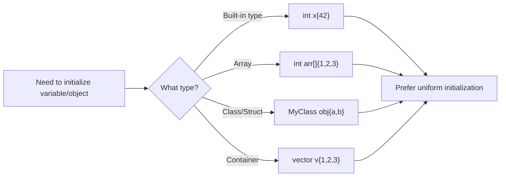

# C++ Uniform Initialization

## Introduction

One of the confusing aspects of C++ prior to C++11 was the various ways to initialize objects and variables. Initialization syntax differed based on what you were initializing, which led to inconsistencies and potential errors. To address this issue, C++11 introduced **uniform initialization** (also known as **brace initialization** or **curly brace initialization**), providing a consistent syntax for initializing objects of any type.

In this article, we'll explore uniform initialization syntax, understand its benefits, and see how it's used in modern C++ programming.

## The Problem with Traditional Initialization

Before C++11, C++ had several different initialization syntaxes:

```cpp
// Different initialization methods in pre-C++11
int a = 10;                       // Copy initialization
int b(20);                        // Direct initialization
int arr[] = {1, 2, 3, 4};         // Aggregate initialization for arrays
struct Point { int x, y; };
Point p = {1, 2};                 // Aggregate initialization for structs
std::vector<int> vec(10, 5);      // Constructor with parameters
```

This inconsistency led to several issues:
- Difficult to remember different syntaxes for different types
- Some initialization forms weren't possible for certain types
- Narrowing conversions (potentially losing data) were allowed
- No uniform way to initialize objects with a list of values

## Uniform Initialization Syntax

C++11 introduced a consistent syntax using curly braces `{}` that works across all types:

```cpp
// Uniform initialization with curly braces
int a{10};                        // Basic variable
int arr[]{1, 2, 3, 4};            // Array
struct Point { int x, y; };
Point p{1, 2};                    // Struct
std::vector<int> vec{1, 2, 3, 4}; // Standard container
auto ptr = new Point{3, 4};       // Dynamic allocation
```

## Key Benefits of Uniform Initialization

### 1. Consistency Across Types

The same syntax works for all types - primitive types, arrays, user-defined types, and standard library containers.

```cpp
// Initializing different types with the same syntax
int i{42};
double d{3.14};
bool flag{true};
std::string name{"C++ Programming"};
std::vector<int> numbers{1, 2, 3, 4, 5};
std::map<std::string, int> ages{{"Alice", 25}, {"Bob", 30}};
```

### 2. Prevention of Narrowing Conversions

Unlike traditional initialization methods, uniform initialization prevents narrowing conversions that might lead to data loss:

```cpp
int x = 3.14;      // Allowed: Silently truncates to 3
// int y{3.14};    // Error: Narrowing conversion from double to int

double pi = 3.14159;
// int approx_pi{pi}; // Error: Narrowing conversion
int safe_conversion{static_cast<int>(pi)}; // OK: Explicit conversion
```

### 3. Empty Initialization

Uniform initialization provides a clear way to default-initialize types:

```cpp
int n{};           // Initialized to 0
double d{};        // Initialized to 0.0
bool b{};          // Initialized to false
std::string s{};   // Initialized to empty string
std::vector<int> v{}; // Initialized to empty vector
```

### 4. Initialization of Nested Objects and Arrays

Brace initialization works well with complex, nested structures:

```cpp
struct Address {
    std::string street;
    std::string city;
    int zipCode;
};

struct Person {
    std::string name;
    int age;
    Address address;
};

// Nested initialization
Person person{
    "John Doe", 
    30, 
    {"123 Main St", "New York", 10001}
};

// Array of objects
Person people[]{
    {"Alice", 25, {"456 Oak Ave", "Boston", 20001}},
    {"Bob", 32, {"789 Pine St", "Chicago", 30001}}
};
```

## Uniform Initialization with Classes

Uniform initialization works seamlessly with user-defined classes, invoking the appropriate constructor:

```cpp
class Rectangle {
private:
    double width;
    double height;
    
public:
    // Default constructor
    Rectangle() : width{0.0}, height{0.0} {}
    
    // Parameterized constructor
    Rectangle(double w, double h) : width{w}, height{h} {}
    
    double area() const { return width * height; }
};

// Using uniform initialization with our class
int main() {
    Rectangle r1{};        // Calls default constructor
    Rectangle r2{5.0, 3.0}; // Calls parameterized constructor
    
    std::cout << "Area of r2: " << r2.area() << std::endl; // Output: Area of r2: 15
    
    // Array of rectangles
    Rectangle shapes[]{
        {2.0, 3.0},
        {4.0, 5.0},
        {1.0, 10.0}
    };
    
    return 0;
}
```

## Initializer Lists

C++11 also introduced `std::initializer_list<T>`, which works together with uniform initialization to create constructors that accept a varying number of values:

```cpp
#include <iostream>
#include <vector>
#include <initializer_list>

class IntCollection {
private:
    std::vector<int> data;
    
public:
    // Constructor taking an initializer list
    IntCollection(std::initializer_list<int> values) : data(values) {}
    
    void print() const {
        for (const auto& value : data) {
            std::cout << value << " ";
        }
        std::cout << std::endl;
    }
};

int main() {
    // Using initializer list constructor
    IntCollection collection{1, 2, 3, 4, 5};
    
    std::cout << "Collection values: ";
    collection.print(); // Output: Collection values: 1 2 3 4 5
    
    return 0;
}
```

## Potential Confusion: Most Vexing Parse

The uniform initialization syntax helps avoid C++'s "most vexing parse" problem, where what looks like a constructor call is actually interpreted as a function declaration:

```cpp
// Most vexing parse problem
std::vector<int> v1(10);    // Creates a vector with 10 elements (value 0)
std::vector<int> v2();      // Declares a function! Not a vector

// No confusion with uniform initialization
std::vector<int> v3{10};    // Creates a vector with 1 element (value 10)
std::vector<int> v4{};      // Creates an empty vector
```

## Practical Examples

### Example 1: Configuring Application Settings

```cpp
struct AppConfig {
    std::string appName;
    std::string version;
    int maxConnections;
    bool debugMode;
    std::vector<std::string> supportedFileTypes;
};

int main() {
    // Easily create and initialize a complex configuration
    AppConfig config{
        "CodeEditor",
        "1.2.0",
        100,
        true,
        {".cpp", ".h", ".txt", ".md"}
    };
    
    // Use the configuration
    std::cout << "Application: " << config.appName << " " 
              << config.version << std::endl;
    std::cout << "Debug mode: " << (config.debugMode ? "ON" : "OFF") << std::endl;
    std::cout << "Supported file types: ";
    for (const auto& type : config.supportedFileTypes) {
        std::cout << type << " ";
    }
    std::cout << std::endl;
    
    return 0;
}
```

### Example 2: Game Development - Creating Game Entities

```cpp
struct Position {
    float x, y, z;
};

struct Velocity {
    float dx, dy, dz;
};

class GameObject {
private:
    std::string name;
    Position position;
    Velocity velocity;
    bool active;
    
public:
    GameObject(std::string n, Position pos, Velocity vel, bool act)
        : name{std::move(n)}, position{pos}, velocity{vel}, active{act} {}
        
    void update(float deltaTime) {
        if (active) {
            position.x += velocity.dx * deltaTime;
            position.y += velocity.dy * deltaTime;
            position.z += velocity.dz * deltaTime;
        }
    }
    
    void printStatus() const {
        std::cout << "Object: " << name 
                  << " at position (" << position.x << ", " 
                  << position.y << ", " << position.z << ")" << std::endl;
    }
};

int main() {
    // Create game objects with uniform initialization
    GameObject player{"Player", {0.0f, 0.0f, 0.0f}, {1.0f, 0.0f, 0.0f}, true};
    GameObject enemy{"Enemy", {10.0f, 0.0f, 0.0f}, {-0.5f, 0.0f, 0.0f}, true};
    
    // Update game state
    float timeStep = 0.16f; // ~60 FPS
    
    for (int i = 0; i < 5; ++i) {
        player.update(timeStep);
        enemy.update(timeStep);
        
        std::cout << "Frame " << i + 1 << ":" << std::endl;
        player.printStatus();
        enemy.printStatus();
        std::cout << std::endl;
    }
    
    return 0;
}
```

## When to Use Uniform Initialization

Uniform initialization is generally recommended as the default initialization syntax in modern C++, but there are specific cases where it shines:

1. When creating objects with complex nested structures
2. When you want to prevent narrowing conversions
3. When initializing class members in constructors
4. When working with standard library containers



## Gotchas and Considerations

### 1. std::initializer_list Constructor Priority

When a class has both a regular constructor and an `std::initializer_list` constructor, the initializer list version takes precedence with brace initialization:

```cpp
class Widget {
public:
    Widget(int i, bool b) { std::cout << "Regular constructor\n"; }
    Widget(std::initializer_list<int> il) { std::cout << "initializer_list constructor\n"; }
};

int main() {
    Widget w1(10, true);     // Calls regular constructor
    Widget w2{10, true};     // Calls initializer_list constructor!
    
    // To force regular constructor with braces when both exist:
    Widget w3(std::initializer_list<int>{10, true}); 
}
```

### 2. Empty Braces Ambiguity

Empty braces can sometimes be ambiguous:

```cpp
std::vector<int> v1{};       // Default constructor
std::vector<int> v2(10);     // Vector with 10 elements initialized to 0
std::vector<int> v3{10};     // Vector with ONE element with value 10
```

## Summary

Uniform initialization provides a consistent syntax for initializing objects in C++, regardless of their type. Key benefits include:

- **Consistency**: The same syntax works for all types
- **Safety**: Prevention of narrowing conversions
- **Flexibility**: Works with fundamental types, arrays, user-defined types, and containers
- **Readability**: Clearly expresses initialization intention

As you continue developing in modern C++, adopting uniform initialization will lead to more consistent and safer code. Remember that while it's generally recommended, there are specific cases where you need to be aware of potential ambiguities with `std::initializer_list` constructors.

## Exercises

1. Convert the following traditional initializations to uniform initialization:
   ```cpp
   int x = 10;
   double values[] = {1.0, 2.0, 3.0};
   std::string name = "Alice";
   std::vector<int> numbers(5, 1);
   ```

2. Create a `Person` class with name, age, and address members. Use uniform initialization to create and initialize an array of 3 people.

3. Implement a `Matrix` class that uses an initializer list constructor to accept rows of values.

4. Identify and fix the narrowing conversions in the following code:
   ```cpp
   int a = 3.14;
   char c = 1000;
   float f = 123456789.0;
   ```

## Additional Resources

- [C++11 Standard](https://www.iso.org/standard/50372.html)
- [CPPReference - Initialization](https://en.cppreference.com/w/cpp/language/initialization)
- [C++ Core Guidelines - Initialization](https://isocpp.github.io/CppCoreGuidelines/CppCoreGuidelines#Res-list)
- Book: "Effective Modern C++" by Scott Meyers, Item 7 (Distinguish between () and {} when creating objects)

Happy coding with modern C++ initialization techniques!