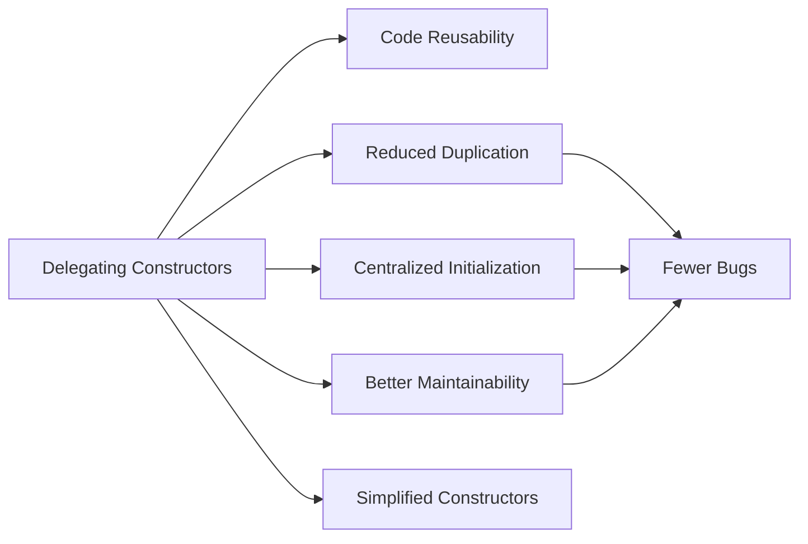

# C++ Delegating Constructors

## Introduction

When building classes in C++, you often need multiple constructors to initialize objects in different ways. Before C++11, implementing several constructors often led to duplicated code or required separate helper methods to share initialization logic. **Delegating constructors**, introduced in C++11, solve this problem by allowing one constructor to call another constructor in the same class.

This feature helps you:
- Eliminate code duplication
- Centralize initialization logic
- Create more maintainable and less error-prone code
- Implement the DRY (Don't Repeat Yourself) principle

## Basic Syntax

The syntax for delegating constructors is straightforward. A constructor can call another constructor in its initialization list:

```cpp
class MyClass {
public:
    // Primary constructor
    MyClass(int x, std::string s, bool b) {
        // Full initialization logic here
    }
    
    // Delegating constructor
    MyClass(int x) : MyClass(x, "default", false) {
        // Any additional logic specific to this constructor
    }
};
```

## How Delegating Constructors Work

Let's understand the concept with a simple example:

```cpp
#include <iostream>
#include <string>

class Person {
private:
    std::string name;
    int age;
    std::string address;

public:
    // Primary constructor
    Person(const std::string& n, int a, const std::string& addr) 
        : name(n), age(a), address(addr) {
        std::cout << "Primary constructor called" << std::endl;
    }
    
    // Delegating constructor 1
    Person(const std::string& n, int a) 
        : Person(n, a, "Unknown") {
        std::cout << "Delegating constructor with two parameters called" << std::endl;
    }
    
    // Delegating constructor 2
    Person() 
        : Person("John Doe", 0) {
        std::cout << "Default constructor called" << std::endl;
    }
    
    void display() const {
        std::cout << "Name: " << name << ", Age: " << age << ", Address: " << address << std::endl;
    }
};

int main() {
    std::cout << "Creating p1:" << std::endl;
    Person p1("Alice", 25, "123 Main St");
    p1.display();
    
    std::cout << "\nCreating p2:" << std::endl;
    Person p2("Bob", 30);
    p2.display();
    
    std::cout << "\nCreating p3:" << std::endl;
    Person p3;
    p3.display();
    
    return 0;
}
```

Output:
```
Creating p1:
Primary constructor called
Name: Alice, Age: 25, Address: 123 Main St

Creating p2:
Primary constructor called
Delegating constructor with two parameters called
Name: Bob, Age: 30, Address: Unknown

Creating p3:
Primary constructor called
Delegating constructor with two parameters called
Default constructor called
Name: John Doe, Age: 0, Address: Unknown
```

### Step-by-Step Explanation

1. The `Person` class has three constructors:
   - The primary constructor that initializes all member variables
   - A delegating constructor that only requires name and age, delegating to the primary constructor with a default address
   - A default constructor that delegates to the two-parameter constructor with default values

2. When we create `p1`, only the primary constructor is called since we provide all three parameters.

3. When we create `p2`, first the primary constructor is called (through delegation), and then the two-parameter constructor continues with its own body.

4. When we create `p3`, the call chain is: default constructor → two-parameter constructor → primary constructor. Each constructor's body executes in the reverse order after the initialization is complete.

## Rules and Restrictions

When using delegating constructors, keep these important rules in mind:

1. **No circular delegation**: A constructor cannot delegate to itself or create a circular chain of delegations. The compiler will detect this and produce an error.

2. **Initialization order**: The delegated constructor completes its initialization list and body before the delegating constructor's body executes.

3. **Member initializers**: A delegating constructor cannot include member initializers in its initialization list alongside the constructor delegation.

```cpp
class Example {
private:
    int a;
    int b;
    
public:
    Example(int x, int y) : a(x), b(y) {}
    
    // INCORRECT - cannot mix delegation with member initialization
    // Example(int x) : Example(x, 0), a(x) {}  // Compiler error
    
    // CORRECT approach
    Example(int x) : Example(x, 0) {
        // Any additional initialization goes here
    }
};
```

## Practical Applications

### 1. Configuration Class with Default Values

```cpp
#include <iostream>
#include <string>

class Configuration {
private:
    std::string hostname;
    int port;
    bool useSSL;
    int timeout;

public:
    // Primary constructor with all parameters
    Configuration(const std::string& host, int p, bool ssl, int time) 
        : hostname(host), port(p), useSSL(ssl), timeout(time) {
    }
    
    // Database server configuration
    Configuration(const std::string& host, int p) 
        : Configuration(host, p, true, 30) {
    }
    
    // Default local configuration
    Configuration() 
        : Configuration("localhost", 8080, false, 10) {
    }
    
    void printConfig() const {
        std::cout << "Host: " << hostname << "\n"
                  << "Port: " << port << "\n"
                  << "SSL: " << (useSSL ? "Enabled" : "Disabled") << "\n"
                  << "Timeout: " << timeout << " seconds\n";
    }
};

int main() {
    // Full custom configuration
    Configuration custom("api.example.com", 443, true, 60);
    std::cout << "Custom Configuration:\n";
    custom.printConfig();
    
    // Database server with defaults
    Configuration db("db.example.com", 5432);
    std::cout << "\nDatabase Configuration:\n";
    db.printConfig();
    
    // Default local development configuration
    Configuration local;
    std::cout << "\nLocal Configuration:\n";
    local.printConfig();
    
    return 0;
}
```

Output:
```
Custom Configuration:
Host: api.example.com
Port: 443
SSL: Enabled
Timeout: 60 seconds

Database Configuration:
Host: db.example.com
Port: 5432
SSL: Enabled
Timeout: 30 seconds

Local Configuration:
Host: localhost
Port: 8080
SSL: Disabled
Timeout: 10 seconds
```

### 2. Resource Management Class

```cpp
#include <iostream>
#include <string>
#include <vector>

class ResourceManager {
private:
    std::string resourceName;
    std::vector<int> data;
    bool isInitialized;
    
    void logCreation() const {
        std::cout << "Resource '" << resourceName << "' created with " 
                  << data.size() << " elements" << std::endl;
    }

public:
    // Primary constructor
    ResourceManager(const std::string& name, const std::vector<int>& initialData, bool init) 
        : resourceName(name), data(initialData), isInitialized(init) {
        if (isInitialized) {
            std::cout << "Initializing resource '" << resourceName << "'" << std::endl;
            // Imagine complex initialization here
        }
        logCreation();
    }
    
    // Pre-initialized resource with data
    ResourceManager(const std::string& name, const std::vector<int>& initialData) 
        : ResourceManager(name, initialData, true) {
    }
    
    // Empty resource that's initialized
    ResourceManager(const std::string& name) 
        : ResourceManager(name, {}, true) {
    }
    
    // Default resource that's not initialized
    ResourceManager() 
        : ResourceManager("default", {}, false) {
        std::cout << "Warning: Created uninitialized default resource" << std::endl;
    }
    
    void addData(int value) {
        if (!isInitialized) {
            std::cout << "Warning: Adding data to uninitialized resource" << std::endl;
            isInitialized = true;
        }
        data.push_back(value);
    }
    
    void displayInfo() const {
        std::cout << "Resource '" << resourceName << "' has " << data.size() 
                  << " elements and is " << (isInitialized ? "initialized" : "not initialized") 
                  << std::endl;
    }
};

int main() {
    // Using different constructors
    ResourceManager r1("config", {1, 2, 3, 4});
    ResourceManager r2("settings");
    ResourceManager r3;
    
    std::cout << "\nResource status after creation:\n";
    r1.displayInfo();
    r2.displayInfo();
    r3.displayInfo();
    
    std::cout << "\nAdding data to resources:\n";
    r1.addData(5);
    r2.addData(10);
    r3.addData(100);
    
    std::cout << "\nFinal resource status:\n";
    r1.displayInfo();
    r2.displayInfo();
    r3.displayInfo();
    
    return 0;
}
```

Output:
```
Initializing resource 'config'
Resource 'config' created with 4 elements
Initializing resource 'settings'
Resource 'settings' created with 0 elements
Resource 'default' created with 0 elements
Warning: Created uninitialized default resource

Resource status after creation:
Resource 'config' has 4 elements and is initialized
Resource 'settings' has 0 elements and is initialized
Resource 'default' has 0 elements and is not initialized

Adding data to resources:
Warning: Adding data to uninitialized resource

Final resource status:
Resource 'config' has 5 elements and is initialized
Resource 'settings' has 1 elements and is initialized
Resource 'default' has 1 elements and is initialized
```

## Advantages of Delegating Constructors

<div className="centered-image">

</div>

1. **Code Reusability**: Common initialization code is written once and reused.

2. **Reduced Duplication**: Eliminates the need to repeat initialization code across multiple constructors.

3. **Centralized Initialization**: All initialization logic can be maintained in one place (usually the most complex constructor).

4. **Better Maintainability**: Changes to initialization logic only need to be made in one place.

5. **Simplified Constructors**: Constructors become shorter and more focused on their specific initialization needs.

## Common Pitfalls and Best Practices

### Pitfalls to Avoid

1. **Circular Dependencies**: Avoid creating circular chains of constructor delegation.

2. **Over-delegation**: Don't create unnecessarily deep chains of constructor calls.

3. **Performance Concerns**: Be aware that each delegated constructor adds a small overhead.

### Best Practices

1. **Delegate to the Most Complete Constructor**: Have all other constructors delegate to the constructor with the most parameters.

2. **Keep Constructor Bodies Minimal**: Ideally, the delegating constructor should only provide default values and minimal additional logic.

3. **Use Meaningful Default Values**: When delegating with default values, make sure they are sensible and well-documented.

4. **Consider Using Default Arguments**: For simple cases, default arguments might be cleaner than multiple delegating constructors.

## Summary

Delegating constructors are a powerful feature in modern C++ that helps reduce code duplication and centralize initialization logic. By allowing one constructor to call another within the same class, you can write more maintainable and less error-prone code.

Key points to remember:
- Use delegation to centralize initialization logic
- The delegated constructor runs before the delegating constructor's body
- You cannot mix member initialization with delegation in the same initialization list
- Avoid circular delegation chains
- Delegate to the most complete constructor for best organization

By mastering delegating constructors, you'll write cleaner, more maintainable C++ code that follows the DRY principle.

## Exercises

1. Create a `Rectangle` class with three constructors:
   - One that takes width and height
   - One that takes only one dimension (creating a square)
   - A default constructor

2. Implement a `NetworkConnection` class with delegating constructors that handle different connection scenarios (secure/insecure, with/without timeout, etc.).

3. Refactor the following class to use delegating constructors:
   ```cpp
   class Student {
   private:
       std::string name;
       int id;
       double gpa;
   public:
       Student(std::string n, int i, double g) {
           name = n;
           id = i;
           gpa = g;
       }
       
       Student(std::string n, int i) {
           name = n;
           id = i;
           gpa = 0.0;
       }
       
       Student() {
           name = "Unknown";
           id = 0;
           gpa = 0.0;
       }
   };
   ```

## Additional Resources

- [C++11 Standard](https://isocpp.org/wiki/faq/cpp11)
- [CPP Reference on Constructors](https://en.cppreference.com/w/cpp/language/constructor)
- Book: "Effective Modern C++" by Scott Meyers (Item 7 covers delegating constructors)
- [C++ Core Guidelines](https://isocpp.github.io/CppCoreGuidelines/CppCoreGuidelines)