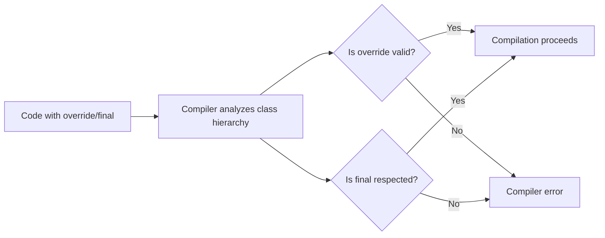

# C++ Override and Final Specifiers

## Introduction

The `override` and `final` specifiers were introduced in C++11 to help developers write more robust code when dealing with inheritance and virtual functions. These specifiers provide explicit control over method overriding in derived classes, making code more readable and preventing common bugs related to inheritance.

In this tutorial, you'll learn:
- What the `override` specifier does and how to use it
- What the `final` specifier does for both methods and classes
- How these specifiers can prevent subtle bugs in your code
- Best practices when working with inheritance hierarchies

## The Override Specifier

### What Problem Does `override` Solve?

In C++, when you inherit from a base class, you can override virtual methods to provide different implementations in derived classes. However, before C++11, it was easy to accidentally create a new method instead of overriding an existing one, as shown in the example below:

```cpp
class Base {
public:
    virtual void show() { 
        std::cout << "Base class" << std::endl; 
    }
};

class Derived : public Base {
public:
    // Oops! This is a new method, not an override
    // The method signature doesn't match exactly (missing const)
    virtual void show() const { 
        std::cout << "Derived class" << std::endl; 
    }
};

int main() {
    Derived d;
    Base* b = &d;
    b->show(); // Calls Base::show(), not Derived::show()
    return 0;
}
```

**Output:**
```
Base class
```

In the above example, the developer intended to override `show()`, but accidentally created a new method because the signatures don't match exactly (one has `const` and the other doesn't).

### Using the `override` Specifier

The `override` specifier tells the compiler that a method is intended to override a virtual method from a base class. If it doesn't actually override anything, the compiler will generate an error:

```cpp
class Base {
public:
    virtual void show() { 
        std::cout << "Base class" << std::endl; 
    }
};

class Derived : public Base {
public:
    // Compiler error: no virtual method in base class matches this signature
    void show() const override { 
        std::cout << "Derived class" << std::endl; 
    }
};
```

Corrected version:

```cpp
class Base {
public:
    virtual void show() { 
        std::cout << "Base class" << std::endl; 
    }
};

class Derived : public Base {
public:
    // Now correctly overrides Base::show()
    void show() override { 
        std::cout << "Derived class" << std::endl; 
    }
};

int main() {
    Derived d;
    Base* b = &d;
    b->show(); // Now calls Derived::show()
    return 0;
}
```

**Output:**
```
Derived class
```

### Key Rules for `override`:

1. It must be used with a function that overrides a virtual function from a base class
2. The function signature and return type must exactly match the one in the base class
3. The base class function must be declared as `virtual`
4. `override` appears at the end of the function declaration, after any `const` and reference qualifiers

## The Final Specifier

The `final` specifier has two uses in C++:

1. Preventing a virtual method from being overridden in derived classes
2. Preventing a class from being used as a base class

### Making Methods Final

When applied to a virtual method, `final` prevents any derived class from overriding that method:

```cpp
class Base {
public:
    virtual void method1() { 
        std::cout << "Base::method1()" << std::endl; 
    }
    
    virtual void method2() final { 
        std::cout << "Base::method2()" << std::endl; 
    }
};

class Derived : public Base {
public:
    void method1() override { 
        std::cout << "Derived::method1()" << std::endl; 
    }
    
    // Error: cannot override final method
    // void method2() override { 
    //     std::cout << "Derived::method2()" << std::endl; 
    // }
};

int main() {
    Derived d;
    Base* b = &d;
    b->method1(); // Calls Derived::method1()
    b->method2(); // Calls Base::method2() (can't be overridden)
    return 0;
}
```

**Output:**
```
Derived::method1()
Base::method2()
```

### Making Classes Final

When applied to a class, `final` prevents any other class from inheriting from it:

```cpp
class BaseClass final {
public:
    void someMethod() {
        std::cout << "BaseClass::someMethod()" << std::endl;
    }
};

// Error: cannot derive from final class
// class DerivedClass : public BaseClass {
// public:
//     void anotherMethod() {
//         std::cout << "DerivedClass::anotherMethod()" << std::endl;
//     }
// };
```

## Practical Examples

### Example 1: Building a Robust Shape Hierarchy

```cpp
#include <iostream>
#include <vector>
#include <memory>

class Shape {
public:
    virtual ~Shape() = default;
    virtual double area() const = 0;
    virtual void draw() const {
        std::cout << "Drawing a shape" << std::endl;
    }
};

class Circle final : public Shape {
private:
    double radius;

public:
    Circle(double r) : radius(r) {}

    double area() const override {
        return 3.14159 * radius * radius;
    }

    void draw() const override {
        std::cout << "Drawing a circle with radius " << radius << std::endl;
    }
};

class Rectangle : public Shape {
private:
    double width;
    double height;

public:
    Rectangle(double w, double h) : width(w), height(h) {}

    double area() const override {
        return width * height;
    }

    void draw() const override final {
        std::cout << "Drawing a rectangle " << width << "x" << height << std::endl;
    }
};

class Square final : public Rectangle {
public:
    Square(double side) : Rectangle(side, side) {}

    // Can't override draw() because it's final in Rectangle
    // Can still override area() if needed (though not necessary here)
    double area() const override {
        return Rectangle::area(); // Just calls the base implementation
    }
};

int main() {
    std::vector<std::unique_ptr<Shape>> shapes;
    
    shapes.push_back(std::make_unique<Circle>(5.0));
    shapes.push_back(std::make_unique<Rectangle>(4.0, 3.0));
    shapes.push_back(std::make_unique<Square>(2.0));
    
    for (const auto& shape : shapes) {
        shape->draw();
        std::cout << "Area: " << shape->area() << std::endl;
        std::cout << "------------------------" << std::endl;
    }
    
    return 0;
}
```

**Output:**
```
Drawing a circle with radius 5
Area: 78.5398
------------------------
Drawing a rectangle 4x3
Area: 12
------------------------
Drawing a rectangle 2x2
Area: 4
------------------------
```

### Example 2: Interface Implementation with Override

```cpp
#include <iostream>
#include <string>
#include <vector>
#include <memory>

// Logger interface
class Logger {
public:
    virtual ~Logger() = default;
    virtual void log(const std::string& message) = 0;
    virtual void setLevel(int level) = 0;
    virtual int getLevel() const = 0;
};

// ConsoleLogger implementation
class ConsoleLogger : public Logger {
private:
    int logLevel;

public:
    ConsoleLogger() : logLevel(0) {}

    void log(const std::string& message) override {
        std::cout << "[Console] " << message << std::endl;
    }

    void setLevel(int level) override {
        logLevel = level;
    }

    int getLevel() const override {
        return logLevel;
    }
};

// FileLogger implementation
class FileLogger final : public Logger {
private:
    int logLevel;
    std::string filename;

public:
    FileLogger(const std::string& file) : logLevel(0), filename(file) {}

    void log(const std::string& message) override {
        std::cout << "[File: " << filename << "] " << message << std::endl;
        // In a real implementation, we would write to a file here
    }

    void setLevel(int level) override {
        logLevel = level;
    }

    int getLevel() const override {
        return logLevel;
    }
};

int main() {
    std::vector<std::unique_ptr<Logger>> loggers;
    
    loggers.push_back(std::make_unique<ConsoleLogger>());
    loggers.push_back(std::make_unique<FileLogger>("app.log"));
    
    for (const auto& logger : loggers) {
        logger->setLevel(1);
        logger->log("Application started");
    }
    
    return 0;
}
```

**Output:**
```
[Console] Application started
[File: app.log] Application started
```

## Best Practices

1. **Always use `override` when overriding virtual functions**:
   - It makes your code more readable
   - It prevents subtle bugs
   - It documents your intention clearly

2. **Use `final` when**:
   - You need to prevent further derivation for security/design reasons
   - You're working on performance-critical code (the compiler can optimize non-virtual calls)
   - You're building a class that isn't designed to be inherited from

3. **Consider the inheritance hierarchy carefully**:
   - Don't mark methods as `final` unless you have a good reason
   - Classes marked as `final` can't be mocked in some testing frameworks

## How the Compiler Uses These Specifiers



## Summary

- The `override` specifier ensures that a method is actually overriding a base class method
- The `final` specifier prevents further overriding of methods or inheritance of classes
- Both specifiers help catch errors at compile time rather than at runtime
- Using these specifiers makes code more robust and self-documenting
- These features are part of modern C++ best practices for inheritance hierarchies

## Exercises

1. Convert an existing class hierarchy in your codebase to use `override` and see if you catch any bugs
2. Create a simple plugin system where some methods can be overridden but others are marked as `final`
3. Design a class hierarchy for a game with different character types, using `override` and `final` appropriately

## Additional Resources

- [C++ Reference: override specifier](https://en.cppreference.com/w/cpp/language/override)
- [C++ Reference: final specifier](https://en.cppreference.com/w/cpp/language/final)
- [C++ Core Guidelines: C.128: Virtual functions should specify exactly one of virtual, override, or final](https://isocpp.github.io/CppCoreGuidelines/CppCoreGuidelines#c128-virtual-functions-should-specify-exactly-one-of-virtual-override-or-final)