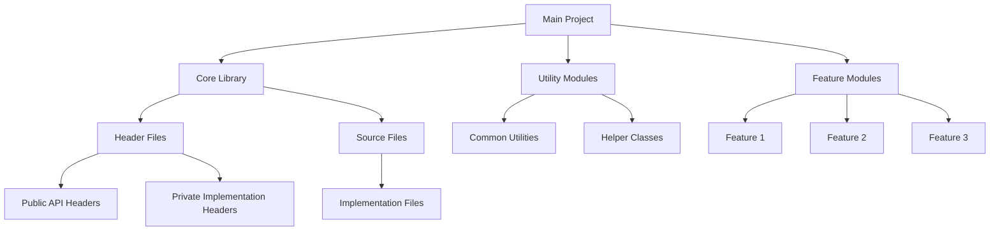

# C++ Code Organization

One of the most important aspects of software development that often gets overlooked by beginners is proper code organization. Well-organized code is easier to read, maintain, debug, and extend. In this article, we'll explore best practices for organizing your C++ code to improve your development workflow and make collaboration with others more effective.

## Why Code Organization Matters

Before diving into specific techniques, let's understand why code organization is crucial:

- **Readability**: Well-organized code is easier to read and understand
- **Maintainability**: When you need to fix bugs or add features, good organization helps you locate relevant code quickly
- **Collaboration**: Other developers can understand and work with your code more efficiently
- **Scalability**: As projects grow, good organization prevents them from becoming unmanageable

## File Structure Best Practices

### Header and Source Files Separation

In C++, it's a standard practice to separate declarations (interfaces) from implementations. This is done using header (`.h` or `.hpp`) and source (`.cpp`) files.

#### Header File (`example.h`)

```cpp
#ifndef EXAMPLE_H
#define EXAMPLE_H

class Example {
public:
    // Function declarations
    void sayHello();
    int add(int a, int b);
    
private:
    // Private member variables
    int m_value;
};

#endif // EXAMPLE_H
```

#### Source File (`example.cpp`)

```cpp
#include "example.h"
#include <iostream>

void Example::sayHello() {
    std::cout << "Hello, World!" << std::endl;
}

int Example::add(int a, int b) {
    return a + b;
}
```

#### Key benefits of this separation:

1. **Compilation efficiency**: When you change the implementation, only the `.cpp` file needs recompilation
2. **Information hiding**: Users of your class see only the interface, not the implementation details
3. **Reduced dependencies**: Header files include only what's necessary for declarations

### Directory Structure

For small projects, you might start with a simple structure:

```
project/
├── include/          # Header files
├── src/              # Source files
├── tests/            # Test files
└── CMakeLists.txt    # Build configuration
```

For larger projects, consider organizing by modules or components:

```
project/
├── include/
│   ├── core/         # Core functionality headers
│   ├── utils/        # Utility headers
│   └── modules/      # Feature-specific headers
├── src/
│   ├── core/         # Core implementation
│   ├── utils/        # Utility implementation
│   └── modules/      # Feature implementations
├── tests/
│   ├── core/         # Core tests
│   ├── utils/        # Utility tests
│   └── modules/      # Feature tests
├── docs/             # Documentation
└── CMakeLists.txt    # Build configuration
```

## Header File Best Practices

### Include Guards

Include guards prevent multiple inclusions of the same header file, which can cause redefinition errors.

```cpp
#ifndef UNIQUE_NAME_H
#define UNIQUE_NAME_H

// Header content goes here

#endif // UNIQUE_NAME_H
```

Alternatively, you can use the `#pragma once` directive, which is supported by most modern compilers:

```cpp
#pragma once

// Header content goes here
```

### Forward Declarations

To reduce compile-time dependencies, use forward declarations instead of including headers whenever possible:

```cpp
// Instead of including the full header
// #include "ComplexClass.h"

// Use forward declaration
class ComplexClass;

class MyClass {
private:
    ComplexClass* m_complexInstance; // Pointer or reference only!
};
```

Note: Forward declarations only work when you're using pointers or references to the class, not when you need the complete class definition.

### Include What You Use

Include only the headers that are directly used in your file. This reduces compilation dependencies and improves build times.

```cpp
// Bad practice: including unnecessary headers
#include <vector>
#include <string>
#include <iostream>
#include <algorithm>

void printMessage() {
    std::cout << "Hello!" << std::endl; // Only iostream is needed
}

// Good practice: include only what's needed
#include <iostream>

void printMessage() {
    std::cout << "Hello!" << std::endl;
}
```

## Namespaces

Namespaces help prevent name collisions and organize related code elements.

### Creating and Using Namespaces

```cpp
// In utils.h
namespace MyApp {
    namespace Utils {
        void helperFunction();
        
        class Logger {
            // ...
        };
    }
}

// In utils.cpp
#include "utils.h"

namespace MyApp {
    namespace Utils {
        void helperFunction() {
            // Implementation
        }
        
        // Logger implementation...
    }
}

// Using the namespace
#include "utils.h"

int main() {
    // Full qualification
    MyApp::Utils::helperFunction();
    
    // Using directive (use sparingly)
    using namespace MyApp::Utils;
    helperFunction();
    
    // Using declaration (preferred)
    using MyApp::Utils::helperFunction;
    helperFunction();
    
    return 0;
}
```

### Namespace Best Practices

1. **Avoid `using namespace std;` in headers**: This can cause name conflicts
2. **Prefer using declarations over directives**: Use `using std::string;` rather than `using namespace std;`
3. **Use nested namespaces for better organization**: `namespace MyApp::Utils` (C++17) or `namespace MyApp { namespace Utils {`

## Class Organization

### Member Access Specification Order

A common convention is to organize class members in this order:

```cpp
class MyClass {
public:
    // Constructors and destructors
    MyClass();
    ~MyClass();
    
    // Public methods
    void publicMethod();
    
protected:
    // Protected methods
    void protectedMethod();
    
private:
    // Private methods
    void privateMethod();
    
    // Private member variables (prefixed with m_)
    int m_value;
};
```

### Separating Interface and Implementation

For large classes, consider separating the public interface from implementation details:

```cpp
// In public_api.h
class PublicAPI {
public:
    void userFacingMethod();
    
private:
    class Impl;  // Forward declaration of implementation class
    Impl* m_impl; // Pointer to implementation
};

// In public_api_impl.h (internal header)
#include "public_api.h"

class PublicAPI::Impl {
public:
    void internalMethod();
    
private:
    int m_internalData;
};

// In public_api.cpp
#include "public_api_impl.h"

void PublicAPI::userFacingMethod() {
    m_impl->internalMethod();
}
```

This pattern is known as the Pimpl (Pointer to Implementation) idiom or the Bridge pattern.

## Real-World Example: A Simple Math Library

Let's put these principles into practice by creating a simple math library.

### Directory Structure

```
math_lib/
├── include/
│   └── math_lib/
│       ├── math_lib.h
│       ├── vector.h
│       └── matrix.h
├── src/
│   ├── vector.cpp
│   └── matrix.cpp
└── tests/
    ├── vector_tests.cpp
    └── matrix_tests.cpp
```

### Main Header (`math_lib.h`)

```cpp
#ifndef MATH_LIB_H
#define MATH_LIB_H

// Include all component headers
#include "vector.h"
#include "matrix.h"

namespace MathLib {
    // Library-wide constants or functions
    constexpr double PI = 3.14159265358979323846;
    
    double radiansToDegrees(double radians);
    double degreesToRadians(double degrees);
}

#endif // MATH_LIB_H
```

### Vector Component (`vector.h`)

```cpp
#ifndef MATH_LIB_VECTOR_H
#define MATH_LIB_VECTOR_H

#include <array>
#include <cmath>

namespace MathLib {
    template<size_t N>
    class Vector {
    public:
        // Default constructor
        Vector() : m_data{} {}
        
        // Constructor with initializer list
        Vector(std::initializer_list<double> values) {
            size_t i = 0;
            for (auto val : values) {
                if (i < N) m_data[i++] = val;
            }
        }
        
        // Access elements
        double& operator[](size_t index) { return m_data[index]; }
        const double& operator[](size_t index) const { return m_data[index]; }
        
        // Vector magnitude
        double magnitude() const {
            double sum = 0.0;
            for (size_t i = 0; i < N; ++i) {
                sum += m_data[i] * m_data[i];
            }
            return std::sqrt(sum);
        }
        
        // Normalize vector
        void normalize() {
            double mag = magnitude();
            if (mag > 0) {
                for (size_t i = 0; i < N; ++i) {
                    m_data[i] /= mag;
                }
            }
        }
        
    private:
        std::array<double, N> m_data;
    };
    
    // Specialized type definitions
    using Vector2D = Vector<2>;
    using Vector3D = Vector<3>;
}

#endif // MATH_LIB_VECTOR_H
```

### Vector Implementation (`vector.cpp`)

```cpp
#include "math_lib/vector.h"

// If we had non-template functions, they would be implemented here.
// Since our Vector class is template-based, most implementation is in the header.

namespace MathLib {
    // Any non-template functions related to vectors
}
```

### Using the Library

```cpp
#include <iostream>
#include "math_lib/math_lib.h"

int main() {
    // Create a 3D vector
    MathLib::Vector3D v{3.0, 4.0, 0.0};
    
    // Calculate magnitude
    std::cout << "Magnitude: " << v.magnitude() << std::endl;
    
    // Normalize the vector
    v.normalize();
    std::cout << "Normalized vector: [" << v[0] << ", " << v[1] << ", " << v[2] << "]" << std::endl;
    
    return 0;
}
```

**Output:**
```
Magnitude: 5
Normalized vector: [0.6, 0.8, 0]
```

## Project Organization with Build Systems

For real-world projects, you'll want to use a build system like CMake.

### Simple CMakeLists.txt Example

```cmake
cmake_minimum_required(VERSION 3.10)
project(MathLib VERSION 1.0)

# Specify C++ standard
set(CMAKE_CXX_STANDARD 17)
set(CMAKE_CXX_STANDARD_REQUIRED ON)

# Add include directory
include_directories(include)

# Collect source files
file(GLOB SOURCES "src/*.cpp")

# Create library
add_library(mathlib ${SOURCES})

# Link the library to the test executable
add_executable(math_tests tests/main_test.cpp)
target_link_libraries(math_tests mathlib)
```

## Visualizing Code Organization

Let's use a diagram to visualize the components and their relationships:



## Summary

Good code organization is essential for creating maintainable and collaborative C++ projects. Key takeaways include:

1. **Separate declarations from implementations** using header and source files
2. **Use meaningful directory structures** that scale with your project
3. **Apply include guards** to prevent multiple inclusions
4. **Use forward declarations** when possible to reduce dependencies
5. **Organize classes consistently** with clear access specifications
6. **Use namespaces** to prevent name collisions and group related code
7. **Consider design patterns** like Pimpl for better encapsulation
8. **Use build systems** like CMake for larger projects

## Exercises

1. Refactor a small project to follow the organization principles in this article
2. Create a multi-file C++ project with at least two classes that interact with each other
3. Implement a simple library with a clear separation between public API and implementation details
4. Add namespaces to an existing project to improve code organization
5. Convert a project to use CMake as its build system

## Additional Resources

- [Google C++ Style Guide](https://google.github.io/styleguide/cppguide.html)
- [C++ Core Guidelines](https://isocpp.github.io/CppCoreGuidelines/CppCoreGuidelines)
- [Effective Modern C++](https://www.oreilly.com/library/view/effective-modern-c/9781491908419/) by Scott Meyers
- [CMake Documentation](https://cmake.org/documentation/)
- [C++ Project Structure: A Brief Guide](https://www.open-std.org/jtc1/sc22/wg21/docs/papers/2018/p1204r0.html)

Good code organization is a skill that improves with practice. Start applying these principles early in your C++ journey, and they'll become natural habits that improve the quality of your software.