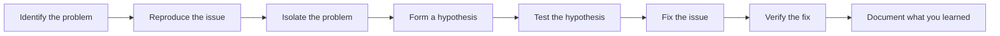

# C++ Debugging Techniques

Debugging is an essential skill for every programmer. Even the most experienced developers make mistakes, and knowing how to find and fix them efficiently can save you hours of frustration. This guide will walk you through various debugging techniques in C++, from simple print statements to using professional debugging tools.

## Introduction to Debugging

Debugging is the process of finding and resolving bugs (defects or problems) in your code that prevent it from functioning correctly. In C++, bugs can range from simple syntax errors to complex memory management issues and undefined behavior.

Effective debugging involves:
1. Identifying that a problem exists
2. Isolating the source of the problem
3. Fixing the issue
4. Verifying that the fix was successful

Let's explore various techniques to help you become proficient at debugging your C++ programs.

## Basic Debugging Techniques

### 1. Print Statement Debugging

The simplest form of debugging involves using `cout` statements to track program flow and examine variable values.

```cpp
#include <iostream>

int main() {
    int sum = 0;
    
    std::cout << "Starting the loop" << std::endl;
    for (int i = 1; i <= 10; i++) {
        std::cout << "Current i: " << i << ", Sum before: " << sum << std::endl;
        sum += i;
        std::cout << "Sum after: " << sum << std::endl;
    }
    
    std::cout << "Final sum: " << sum << std::endl;
    return 0;
}
```

**Output:**
```
Starting the loop
Current i: 1, Sum before: 0
Sum after: 1
Current i: 2, Sum before: 1
Sum after: 3
Current i: 3, Sum before: 3
Sum after: 6
...
Current i: 10, Sum before: 45
Sum after: 55
Final sum: 55
```

**Advantages:**
- Simple to implement
- No special tools required
- Works in any environment

**Disadvantages:**
- Can clutter your code
- Inefficient for complex programs
- Need to recompile after each change

### 2. Using assertions

Assertions verify that certain conditions are met during program execution. If an assertion fails, the program terminates immediately.

```cpp
#include <iostream>
#include <cassert>

int divide(int a, int b) {
    assert(b != 0 && "Division by zero!");
    return a / b;
}

int main() {
    std::cout << divide(10, 2) << std::endl; // Works fine
    std::cout << divide(10, 0) << std::endl; // Will trigger assertion
    return 0;
}
```

**Output:**
```
5
Assertion failed: b != 0 && "Division by zero!", file main.cpp, line 5
```

Assertions are particularly useful for catching programming errors and invalid assumptions.

## Using Preprocessor Directives for Debugging

### Creating a Debug Macro

You can create macros that only operate in debug mode:

```cpp
#include <iostream>

// Define DEBUG to enable debug output
#define DEBUG

#ifdef DEBUG
    #define DEBUG_PRINT(x) std::cout << x << std::endl
#else
    #define DEBUG_PRINT(x)
#endif

int main() {
    int x = 5;
    DEBUG_PRINT("x = " << x);
    
    x += 10;
    DEBUG_PRINT("After addition, x = " << x);
    
    return 0;
}
```

**Output (with DEBUG defined):**
```
x = 5
After addition, x = 15
```

**Output (without DEBUG defined):**
```
(no output)
```

This approach allows you to:
- Keep debugging code in your program
- Easily enable/disable it without removing code
- Avoid the performance impact in release builds

## Using a Debugger

### GDB (GNU Debugger)

GDB is a powerful command-line debugger that allows you to:
- Set breakpoints
- Step through code
- Examine variables
- View the call stack
- And much more

Here's how to compile your program with debugging information and use GDB:

```bash
# Compile with debugging symbols
g++ -g myprogram.cpp -o myprogram

# Start debugging
gdb myprogram
```

Common GDB commands:

| Command | Description |
|---------|-------------|
| `break main` | Set a breakpoint at the beginning of main |
| `break filename.cpp:42` | Set a breakpoint at line 42 |
| `run` | Start the program |
| `next` | Execute the next line (step over) |
| `step` | Step into a function call |
| `continue` | Continue until next breakpoint |
| `print variable` | Display variable value |
| `backtrace` | Show call stack |
| `quit` | Exit GDB |

### IDE Integrated Debuggers

Most modern IDEs like Visual Studio, CLion, and Visual Studio Code have integrated debuggers that provide a graphical interface for debugging. These typically offer:

- Breakpoints management
- Variable inspection
- Watch windows
- Call stack navigation
- Memory inspection

Here's a typical debugging workflow in an IDE:

1. Set breakpoints by clicking in the margin next to the line numbers
2. Start debugging (usually F5 or a "Debug" button)
3. When execution reaches a breakpoint, inspect variables
4. Step through code using step-over, step-into, and step-out buttons
5. Continue execution or stop debugging when done

## Advanced Debugging Techniques

### Memory Debugging Tools

Memory-related bugs can be particularly challenging to find. Tools like Valgrind can help identify:
- Memory leaks
- Use of uninitialized memory
- Double-free errors
- Buffer overflows

Example of using Valgrind:

```bash
# Compile with debugging symbols
g++ -g memoryprogram.cpp -o memoryprogram

# Run with Valgrind
valgrind --leak-check=full ./memoryprogram
```

Here's a program with a memory leak:

```cpp
#include <iostream>

int main() {
    int* ptr = new int[10];  // Allocate memory
    
    ptr[0] = 42;
    std::cout << "Value: " << ptr[0] << std::endl;
    
    // Missing delete[] ptr; - memory leak!
    
    return 0;
}
```

Valgrind output:

```
==12345== HEAP SUMMARY:
==12345==     in use at exit: 40 bytes in 1 blocks
==12345==   total heap usage: 2 allocs, 1 frees, 72 bytes allocated
==12345== 
==12345== 40 bytes in 1 blocks are definitely lost in loss record 1 of 1
==12345==    at 0x4C2B0E0: operator new[](unsigned long) (in /usr/lib/valgrind/vgpreload_memcheck-amd64-linux.so)
==12345==    by 0x400814: main (memoryprogram.cpp:4)
```

### Sanitizers

Modern compilers include sanitizers that can detect various runtime errors:

- AddressSanitizer (ASan): detects memory errors
- UndefinedBehaviorSanitizer (UBSan): detects undefined behavior
- ThreadSanitizer (TSan): detects data races

Example of compiling with AddressSanitizer:

```bash
g++ -fsanitize=address -g myprogram.cpp -o myprogram
```

### Static Analysis Tools

Static analyzers examine your code without running it to find potential bugs:

- Clang Static Analyzer
- Cppcheck
- PVS-Studio

Example of using Cppcheck:

```bash
cppcheck --enable=all myfile.cpp
```

## Debugging Techniques for Specific Problems

### 1. Debugging Segmentation Faults

Segmentation faults occur when a program attempts to access memory it doesn't have permission to access. Common causes include:

- Null pointer dereference
- Out-of-bounds array access
- Using uninitialized pointers
- Using dangling pointers after free

Example of finding a segmentation fault:

```cpp
#include <iostream>

int main() {
    int* ptr = nullptr;
    *ptr = 42;  // Segmentation fault!
    return 0;
}
```

Debugging steps:
1. Run with a debugger
2. Look at where the program crashes
3. Check pointer values before the crash
4. Examine the logic that led to that point

### 2. Debugging Logic Errors

Logic errors produce incorrect results without crashing. To debug:

1. Test with simple inputs where you know the expected output
2. Add print statements at key points
3. Trace through the code manually
4. Use assertions to verify assumptions

```cpp
#include <iostream>
#include <vector>

// Function with a logic error
int findMax(const std::vector<int>& numbers) {
    if (numbers.empty()) {
        return -1;
    }
    
    int max = numbers[0];
    // Bug: Starting from 0 instead of 1
    for (size_t i = 0; i < numbers.size(); i++) {
        if (numbers[i] > max) {
            max = numbers[i];
        }
        std::cout << "At index " << i << ", current max: " << max << std::endl;
    }
    return max;
}

int main() {
    std::vector<int> nums = {3, 8, 2, 10, 5};
    int result = findMax(nums);
    std::cout << "Maximum value: " << result << std::endl;
    return 0;
}
```

**Output:**
```
At index 0, current max: 3
At index 1, current max: 8
At index 2, current max: 8
At index 3, current max: 10
At index 4, current max: 10
Maximum value: 10
```

The output helps you trace the function's execution and verify it works correctly (in this case, it actually does work despite the suboptimal loop starting at 0 instead of 1).

## Creating a Debugging Strategy

For effective debugging, follow these steps:



1. **Identify the problem**: What doesn't work? What are the symptoms?
2. **Reproduce the issue**: Create a small, reliable test case.
3. **Isolate the problem**: Narrow down where the issue occurs.
4. **Form a hypothesis**: What do you think is causing the problem?
5. **Test the hypothesis**: Use debugging techniques to confirm or refute.
6. **Fix the issue**: Make the necessary code changes.
7. **Verify the fix**: Test to ensure the problem is resolved.
8. **Document what you learned**: Help yourself and others in the future.

## Real-world Application: Debugging a Simple Calculator Program

Let's debug a calculator program with multiple issues:

```cpp
#include <iostream>
#include <string>

// Function prototypes
double add(double a, double b);
double subtract(double a, double b);
double multiply(double a, double b);
double divide(double a, double b);

int main() {
    double num1, num2;
    char operation;
    bool continueCalculating = true;
    
    while (continueCalculating) {
        // Get input
        std::cout << "Enter first number: ";
        std::cin >> num1;
        
        std::cout << "Enter operation (+, -, *, /): ";
        std::cin >> operation;
        
        std::cout << "Enter second number: ";
        std::cin >> num2;
        
        // Perform calculation
        double result;
        bool validOperation = true;
        
        switch (operation) {
            case '+':
                result = add(num1, num2);
                break;
            case '-':
                result = subtract(num1, num2);
                break;
            case '*':
                result = multiply(num1, num2);
                break;
            case '/':
                if (num2 == 0) {
                    std::cout << "Error: Division by zero!" << std::endl;
                    validOperation = false;
                } else {
                    result = divide(num1, num2);
                }
                break;
            default:
                std::cout << "Invalid operation!" << std::endl;
                validOperation = false;
        }
        
        if (validOperation) {
            std::cout << "Result: " << result << std::endl;
        }
        
        // Ask to continue
        char response;
        std::cout << "Continue? (y/n): ";
        std::cin >> response;
        
        if (response != 'y' && response != 'Y') {
            continueCalculating = false;
        }
    }
    
    return 0;
}

// Function implementations
double add(double a, double b) {
    return a + b;
}

double subtract(double a, double b) {
    return a - b;
}

double multiply(double a, double b) {
    return a * b;
}

double divide(double a, double b) {
    return a / b;
}
```

**Issues to debug:**

1. **Uninitialized variable**: The `result` variable might be used uninitialized if no valid operation is entered.
   
   **Fix**: Initialize `result` to 0 or add a check before using it.

2. **Input validation**: The program doesn't handle invalid inputs correctly.
   
   **Fix**: Add error checking for non-numeric inputs and clear the input stream.

3. **Potential division by zero**: Although there's a check, it's good to add an assertion.
   
   **Fix**: Add an assertion to reinforce the division by zero check.

**Improved version:**

```cpp
#include <iostream>
#include <string>
#include <limits>
#include <cassert>

// Function prototypes
double add(double a, double b);
double subtract(double a, double b);
double multiply(double a, double b);
double divide(double a, double b);

int main() {
    double num1, num2;
    char operation;
    bool continueCalculating = true;
    
    while (continueCalculating) {
        // Get first number with validation
        std::cout << "Enter first number: ";
        while (!(std::cin >> num1)) {
            std::cout << "Invalid input. Please enter a number: ";
            std::cin.clear();
            std::cin.ignore(std::numeric_limits<std::streamsize>::max(), '\n');
        }
        
        // Get operation with validation
        std::cout << "Enter operation (+, -, *, /): ";
        std::cin >> operation;
        while (operation != '+' && operation != '-' && 
               operation != '*' && operation != '/') {
            std::cout << "Invalid operation. Enter +, -, *, or /: ";
            std::cin.clear();
            std::cin.ignore(std::numeric_limits<std::streamsize>::max(), '\n');
            std::cin >> operation;
        }
        
        // Get second number with validation
        std::cout << "Enter second number: ";
        while (!(std::cin >> num2)) {
            std::cout << "Invalid input. Please enter a number: ";
            std::cin.clear();
            std::cin.ignore(std::numeric_limits<std::streamsize>::max(), '\n');
        }
        
        // Perform calculation
        double result = 0.0;  // Initialize result
        bool validOperation = true;
        
        switch (operation) {
            case '+':
                result = add(num1, num2);
                break;
            case '-':
                result = subtract(num1, num2);
                break;
            case '*':
                result = multiply(num1, num2);
                break;
            case '/':
                if (num2 == 0) {
                    std::cout << "Error: Division by zero!" << std::endl;
                    validOperation = false;
                } else {
                    result = divide(num1, num2);
                }
                break;
            default:
                std::cout << "Invalid operation!" << std::endl;
                validOperation = false;
        }
        
        if (validOperation) {
            std::cout << "Result: " << result << std::endl;
        }
        
        // Ask to continue with validation
        char response;
        std::cout << "Continue? (y/n): ";
        std::cin >> response;
        
        if (response != 'y' && response != 'Y') {
            continueCalculating = false;
        }
    }
    
    return 0;
}

// Function implementations
double add(double a, double b) {
    return a + b;
}

double subtract(double a, double b) {
    return a - b;
}

double multiply(double a, double b) {
    return a * b;
}

double divide(double a, double b) {
    assert(b != 0 && "Division by zero in divide function!");
    return a / b;
}
```

This improved version addresses all the issues identified during debugging:
1. The `result` variable is now initialized to avoid undefined behavior
2. Input validation has been added for numeric inputs
3. Operation validation ensures only valid operations are accepted
4. An assertion has been added to the divide function as an extra safeguard

## Summary

Debugging is an essential skill that improves with practice. In this guide, we've covered:

- Basic debugging techniques like print statements and assertions
- Using preprocessor directives for debugging
- Working with debuggers like GDB and IDE-integrated tools
- Advanced techniques using memory checkers and sanitizers
- Strategies for debugging specific types of problems
- A structured approach to debugging
- A real-world example with common bugs and fixes

Remember that efficient debugging combines multiple techniques and tools. The best approach often depends on the specific problem you're facing. Start with simple techniques and move to more advanced tools as needed.

## Additional Resources

1. **Books**:
   - "Debugging: The 9 Indispensable Rules for Finding Even the Most Elusive Software and Hardware Problems" by David J. Agans
   - "The Art of Debugging with GDB, DDD, and Eclipse" by Norman Matloff and Peter Jay Salzman

2. **Online Resources**:
   - [GDB Documentation](https://sourceware.org/gdb/current/onlinedocs/gdb/)
   - [Valgrind Quick Start Guide](https://valgrind.org/docs/manual/quick-start.html)
   - [CppCon Talks on Debugging](https://www.youtube.com/results?search_query=cppcon+debugging)

3. **Tools**:
   - GDB: GNU Debugger
   - LLDB: LLVM Debugger
   - Valgrind: Memory debugging tool
   - AddressSanitizer, UndefinedBehaviorSanitizer, and ThreadSanitizer
   - Cppcheck and other static analyzers

## Exercises

1. **Basic Debugging**: Write a program with an intentional off-by-one error in a loop. Use print statements to identify and fix the issue.

2. **Debugger Practice**: Create a recursive function with a base case error that causes a stack overflow. Use a debugger to trace the calls and identify where it goes wrong.

3. **Memory Debugging**: Write a program that has a memory leak, a double-free error, and an out-of-bounds access. Use Valgrind or AddressSanitizer to find all three issues.

4. **Logic Error**: Implement a binary search algorithm with a subtle logic error. Debug it using a combination of print statements and a debugger.

5. **Complete Project**: Debug the following program that is supposed to count the frequency of characters in a string but has multiple bugs:

```cpp
#include <iostream>
#include <string>
#include <map>

void countCharacters(std::string text) {
    std::map<char, int> charCount;
    
    // Count characters
    for (int i = 0; i <= text.length(); i++) {
        charCount[text[i]]++;
    }
    
    // Print results
    for (auto it = charCount.begin(); it != charCount.end(); it++) {
        std::cout << "'" << it->first << "': " << it->second << std::endl;
    }
}

int main() {
    std::string input;
    std::cout << "Enter a string: ";
    std::cin >> input;
    
    countCharacters(input);
    return 0;
}
```

Happy debugging!