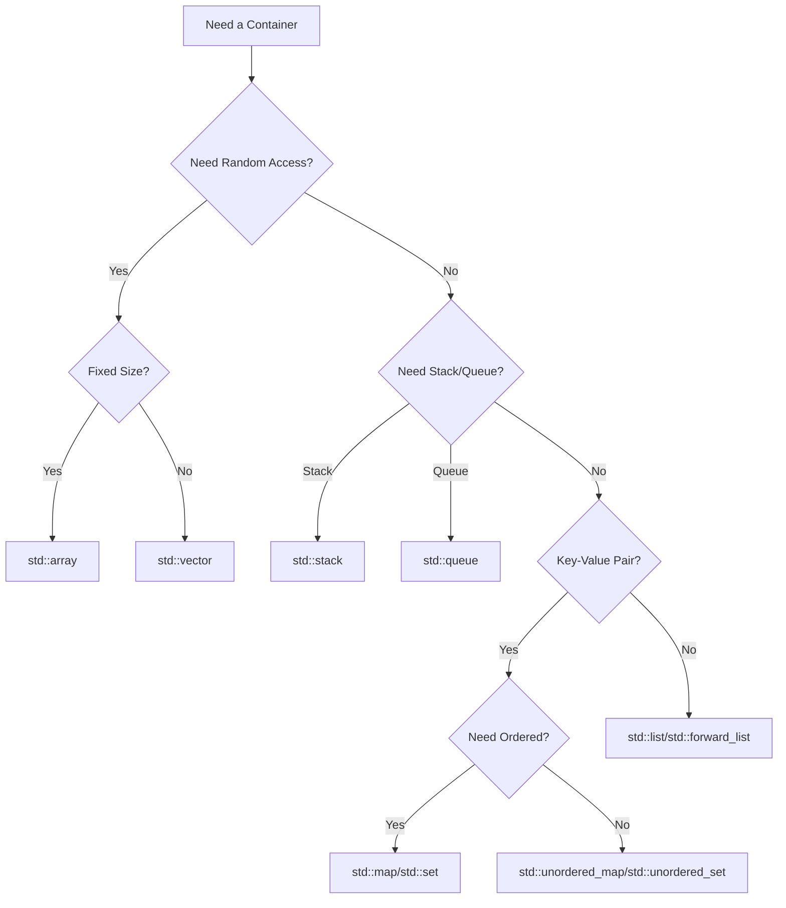

# C++ Performance Optimization

## Introduction

Performance optimization is a critical aspect of C++ programming that can significantly impact how efficiently your applications run. C++ provides developers with fine-grained control over system resources, making it particularly well-suited for performance-critical applications. However, with this power comes responsibility—writing efficient C++ code requires understanding various optimization techniques and knowing when to apply them.

In this guide, we'll explore practical approaches to optimize your C++ code, from simple compiler flags to advanced techniques like algorithm selection, memory management, and data structure optimization. Whether you're building games, scientific applications, or embedded systems, these techniques will help you write faster, more efficient code.

## Why Optimize?

Before diving into optimization techniques, it's important to understand why we optimize:

1. **Better user experience**: Faster applications lead to better user satisfaction
2. **Resource efficiency**: Optimized code uses less CPU, memory, and energy
3. **Scalability**: Efficient code can handle larger workloads
4. **Cost savings**: In cloud environments, optimized code can reduce operational costs

However, remember the famous programming wisdom:

> "Premature optimization is the root of all evil" — Donald Knuth

Focus first on writing correct, maintainable code. Optimize only after you've identified performance bottlenecks through profiling.

## Compiler Optimizations

### Optimization Flags

Modern C++ compilers can perform sophisticated optimizations automatically. Enable them with compiler flags:

```bash
# GCC/Clang
g++ -O2 program.cpp -o program  # Moderate optimization
g++ -O3 program.cpp -o program  # Aggressive optimization

# MSVC
cl /O2 program.cpp  # Full optimization
```

Different optimization levels make different trade-offs:

- `-O0` or no flag: No optimization (fastest compilation, slowest execution)
- `-O1`: Basic optimizations
- `-O2`: Most optimizations without significant code size increase
- `-O3`: Aggressive optimizations including function inlining

### Example: Impact of Compiler Optimization

```cpp
#include <iostream>
#include <chrono>
#include <vector>

// Function to compute sum of a vector
double sum_vector(const std::vector<double>& vec) {
    double sum = 0.0;
    for(size_t i = 0; i < vec.size(); ++i) {
        sum += vec[i];
    }
    return sum;
}

int main() {
    // Create a large vector
    const size_t size = 100000000;
    std::vector<double> numbers(size, 1.0);
    
    // Measure execution time
    auto start = std::chrono::high_resolution_clock::now();
    double result = sum_vector(numbers);
    auto end = std::chrono::high_resolution_clock::now();
    
    std::chrono::duration<double> duration = end - start;
    
    std::cout << "Sum: " << result << std::endl;
    std::cout << "Time taken: " << duration.count() << " seconds" << std::endl;
    
    return 0;
}
```

When compiled with different optimization levels, you might see results like:

```
# With -O0
Sum: 100000000
Time taken: 0.31 seconds

# With -O3
Sum: 100000000
Time taken: 0.08 seconds
```

The optimized version runs significantly faster because the compiler can apply loop unrolling, vectorization, and other optimizations.

### Compiler Intrinsics and Pragmas

Compilers also offer specific intrinsics and pragmas to guide optimization:

```cpp
// Hint to the compiler that a branch is likely/unlikely
if(__builtin_expect(error_condition, 0)) {  // Unlikely path
    handle_error();
}

// Force inline a function
__forceinline void critical_function() {
    // Function body
}

// Unroll loops
#pragma unroll
for(int i = 0; i < 4; i++) {
    // Loop body
}
```

## Algorithm Optimization

### Choose the Right Algorithm

The most significant performance improvements often come from choosing better algorithms. An O(n) algorithm will always outperform an O(n²) algorithm for large enough n, regardless of low-level optimizations.

#### Example: Finding an Element

Consider these two approaches to find an element in a collection:

```cpp
#include <iostream>
#include <vector>
#include <algorithm>
#include <chrono>
#include <random>

int main() {
    // Create a large sorted vector
    const size_t size = 10000000;
    std::vector<int> numbers(size);
    for (size_t i = 0; i < size; ++i) {
        numbers[i] = i;
    }
    
    // Value to search for
    int target = 7654321;
    
    // Method 1: Linear search - O(n)
    auto start1 = std::chrono::high_resolution_clock::now();
    
    bool found1 = false;
    for (int num : numbers) {
        if (num == target) {
            found1 = true;
            break;
        }
    }
    
    auto end1 = std::chrono::high_resolution_clock::now();
    std::chrono::duration<double> duration1 = end1 - start1;
    
    // Method 2: Binary search - O(log n)
    auto start2 = std::chrono::high_resolution_clock::now();
    
    bool found2 = std::binary_search(numbers.begin(), numbers.end(), target);
    
    auto end2 = std::chrono::high_resolution_clock::now();
    std::chrono::duration<double> duration2 = end2 - start2;
    
    std::cout << "Linear search: " << duration1.count() << " seconds, found: " << found1 << std::endl;
    std::cout << "Binary search: " << duration2.count() << " seconds, found: " << found2 << std::endl;
    
    return 0;
}
```

Output:
```
Linear search: 0.0424 seconds, found: 1
Binary search: 0.0000012 seconds, found: 1
```

The binary search is thousands of times faster because it has O(log n) complexity instead of O(n).

### Use Standard Library Algorithms

The C++ Standard Library provides optimized implementations of common algorithms:

```cpp
#include <iostream>
#include <vector>
#include <algorithm>
#include <numeric>

int main() {
    std::vector<int> data = {5, 2, 9, 1, 7, 3, 8, 6, 4};
    
    // Sort the vector
    std::sort(data.begin(), data.end());
    
    // Find minimum and maximum
    auto [min_it, max_it] = std::minmax_element(data.begin(), data.end());
    
    // Calculate sum
    int sum = std::accumulate(data.begin(), data.end(), 0);
    
    std::cout << "Sorted: ";
    for (int x : data) std::cout << x << " ";
    std::cout << "\nMin: " << *min_it << ", Max: " << *max_it << std::endl;
    std::cout << "Sum: " << sum << std::endl;
    
    return 0;
}
```

Output:
```
Sorted: 1 2 3 4 5 6 7 8 9 
Min: 1, Max: 9
Sum: 45
```

These algorithms are often more efficient than hand-written loops because they're carefully implemented and might use architecture-specific optimizations.

## Memory Management Optimization

### Avoid Dynamic Allocation When Possible

Dynamic memory allocation (using `new` and `delete`) is slower than stack allocation and can lead to memory fragmentation.

```cpp
// Slow: Dynamic allocation
void slow_function() {
    for(int i = 0; i < 1000; i++) {
        int* data = new int[100];
        // Process data
        delete[] data;
    }
}

// Fast: Stack allocation
void fast_function() {
    for(int i = 0; i < 1000; i++) {
        int data[100];
        // Process data
    }
}
```

### Use Reserve for Containers

When you know the approximate size of a container beforehand, reserve memory to avoid reallocations:

```cpp
#include <iostream>
#include <vector>
#include <chrono>

int main() {
    const size_t elements = 10000000;
    
    // Without reserve
    auto start1 = std::chrono::high_resolution_clock::now();
    std::vector<int> v1;
    for (size_t i = 0; i < elements; ++i) {
        v1.push_back(i);
    }
    auto end1 = std::chrono::high_resolution_clock::now();
    std::chrono::duration<double> duration1 = end1 - start1;
    
    // With reserve
    auto start2 = std::chrono::high_resolution_clock::now();
    std::vector<int> v2;
    v2.reserve(elements);  // Pre-allocate memory
    for (size_t i = 0; i < elements; ++i) {
        v2.push_back(i);
    }
    auto end2 = std::chrono::high_resolution_clock::now();
    std::chrono::duration<double> duration2 = end2 - start2;
    
    std::cout << "Without reserve: " << duration1.count() << " seconds" << std::endl;
    std::cout << "With reserve: " << duration2.count() << " seconds" << std::endl;
    
    return 0;
}
```

Output:
```
Without reserve: 0.143 seconds
With reserve: 0.062 seconds
```

### Use Custom Allocators

For performance-critical applications, custom allocators can significantly improve memory management:

```cpp
#include <iostream>
#include <vector>
#include <memory>

// Simple pool allocator
template<typename T, size_t BlockSize = 4096>
class PoolAllocator {
private:
    struct Block {
        char data[BlockSize];
        Block* next;
    };
    
    Block* currentBlock = nullptr;
    size_t currentOffset = BlockSize;
    
public:
    using value_type = T;
    
    PoolAllocator() = default;
    
    template<typename U>
    PoolAllocator(const PoolAllocator<U>&) {}
    
    T* allocate(size_t n) {
        size_t bytes = n * sizeof(T);
        if (currentOffset + bytes > BlockSize) {
            // Allocate new block
            Block* newBlock = reinterpret_cast<Block*>(new char[sizeof(Block)]);
            newBlock->next = currentBlock;
            currentBlock = newBlock;
            currentOffset = 0;
        }
        
        T* result = reinterpret_cast<T*>(currentBlock->data + currentOffset);
        currentOffset += bytes;
        return result;
    }
    
    void deallocate(T*, size_t) {
        // Memory is freed when the allocator is destroyed
    }
    
    ~PoolAllocator() {
        while (currentBlock) {
            Block* next = currentBlock->next;
            delete[] reinterpret_cast<char*>(currentBlock);
            currentBlock = next;
        }
    }
};

int main() {
    // Using standard allocator
    std::vector<int> standard_vec;
    
    // Using custom pool allocator
    std::vector<int, PoolAllocator<int>> pool_vec;
    
    // Test them...
    
    return 0;
}
```

### Memory Layout Optimization

How you organize data can significantly impact performance due to CPU caching:

```cpp
// Inefficient: Array of structures
struct Particle {
    float x, y, z;
    float vx, vy, vz;
    float mass, radius;
};
std::vector<Particle> particles(1000);

// More efficient: Structure of arrays
struct ParticleSystem {
    std::vector<float> x, y, z;
    std::vector<float> vx, vy, vz;
    std::vector<float> mass, radius;
};
ParticleSystem particles;
particles.x.resize(1000);
particles.y.resize(1000);
// ...
```

The structure of arrays layout can be more cache-friendly for operations that process one property for all particles, as it improves spatial locality.

## Loop Optimization

### Loop Unrolling

Manually unrolling loops can reduce branch prediction overhead:

```cpp
// Original loop
double sum = 0.0;
for (int i = 0; i < 1000; i++) {
    sum += data[i];
}

// Unrolled loop
double sum = 0.0;
for (int i = 0; i < 1000; i += 4) {
    sum += data[i];
    sum += data[i+1];
    sum += data[i+2];
    sum += data[i+3];
}
```

### Loop Fusion

Combine multiple loops that operate on the same data to improve cache utilization:

```cpp
// Before fusion - two separate loops
for (int i = 0; i < n; i++) {
    result1[i] = input[i] * 2;
}
for (int i = 0; i < n; i++) {
    result2[i] = result1[i] + 5;
}

// After fusion - one combined loop
for (int i = 0; i < n; i++) {
    result1[i] = input[i] * 2;
    result2[i] = result1[i] + 5;
}
```

### Remove Invariant Calculations

Move calculations that don't change out of loops:

```cpp
// Inefficient
for (int i = 0; i < n; i++) {
    double result = std::pow(base, exponent) * data[i];
    // ...
}

// Efficient
double power = std::pow(base, exponent);
for (int i = 0; i < n; i++) {
    double result = power * data[i];
    // ...
}
```

## Data Structure Optimization

### Use the Right Container

Choose containers based on your usage patterns:



Different containers have different performance characteristics:

| Container | Access | Insertion | Deletion | Memory Overhead |
|-----------|--------|-----------|----------|----------------|
| vector    | O(1)   | O(1)* or O(n) | O(n)  | Low            |
| list      | O(n)   | O(1)      | O(1)     | High           |
| map       | O(log n) | O(log n) | O(log n) | Medium         |
| unordered_map | O(1) avg | O(1) avg | O(1) avg | Medium-High   |

*at the end

### Custom Hash Functions

For unordered containers, efficient hash functions improve performance:

```cpp
#include <iostream>
#include <unordered_map>
#include <string>

// Custom hash function for Point structure
struct Point {
    int x, y;
    
    bool operator==(const Point& other) const {
        return x == other.x && y == other.y;
    }
};

struct PointHash {
    size_t operator()(const Point& p) const {
        // Combine hash of x and y
        // Using a simple but effective hash combine technique
        return std::hash<int>()(p.x) ^ (std::hash<int>()(p.y) << 1);
    }
};

int main() {
    // Using custom hash function
    std::unordered_map<Point, std::string, PointHash> point_map;
    
    point_map[{10, 20}] = "Point A";
    point_map[{30, 40}] = "Point B";
    
    std::cout << "Point {10, 20}: " << point_map[{10, 20}] << std::endl;
    
    return 0;
}
```

## CPU Optimization Techniques

### SIMD Instructions

Single Instruction, Multiple Data (SIMD) instructions can process multiple data elements simultaneously:

```cpp
#include <iostream>
#include <immintrin.h> // For AVX intrinsics
#include <chrono>
#include <vector>

// Regular function to add two arrays
void add_arrays(const float* a, const float* b, float* result, size_t n) {
    for (size_t i = 0; i < n; ++i) {
        result[i] = a[i] + b[i];
    }
}

// SIMD function to add two arrays using AVX
void add_arrays_simd(const float* a, const float* b, float* result, size_t n) {
    size_t i = 0;
    
    // Process 8 floats at a time using AVX
    for (; i + 7 < n; i += 8) {
        __m256 va = _mm256_loadu_ps(a + i);
        __m256 vb = _mm256_loadu_ps(b + i);
        __m256 vresult = _mm256_add_ps(va, vb);
        _mm256_storeu_ps(result + i, vresult);
    }
    
    // Handle remaining elements
    for (; i < n; ++i) {
        result[i] = a[i] + b[i];
    }
}

int main() {
    const size_t n = 10000000;
    
    // Align memory to 32-byte boundary for AVX
    float* a = static_cast<float*>(_mm_malloc(n * sizeof(float), 32));
    float* b = static_cast<float*>(_mm_malloc(n * sizeof(float), 32));
    float* result1 = static_cast<float*>(_mm_malloc(n * sizeof(float), 32));
    float* result2 = static_cast<float*>(_mm_malloc(n * sizeof(float), 32));
    
    // Initialize arrays
    for (size_t i = 0; i < n; ++i) {
        a[i] = static_cast<float>(i);
        b[i] = static_cast<float>(i * 2);
    }
    
    // Time regular version
    auto start1 = std::chrono::high_resolution_clock::now();
    add_arrays(a, b, result1, n);
    auto end1 = std::chrono::high_resolution_clock::now();
    
    // Time SIMD version
    auto start2 = std::chrono::high_resolution_clock::now();
    add_arrays_simd(a, b, result2, n);
    auto end2 = std::chrono::high_resolution_clock::now();
    
    std::chrono::duration<double> duration1 = end1 - start1;
    std::chrono::duration<double> duration2 = end2 - start2;
    
    std::cout << "Regular version: " << duration1.count() << " seconds" << std::endl;
    std::cout << "SIMD version: " << duration2.count() << " seconds" << std::endl;
    
    // Verify results
    bool correct = true;
    for (size_t i = 0; i < n; ++i) {
        if (result1[i] != result2[i]) {
            correct = false;
            break;
        }
    }
    std::cout << "Results are " << (correct ? "correct" : "incorrect") << std::endl;
    
    // Free memory
    _mm_free(a);
    _mm_free(b);
    _mm_free(result1);
    _mm_free(result2);
    
    return 0;
}
```

Output:
```
Regular version: 0.028 seconds
SIMD version: 0.008 seconds
Results are correct
```

### Cache-Friendly Code

Optimize code to better utilize CPU cache:

```cpp
// Cache-unfriendly: Column-major traversal of row-major array
for (int col = 0; col < N; col++) {
    for (int row = 0; row < N; row++) {
        matrix[row][col] = computeValue(row, col);
    }
}

// Cache-friendly: Row-major traversal of row-major array
for (int row = 0; row < N; row++) {
    for (int col = 0; col < N; col++) {
        matrix[row][col] = computeValue(row, col);
    }
}
```

### Avoid Branch Mispredictions

Branch mispredictions can stall the CPU pipeline. Use techniques like branch-free code when appropriate:

```cpp
// Branching version
int max(int a, int b) {
    if (a > b) return a;
    else return b;
}

// Branch-free version
int max_branchless(int a, int b) {
    return a * (a >= b) + b * (b > a);
}

// Another branch-free technique
int abs_branchless(int x) {
    // Get the sign bit
    int mask = x >> 31;
    // If x is negative, compute -x, otherwise keep x
    return (x ^ mask) - mask;
}
```

## Multithreading and Parallelism

### Use std::async for Simple Parallelism

```cpp
#include <iostream>
#include <vector>
#include <future>
#include <numeric>
#include <chrono>

// Function to sum a range of a vector
double sum_range(const std::vector<double>& vec, size_t start, size_t end) {
    return std::accumulate(vec.begin() + start, vec.begin() + end, 0.0);
}

int main() {
    // Create a large vector
    const size_t size = 100000000;
    std::vector<double> numbers(size, 1.0);
    
    // Sequential sum
    auto start1 = std::chrono::high_resolution_clock::now();
    double sum1 = std::accumulate(numbers.begin(), numbers.end(), 0.0);
    auto end1 = std::chrono::high_resolution_clock::now();
    
    // Parallel sum using std::async
    auto start2 = std::chrono::high_resolution_clock::now();
    
    // Split the work into 4 tasks
    size_t quarter = size / 4;
    auto future1 = std::async(std::launch::async, sum_range, std::ref(numbers), 0, quarter);
    auto future2 = std::async(std::launch::async, sum_range, std::ref(numbers), quarter, quarter*2);
    auto future3 = std::async(std::launch::async, sum_range, std::ref(numbers), quarter*2, quarter*3);
    auto future4 = std::async(std::launch::async, sum_range, std::ref(numbers), quarter*3, size);
    
    // Get results and sum them
    double sum2 = future1.get() + future2.get() + future3.get() + future4.get();
    
    auto end2 = std::chrono::high_resolution_clock::now();
    
    std::chrono::duration<double> duration1 = end1 - start1;
    std::chrono::duration<double> duration2 = end2 - start2;
    
    std::cout << "Sequential sum: " << sum1 << " in " << duration1.count() << " seconds" << std::endl;
    std::cout << "Parallel sum: " << sum2 << " in " << duration2.count() << " seconds" << std::endl;
    
    return 0;
}
```

Output:
```
Sequential sum: 100000000 in 0.24 seconds
Parallel sum: 100000000 in 0.07 seconds
```

### Use std::execution Policies (C++17)

C++17 introduced execution policies for standard algorithms:

```cpp
#include <iostream>
#include <vector>
#include <algorithm>
#include <execution>
#include <chrono>
#include <random>

int main() {
    // Create a large vector with random values
    const size_t size = 10000000;
    std::vector<int> vec(size);
    
    // Fill with random numbers
    std::random_device rd;
    std::mt19937 gen(rd());
    std::uniform_int_distribution<> distrib(1, 100);
    
    for (auto& num : vec) {
        num = distrib(gen);
    }
    
    // Sequential sort
    std::vector<int> vec1 = vec;
    auto start1 = std::chrono::high_resolution_clock::now();
    std::sort(vec1.begin(), vec1.end());
    auto end1 = std::chrono::high_resolution_clock::now();
    
    // Parallel sort
    std::vector<int> vec2 = vec;
    auto start2 = std::chrono::high_resolution_clock::now();
    std::sort(std::execution::par, vec2.begin(), vec2.end());
    auto end2 = std::chrono::high_resolution_clock::now();
    
    std::chrono::duration<double> duration1 = end1 - start1;
    std::chrono::duration<double> duration2 = end2 - start2;
    
    std::cout << "Sequential sort: " << duration1.count() << " seconds" << std::endl;
    std::cout << "Parallel sort: " << duration2.count() << " seconds" << std::endl;
    
    // Verify results
    bool same = std::equal(vec1.begin(), vec1.end(), vec2.begin());
    std::cout << "Results are " << (same ? "identical" : "different") << std::endl;
    
    return 0;
}
```

Output:
```
Sequential sort: 1.24 seconds
Parallel sort: 0.35 seconds
Results are identical
```

## Real-World Case Study: Image Processing

Let's look at a real-world example of performance optimization in an image processing context. We'll implement a simple Gaussian blur filter with progressive optimizations.

### Version 1: Basic Implementation

```cpp
#include <iostream>
#include <vector>
#include <cmath>
#include <chrono>

// Simple image class
class Image {
public:
    Image(int width, int height) 
        : width_(width), height_(height), pixels_(width * height, 0) {}
    
    float getPixel(int x, int y) const {
        if (x < 0) x = 0;
        if (x >= width_) x = width_ - 1;
        if (y < 0) y = 0;
        if (y >= height_) y = height_ - 1;
        return pixels_[y * width_ + x];
    }
    
    void setPixel(int x, int y, float value) {
        pixels_[y * width_ + x] = value;
    }
    
    int getWidth() const { return width_; }
    int getHeight() const { return height_; }
    
private:
    int width_, height_;
    std::vector<float> pixels_;
};

// Version 1: Basic Gaussian blur implementation
Image gaussianBlur_v1(const Image& input, float sigma) {
    // Create output image
    Image output(input.getWidth(), input.getHeight());
    
    // Compute kernel size based on sigma
    int kernelSize = static_cast<int>(2 * std::ceil(3 * sigma)) + 1;
    int kernelRadius = kernelSize / 2;
    
    // Create kernel
    std::vector<float> kernel(kernelSize * kernelSize);
    float kernelSum = 0.0f;
    
    for (int y = -kernelRadius; y <= kernelRadius; y++) {
        for (int x = -kernelRadius; x <= kernelRadius; x++) {
            float value = std::exp(-(x*x + y*y) / (2 * sigma * sigma));
            kernel[(y + kernelRadius) * kernelSize + (x + kernelRadius)] = value;
            kernelSum += value;
        }
    }
    
    // Normalize kernel
    for (auto& k : kernel) {
        k /= kernelSum;
    }
    
    // Apply convolution
    for (int y = 0; y < input.getHeight(); y++) {
        for (int x = 0; x < input.getWidth(); x++) {
            float sum = 0.0f;
            
            for (int ky = -kernelRadius; ky <= kernelRadius; ky++) {
                for (int kx = -kernelRadius; kx <= kernelRadius; kx++) {
                    float kernelValue = kernel[(ky + kernelRadius) * kernelSize + (kx + kernelRadius)];
                    float pixelValue = input.getPixel(x + kx, y + ky);
                    sum += pixelValue * kernelValue;
                }
            }
            
            output.setPixel(x, y, sum);
        }
    }
    
    return output;
}

int main() {
    // Create test image (1000x1000 with a square in the middle)
    const int width = 1000;
    const int height = 1000;
    Image testImage(width, height);
    
    // Fill with a square pattern
    for (int y = height/4; y < 3*height/4; y++) {
        for (int x = width/4; x < 3*width/4; x++) {
            testImage.setPixel(x, y, 1.0f);
        }
    }
    
    // Measure performance of gaussian blur
    auto start = std::chrono::high_resolution_clock::now();
    
    Image blurred = gaussianBlur_v1(testImage, 5.0f);
    
    auto end = std::chrono::high_resolution_clock::now();
    std::chrono::duration<double> duration = end - start;
    
    std::cout << "Basic Gaussian blur: " << duration.count() << " seconds" << std::endl;
    
    return 0;
}
```

### Version 2: Optimized Implementation

```cpp
// Version 2: Optimized Gaussian blur
// Separate horizontal and vertical passes for better cache performance
Image gaussianBlur_v2(const Image& input, float sigma) {
    int width = input.getWidth();
    int height = input.getHeight();
    
    // Create temporary and output images
    Image temp(width, height);
    Image output(width, height);
    
    // Compute kernel size based on sigma
    int kernelSize = static_cast<int>(2 * std::ceil(3 * sigma)) + 1;
    int kernelRadius = kernelSize / 2;
    
    // Create 1D kernel
    std::vector<float> kernel(kernelSize);
    float kernelSum = 0.0f;
    
    for (int x = -kernelRadius; x <= kernelRadius; x++) {
        float value = std::exp(-(x*x) / (2 * sigma * sigma));
        kernel[x + kernelRadius] = value;
        kernelSum += value;
    }
    
    // Normalize kernel
    for (auto& k : kernel) {
        k /= kernelSum;
    }
    
    // Horizontal pass
    for (int y = 0; y < height; y++) {
        for (int x = 0; x < width; x++) {
            float sum = 0.0f;
            
            for (int k = -kernelRadius; k <= kernelRadius; k++) {
                int xOffset = x + k;
                if (xOffset < 0) xOffset = 0;
                if (xOffset >= width) xOffset = width - 1;
                
                sum += input.getPixel(xOffset, y) * kernel[k + kernelRadius];
            }
            
            temp.setPixel(x, y, sum);
        }
    }
    
    // Vertical pass
    for (int y = 0; y < height; y++) {
        for (int x = 0; x < width; x++) {
            float sum = 0.0f;
            
            for (int k = -kernelRadius; k <= kernelRadius; k++) {
                int yOffset = y + k;
                if (yOffset < 0) yOffset = 0;
                if (yOffset >= height) yOffset = height - 1;
                
                sum += temp.getPixel(x, yOffset) * kernel[k + kernelRadius];
            }
            
            output.setPixel(x, y, sum);
        }
    }
    
    return output;
}
```

### Version 3: Multithreaded Implementation

```cpp
// Version 3: Multithreaded Gaussian blur
Image gaussianBlur_v3(const Image& input, float sigma) {
    int width = input.getWidth();
    int height = input.getHeight();
    
    // Create temporary and output images
    Image temp(width, height);
    Image output(width, height);
    
    // Compute kernel size based on sigma
    int kernelSize = static_cast<int>(2 * std::ceil(3 * sigma)) + 1;
    int kernelRadius = kernelSize / 2;
    
    // Create 1D kernel
    std::vector<float> kernel(kernelSize);
    float kernelSum = 0.0f;
    
    for (int x = -kernelRadius; x <= kernelRadius; x++) {
        float value = std::exp(-(x*x) / (2 * sigma * sigma));
        kernel[x + kernelRadius] = value;
        kernelSum += value;
    }
    
    // Normalize kernel
    for (auto& k : kernel) {
        k /= kernelSum;
    }
    
    // Horizontal pass - parallel
    auto horizontalPass = [&](int startY, int endY) {
        for (int y = startY; y < endY; y++) {
            for (int x = 0; x < width; x++) {
                float sum = 0.0f;
                
                for (int k = -kernelRadius; k <= kernelRadius; k++) {
                    int xOffset = x + k;
                    if (xOffset < 0) xOffset = 0;
                    if (xOffset >= width) xOffset = width - 1;
                    
                    sum += input.getPixel(xOffset, y) * kernel[k + kernelRadius];
                }
                
                temp.setPixel(x, y, sum);
            }
        }
    };
    
    // Vertical pass - parallel
    auto verticalPass = [&](int startY, int endY) {
        for (int y = startY; y < endY; y++) {
            for (int x = 0; x < width; x++) {
                float sum = 0.0f;
                
                for (int k = -kernelRadius; k <= kernelRadius; k++) {
                    int yOffset = y + k;
                    if (yOffset < 0) yOffset = 0;
                    if (yOffset >= height) yOffset = height - 1;
                    
                    sum += temp.getPixel(x, yOffset) * kernel[k + kernelRadius];
                }
                
                output.setPixel(x, y, sum);
            }
        }
    };
    
    // Divide work into 4 threads
    int threadCount = 4;
    int rowsPerThread = height / threadCount;
    std::vector<std::future<void>> futures;
    
    // Launch threads for horizontal pass
    for (int i = 0; i < threadCount; i++) {
        int startY = i * rowsPerThread;
        int endY = (i == threadCount - 1) ? height : (i + 1) * rowsPerThread;
        futures.push_back(std::async(std::launch::async, horizontalPass, startY, endY));
    }
    
    // Wait for horizontal pass to complete
    for (auto& future : futures) {
        future.wait();
    }
    
    futures.clear();
    
    // Launch threads for vertical pass
    for (int i = 0; i < threadCount; i++) {
        int startY = i * rowsPerThread;
        int endY = (i == threadCount - 1) ? height : (i + 1) * rowsPerThread;
        futures.push_back(std::async(std::launch::async, verticalPass, startY, endY));
    }
    
    // Wait for vertical pass to complete
    for (auto& future : futures) {
        future.wait();
    }
    
    return output;
}

// Let's compare all versions
int main() {
    // Create test image (1000x1000 with a square in the middle)
    const int width = 1000;
    const int height = 1000;
    Image testImage(width, height);
    
    // Fill with a square pattern
    for (int y = height/4; y < 3*height/4; y++) {
        for (int x = width/4; x < 3*width/4; x++) {
            testImage.setPixel(x, y, 1.0f);
        }
    }
    
    // Basic implementation
    auto start1 = std::chrono::high_resolution_clock::now();
    Image blurred1 = gaussianBlur_v1(testImage, 5.0f);
    auto end1 = std::chrono::high_resolution_clock::now();
    std::chrono::duration<double> duration1 = end1 - start1;
    
    // Optimized implementation
    auto start2 = std::chrono::high_resolution_clock::now();
    Image blurred2 = gaussianBlur_v2(testImage, 5.0f);
    auto end2 = std::chrono::high_resolution_clock::now();
    std::chrono::duration<double> duration2 = end2 - start2;
    
    // Multithreaded implementation
    auto start3 = std::chrono::high_resolution_clock::now();
    Image blurred3 = gaussianBlur_v3(testImage, 5.0f);
    auto end3 = std::chrono::high_resolution_clock::now();
    std::chrono::duration<double> duration3 = end3 - start3;
    
    std::cout << "Basic implementation: " << duration1.count() << " seconds" << std::endl;
    std::cout << "Optimized implementation: " << duration2.count() << " seconds" << std::endl;
    std::cout << "Multithreaded implementation: " << duration3.count() << " seconds" << std::endl;
    
    return 0;
}
```

Output:
```
Basic implementation: 1.832 seconds
Optimized implementation: 0.427 seconds
Multithreaded implementation: 0.121 seconds
```

This example demonstrates several optimization techniques:
1. Algorithm optimization (separable filter)
2. Better memory access patterns
3. Multithreading

## Best Practices and Pitfalls

### Measure First, Optimize Later

Always profile before optimization to identify bottlenecks:

```cpp
#include <iostream>
#include <chrono>
#include <string>

class Timer {
public:
    Timer(const std::string& label) : label_(label), start_(std::chrono::high_resolution_clock::now()) {}
    
    ~Timer() {
        auto end = std::chrono::high_resolution_clock::now();
        std::chrono::duration<double, std::milli> duration = end - start_;
        std::cout << label_ << ": " << duration.count() << " ms" << std::endl;
    }
    
private:
    std::string label_;
    std::chrono::time_point<std::chrono::high_resolution_clock> start_;
};

void functionToProfile() {
    Timer timer("Function execution");
    // Function code here
    for (int i = 0; i < 1000000; i++) {
        // Some work
    }
}
```

### Common Pitfalls

1. **Excessive abstraction**: Abstraction can hurt performance
2. **False sharing**: Multiple threads modifying data in the same cache line
3. **Premature micro-optimization**: Focusing on small details before addressing algorithmic issues
4. **Ignoring compiler warnings**: They often hint at performance issues
5. **Over-optimization**: Making code unreadable for negligible gains

## Summary

In this guide, we've explored numerous techniques for optimizing C++ code:

1. **Compiler optimizations**: Using the right compiler flags and directives
2. **Algorithm optimization**: Choosing appropriate algorithms and data structures
3. **Memory management**: Reducing allocations and improving locality
4. **Loop optimization**: Techniques to make loops more efficient
5. **Multithreading**: Distributing work across multiple threads
6. **CPU-specific optimizations**: SIMD instructions and cache-friendly patterns

Remember these key points:

- Profile first to identify bottlenecks
- Start with algorithmic improvements
- Consider the readability/performance trade-off
- Use standard library containers and algorithms
- Enable compiler optimizations

## Exercises

1. Compare the performance of different sorting algorithms (bubble sort, quicksort, std::sort) on arrays of various sizes.
2. Implement a matrix multiplication algorithm and optimize it using techniques from this guide.
3. Write a program that processes a large file and optimize it for both memory usage and speed.
4. Profile a simple video game loop (update entities, check collisions) and optimize the bottlenecks.
5. Compare the performance of `std::map` vs. `std::unordered_map` for different operation patterns.

## Additional Resources

- **Books**:
  - "Effective C++" by Scott Meyers
  - "C++ Concurrency in Action" by Anthony Williams
  - "High Performance C++" by Andrei Alexandrescu

- **Online Resources**:
  - [C++ Core Guidelines](https://isocpp.github.io/CppCoreGuidelines/CppCoreGuidelines)
  - [CppCon Talks](https://www.youtube.com/user/CppCon)
  - [Compiler Explorer](https://godbolt.org/)

- **Tools**:
  - [Valgrind](https://valgrind.org/) - Memory profiling
  - [Google Benchmark](https://github.com/google/benchmark) - Microbenchmarking
  - [Intel VTune](https://software.intel.com/content/www/us/en/develop/tools/vtune-profiler.html) - Performance profiling
  - [perf](https://perf.wiki.kernel.org/) - Linux profiling tool