# C++ Common Mistakes

Programming in C++ can be challenging, especially for beginners. This guide highlights common pitfalls that new C++ programmers often encounter, explains why they occur, and demonstrates how to avoid them. By learning to recognize these issues early, you'll develop better programming habits and write more robust code.

## Introduction

C++ is a powerful language that gives programmers significant control over system resources, memory management, and performance optimization. However, this power comes with responsibility, and it's easy to make mistakes that can lead to bugs, crashes, or security vulnerabilities.

In this guide, we'll explore common C++ mistakes in several categories:
- Memory management issues
- Variable initialization problems
- Pointer pitfalls
- Syntax and semantic errors
- Function and scope mistakes
- Performance issues

Let's dive in and learn how to recognize and prevent these common errors!

## Memory Management Mistakes

### 1. Memory Leaks

One of the most common issues in C++ is failing to free dynamically allocated memory.

```cpp
// ❌ Memory leak example
void badFunction() {
    int* numbers = new int[100];
    // Function ends without deleting numbers
}

// ✅ Correct approach
void goodFunction() {
    int* numbers = new int[100];
    // Do operations with numbers
    delete[] numbers; // Remember to free the memory
}
```

**Why it's a problem**: When memory is allocated but never freed, it remains inaccessible, leading to memory leaks. Over time, this can cause your program to consume increasing amounts of memory, eventually crashing.

**Better solution**: Use smart pointers that automatically manage memory:

```cpp
#include <memory>

void bestFunction() {
    std::unique_ptr<int[]> numbers(new int[100]);
    // Memory will be automatically freed when numbers goes out of scope
}

// Even better with C++11 and later
void modernFunction() {
    std::vector<int> numbers(100);
    // No manual memory management needed
}
```

### 2. Double Deletion

```cpp
// ❌ Double deletion example
int* value = new int(42);
delete value;
// Some more code...
delete value; // Error: double deletion
```

**Why it's a problem**: Deleting the same memory twice can cause undefined behavior, potentially crashing your program or corrupting memory.

**Solution**: Set pointers to nullptr after deletion and check before deleting:

```cpp
// ✅ Correct approach
int* value = new int(42);
delete value;
value = nullptr; // Set to nullptr after deletion

// Later in code
if (value != nullptr) {
    delete value;
    value = nullptr;
}
```

## Variable Initialization Problems

### 1. Uninitialized Variables

```cpp
// ❌ Uninitialized variable
int main() {
    int x;
    std::cout << "Value of x: " << x << std::endl; // Undefined behavior
    return 0;
}

// ✅ Properly initialized variable
int main() {
    int x = 0; // Initialize to a default value
    std::cout << "Value of x: " << x << std::endl; // Outputs: Value of x: 0
    return 0;
}
```

**Why it's a problem**: Uninitialized variables contain random values (whatever was in that memory location), which can lead to unpredictable program behavior.

### 2. Forgetting to Initialize Class Members

```cpp
// ❌ Class with uninitialized members
class Person {
private:
    std::string name;
    int age;
public:
    Person(std::string n) {
        name = n;
        // age is never initialized
    }
    
    void display() {
        std::cout << name << " is " << age << " years old." << std::endl; // Undefined behavior
    }
};

// ✅ Class with properly initialized members
class Person {
private:
    std::string name;
    int age;
public:
    Person(std::string n) : name(n), age(0) { // Initialize all members
    }
    
    void display() {
        std::cout << name << " is " << age << " years old." << std::endl; // Safe
    }
};
```

**Best practice**: Use member initializer lists for better performance and to ensure all members are initialized.

## Pointer Pitfalls

### 1. Null Pointer Dereferencing

```cpp
// ❌ Null pointer dereferencing
int* ptr = nullptr;
*ptr = 42; // Crash: dereferencing nullptr

// ✅ Check before dereferencing
int* ptr = nullptr;
if (ptr != nullptr) {
    *ptr = 42;
} else {
    // Handle the null pointer case
    ptr = new int(0);
    *ptr = 42;
}
```

**Output of bad code**: Program crash or segmentation fault

### 2. Dangling Pointers

```cpp
// ❌ Dangling pointer example
int* createAndReturn() {
    int local = 42;
    return &local; // DANGEROUS: returning address of local variable
}

int main() {
    int* ptr = createAndReturn();
    std::cout << *ptr << std::endl; // Undefined behavior
    return 0;
}

// ✅ Proper approach with dynamic allocation
int* createAndReturn() {
    int* value = new int(42);
    return value; // Return dynamically allocated memory
}

int main() {
    int* ptr = createAndReturn();
    std::cout << *ptr << std::endl; // Prints 42
    delete ptr; // Remember to free the memory
    return 0;
}
```

**Why it's a problem**: When a function returns the address of a local variable, that memory becomes invalid after the function returns, leading to dangling pointers.

## Syntax and Semantic Errors

### 1. Confusing Assignment (=) with Equality (==)

```cpp
// ❌ Using assignment instead of equality check
int x = 5;
if (x = 10) { // This assigns 10 to x, then evaluates to true
    std::cout << "This will always print!" << std::endl;
}

// ✅ Correct equality check
int x = 5;
if (x == 10) { // This checks if x equals 10
    std::cout << "This won't print because x is 5" << std::endl;
}
```

**Output of bad code**: "This will always print!"

**Why it's a problem**: Assignment operators return the assigned value, which is treated as a boolean in conditional statements. Non-zero values evaluate to true.

### 2. Missing Semicolons

```cpp
// ❌ Missing semicolon
int x = 5
std::cout << x << std::endl; // Compiler error

// ✅ Correct syntax
int x = 5;
std::cout << x << std::endl;
```

**Best practice**: Always end statements with semicolons and use a linter or compiler warnings to catch these errors.

## Function and Scope Mistakes

### 1. Shadowing Variables

```cpp
// ❌ Variable shadowing
int value = 42;

void function() {
    int value = 10; // This shadows the global value
    std::cout << "Local value: " << value << std::endl; // Prints 10
    // Global value is inaccessible here directly
}

// ✅ Better approach
int globalValue = 42;

void function() {
    int localValue = 10; // Different name, no shadowing
    std::cout << "Local value: " << localValue << std::endl;
    std::cout << "Global value: " << globalValue << std::endl;
}
```

**Why it's a problem**: Shadowing creates confusion and can lead to bugs when the programmer thinks they're accessing one variable but are actually accessing another.

### 2. Not Understanding Pass-by-Value vs. Pass-by-Reference

```cpp
// ❌ Attempting to modify a parameter passed by value
void incrementByValue(int x) {
    x++; // This only modifies the local copy
}

// ✅ Modifying a parameter passed by reference
void incrementByReference(int& x) {
    x++; // This modifies the original variable
}

int main() {
    int number = 5;
    
    incrementByValue(number);
    std::cout << "After incrementByValue: " << number << std::endl; // Outputs: 5
    
    incrementByReference(number);
    std::cout << "After incrementByReference: " << number << std::endl; // Outputs: 6
    
    return 0;
}
```

**Output**:
```
After incrementByValue: 5
After incrementByReference: 6
```

## Performance Issues

### 1. Inefficient String Concatenation in Loops

```cpp
// ❌ Inefficient string concatenation
std::string result;
for (int i = 0; i < 10000; i++) {
    result = result + std::to_string(i) + ", "; // Creates a new string each iteration
}

// ✅ Efficient approach using std::stringstream
std::stringstream ss;
for (int i = 0; i < 10000; i++) {
    ss << i << ", ";
}
std::string result = ss.str();
```

**Why it's a problem**: String concatenation creates new string objects, which is inefficient in a loop.

### 2. Passing Large Objects by Value

```cpp
// ❌ Passing large object by value
void processData(std::vector<int> data) { // Copies the entire vector
    // Process data
}

// ✅ Passing by const reference
void processData(const std::vector<int>& data) { // No copy is made
    // Process data (without modifying it)
}
```

**Why it's a problem**: Passing large objects by value creates unnecessary copies, consuming time and memory.

## Real-World Application: Building a Simple To-Do List

Let's put our knowledge to use by building a simple to-do list application, avoiding common mistakes:

```cpp
#include <iostream>
#include <vector>
#include <string>
#include <memory>

class Task {
private:
    std::string description;
    bool completed;

public:
    // Proper initialization of all members
    Task(const std::string& desc) : description(desc), completed(false) {}
    
    void markCompleted() {
        completed = true;
    }
    
    void display() const {
        std::cout << (completed ? "[X] " : "[ ] ") << description << std::endl;
    }
    
    bool isCompleted() const {
        return completed;
    }
    
    // Using const reference for efficient string access
    const std::string& getDescription() const {
        return description;
    }
};

class TodoList {
private:
    std::vector<std::unique_ptr<Task>> tasks; // Using smart pointers for automatic memory management

public:
    // Adding task efficiently
    void addTask(const std::string& description) {
        tasks.push_back(std::make_unique<Task>(description));
    }
    
    void displayTasks() const {
        if (tasks.empty()) {
            std::cout << "No tasks in the list." << std::endl;
            return;
        }
        
        std::cout << "Tasks:" << std::endl;
        for (size_t i = 0; i < tasks.size(); ++i) {
            std::cout << i + 1 << ". ";
            tasks[i]->display();
        }
    }
    
    bool completeTask(size_t index) {
        // Properly check bounds
        if (index >= 0 && index < tasks.size()) {
            tasks[index]->markCompleted();
            return true;
        }
        return false;
    }
};

int main() {
    TodoList todoList;
    
    todoList.addTask("Learn C++");
    todoList.addTask("Understand common mistakes");
    todoList.addTask("Practice good coding habits");
    
    std::cout << "Initial list:" << std::endl;
    todoList.displayTasks();
    
    // Complete a task (using index 0 for the first task)
    if (todoList.completeTask(0)) {
        std::cout << "\nAfter completing the first task:" << std::endl;
        todoList.displayTasks();
    }
    
    return 0;
}
```

**Output**:
```
Initial list:
Tasks:
1. [ ] Learn C++
2. [ ] Understand common mistakes
3. [ ] Practice good coding habits

After completing the first task:
Tasks:
1. [X] Learn C++
2. [ ] Understand common mistakes
3. [ ] Practice good coding habits
```

This example demonstrates several best practices:
- Smart pointers for memory management
- Initializing all class members
- Passing strings by const reference for efficiency
- Proper bounds checking
- Clear separation of concerns between classes

## Debugging Tips for Common Mistakes

When you encounter errors or unexpected behavior in your C++ code, these strategies can help:

1. **Enable compiler warnings**: Use flags like `-Wall`, `-Wextra`, and `-Wpedantic` with GCC/Clang.

2. **Use a debugger**: Tools like GDB or Visual Studio's debugger allow you to step through code and inspect variables.

3. **Add assertions**: Use `assert()` to verify assumptions in your code during development.

```cpp
#include <cassert>

void divide(int a, int b) {
    assert(b != 0 && "Division by zero is not allowed!");
    int result = a / b;
    std::cout << "Result: " << result << std::endl;
}
```

4. **Memory checking tools**: Use tools like Valgrind to detect memory leaks and other issues.

## Common Mistakes Visualization

```mermaid
graph TD
    A[Common C++ Mistakes] --> B[Memory Management]
    A --> C[Variable Initialization]
    A --> D[Pointer Issues]
    A --> E[Syntax Errors]
    A --> F[Function/Scope Issues]
    A --> G[Performance Issues]
    
    B --> B1[Memory Leaks]
    B --> B2[Double Deletion]
    B --> B3[Use After Free]
    
    C --> C1[Uninitialized Variables]
    C --> C2[Uninitialized Class Members]
    
    D --> D1[Null Pointer Dereferencing]
    D --> D2[Dangling Pointers]
    D --> D3[Invalid Pointer Arithmetic]
    
    E --> E1[Missing Semicolons]
    E --> E2[Assignment vs. Equality]
    E --> E3[Mismatched Brackets]
    
    F --> F1[Variable Shadowing]
    F --> F2[Pass-by-Value vs. Reference Confusion]
    
    G --> G1[Inefficient String Operations]
    G --> G2[Passing Large Objects by Value]
```



## Summary

Understanding common C++ mistakes is crucial for writing robust and efficient code. In this guide, we've covered:

1. **Memory management issues**: Memory leaks, double deletions, and how smart pointers help
2. **Variable initialization problems**: The importance of initializing variables and class members
3. **Pointer pitfalls**: Handling null pointers and avoiding dangling pointers
4. **Syntax and semantic errors**: Distinguishing between assignment and equality, proper semicolon usage
5. **Function and scope mistakes**: Variable shadowing and parameter passing mechanisms
6. **Performance issues**: Efficient string operations and parameter passing

By being aware of these common mistakes, you can write cleaner, more robust C++ code and avoid many debugging headaches.

## Exercises

1. Find and fix the bugs in the following code:
   ```cpp
   #include <iostream>
   
   int main() {
       int* arr = new int[10];
       for (int i = 0; i <= 10; i++) {
           arr[i] = i;
       }
       
       int value;
       if (value = 10) {
           std::cout << "Value is 10" << std::endl;
       }
       
       int x = 5;
       int* ptr = &x;
       delete ptr;
       
       return 0;
   }
   ```

2. Rewrite the following code to avoid memory leaks:
   ```cpp
   void processData() {
       int* data = new int[1000];
       // Process data...
       
       if (someCondition()) {
           return; // Memory leak!
       }
       
       // More processing...
       delete[] data;
   }
   ```

3. Implement a simple `String` class that avoids common memory management issues and provides safe copy semantics.

## Additional Resources

- [C++ Core Guidelines](https://isocpp.github.io/CppCoreGuidelines/CppCoreGuidelines)
- [Effective C++](https://www.amazon.com/Effective-Specific-Improve-Programs-Designs/dp/0321334876) by Scott Meyers
- [C++ Reference Documentation](https://en.cppreference.com)
- Online compilers to test your code:
  - [Compiler Explorer](https://godbolt.org/)
  - [Wandbox](https://wandbox.org/)
  - [Coliru](http://coliru.stacked-crooked.com/)

Remember that understanding common mistakes is a key part of mastering C++. Keep practicing, analyzing your code, and learning from errors to become a more proficient C++ programmer!