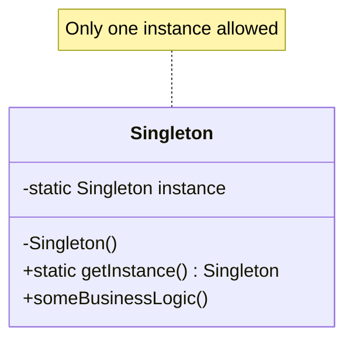
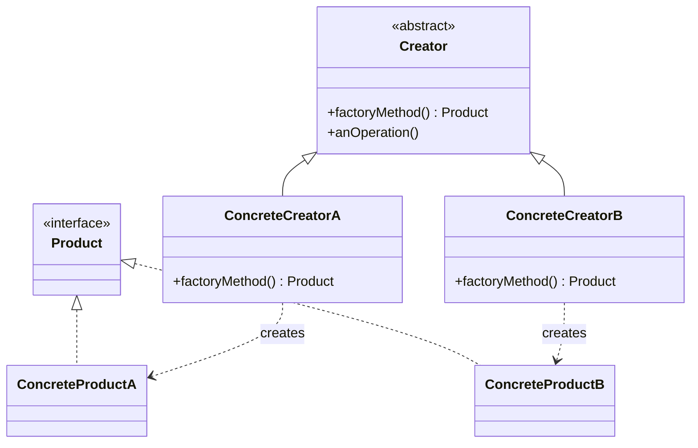
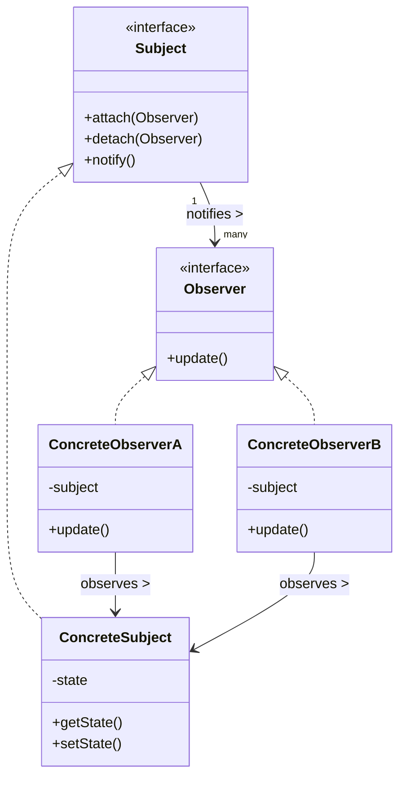

# C++ Design Patterns

## Introduction

Design patterns are reusable solutions to common problems that occur in software design. Think of them as blueprints that can be customized to solve a particular design problem in your code. Learning design patterns helps you write more maintainable, flexible, and scalable code by following proven practices established by experienced developers.

In this guide, we'll explore several essential design patterns in C++, understand when to use them, and see how they can improve your code structure.

## Why Learn Design Patterns?

Before diving into specific patterns, let's understand why design patterns are valuable:

- They provide tested, proven development paradigms
- They help you avoid reinventing the wheel
- They make your code more maintainable and readable
- They provide a common vocabulary for developers to communicate
- They encapsulate best practices refined by experienced programmers

## Types of Design Patterns

Design patterns are typically categorized into three main groups:

1. **Creational Patterns**: Handle object creation mechanisms
2. **Structural Patterns**: Deal with object composition and relationships
3. **Behavioral Patterns**: Focus on communication between objects

Let's explore some of the most common patterns in each category.

## Creational Patterns

### Singleton Pattern

The Singleton pattern ensures a class has only one instance and provides a global point of access to it.

```cpp
class Singleton {
private:
    // Private constructor prevents direct instantiation
    Singleton() {
        std::cout << "Singleton instance created" << std::endl;
    }
    
    // Delete copy constructor and assignment operator
    Singleton(const Singleton&) = delete;
    Singleton& operator=(const Singleton&) = delete;
    
    static Singleton* instance;

public:
    static Singleton* getInstance() {
        if (instance == nullptr) {
            instance = new Singleton();
        }
        return instance;
    }
    
    void someBusinessLogic() {
        std::cout << "Executing business logic" << std::endl;
    }
};

// Initialize static member
Singleton* Singleton::instance = nullptr;

// Usage example
int main() {
    // You cannot do this: Singleton s = Singleton(); // Error: constructor is private
    
    // Get the singleton instance
    Singleton* s1 = Singleton::getInstance();
    s1->someBusinessLogic();
    
    // Will return the same instance
    Singleton* s2 = Singleton::getInstance();
    
    // Both pointers point to the same instance
    std::cout << "Are s1 and s2 the same instance? " << (s1 == s2 ? "Yes" : "No") << std::endl;
    
    return 0;
}
```

**Output:**
```
Singleton instance created
Executing business logic
Are s1 and s2 the same instance? Yes
```

**When to use:**
- When exactly one instance of a class is needed
- When you need stricter control over global variables
- For shared resources like configuration managers, connection pools, or caches

### Factory Method Pattern

The Factory Method pattern defines an interface for creating objects but lets subclasses decide which classes to instantiate.

```cpp
// Product interface
class Vehicle {
public:
    virtual void drive() = 0;
    virtual ~Vehicle() {}
};

// Concrete products
class Car : public Vehicle {
public:
    void drive() override {
        std::cout << "Driving a car at 100 km/h" << std::endl;
    }
};

class Bike : public Vehicle {
public:
    void drive() override {
        std::cout << "Riding a bike at 25 km/h" << std::endl;
    }
};

// Creator abstract class
class VehicleFactory {
public:
    virtual Vehicle* createVehicle() = 0;
    virtual ~VehicleFactory() {}
    
    // The "factory method"
    Vehicle* getVehicle() {
        Vehicle* vehicle = createVehicle();
        return vehicle;
    }
};

// Concrete creators
class CarFactory : public VehicleFactory {
public:
    Vehicle* createVehicle() override {
        return new Car();
    }
};

class BikeFactory : public VehicleFactory {
public:
    Vehicle* createVehicle() override {
        return new Bike();
    }
};

// Client code
int main() {
    VehicleFactory* carFactory = new CarFactory();
    VehicleFactory* bikeFactory = new BikeFactory();
    
    Vehicle* car = carFactory->getVehicle();
    Vehicle* bike = bikeFactory->getVehicle();
    
    car->drive();
    bike->drive();
    
    // Clean up
    delete car;
    delete bike;
    delete carFactory;
    delete bikeFactory;
    
    return 0;
}
```

**Output:**
```
Driving a car at 100 km/h
Riding a bike at 25 km/h
```

**When to use:**
- When a class can't anticipate which objects it needs to create
- When a class wants its subclasses to specify the objects it creates
- When you want to delegate object creation to specialized subclasses

## Structural Patterns

### Adapter Pattern

The Adapter pattern allows objects with incompatible interfaces to work together by wrapping an instance of one class with a new adapter class.

```cpp
// Target interface that the client expects to use
class MediaPlayer {
public:
    virtual void play(const std::string& audioType, const std::string& fileName) = 0;
    virtual ~MediaPlayer() {}
};

// Another interface, incompatible with MediaPlayer
class AdvancedMediaPlayer {
public:
    virtual void playVlc(const std::string& fileName) = 0;
    virtual void playMp4(const std::string& fileName) = 0;
    virtual ~AdvancedMediaPlayer() {}
};

// Concrete implementation of AdvancedMediaPlayer
class VlcPlayer : public AdvancedMediaPlayer {
public:
    void playVlc(const std::string& fileName) override {
        std::cout << "Playing vlc file: " << fileName << std::endl;
    }
    
    void playMp4(const std::string& fileName) override {
        // Do nothing, this player doesn't support MP4
    }
};

class Mp4Player : public AdvancedMediaPlayer {
public:
    void playVlc(const std::string& fileName) override {
        // Do nothing, this player doesn't support VLC
    }
    
    void playMp4(const std::string& fileName) override {
        std::cout << "Playing mp4 file: " << fileName << std::endl;
    }
};

// The adapter class that makes AdvancedMediaPlayer compatible with MediaPlayer
class MediaAdapter : public MediaPlayer {
private:
    AdvancedMediaPlayer* advancedPlayer;

public:
    MediaAdapter(const std::string& audioType) {
        if (audioType == "vlc") {
            advancedPlayer = new VlcPlayer();
        } else if (audioType == "mp4") {
            advancedPlayer = new Mp4Player();
        }
    }
    
    ~MediaAdapter() {
        delete advancedPlayer;
    }
    
    void play(const std::string& audioType, const std::string& fileName) override {
        if (audioType == "vlc") {
            advancedPlayer->playVlc(fileName);
        } else if (audioType == "mp4") {
            advancedPlayer->playMp4(fileName);
        }
    }
};

// Concrete implementation of the MediaPlayer
class AudioPlayer : public MediaPlayer {
private:
    MediaAdapter* mediaAdapter;

public:
    AudioPlayer() : mediaAdapter(nullptr) {}
    
    ~AudioPlayer() {
        delete mediaAdapter;
    }
    
    void play(const std::string& audioType, const std::string& fileName) override {
        // Built-in support for mp3 files
        if (audioType == "mp3") {
            std::cout << "Playing mp3 file: " << fileName << std::endl;
        } 
        // Use adapter for vlc and mp4 formats
        else if (audioType == "vlc" || audioType == "mp4") {
            mediaAdapter = new MediaAdapter(audioType);
            mediaAdapter->play(audioType, fileName);
        } else {
            std::cout << "Invalid media type: " << audioType << " format not supported" << std::endl;
        }
    }
};

// Client code
int main() {
    AudioPlayer audioPlayer;
    
    audioPlayer.play("mp3", "song.mp3");
    audioPlayer.play("mp4", "movie.mp4");
    audioPlayer.play("vlc", "video.vlc");
    audioPlayer.play("avi", "video.avi");
    
    return 0;
}
```

**Output:**
```
Playing mp3 file: song.mp3
Playing mp4 file: movie.mp4
Playing vlc file: video.vlc
Invalid media type: avi format not supported
```

**When to use:**
- When you want to use an existing class but its interface doesn't match what you need
- When you want to create a reusable class that cooperates with classes that don't necessarily have compatible interfaces
- When you need to use several existing subclasses but it's impractical to adapt their interfaces by subclassing each one

### Composite Pattern

The Composite pattern composes objects into tree structures to represent part-whole hierarchies, allowing clients to treat individual objects and compositions uniformly.

```cpp
#include <iostream>
#include <vector>
#include <algorithm>
#include <string>

// Component interface
class FileSystemComponent {
protected:
    std::string name;
    
public:
    FileSystemComponent(const std::string& name) : name(name) {}
    
    std::string getName() const {
        return name;
    }
    
    virtual void add(FileSystemComponent* component) {
        throw std::logic_error("Cannot add to a leaf");
    }
    
    virtual void remove(FileSystemComponent* component) {
        throw std::logic_error("Cannot remove from a leaf");
    }
    
    virtual void print(int depth = 0) const = 0;
    
    virtual ~FileSystemComponent() {}
};

// Leaf class
class File : public FileSystemComponent {
private:
    int size; // in KB
    
public:
    File(const std::string& name, int size) : FileSystemComponent(name), size(size) {}
    
    void print(int depth = 0) const override {
        std::string indent(depth * 2, ' ');
        std::cout << indent << "File: " << name << " (" << size << " KB)" << std::endl;
    }
};

// Composite class
class Directory : public FileSystemComponent {
private:
    std::vector<FileSystemComponent*> children;
    
public:
    Directory(const std::string& name) : FileSystemComponent(name) {}
    
    ~Directory() {
        for (auto child : children) {
            delete child;
        }
    }
    
    void add(FileSystemComponent* component) override {
        children.push_back(component);
    }
    
    void remove(FileSystemComponent* component) override {
        auto it = std::find(children.begin(), children.end(), component);
        if (it != children.end()) {
            children.erase(it);
        }
    }
    
    void print(int depth = 0) const override {
        std::string indent(depth * 2, ' ');
        std::cout << indent << "Directory: " << name << std::endl;
        
        for (const auto* child : children) {
            child->print(depth + 1);
        }
    }
};

// Client code
int main() {
    // Create a file system structure
    Directory* root = new Directory("root");
    Directory* home = new Directory("home");
    Directory* documents = new Directory("documents");
    Directory* pictures = new Directory("pictures");
    
    File* file1 = new File("resume.pdf", 2048);
    File* file2 = new File("avatar.png", 4096);
    File* file3 = new File("notes.txt", 512);
    
    // Build the tree structure
    root->add(home);
    home->add(documents);
    home->add(pictures);
    
    documents->add(file1);
    documents->add(file3);
    pictures->add(file2);
    
    // Print the entire structure
    std::cout << "File System Structure:" << std::endl;
    root->print();
    
    // Clean up
    delete root; // This will delete the entire structure
    
    return 0;
}
```

**Output:**
```
File System Structure:
Directory: root
  Directory: home
    Directory: documents
      File: resume.pdf (2048 KB)
      File: notes.txt (512 KB)
    Directory: pictures
      File: avatar.png (4096 KB)
```

**When to use:**
- When you want to represent part-whole hierarchies of objects
- When you want clients to be able to ignore the difference between compositions of objects and individual objects
- When you need to treat objects and compositions of objects uniformly

## Behavioral Patterns

### Observer Pattern

The Observer pattern defines a one-to-many dependency between objects, so when one object changes state, all its dependents are notified and updated automatically.

```cpp
#include <iostream>
#include <vector>
#include <algorithm>
#include <string>

// Observer interface
class Observer {
public:
    virtual void update(const std::string& message) = 0;
    virtual ~Observer() {}
};

// Subject interface
class Subject {
public:
    virtual void attach(Observer* observer) = 0;
    virtual void detach(Observer* observer) = 0;
    virtual void notify() = 0;
    virtual ~Subject() {}
};

// Concrete subject
class WeatherStation : public Subject {
private:
    std::vector<Observer*> observers;
    float temperature;
    float humidity;
    float pressure;
    
public:
    WeatherStation() : temperature(0), humidity(0), pressure(0) {}
    
    void attach(Observer* observer) override {
        observers.push_back(observer);
    }
    
    void detach(Observer* observer) override {
        auto it = std::find(observers.begin(), observers.end(), observer);
        if (it != observers.end()) {
            observers.erase(it);
        }
    }
    
    void notify() override {
        std::string weatherData = "Weather Update: Temperature = " + 
                                 std::to_string(temperature) + "°C, " +
                                 "Humidity = " + std::to_string(humidity) + "%, " +
                                 "Pressure = " + std::to_string(pressure) + " hPa";
                                 
        for (auto observer : observers) {
            observer->update(weatherData);
        }
    }
    
    void setMeasurements(float temperature, float humidity, float pressure) {
        this->temperature = temperature;
        this->humidity = humidity;
        this->pressure = pressure;
        measurementsChanged();
    }
    
    void measurementsChanged() {
        notify();
    }
};

// Concrete observer
class WeatherDisplay : public Observer {
private:
    std::string name;
    
public:
    WeatherDisplay(const std::string& name) : name(name) {}
    
    void update(const std::string& message) override {
        std::cout << name << " received: " << message << std::endl;
    }
};

// Client code
int main() {
    // Create the weather station (subject)
    WeatherStation weatherStation;
    
    // Create displays (observers)
    WeatherDisplay phoneApp("Phone App");
    WeatherDisplay webBrowser("Web Browser");
    WeatherDisplay desktopWidget("Desktop Widget");
    
    // Register observers with the subject
    weatherStation.attach(&phoneApp);
    weatherStation.attach(&webBrowser);
    weatherStation.attach(&desktopWidget);
    
    // Change weather measurements - all observers will be notified
    std::cout << "Weather station updates measurements..." << std::endl;
    weatherStation.setMeasurements(25.2, 65.0, 1013.2);
    
    // Unregister one observer
    std::cout << "\nDetaching Web Browser..." << std::endl;
    weatherStation.detach(&webBrowser);
    
    // Change measurements again - only remaining observers will be notified
    std::cout << "Weather station updates measurements again..." << std::endl;
    weatherStation.setMeasurements(26.8, 70.3, 1012.1);
    
    return 0;
}
```

**Output:**
```
Weather station updates measurements...
Phone App received: Weather Update: Temperature = 25.200000°C, Humidity = 65.000000%, Pressure = 1013.200000 hPa
Web Browser received: Weather Update: Temperature = 25.200000°C, Humidity = 65.000000%, Pressure = 1013.200000 hPa
Desktop Widget received: Weather Update: Temperature = 25.200000°C, Humidity = 65.000000%, Pressure = 1013.200000 hPa

Detaching Web Browser...
Weather station updates measurements again...
Phone App received: Weather Update: Temperature = 26.800000°C, Humidity = 70.300000%, Pressure = 1012.100000 hPa
Desktop Widget received: Weather Update: Temperature = 26.800000°C, Humidity = 70.300000%, Pressure = 1012.100000 hPa
```

**When to use:**
- When a change to one object requires changing others, and you don't know how many objects need to change
- When an object should be able to notify other objects without knowing who they are
- When you need to maintain consistency between related objects without making them tightly coupled

### Strategy Pattern

The Strategy pattern defines a family of algorithms, encapsulates each one, and makes them interchangeable. Strategy lets the algorithm vary independently from clients that use it.

```cpp
#include <iostream>
#include <vector>
#include <algorithm>

// Strategy interface
class SortStrategy {
public:
    virtual void sort(std::vector<int>& data) = 0;
    virtual std::string getName() const = 0;
    virtual ~SortStrategy() {}
};

// Concrete strategies
class BubbleSort : public SortStrategy {
public:
    void sort(std::vector<int>& data) override {
        std::cout << "Sorting using bubble sort..." << std::endl;
        int n = data.size();
        for (int i = 0; i < n - 1; i++) {
            for (int j = 0; j < n - i - 1; j++) {
                if (data[j] > data[j + 1]) {
                    std::swap(data[j], data[j + 1]);
                }
            }
        }
    }
    
    std::string getName() const override {
        return "Bubble Sort";
    }
};

class QuickSort : public SortStrategy {
private:
    int partition(std::vector<int>& data, int low, int high) {
        int pivot = data[high];
        int i = low - 1;
        
        for (int j = low; j < high; j++) {
            if (data[j] <= pivot) {
                i++;
                std::swap(data[i], data[j]);
            }
        }
        std::swap(data[i + 1], data[high]);
        return i + 1;
    }
    
    void quickSort(std::vector<int>& data, int low, int high) {
        if (low < high) {
            int pi = partition(data, low, high);
            quickSort(data, low, pi - 1);
            quickSort(data, pi + 1, high);
        }
    }
    
public:
    void sort(std::vector<int>& data) override {
        std::cout << "Sorting using quick sort..." << std::endl;
        quickSort(data, 0, data.size() - 1);
    }
    
    std::string getName() const override {
        return "Quick Sort";
    }
};

class STLSort : public SortStrategy {
public:
    void sort(std::vector<int>& data) override {
        std::cout << "Sorting using C++ STL sort..." << std::endl;
        std::sort(data.begin(), data.end());
    }
    
    std::string getName() const override {
        return "STL Sort";
    }
};

// Context class that uses a strategy
class Sorter {
private:
    SortStrategy* strategy;
    
public:
    Sorter(SortStrategy* strategy) : strategy(strategy) {}
    
    ~Sorter() {
        delete strategy;
    }
    
    void setStrategy(SortStrategy* newStrategy) {
        delete strategy;
        strategy = newStrategy;
    }
    
    void sort(std::vector<int>& data) {
        strategy->sort(data);
    }
    
    std::string getStrategyName() const {
        return strategy->getName();
    }
};

// Helper function to print a vector
void printVector(const std::vector<int>& data) {
    for (int num : data) {
        std::cout << num << " ";
    }
    std::cout << std::endl;
}

// Client code
int main() {
    // Create sample data
    std::vector<int> data = {64, 34, 25, 12, 22, 11, 90};
    
    // Create a sorter with initial strategy
    Sorter sorter(new BubbleSort());
    
    // Sort with current strategy
    std::cout << "Original data: ";
    printVector(data);
    
    sorter.sort(data);
    std::cout << "After " << sorter.getStrategyName() << ": ";
    printVector(data);
    
    // Change the sorting strategy at runtime
    data = {64, 34, 25, 12, 22, 11, 90}; // Reset data
    sorter.setStrategy(new QuickSort());
    
    sorter.sort(data);
    std::cout << "After " << sorter.getStrategyName() << ": ";
    printVector(data);
    
    // Change to STL sort strategy
    data = {64, 34, 25, 12, 22, 11, 90}; // Reset data
    sorter.setStrategy(new STLSort());
    
    sorter.sort(data);
    std::cout << "After " << sorter.getStrategyName() << ": ";
    printVector(data);
    
    return 0;
}
```

**Output:**
```
Original data: 64 34 25 12 22 11 90 
Sorting using bubble sort...
After Bubble Sort: 11 12 22 25 34 64 90 
Sorting using quick sort...
After Quick Sort: 11 12 22 25 34 64 90 
Sorting using C++ STL sort...
After STL Sort: 11 12 22 25 34 64 90 
```

**When to use:**
- When you want to define a family of algorithms and make them interchangeable
- When you need different variants of an algorithm
- When an algorithm uses data that clients shouldn't know about
- When you want to avoid multiple conditional statements in your code

## Real-World Example: Building a Logger System

Let's design a simple logging system that uses multiple design patterns to demonstrate how they can work together.

```cpp
#include <iostream>
#include <fstream>
#include <string>
#include <vector>
#include <chrono>
#include <ctime>
#include <iomanip>
#include <sstream>
#include <memory>

// --- Singleton Pattern for Logger ---
class Logger {
private:
    // Singleton instance
    static Logger* instance;
    
    // Private constructor to prevent instantiation
    Logger() {}
    
    // Strategy Pattern: Different logging strategies
    class LogStrategy {
    public:
        virtual void writeLog(const std::string& message) = 0;
        virtual ~LogStrategy() {}
    };
    
    // Concrete strategies for logging
    class ConsoleLogStrategy : public LogStrategy {
    public:
        void writeLog(const std::string& message) override {
            std::cout << message << std::endl;
        }
    };
    
    class FileLogStrategy : public LogStrategy {
    private:
        std::ofstream logFile;
        
    public:
        FileLogStrategy(const std::string& filename) {
            logFile.open(filename, std::ios::app);
            if (!logFile.is_open()) {
                std::cerr << "Failed to open log file: " << filename << std::endl;
            }
        }
        
        ~FileLogStrategy() {
            if (logFile.is_open()) {
                logFile.close();
            }
        }
        
        void writeLog(const std::string& message) override {
            if (logFile.is_open()) {
                logFile << message << std::endl;
            }
        }
    };
    
    // Observer Pattern: Log observers
    class LogObserver {
    public:
        virtual void update(const std::string& message) = 0;
        virtual ~LogObserver() {}
    };
    
    class EmailAlertObserver : public LogObserver {
    private:
        std::string email;
        
    public:
        EmailAlertObserver(const std::string& email) : email(email) {}
        
        void update(const std::string& message) override {
            // In real app, this would send an email
            std::cout << "ALERT: Email sent to " << email << " with message: " << message << std::endl;
        }
    };
    
    class SMSAlertObserver : public LogObserver {
    private:
        std::string phoneNumber;
        
    public:
        SMSAlertObserver(const std::string& phoneNumber) : phoneNumber(phoneNumber) {}
        
        void update(const std::string& message) override {
            // In real app, this would send an SMS
            std::cout << "ALERT: SMS sent to " << phoneNumber << " with message: " << message << std::endl;
        }
    };
    
    // Store multiple logging strategies and observers
    std::vector<std::unique_ptr<LogStrategy>> logStrategies;
    std::vector<std::unique_ptr<LogObserver>> logObservers;
    
    // For logging levels
    enum class LogLevel {
        DEBUG,
        INFO,
        WARNING,
        ERROR,
        CRITICAL
    };
    
    // Helper function to get timestamp
    std::string getTimestamp() {
        auto now = std::chrono::system_clock::now();
        auto time = std::chrono::system_clock::to_time_t(now);
        std::stringstream ss;
        ss << std::put_time(std::localtime(&time), "%Y-%m-%d %H:%M:%S");
        return ss.str();
    }
    
    // Helper function to format log message
    std::string formatLogMessage(LogLevel level, const std::string& message) {
        std::string levelStr;
        
        switch (level) {
            case LogLevel::DEBUG:    levelStr = "DEBUG"; break;
            case LogLevel::INFO:     levelStr = "INFO"; break;
            case LogLevel::WARNING:  levelStr = "WARNING"; break;
            case LogLevel::ERROR:    levelStr = "ERROR"; break;
            case LogLevel::CRITICAL: levelStr = "CRITICAL"; break;
        }
        
        return "[" + getTimestamp() + "] [" + levelStr + "] " + message;
    }
    
    // Notify all observers (only for warning and above)
    void notifyObservers(LogLevel level, const std::string& message) {
        if (level >= LogLevel::WARNING) {
            for (auto& observer : logObservers) {
                observer->update(message);
            }
        }
    }
    
public:
    // Delete copy constructor and assignment operator
    Logger(const Logger&) = delete;
    Logger& operator=(const Logger&) = delete;
    
    // Get singleton instance
    static Logger* getInstance() {
        if (instance == nullptr) {
            instance = new Logger();
        }
        return instance;
    }
    
    // Add a logging strategy
    void addStrategy(LogStrategy* strategy) {
        logStrategies.push_back(std::unique_ptr<LogStrategy>(strategy));
    }
    
    // Add console logging
    void addConsoleLogging() {
        addStrategy(new ConsoleLogStrategy());
    }
    
    // Add file logging
    void addFileLogging(const std::string& filename) {
        addStrategy(new FileLogStrategy(filename));
    }
    
    // Add an observer
    void addObserver(LogObserver* observer) {
        logObservers.push_back(std::unique_ptr<LogObserver>(observer));
    }
    
    // Add email alert
    void addEmailAlert(const std::string& email) {
        addObserver(new EmailAlertObserver(email));
    }
    
    // Add SMS alert
    void addSMSAlert(const std::string& phoneNumber) {
        addObserver(new SMSAlertObserver(phoneNumber));
    }
    
    // Log methods for different levels
    void debug(const std::string& message) {
        log(LogLevel::DEBUG, message);
    }
    
    void info(const std::string& message) {
        log(LogLevel::INFO, message);
    }
    
    void warning(const std::string& message) {
        log(LogLevel::WARNING, message);
    }
    
    void error(const std::string& message) {
        log(LogLevel::ERROR, message);
    }
    
    void critical(const std::string& message) {
        log(LogLevel::CRITICAL, message);
    }
    
    // Generic log method
    void log(LogLevel level, const std::string& message) {
        std::string formattedMessage = formatLogMessage(level, message);
        
        // Strategy pattern: use all strategies to log the message
        for (auto& strategy : logStrategies) {
            strategy->writeLog(formattedMessage);
        }
        
        // Observer pattern: notify observers of important log events
        notifyObservers(level, formattedMessage);
    }
    
    // Clean up
    static void cleanup() {
        delete instance;
        instance = nullptr;
    }
};

// Initialize static member
Logger* Logger::instance = nullptr;

// Client code
int main() {
    // Get the logger instance
    Logger* logger = Logger::getInstance();
    
    // Configure logging strategies
    logger->addConsoleLogging();
    logger->addFileLogging("application.log");
    
    // Configure observers for critical alerts
    logger->addEmailAlert("admin@example.com");
    logger->addSMSAlert("123-456-7890");
    
    // Log some messages
    logger->debug("This is a debug message");
    logger->info("Application started successfully");
    logger->warning("Low memory warning");
    logger->error("Failed to connect to database");
    logger->critical("System crash imminent!");
    
    // Clean up
    Logger::cleanup();
    
    return 0;
}
```

**Output:**
```
[2023-12-01 15:20:30] [DEBUG] This is a debug message
[2023-12-01 15:20:30] [INFO] Application started successfully
[2023-12-01 15:20:30] [WARNING] Low memory warning
ALERT: Email sent to admin@example.com with message: [2023-12-01 15:20:30] [WARNING] Low memory warning
ALERT: SMS sent to 123-456-7890 with message: [2023-12-01 15:20:30] [WARNING] Low memory warning
[2023-12-01 15:20:30] [ERROR] Failed to connect to database
ALERT: Email sent to admin@example.com with message: [2023-12-01 15:20:30] [ERROR] Failed to connect to database
ALERT: SMS sent to 123-456-7890 with message: [2023-12-01 15:20:30] [ERROR] Failed to connect to database
[2023-12-01 15:20:30] [CRITICAL] System crash imminent!
ALERT: Email sent to admin@example.com with message: [2023-12-01 15:20:30] [CRITICAL] System crash imminent!
ALERT: SMS sent to 123-456-7890 with message: [2023-12-01 15:20:30] [CRITICAL] System crash imminent!
```

In this comprehensive example, we've combined several design patterns:
- **Singleton Pattern**: The Logger class has only one instance
- **Strategy Pattern**: Different logging strategies (console, file)
- **Observer Pattern**: Email and SMS alerts that respond to important log events

## Visualizing Design Patterns

Let's look at some visualizations of common design patterns using Mermaid diagrams.

### Singleton Pattern



### Factory Method Pattern



### Observer Pattern



## Summary

Design patterns are essential tools for C++ developers to create maintainable, flexible, and reusable code. We've explored several key patterns:

- **Creational Patterns** like Singleton and Factory Method for controlling object creation
- **Structural Patterns** like Adapter and Composite for organizing classes and objects
- **Behavioral Patterns** like Observer and Strategy for defining communication between objects

These patterns offer proven solutions to common design problems and provide a vocabulary for discussing complex software designs with other developers. By incorporating design patterns into your C++ projects, you'll write more professional, robust code and avoid reinventing solutions to common problems.

## Additional Resources

To further your understanding of design patterns in C++:

1. "Design Patterns: Elements of Reusable Object-Oriented Software" by Erich Gamma, Richard Helm, Ralph Johnson, and John Vlissides (the "Gang of Four" book)
2. "Modern C++ Design: Generic Programming and Design Patterns Applied" by Andrei Alexandrescu
3. "Head First Design Patterns" for a more beginner-friendly approach
4. [Refactoring.Guru](https://refactoring.guru/design-patterns) - Excellent online resource for design patterns

## Exercises

1. **Implement a Logger with Decorator Pattern**: Extend the logging system to add decorators that can transform log messages (e.g., add timestamps, format JSON, encrypt sensitive data).

2. **Build a Command Pattern Example**: Create a simple text editor that uses the Command pattern to implement undo/redo functionality.

3. **Design a Cache with Strategy Pattern**: Implement a caching system that can use different strategies for cache eviction (e.g., LRU, FIFO, LFU).

4. **Create a Game Engine Component System**: Design a simple game engine that uses the Component pattern to compose game objects from reusable components.

5. **Implement a Configuration System**: Design a configuration system that uses the Builder pattern to create complex configuration objects with many optional parameters.