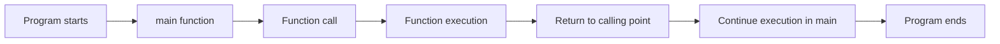

# C++ Functions Basics

## Introduction

Functions are one of the most fundamental building blocks in C++ programming. They allow you to divide your code into reusable, manageable pieces that perform specific tasks. Think of functions as mini-programs within your program.

In this tutorial, we'll explore the basics of C++ functions - from defining and calling functions to understanding parameters, return values, and common use cases. By the end, you'll have a solid understanding of how to use functions to make your code more organized, readable, and efficient.

## Why Use Functions?

Before diving into the syntax, let's understand why functions are essential:

1. **Code Reusability**: Write a function once, use it multiple times
2. **Modularity**: Break complex problems into smaller, manageable parts
3. **Maintainability**: Easier to debug and update specific parts of your program
4. **Abstraction**: Hide complex implementation details behind simple interfaces

## Function Syntax and Structure

Here's the basic structure of a C++ function:

```cpp
return_type function_name(parameter_list) {
    // Function body - code to be executed
    
    return value; // Optional: depends on return_type
}
```

Let's break down each component:

- **return_type**: The data type of the value the function returns (or `void` if no value is returned)
- **function_name**: A unique identifier for your function (follow variable naming conventions)
- **parameter_list**: Input values the function needs to perform its task (optional)
- **function body**: The code that executes when the function is called
- **return statement**: Sends a value back to where the function was called (required if return type isn't `void`)

## Your First Function: Hello World

Let's start with a simple example:

```cpp
#include <iostream>
using namespace std;

// Function declaration
void sayHello();

int main() {
    // Function call
    sayHello();
    
    return 0;
}

// Function definition
void sayHello() {
    cout << "Hello, World!" << endl;
}
```

**Output:**
```
Hello, World!
```

In this example:
- We declared a function called `sayHello` that doesn't take any parameters and doesn't return a value (`void`)
- We called the function from `main()`
- The function printed "Hello, World!" to the console

## Function Parameters

Parameters allow you to pass data to functions. There are two types:

### 1. Function with Parameters

```cpp
#include <iostream>
using namespace std;

// Function with parameters
void greet(string name) {
    cout << "Hello, " << name << "!" << endl;
}

int main() {
    greet("Alice");
    greet("Bob");
    
    string username = "Charlie";
    greet(username);
    
    return 0;
}
```

**Output:**
```
Hello, Alice!
Hello, Bob!
Hello, Charlie!
```

### 2. Multiple Parameters

Functions can take multiple parameters separated by commas:

```cpp
#include <iostream>
using namespace std;

void displayInfo(string name, int age) {
    cout << name << " is " << age << " years old." << endl;
}

int main() {
    displayInfo("Alice", 25);
    displayInfo("Bob", 30);
    
    return 0;
}
```

**Output:**
```
Alice is 25 years old.
Bob is 30 years old.
```

## Return Values

Functions can return values using the `return` statement:

```cpp
#include <iostream>
using namespace std;

// Function that returns a value
int add(int a, int b) {
    int sum = a + b;
    return sum;
}

int main() {
    int result1 = add(5, 3);
    cout << "5 + 3 = " << result1 << endl;
    
    int num1 = 10, num2 = 7;
    int result2 = add(num1, num2);
    cout << num1 << " + " << num2 << " = " << result2 << endl;
    
    // You can also use the function directly in expressions
    cout << "15 + 25 = " << add(15, 25) << endl;
    
    return 0;
}
```

**Output:**
```
5 + 3 = 8
10 + 7 = 17
15 + 25 = 40
```

## Function Declaration vs. Definition

In C++, you can separate the function declaration (also called a prototype) from its definition:

```cpp
#include <iostream>
using namespace std;

// Function declaration (prototype)
int multiply(int a, int b);

int main() {
    cout << "4 * 7 = " << multiply(4, 7) << endl;
    return 0;
}

// Function definition
int multiply(int a, int b) {
    return a * b;
}
```

**Output:**
```
4 * 7 = 28
```

This separation is useful for:
- Organizing code in larger programs
- Making functions available to multiple source files
- Enabling function calls before the full definition appears

## Default Parameter Values

You can assign default values to parameters:

```cpp
#include <iostream>
using namespace std;

// Function with default parameter
void printMessage(string message = "Default message") {
    cout << message << endl;
}

int main() {
    printMessage("Hello there!");  // Uses provided argument
    printMessage();               // Uses default value
    
    return 0;
}
```

**Output:**
```
Hello there!
Default message
```

Important rules:
- Default parameters must be the rightmost parameters in the function declaration
- Once you provide a default value, all parameters to the right must also have default values

## Function Overloading

C++ allows multiple functions with the same name but different parameter lists:

```cpp
#include <iostream>
using namespace std;

// Function overloading
int add(int a, int b) {
    cout << "Adding integers: " << a << " + " << b << endl;
    return a + b;
}

double add(double a, double b) {
    cout << "Adding doubles: " << a << " + " << b << endl;
    return a + b;
}

int add(int a, int b, int c) {
    cout << "Adding three integers: " << a << " + " << b << " + " << c << endl;
    return a + b + c;
}

int main() {
    cout << "Result: " << add(5, 3) << endl;
    cout << "Result: " << add(4.2, 2.7) << endl;
    cout << "Result: " << add(1, 2, 3) << endl;
    
    return 0;
}
```

**Output:**
```
Adding integers: 5 + 3
Result: 8
Adding doubles: 4.2 + 2.7
Result: 6.9
Adding three integers: 1 + 2 + 3
Result: 6
```

The compiler chooses the appropriate function based on the arguments' number and types.

## Practical Examples

### Example 1: Temperature Converter

```cpp
#include <iostream>
using namespace std;

// Function to convert Celsius to Fahrenheit
double celsiusToFahrenheit(double celsius) {
    return (celsius * 9.0/5.0) + 32;
}

// Function to convert Fahrenheit to Celsius
double fahrenheitToCelsius(double fahrenheit) {
    return (fahrenheit - 32) * 5.0/9.0;
}

int main() {
    double temp;
    char unit;
    
    cout << "Enter temperature value: ";
    cin >> temp;
    
    cout << "Enter unit (C for Celsius, F for Fahrenheit): ";
    cin >> unit;
    
    if (unit == 'C' || unit == 'c') {
        cout << temp << "°C = " << celsiusToFahrenheit(temp) << "°F" << endl;
    } else if (unit == 'F' || unit == 'f') {
        cout << temp << "°F = " << fahrenheitToCelsius(temp) << "°C" << endl;
    } else {
        cout << "Invalid unit!" << endl;
    }
    
    return 0;
}
```

**Example Input/Output:**
```
Enter temperature value: 25
Enter unit (C for Celsius, F for Fahrenheit): C
25°C = 77°F
```

### Example 2: Simple Calculator

```cpp
#include <iostream>
using namespace std;

// Calculator functions
double add(double a, double b) {
    return a + b;
}

double subtract(double a, double b) {
    return a - b;
}

double multiply(double a, double b) {
    return a * b;
}

double divide(double a, double b) {
    if (b == 0) {
        cout << "Error: Division by zero!" << endl;
        return 0;
    }
    return a / b;
}

int main() {
    double num1, num2;
    char operation;
    
    cout << "Enter first number: ";
    cin >> num1;
    
    cout << "Enter operation (+, -, *, /): ";
    cin >> operation;
    
    cout << "Enter second number: ";
    cin >> num2;
    
    switch (operation) {
        case '+':
            cout << num1 << " + " << num2 << " = " << add(num1, num2) << endl;
            break;
        case '-':
            cout << num1 << " - " << num2 << " = " << subtract(num1, num2) << endl;
            break;
        case '*':
            cout << num1 << " * " << num2 << " = " << multiply(num1, num2) << endl;
            break;
        case '/':
            cout << num1 << " / " << num2 << " = " << divide(num1, num2) << endl;
            break;
        default:
            cout << "Invalid operation!" << endl;
    }
    
    return 0;
}
```

**Example Input/Output:**
```
Enter first number: 10
Enter operation (+, -, *, /): *
Enter second number: 5
10 * 5 = 50
```

## Function Execution Flow

Understanding how function calls work in memory is important:



When a function is called:
1. The current execution is paused
2. Function arguments are evaluated and passed to parameters
3. Control transfers to the function
4. Function body executes
5. Return value (if any) is passed back
6. Control returns to the point right after the function call

## Best Practices for Functions

1. **Descriptive Names**: Use verb-noun combinations that describe what the function does (e.g., `calculateTotalPrice()`)
2. **Single Responsibility**: Each function should do one thing well
3. **Small Size**: Keep functions reasonably short (20-30 lines is a good target)
4. **Limited Parameters**: Try to keep the parameter list short (4 or fewer is ideal)
5. **Consistent Return Types**: Don't return different types from the same function
6. **Comment Your Functions**: Document the purpose, parameters, and return values
7. **Error Handling**: Handle potential errors within the function

## Summary

Functions are essential building blocks in C++ programming that allow you to:
- Create reusable pieces of code
- Organize your program into logical, manageable components
- Avoid code duplication
- Hide complexity behind simple interfaces

We've covered:
- Basic function syntax and structure
- Parameters and arguments
- Return values
- Function declaration vs. definition
- Default parameters
- Function overloading
- Practical examples

By mastering functions, you're taking a significant step toward writing clean, efficient, and maintainable C++ code.

## Exercises

Try these exercises to practice what you've learned:

1. Create a function that checks if a number is prime.
2. Write a function that finds the maximum value in an array.
3. Implement a function that converts decimal numbers to binary.
4. Create a set of functions to calculate the area of different shapes (circle, rectangle, triangle).
5. Build a simple banking system with functions for deposit, withdrawal, and balance check.

## Additional Resources

- [C++ Reference: Functions](https://en.cppreference.com/w/cpp/language/functions)
- [CPlusPlus.com: Functions](http://www.cplusplus.com/doc/tutorial/functions/)
- Book: "C++ Primer" by Stanley B. Lippman (Chapters on Functions)
- Book: "Effective C++" by Scott Meyers (Item 19: Treat Functions as Interfaces)