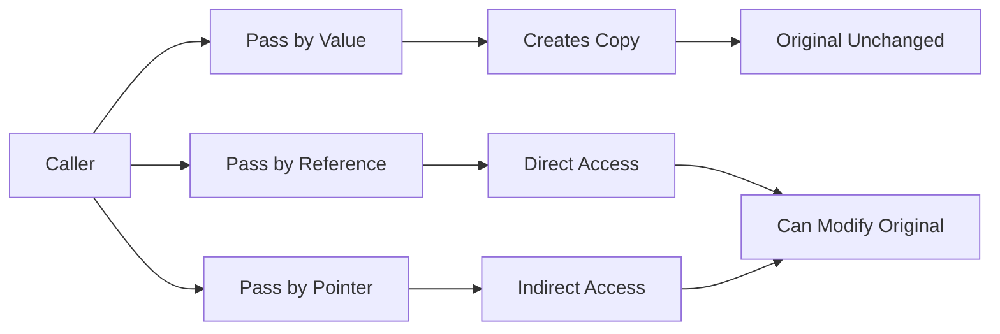

# C++ Function Parameters

## Introduction

Function parameters are a fundamental concept in C++ programming. They allow us to pass data to functions, making our code more flexible and reusable. In this guide, we'll explore different types of function parameters in C++, how they work, and best practices for using them effectively.

Think of function parameters as the communication channel between the calling code and the function itself. They enable a function to work with external data without relying on global variables, leading to better structured and more maintainable code.

## What Are Function Parameters?

In C++, a function parameter (or formal parameter) is a variable declared in the function declaration that receives a value when the function is called. The values passed to a function when it is called are known as arguments.

Here's a simple example:

```cpp
// Function declaration with parameters
void greet(std::string name, int age) {
    std::cout << "Hello, " << name << "! You are " << age << " years old." << std::endl;
}

int main() {
    // Function call with arguments
    greet("Alice", 25);  // "Alice" and 25 are arguments
    return 0;
}
```

**Output:**
```
Hello, Alice! You are 25 years old.
```

In this example:
- `name` and `age` are parameters of the `greet` function
- `"Alice"` and `25` are arguments passed to the function

## Types of Parameter Passing in C++

C++ offers several ways to pass parameters to functions. Understanding these mechanisms is crucial for writing efficient and effective code.

### 1. Pass by Value

When you pass a parameter by value, the function receives a copy of the original data. Any changes made to the parameter inside the function don't affect the original value.

```cpp
#include <iostream>

void modifyValue(int num) {
    num = num * 2;  // Modifies the local copy only
    std::cout << "Inside function: " << num << std::endl;
}

int main() {
    int x = 10;
    std::cout << "Before function call: " << x << std::endl;
    
    modifyValue(x);
    
    std::cout << "After function call: " << x << std::endl;
    return 0;
}
```

**Output:**
```
Before function call: 10
Inside function: 20
After function call: 10
```

Notice that `x` remains unchanged even though we modified `num` inside the function. This is because `num` is just a copy of `x`.

### 2. Pass by Reference

When passing by reference, the function receives a reference to the original variable. Any changes made to the parameter inside the function will affect the original value.

```cpp
#include <iostream>

void modifyValue(int& num) {  // Note the & symbol
    num = num * 2;  // Modifies the original value
    std::cout << "Inside function: " << num << std::endl;
}

int main() {
    int x = 10;
    std::cout << "Before function call: " << x << std::endl;
    
    modifyValue(x);
    
    std::cout << "After function call: " << x << std::endl;
    return 0;
}
```

**Output:**
```
Before function call: 10
Inside function: 20
After function call: 20
```

In this case, `x` is modified because `num` is a reference to `x`, not a copy.

### 3. Pass by Pointer

Another way to modify the original value is by passing a pointer to it.

```cpp
#include <iostream>

void modifyValue(int* num) {
    *num = *num * 2;  // Dereference and modify
    std::cout << "Inside function: " << *num << std::endl;
}

int main() {
    int x = 10;
    std::cout << "Before function call: " << x << std::endl;
    
    modifyValue(&x);  // Pass the address of x
    
    std::cout << "After function call: " << x << std::endl;
    return 0;
}
```

**Output:**
```
Before function call: 10
Inside function: 20
After function call: 20
```

### 4. Pass by Const Reference

When you want to avoid copying large objects but don't want to modify them:

```cpp
#include <iostream>
#include <string>

void printDetails(const std::string& name) {  // Const reference
    // name = "Changed";  // This would cause a compilation error
    std::cout << "Name: " << name << std::endl;
}

int main() {
    std::string personName = "Bob Johnson";
    printDetails(personName);
    return 0;
}
```

**Output:**
```
Name: Bob Johnson
```

## Special Parameter Features in C++

### Default Parameters

C++ allows you to specify default values for parameters. If the caller doesn't provide an argument for a parameter with a default value, the default is used.

```cpp
#include <iostream>
#include <string>

void displayInfo(std::string name, int age = 25, std::string country = "Unknown") {
    std::cout << name << " is " << age << " years old and from " << country << std::endl;
}

int main() {
    displayInfo("Alice", 30, "USA");  // All parameters specified
    displayInfo("Bob", 22);           // Using default for country
    displayInfo("Charlie");           // Using default for age and country
    
    return 0;
}
```

**Output:**
```
Alice is 30 years old and from USA
Bob is 22 years old and from Unknown
Charlie is 25 years old and from Unknown
```

Important rules for default parameters:
- Default values can only be specified for trailing parameters (from right to left)
- Once you provide a default value, all parameters to the right must also have default values

### Function Overloading with Different Parameters

C++ allows you to define multiple functions with the same name but different parameter lists:

```cpp
#include <iostream>

void display(int num) {
    std::cout << "Integer: " << num << std::endl;
}

void display(double num) {
    std::cout << "Double: " << num << std::endl;
}

void display(std::string text) {
    std::cout << "String: " << text << std::endl;
}

int main() {
    display(5);
    display(3.14);
    display("Hello");
    
    return 0;
}
```

**Output:**
```
Integer: 5
Double: 3.14
String: Hello
```

### Variable Number of Parameters (Variadic Functions)

C++ provides ways to create functions that accept a variable number of arguments:

```cpp
#include <iostream>
#include <initializer_list>

// Using initializer_list (C++11 and later)
double average(std::initializer_list<double> numbers) {
    double sum = 0;
    for (double num : numbers) {
        sum += num;
    }
    return numbers.size() > 0 ? sum / numbers.size() : 0;
}

int main() {
    std::cout << "Average of 1, 2, 3: " << average({1, 2, 3}) << std::endl;
    std::cout << "Average of 4.5, 5.5, 6.5, 7.5: " << average({4.5, 5.5, 6.5, 7.5}) << std::endl;
    
    return 0;
}
```

**Output:**
```
Average of 1, 2, 3: 2
Average of 4.5, 5.5, 6.5, 7.5: 6
```

## Parameter Passing Visualization



## Real-World Examples

### Example 1: A Simple Calculator Function

```cpp
#include <iostream>

// Calculator function with different parameter options
double calculate(double a, double b, char operation = '+') {
    switch (operation) {
        case '+':
            return a + b;
        case '-':
            return a - b;
        case '*':
            return a * b;
        case '/':
            if (b != 0) return a / b;
            std::cerr << "Error: Division by zero!" << std::endl;
            return 0;
        default:
            std::cerr << "Unknown operation: " << operation << std::endl;
            return 0;
    }
}

int main() {
    // Different ways to call the function
    std::cout << "5 + 3 = " << calculate(5, 3) << std::endl;           // Using default operation
    std::cout << "5 - 3 = " << calculate(5, 3, '-') << std::endl;      // Subtraction
    std::cout << "5 * 3 = " << calculate(5, 3, '*') << std::endl;      // Multiplication
    std::cout << "5 / 3 = " << calculate(5, 3, '/') << std::endl;      // Division
    
    return 0;
}
```

**Output:**
```
5 + 3 = 8
5 - 3 = 2
5 * 3 = 15
5 / 3 = 1.66667
```

### Example 2: Student Record Management

This example demonstrates how different parameter passing mechanisms are used in a real-world application:

```cpp
#include <iostream>
#include <vector>
#include <string>

struct Student {
    std::string name;
    int id;
    double gpa;
};

// Display student info (pass by const reference for efficiency)
void displayStudent(const Student& student) {
    std::cout << "ID: " << student.id << ", Name: " << student.name 
              << ", GPA: " << student.gpa << std::endl;
}

// Update student GPA (pass by reference to modify)
void updateGPA(Student& student, double newGPA) {
    student.gpa = newGPA;
    std::cout << "Updated GPA for " << student.name << " to " << newGPA << std::endl;
}

// Add a new student to the database (pass by reference to modify the database)
void addStudent(std::vector<Student>& database, const Student& newStudent) {
    database.push_back(newStudent);
    std::cout << "Added student: " << newStudent.name << std::endl;
}

// Calculate average GPA (pass by value since we're only reading)
double calculateAverageGPA(std::vector<Student> database) {
    if (database.empty()) return 0.0;
    
    double total = 0.0;
    for (const Student& student : database) {
        total += student.gpa;
    }
    return total / database.size();
}

int main() {
    std::vector<Student> studentDB;
    
    // Add students
    addStudent(studentDB, {"Alice Smith", 1001, 3.8});
    addStudent(studentDB, {"Bob Johnson", 1002, 3.2});
    addStudent(studentDB, {"Charlie Brown", 1003, 3.5});
    
    // Display all students
    std::cout << "\nStudent Database:" << std::endl;
    for (const Student& s : studentDB) {
        displayStudent(s);
    }
    
    // Update a student's GPA
    updateGPA(studentDB[1], 3.6);
    
    // Calculate and display the average GPA
    std::cout << "\nAverage GPA: " << calculateAverageGPA(studentDB) << std::endl;
    
    return 0;
}
```

**Output:**
```
Added student: Alice Smith
Added student: Bob Johnson
Added student: Charlie Brown

Student Database:
ID: 1001, Name: Alice Smith, GPA: 3.8
ID: 1002, Name: Bob Johnson, GPA: 3.2
ID: 1003, Name: Charlie Brown, GPA: 3.5

Updated GPA for Bob Johnson to 3.6

Average GPA: 3.63333
```

## Best Practices for Function Parameters

1. **Use `const` references for large objects you don't need to modify**: 
   ```cpp
   void processData(const std::vector<int>& data);
   ```

2. **Use pass by value for small objects like basic types**:
   ```cpp
   void calculateSquare(int num);
   ```

3. **Use references when you need to modify the original value**:
   ```cpp
   void incrementCounter(int& counter);
   ```

4. **Use default parameters to make functions more flexible**:
   ```cpp
   void connect(std::string host, int port = 80);
   ```

5. **Place parameters that are likely to change at the end of the parameter list**:
   ```cpp
   void configureApp(std::string appName, bool debugMode = false);
   ```

6. **Be consistent with parameter order across similar functions**:
   ```cpp
   // Consistent parameter order: source, destination
   void copyFile(std::string source, std::string destination);
   void moveFile(std::string source, std::string destination);
   ```

7. **Limit the number of parameters (generally no more than 5-7)**:
   - Consider using structs/classes to group related parameters if you need many parameters

## Summary

Function parameters are essential for creating flexible and reusable C++ code. In this guide, we've covered:

- Basic parameter concepts and the difference between parameters and arguments
- Different ways to pass parameters: by value, by reference, by pointer, and by const reference
- Special parameter features: default parameters, function overloading, and variadic functions
- Real-world examples demonstrating parameter usage in practical scenarios
- Best practices for working with function parameters

Understanding how to effectively use function parameters is critical for writing clean, efficient, and maintainable C++ code.

## Exercises

1. **Basic Parameter Practice**: Write a function that takes two integers and returns their sum, product, difference, and quotient (use pass by reference to return multiple values).

2. **Default Parameters**: Create a function that formats a name with optional titles (Mr./Ms./Dr.) and optional suffixes (Jr./Sr./Ph.D.).

3. **Pass by Reference vs. Value**: Write a swap function using both pass by value and pass by reference. Compare the results.

4. **Const References**: Create a function that calculates statistics (min, max, average) for a vector of numbers using const references.

5. **Real-World Application**: Implement a simple banking system with functions for deposit, withdrawal, and balance inquiry, using appropriate parameter passing techniques.

## Additional Resources

- [C++ Reference - Functions](https://en.cppreference.com/w/cpp/language/functions)
- [C++ Reference - Parameter Passing](https://en.cppreference.com/w/cpp/language/reference)
- [C++ Core Guidelines - Function Parameters](https://isocpp.github.io/CppCoreGuidelines/CppCoreGuidelines#f-functions)
- Book: "Effective C++" by Scott Meyers (see items related to function parameters)
- Book: "C++ Primer" by Stanley B. Lippman (comprehensive coverage of functions)