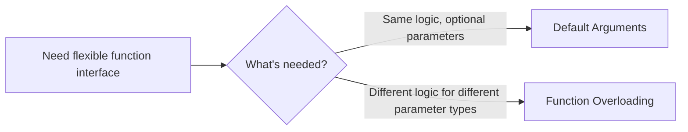

# C++ Default Arguments

## Introduction

When designing functions in C++, you might encounter situations where you want to provide flexibility in how the function can be called. Sometimes, you want to allow users to omit certain arguments if they're satisfied with standard values. This is where **default arguments** come into play.

Default arguments are predefined values assigned to function parameters, which are used when the corresponding argument is omitted in a function call. They help create more flexible function interfaces and can significantly reduce the need for function overloading.

## Basic Syntax

The syntax for defining default arguments is straightforward. You simply assign a value to the parameter in the function declaration:

```cpp
return_type function_name(parameter1, parameter2 = default_value2, parameter3 = default_value3);
```

Let's look at a simple example:

```cpp
#include <iostream>

void greet(std::string name, std::string message = "Hello") {
    std::cout << message << ", " << name << "!" << std::endl;
}

int main() {
    // Call with both arguments
    greet("Alice", "Welcome");
    
    // Call with only the name, using the default message
    greet("Bob");
    
    return 0;
}
```

**Output:**
```
Welcome, Alice!
Hello, Bob!
```

In this example, the `greet` function has a default value for the `message` parameter. When we call `greet("Bob")`, the function uses "Hello" as the default message.

## Rules for Default Arguments

There are several important rules to remember when working with default arguments:

### 1. Default Arguments Must Be Rightmost Parameters

Once you provide a default value for a parameter, all parameters to its right must also have default values:

```cpp
// Correct
void function1(int a, int b = 10, int c = 20);

// Incorrect
void function2(int a = 5, int b, int c = 20); // Error: parameter b has no default
```

### 2. Default Values Are Defined in Function Declaration

Default arguments are typically specified in the function declaration (usually in header files) rather than in the function definition:

```cpp
// In header file
void display(int count, char symbol = '*');

// In implementation file
void display(int count, char symbol) {
    for (int i = 0; i < count; i++) {
        std::cout << symbol;
    }
    std::cout << std::endl;
}
```

### 3. Default Arguments Cannot Be Redefined

Once a default argument is specified in a declaration, it cannot be redefined in a subsequent declaration:

```cpp
// First declaration
void print(int n = 10);

// Later declaration - Error
void print(int n = 20); // Cannot redefine default argument
```

### 4. Default Arguments Can Use Variables or Functions

Default arguments can be variables or function calls, but they are evaluated at the call site:

```cpp
int getDefaultValue() {
    return 100;
}

void showValue(int value = getDefaultValue()) {
    std::cout << "Value: " << value << std::endl;
}
```

## Practical Examples

Let's explore some practical examples of using default arguments in real-world scenarios.

### Example 1: Drawing Shapes

```cpp
#include <iostream>

void drawRectangle(int width, int height, char symbol = '*', bool filled = true) {
    for (int i = 0; i < height; i++) {
        for (int j = 0; j < width; j++) {
            if (filled || i == 0 || i == height - 1 || j == 0 || j == width - 1) {
                std::cout << symbol;
            } else {
                std::cout << " ";
            }
        }
        std::cout << std::endl;
    }
}

int main() {
    std::cout << "Default rectangle (filled with *):" << std::endl;
    drawRectangle(5, 3);
    
    std::cout << "\nCustom symbol (#):" << std::endl;
    drawRectangle(5, 3, '#');
    
    std::cout << "\nOutline only:" << std::endl;
    drawRectangle(5, 3, '*', false);
    
    return 0;
}
```

**Output:**
```
Default rectangle (filled with *):
*****
*****
*****

Custom symbol (#):
#####
#####
#####

Outline only:
*****
*   *
*****
```

In this example, the `drawRectangle` function has default values for the `symbol` and `filled` parameters, allowing the function to be called in different ways.

### Example 2: Configurable Logger

```cpp
#include <iostream>
#include <string>
#include <ctime>

enum LogLevel {
    INFO,
    WARNING,
    ERROR
};

void log(std::string message, LogLevel level = INFO, bool showTimestamp = true) {
    std::string levelStr;
    
    switch (level) {
        case INFO:
            levelStr = "INFO";
            break;
        case WARNING:
            levelStr = "WARNING";
            break;
        case ERROR:
            levelStr = "ERROR";
            break;
    }
    
    if (showTimestamp) {
        time_t now = time(0);
        char* timestamp = ctime(&now);
        // Remove newline from timestamp
        timestamp[strlen(timestamp) - 1] = '\0';
        std::cout << "[" << timestamp << "] ";
    }
    
    std::cout << "[" << levelStr << "] " << message << std::endl;
}

int main() {
    // Basic info log with timestamp
    log("Application started");
    
    // Warning log with timestamp
    log("Disk space running low", WARNING);
    
    // Error log without timestamp
    log("Failed to connect to database", ERROR, false);
    
    return 0;
}
```

**Output:**
```
[Thu Sep 21 10:15:23 2023] [INFO] Application started
[Thu Sep 21 10:15:23 2023] [WARNING] Disk space running low
[ERROR] Failed to connect to database
```

This logging function demonstrates how default arguments can make an API more flexible by allowing different levels of detail based on the caller's needs.

### Example 3: Database Connection Function

```cpp
#include <iostream>
#include <string>

bool connectToDatabase(
    std::string server,
    std::string database,
    std::string username = "admin",
    std::string password = "password123",
    int port = 3306,
    int timeout = 30
) {
    std::cout << "Connecting to database with parameters:" << std::endl;
    std::cout << "Server: " << server << std::endl;
    std::cout << "Database: " << database << std::endl;
    std::cout << "Username: " << username << std::endl;
    std::cout << "Password: " << password.substr(0, 2) << "***" << std::endl;
    std::cout << "Port: " << port << std::endl;
    std::cout << "Timeout: " << timeout << " seconds" << std::endl;
    
    // In a real application, actual connection logic would go here
    
    return true;
}

int main() {
    // Minimal connection with default credentials and settings
    connectToDatabase("db.example.com", "customer_data");
    
    std::cout << "\n";
    
    // Custom credentials but default port and timeout
    connectToDatabase("db.example.com", "analytics", "datauser", "p@ssw0rd");
    
    std::cout << "\n";
    
    // Fully customized connection
    connectToDatabase("db.example.com", "logs", "logger", "secure123", 3307, 60);
    
    return 0;
}
```

**Output:**
```
Connecting to database with parameters:
Server: db.example.com
Database: customer_data
Username: admin
Password: pa***
Port: 3306
Timeout: 30 seconds

Connecting to database with parameters:
Server: db.example.com
Database: analytics
Username: datauser
Password: p@***
Port: 3306
Timeout: 30 seconds

Connecting to database with parameters:
Server: db.example.com
Database: logs
Username: logger
Password: se***
Port: 3307
Timeout: 60 seconds
```

This example shows how default arguments can simplify common use cases while still providing flexibility for more specific configurations.

## Benefits of Default Arguments

Using default arguments offers several advantages:

1. **Simplified Function Interfaces**: Callers only need to provide non-default values.
2. **Reduced Function Overloading**: Instead of creating multiple functions with different parameter lists, one function can handle various calling patterns.
3. **Backward Compatibility**: You can add new parameters with default values without breaking existing code.
4. **Code Readability**: Default arguments can make function calls cleaner by omitting common values.

## Default Arguments vs. Function Overloading

While default arguments and function overloading can both provide flexible interfaces, they serve different purposes:



Default arguments are best when the function logic remains the same but some parameters are optional. Function overloading is more appropriate when different parameter types require significantly different implementations.

## Common Mistakes and Pitfalls

### 1. Order Dependence

Remember that you cannot omit an argument in the middle of the parameter list:

```cpp
void configure(int id, std::string name = "default", int priority = 1);

// This won't work if you want to use default name but specify priority
// configure(100, , 2);  // Syntax error

// Instead, you must provide all arguments up to the one you want to specify
configure(100, "default", 2);
```

### 2. Default Arguments in Virtual Functions

Default arguments are determined by the static type of the pointer or reference:

```cpp
class Base {
public:
    virtual void show(int x = 10) {
        std::cout << "Base: " << x << std::endl;
    }
};

class Derived : public Base {
public:
    void show(int x = 20) override {
        std::cout << "Derived: " << x << std::endl;
    }
};

int main() {
    Derived d;
    Base* b = &d;
    
    d.show();    // Uses Derived's default: 20
    b->show();   // Uses Base's default: 10 (despite calling Derived's implementation)
    
    return 0;
}
```

This is because default arguments are resolved at compile time, while virtual function calls are resolved at runtime.

## Summary

Default arguments in C++ provide a powerful way to create flexible function interfaces without resorting to function overloading. They allow you to define parameters that can be omitted when calling the function, with the compiler automatically filling in the specified default values.

Key points to remember:
- Default arguments must be the rightmost parameters
- Once a parameter has a default value, all parameters to its right must also have defaults
- Default arguments are specified in function declarations
- They can simplify your code by reducing the need for function overloading
- Default arguments are resolved at compile time, not runtime

By using default arguments appropriately, you can create more intuitive and flexible APIs that are easier for others to use.

## Exercises

1. Create a function `printBox` that takes parameters for width, height, and an optional character to use for printing.
2. Write a function `formatText` that takes a string and optional parameters for bold, italic, and underline (boolean values).
3. Implement a `createUser` function with parameters for username and optional parameters for full name, email, and active status.
4. Modify the `drawRectangle` function from the examples to also accept an optional parameter for the background character to use for non-filled spaces.
5. Write a `sendEmail` function with required parameters for recipient and subject, and optional parameters for message body, sender, and priority.

## Additional Resources

- [C++ Reference: Default Arguments](https://en.cppreference.com/w/cpp/language/default_arguments)
- [C++ Core Guidelines: Function Design](https://isocpp.github.io/CppCoreGuidelines/CppCoreGuidelines#f-functions)
- Book: "Effective C++" by Scott Meyers (Item 24: Declare non-member functions when type conversions should apply to all parameters)
- Book: "C++ Primer" by Stanley B. Lippman (Chapter 6: Functions)