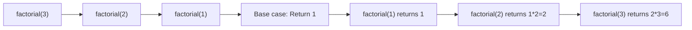

# C++ Recursion

## Introduction

Recursion is a powerful programming technique where a function calls itself to solve a smaller instance of the same problem. It's like looking at yourself in a mirror that reflects another mirror, creating an infinite series of reflections that get smaller and smaller.

In C++, recursion provides an elegant solution to problems that can be broken down into simpler, similar subproblems. While loops can solve many of the same problems, recursion often leads to clearer, more intuitive code for certain types of problems.

In this tutorial, we'll explore recursion in C++, understand how it works, see examples of recursive functions, and learn when (and when not) to use recursion.

## Understanding Recursion

### The Concept

Recursion involves two key components:

1. **Base case**: The terminating condition that stops the recursion
2. **Recursive case**: The part where the function calls itself with a simpler version of the problem

Without a proper base case, recursion would continue indefinitely, causing a stack overflow error.

### How Recursion Works in Memory

When a function calls itself:

1. Each recursive call gets its own copy of the function's parameters and local variables
2. The system stores the return address in the call stack
3. When a base case is reached, the function starts returning values back up the call stack



## Basic Recursive Examples

### Example 1: Factorial Calculation

The factorial of a number is a classic example of recursion:

```cpp
#include <iostream>
using namespace std;

int factorial(int n) {
    // Base case
    if (n <= 1) {
        return 1;
    }
    // Recursive case
    else {
        return n * factorial(n - 1);
    }
}

int main() {
    int number;
    cout << "Enter a positive integer: ";
    cin >> number;
    
    cout << "Factorial of " << number << " is " << factorial(number) << endl;
    
    return 0;
}
```

**Sample Output:**
```
Enter a positive integer: 5
Factorial of 5 is 120
```

**How it works:**
- When we call `factorial(5)`:
  - It returns `5 * factorial(4)`
  - `factorial(4)` returns `4 * factorial(3)`
  - `factorial(3)` returns `3 * factorial(2)`
  - `factorial(2)` returns `2 * factorial(1)`
  - `factorial(1)` hits the base case and returns `1`
  - Then the calculations unwind: `2*1 = 2`, `3*2 = 6`, `4*6 = 24`, `5*24 = 120`

### Example 2: Fibonacci Series

The Fibonacci sequence is another classic recursive problem:

```cpp
#include <iostream>
using namespace std;

int fibonacci(int n) {
    // Base cases
    if (n <= 0) {
        return 0;
    }
    if (n == 1) {
        return 1;
    }
    
    // Recursive case
    return fibonacci(n - 1) + fibonacci(n - 2);
}

int main() {
    int terms;
    cout << "Enter number of terms: ";
    cin >> terms;
    
    cout << "Fibonacci Series: ";
    for (int i = 0; i < terms; i++) {
        cout << fibonacci(i) << " ";
    }
    
    return 0;
}
```

**Sample Output:**
```
Enter number of terms: 8
Fibonacci Series: 0 1 1 2 3 5 8 13 
```

**How it works:**
- Each Fibonacci number is the sum of the two preceding ones
- The base cases are `fibonacci(0) = 0` and `fibonacci(1) = 1`
- For `n ≥ 2`, we calculate `fibonacci(n-1) + fibonacci(n-2)`

## Recursion vs. Iteration

Both recursion and iteration (loops) can solve the same problems, but each has advantages:

| Recursion | Iteration |
|-----------|-----------|
| Elegant and intuitive for some problems | Generally more efficient |
| Requires more memory (call stack) | Uses less memory |
| Can lead to stack overflow for deep recursion | No stack overflow concerns |
| Better for tree-like structures | Better for linear processing |

### Converting Factorial from Recursion to Iteration

```cpp
int factorial_iterative(int n) {
    int result = 1;
    for (int i = 1; i <= n; i++) {
        result *= i;
    }
    return result;
}
```

## Types of Recursion

### 1. Direct Recursion

The function calls itself directly, as seen in our factorial and Fibonacci examples.

### 2. Indirect Recursion

Function A calls function B, which then calls function A again.

```cpp
#include <iostream>
using namespace std;

void functionA(int n);  // Forward declaration

void functionB(int n) {
    if (n > 0) {
        cout << "Function B: " << n << endl;
        functionA(n - 1);
    }
}

void functionA(int n) {
    if (n > 0) {
        cout << "Function A: " << n << endl;
        functionB(n - 1);
    }
}

int main() {
    functionA(3);
    return 0;
}
```

**Output:**
```
Function A: 3
Function B: 2
Function A: 1
Function B: 0
```

### 3. Tail Recursion

The recursive call is the last operation in the function, allowing some compilers to optimize it.

```cpp
// Non-tail recursive factorial
int factorial(int n) {
    if (n <= 1) return 1;
    return n * factorial(n - 1);  // Must multiply after the recursive call returns
}

// Tail recursive factorial
int factorial_tail(int n, int result = 1) {
    if (n <= 1) return result;
    return factorial_tail(n - 1, n * result);  // Result is calculated before the recursive call
}
```

## Practical Applications of Recursion

### 1. Binary Search

Recursively searching a sorted array by dividing it in half each time:

```cpp
#include <iostream>
using namespace std;

int binarySearch(int arr[], int left, int right, int target) {
    if (right >= left) {
        int mid = left + (right - left) / 2;
        
        // If the element is present at the middle
        if (arr[mid] == target)
            return mid;
            
        // If element is smaller than mid, search left subarray
        if (arr[mid] > target)
            return binarySearch(arr, left, mid - 1, target);
            
        // Else search right subarray
        return binarySearch(arr, mid + 1, right, target);
    }
    
    // Element not present
    return -1;
}

int main() {
    int arr[] = {2, 3, 4, 10, 40};
    int n = sizeof(arr) / sizeof(arr[0]);
    int target = 10;
    
    int result = binarySearch(arr, 0, n - 1, target);
    
    if (result == -1)
        cout << "Element not found in array";
    else
        cout << "Element found at index " << result;
        
    return 0;
}
```

**Output:**
```
Element found at index 3
```

### 2. Tree Traversal

Recursion is perfect for traversing tree-like data structures:

```cpp
#include <iostream>
using namespace std;

// Definition for a binary tree node
struct TreeNode {
    int data;
    TreeNode* left;
    TreeNode* right;
    
    TreeNode(int val) : data(val), left(nullptr), right(nullptr) {}
};

// In-order traversal
void inOrderTraversal(TreeNode* root) {
    if (root != nullptr) {
        inOrderTraversal(root->left);    // Visit left subtree
        cout << root->data << " ";       // Visit current node
        inOrderTraversal(root->right);   // Visit right subtree
    }
}

int main() {
    // Create a simple binary tree
    TreeNode* root = new TreeNode(1);
    root->left = new TreeNode(2);
    root->right = new TreeNode(3);
    root->left->left = new TreeNode(4);
    root->left->right = new TreeNode(5);
    
    cout << "In-order traversal: ";
    inOrderTraversal(root);
    
    // Clean up memory (in real code, you'd want a proper destructor)
    // ...
    
    return 0;
}
```

**Output:**
```
In-order traversal: 4 2 5 1 3
```

### 3. Solving the Tower of Hanoi Problem

The Tower of Hanoi is a classic problem that demonstrates the power of recursion:

```cpp
#include <iostream>
using namespace std;

void towerOfHanoi(int n, char source, char auxiliary, char destination) {
    if (n == 1) {
        cout << "Move disk 1 from " << source << " to " << destination << endl;
        return;
    }
    
    towerOfHanoi(n - 1, source, destination, auxiliary);
    cout << "Move disk " << n << " from " << source << " to " << destination << endl;
    towerOfHanoi(n - 1, auxiliary, source, destination);
}

int main() {
    int n = 3; // Number of disks
    towerOfHanoi(n, 'A', 'B', 'C');
    return 0;
}
```

**Output:**
```
Move disk 1 from A to C
Move disk 2 from A to B
Move disk 1 from C to B
Move disk 3 from A to C
Move disk 1 from B to A
Move disk 2 from B to C
Move disk 1 from A to C
```

## Common Pitfalls and Best Practices

### Avoid Infinite Recursion

Always ensure your recursive function has a proper base case and that recursive calls progress toward that base case:

```cpp
// Incorrect - will cause infinite recursion
int badFactorial(int n) {
    return n * badFactorial(n - 1);  // Missing base case!
}

// Correct version
int goodFactorial(int n) {
    if (n <= 1) return 1;  // Base case
    return n * goodFactorial(n - 1);
}
```

### Beware of Stack Overflow

Deep recursion can cause stack overflow. In C++, the default stack size is limited:

```cpp
// This might cause stack overflow for large values of n
int deepRecursion(int n) {
    if (n == 0) return 0;
    return 1 + deepRecursion(n - 1);
}
```

### Use Memoization for Overlapping Subproblems

The naive recursive Fibonacci implementation recomputes the same values multiple times:

```cpp
#include <iostream>
#include <unordered_map>
using namespace std;

// Inefficient recursive implementation
int fib_slow(int n) {
    if (n <= 1) return n;
    return fib_slow(n - 1) + fib_slow(n - 2);
}

// Efficient implementation using memoization
int fib_fast(int n, unordered_map<int, int>& memo) {
    if (n <= 1) return n;
    
    // If we've already calculated this value, return it
    if (memo.find(n) != memo.end()) {
        return memo[n];
    }
    
    // Calculate and store the result
    memo[n] = fib_fast(n - 1, memo) + fib_fast(n - 2, memo);
    return memo[n];
}

int main() {
    int n = 40;
    
    // Time the slow version
    cout << "Calculating fib_slow(" << n << ")..." << endl;
    int result1 = fib_slow(n);
    cout << "Result: " << result1 << endl;
    
    // Time the fast version
    cout << "Calculating fib_fast(" << n << ")..." << endl;
    unordered_map<int, int> memo;
    int result2 = fib_fast(n, memo);
    cout << "Result: " << result2 << endl;
    
    return 0;
}
```

The `fib_fast` version is dramatically faster because it avoids redundant calculations.

## Summary

Recursion is a powerful technique in C++ programming that allows you to solve complex problems by breaking them down into smaller, similar subproblems. The key to writing effective recursive functions is to:

1. Identify clear base cases to terminate recursion
2. Ensure each recursive call moves closer to the base case
3. Understand the memory implications of deep recursion
4. Use techniques like memoization for problems with overlapping subproblems

While recursion may not always be the most efficient solution in terms of memory usage, it often provides elegant, intuitive solutions to problems involving tree-like structures, divide-and-conquer algorithms, and problems that naturally decompose into similar subproblems.

## Exercises

1. Write a recursive function to calculate the sum of digits in a number.
2. Implement a recursive function for finding the greatest common divisor (GCD) of two numbers using Euclid's algorithm.
3. Write a recursive function to reverse a string.
4. Create a recursive solution for generating all permutations of a string.
5. Implement a recursive solution for the "Subset Sum" problem (finding a subset of elements that sum to a target value).

## Additional Resources

- [C++ Reference: Functions](https://en.cppreference.com/w/cpp/language/functions)
- "Introduction to Algorithms" by Cormen, Leiserson, Rivest, and Stein - Contains detailed explanations of recursive algorithms
- "The Art of Computer Programming, Vol. 1" by Donald Knuth - Includes fundamental recursive algorithms
- [Recursive Algorithms Visualization](https://visualgo.net/) - Visualize how recursive algorithms work

Happy coding with recursion!