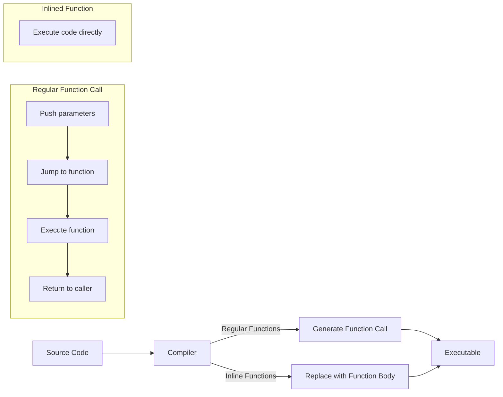

# C++ Inline Functions

## Introduction

When you're writing C++ programs that need to be efficient, function calls can sometimes introduce performance overhead. Each time a function is called, the program needs to save the current state, jump to the function's code, execute it, and then return. This process, while usually fast, adds up when functions are called frequently.

**Inline functions** provide a solution to this problem. They suggest to the compiler that it should substitute the function's code directly at the call site instead of performing a traditional function call. This can improve performance for small, frequently called functions.

## What Are Inline Functions?

An inline function is a function that is expanded in line when it's called. When the compiler processes an inline function, it replaces the function call with the actual code of the function body. This eliminates the overhead of function calls.

You can define an inline function by using the `inline` keyword:

```cpp
inline return_type function_name(parameters) {
    // function body
}
```

## How Inline Functions Work

Let's look at the difference between a regular function call and an inline function:

### Regular Function Call

```cpp
int add(int a, int b) {
    return a + b;
}

int main() {
    int result = add(5, 3); // Function call
    return 0;
}
```

What happens during execution:
1. Save the current execution state
2. Jump to the `add` function
3. Execute the function
4. Return to the calling point with the result
5. Continue execution

### Inline Function

```cpp
inline int add(int a, int b) {
    return a + b;
}

int main() {
    int result = add(5, 3); // Function call gets replaced
    return 0;
}
```

What the compiler might do:
```cpp
int main() {
    int result = 5 + 3; // Direct code substitution
    return 0;
}
```

The compiler has effectively **inlined** the function by replacing the call with the actual operation.

## When to Use Inline Functions

Inline functions are best used when:

1. The function is small (usually a few lines of code)
2. The function is called frequently
3. Performance is critical in that section of code

Common examples include:
- Simple getter and setter methods
- Short mathematical operations
- Functions that are called within loops

## Example: Inline Functions in Action

Let's create a complete example showing inline functions:

```cpp
#include <iostream>
#include <chrono>

// Regular function
int multiply(int a, int b) {
    return a * b;
}

// Inline function
inline int multiplyInline(int a, int b) {
    return a * b;
}

int main() {
    const int iterations = 10000000;
    int result = 0;
    
    // Test regular function
    auto start1 = std::chrono::high_resolution_clock::now();
    for (int i = 0; i < iterations; i++) {
        result += multiply(i, 2);
    }
    auto end1 = std::chrono::high_resolution_clock::now();
    auto duration1 = std::chrono::duration_cast<std::chrono::microseconds>(end1 - start1);
    
    // Reset result
    result = 0;
    
    // Test inline function
    auto start2 = std::chrono::high_resolution_clock::now();
    for (int i = 0; i < iterations; i++) {
        result += multiplyInline(i, 2);
    }
    auto end2 = std::chrono::high_resolution_clock::now();
    auto duration2 = std::chrono::duration_cast<std::chrono::microseconds>(end2 - start2);
    
    std::cout << "Regular function time: " << duration1.count() << " microseconds\n";
    std::cout << "Inline function time: " << duration2.count() << " microseconds\n";
    
    return 0;
}
```

Output (will vary based on your system):
```
Regular function time: 43215 microseconds
Inline function time: 32107 microseconds
```

Note: Modern compilers are smart and might automatically inline functions even without the `inline` keyword if they determine it would be beneficial. The example above demonstrates the concept, but the actual performance difference may vary.

## Implicit Inline Functions in Classes

Member functions defined inside a class definition are implicitly inline:

```cpp
class Rectangle {
private:
    int width, height;
    
public:
    // These functions are implicitly inline
    Rectangle(int w, int h) : width(w), height(h) {}
    
    int area() {
        return width * height;
    }
    
    int perimeter() {
        return 2 * (width + height);
    }
};
```

In this example, the constructor, `area()`, and `perimeter()` methods are all implicitly inline.

## Limitations and Considerations

While inline functions can improve performance, they come with some limitations:

1. **Code Size**: Inlining increases the binary size because the function code is duplicated at each call site.

2. **Not Always Honored**: The `inline` keyword is just a suggestion to the compiler, which may choose to ignore it.

3. **Complex Functions**: Functions with loops, recursion, or complex logic are usually poor candidates for inlining.

4. **Debug Difficulty**: Inlined functions can be harder to debug since they don't appear as separate functions in debuggers.

## Best Practices

1. **Use inline for small, frequently called functions**:
   ```cpp
   inline double square(double x) { return x * x; }
   ```

2. **Don't inline complex functions**:
   ```cpp
   // Bad candidate for inlining
   inline void complexAlgorithm(std::vector<int>& data) {
       // Many lines of code with loops and conditions
   }
   ```

3. **Let the compiler decide**: Modern compilers are quite good at determining when to inline functions. Sometimes it's best to let the compiler make the decision.

4. **Use for class getters and setters**:
   ```cpp
   class Person {
   private:
       std::string name;
   public:
       inline std::string getName() const { return name; }
       inline void setName(const std::string& n) { name = n; }
   };
   ```

## Real-World Application: Math Library

Here's a practical example of creating a simple math library with inline functions:

```cpp
#include <iostream>
#include <cmath>

// A simple math utility namespace with inline functions
namespace MathUtils {
    inline double square(double x) {
        return x * x;
    }
    
    inline double cube(double x) {
        return x * x * x;
    }
    
    inline double average(double a, double b) {
        return (a + b) / 2.0;
    }
    
    inline double hypotenuse(double a, double b) {
        return std::sqrt(square(a) + square(b));
    }
}

int main() {
    double a = 3.0, b = 4.0;
    
    std::cout << "Square of " << a << ": " << MathUtils::square(a) << std::endl;
    std::cout << "Cube of " << a << ": " << MathUtils::cube(a) << std::endl;
    std::cout << "Average of " << a << " and " << b << ": " << MathUtils::average(a, b) << std::endl;
    std::cout << "Hypotenuse of right triangle with sides " << a << " and " << b 
              << ": " << MathUtils::hypotenuse(a, b) << std::endl;
    
    return 0;
}
```

Output:
```
Square of 3: 9
Cube of 3: 27
Average of 3 and 4: 3.5
Hypotenuse of right triangle with sides 3 and 4: 5
```

This example shows how inline functions can be used to create a clean, efficient math utility library. The functions are small and likely to be called frequently, making them good candidates for inlining.

## How Inline Functions Work Under the Hood



## Summary

Inline functions in C++ provide a way to optimize your code by eliminating function call overhead. They work by suggesting to the compiler that it should replace function calls with the actual function code.

Key points to remember:
- Use the `inline` keyword to define inline functions
- Best for small, frequently called functions
- Member functions defined inside class definitions are implicitly inline
- Inlining is a suggestion to the compiler, not a command
- Improves performance by reducing function call overhead
- May increase code size due to function duplication

Inline functions are a useful optimization technique, but they should be used judiciously. Modern compilers are quite sophisticated and can often make better inlining decisions automatically.

## Exercises

1. Create an inline function called `max` that returns the larger of two integers.

2. Create a `Vector2D` class with inline methods for vector operations like addition, subtraction, and dot product.

3. Write a program that compares the performance of an inline function versus a regular function for a simple operation executed in a loop 100 million times.

4. Create a temperature conversion utility with inline functions for converting between Celsius, Fahrenheit, and Kelvin.

5. Investigate how your compiler treats inline functions by examining the assembly output with and without the `inline` keyword.

## Additional Resources

- [C++ Reference - inline specifier](https://en.cppreference.com/w/cpp/language/inline)
- Book: "Effective C++" by Scott Meyers (Item 30 discusses inline functions)
- Book: "C++ Primer" by Stanley B. Lippman (Chapter 6.5.1 covers inline functions)
- [C++ Core Guidelines: Performance](https://isocpp.github.io/CppCoreGuidelines/CppCoreGuidelines#Rper-inline)

Happy coding!