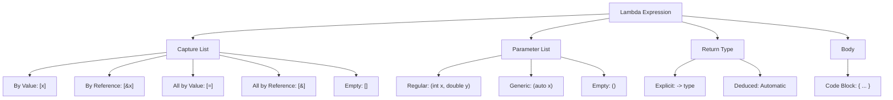

# C++ Lambda Expressions

## Introduction

Lambda expressions, introduced in C++11, are a powerful feature that allows you to create anonymous functions right at the location where they're needed. Think of them as small, disposable functions that you can define inline without having to formally declare a named function elsewhere.

Lambda expressions are particularly useful for:
- Short, simple functions that are used only once
- Functions that need to access variables from their containing scope
- Passing custom behavior to algorithms and functions

By the end of this tutorial, you'll understand how lambda expressions work, how to write them, and when to use them in your C++ programs.

## Basic Syntax of Lambda Expressions

A lambda expression follows this general syntax:

```cpp
[capture-list](parameters) -> return_type { body }
```

Where:
- `[capture-list]`: Specifies which variables from the surrounding scope are accessible inside the lambda
- `(parameters)`: Parameters the lambda takes (just like regular function parameters)
- `-> return_type`: Optional return type specification
- `{ body }`: The code to execute when the lambda is called

Let's start with a simple example:

```cpp
#include <iostream>

int main() {
    // A basic lambda that takes no parameters and returns nothing
    auto sayHello = []() {
        std::cout << "Hello, Lambda!" << std::endl;
    };
    
    // Call the lambda function
    sayHello();
    
    return 0;
}
```

**Output:**
```
Hello, Lambda!
```

In this example, we defined a lambda expression that prints a message and assigned it to the variable `sayHello`. We then called it like a regular function.

## Lambda Parameters

Just like regular functions, lambdas can take parameters:

```cpp
#include <iostream>

int main() {
    // Lambda that takes two parameters
    auto add = [](int a, int b) {
        return a + b;
    };
    
    int result = add(3, 4);
    std::cout << "3 + 4 = " << result << std::endl;
    
    // Lambda can also be used directly without assigning to a variable
    std::cout << "5 + 7 = " << [](int a, int b) { return a + b; }(5, 7) << std::endl;
    
    return 0;
}
```

**Output:**
```
3 + 4 = 7
5 + 7 = 12
```

## Return Type Deduction

In many cases, C++ can deduce the return type of a lambda expression. However, you can explicitly specify it using the `->` syntax:

```cpp
#include <iostream>

int main() {
    // Return type is automatically deduced as int
    auto multiply = [](int a, int b) {
        return a * b;
    };
    
    // Explicitly specifying return type as double
    auto divide = [](int a, int b) -> double {
        return static_cast<double>(a) / b;
    };
    
    std::cout << "5 * 3 = " << multiply(5, 3) << std::endl;
    std::cout << "5 / 2 = " << divide(5, 2) << std::endl;
    
    return 0;
}
```

**Output:**
```
5 * 3 = 15
5 / 2 = 2.5
```

Explicitly specifying the return type is necessary when the lambda body has multiple return statements with different types, or when you want to ensure a specific return type.

## Variable Capture

One of the most powerful features of lambda expressions is their ability to "capture" variables from the surrounding scope and use them inside the lambda body.

### Capture Modes

There are several ways to capture variables:

1. `[var]`: Capture variable `var` by value
2. `[&var]`: Capture variable `var` by reference
3. `[=]`: Capture all variables used in the lambda by value
4. `[&]`: Capture all variables used in the lambda by reference
5. `[this]`: Capture the current object (in member functions)
6. `[]`: Capture nothing

Let's see some examples:

```cpp
#include <iostream>

int main() {
    int x = 10;
    int y = 20;
    
    // Capture x by value
    auto lambda1 = [x]() {
        std::cout << "x = " << x << std::endl;
        // x = 20;  // Error: cannot modify a captured variable by value
    };
    
    // Capture y by reference
    auto lambda2 = [&y]() {
        y = 30;  // Can modify y because it's captured by reference
        std::cout << "y = " << y << std::endl;
    };
    
    // Capture all variables by value
    auto lambda3 = [=]() {
        std::cout << "x + y = " << x + y << std::endl;
        // y = 40;  // Error: cannot modify variables captured by value
    };
    
    // Capture all variables by reference
    auto lambda4 = [&]() {
        x += 5;
        y += 5;
        std::cout << "After modification: x = " << x << ", y = " << y << std::endl;
    };
    
    lambda1();
    lambda2();
    std::cout << "After lambda2: y = " << y << std::endl;
    lambda3();
    lambda4();
    
    return 0;
}
```

**Output:**
```
x = 10
y = 30
After lambda2: y = 30
x + y = 10 + 30 = 40
After modification: x = 15, y = 35
```

### Mutable Lambdas

By default, variables captured by value are read-only inside the lambda. To modify them, you need to use the `mutable` keyword:

```cpp
#include <iostream>

int main() {
    int counter = 0;
    
    // Without mutable, this would be an error
    auto incrementCounter = [counter]() mutable {
        counter++;
        std::cout << "Inside lambda: counter = " << counter << std::endl;
    };
    
    incrementCounter();
    incrementCounter();
    
    // The original counter is unchanged
    std::cout << "Outside lambda: counter = " << counter << std::endl;
    
    return 0;
}
```

**Output:**
```
Inside lambda: counter = 1
Inside lambda: counter = 2
Outside lambda: counter = 0
```

Note that `mutable` only affects variables captured by value. It allows you to modify the lambda's copy of those variables, but the original variables remain unchanged.

## Practical Applications of Lambda Expressions

### 1. Using Lambdas with Algorithms

Lambdas shine when used with standard library algorithms:

```cpp
#include <iostream>
#include <vector>
#include <algorithm>

int main() {
    std::vector<int> numbers = {1, 5, 3, 9, 7, 2, 8, 4, 6};
    
    // Sort in descending order using a lambda
    std::sort(numbers.begin(), numbers.end(), [](int a, int b) {
        return a > b;
    });
    
    std::cout << "Sorted numbers (descending): ";
    for (int num : numbers) {
        std::cout << num << " ";
    }
    std::cout << std::endl;
    
    // Find the first number greater than 5
    auto it = std::find_if(numbers.begin(), numbers.end(), [](int num) {
        return num <= 5;
    });
    
    if (it != numbers.end()) {
        std::cout << "First number less than or equal to 5: " << *it << std::endl;
    }
    
    // Count numbers less than 5
    int count = std::count_if(numbers.begin(), numbers.end(), [](int num) {
        return num < 5;
    });
    
    std::cout << "Count of numbers less than 5: " << count << std::endl;
    
    return 0;
}
```

**Output:**
```
Sorted numbers (descending): 9 8 7 6 5 4 3 2 1 
First number less than or equal to 5: 5
Count of numbers less than 5: 3
```

### 2. Custom Callback Functions

Lambdas are great for creating quick callback functions:

```cpp
#include <iostream>
#include <functional>

// A function that takes a callback function as an argument
void performOperation(int a, int b, std::function<void(int, int)> callback) {
    callback(a, b);
}

int main() {
    // Using lambdas as callbacks
    performOperation(5, 3, [](int x, int y) {
        std::cout << x << " + " << y << " = " << (x + y) << std::endl;
    });
    
    performOperation(5, 3, [](int x, int y) {
        std::cout << x << " * " << y << " = " << (x * y) << std::endl;
    });
    
    return 0;
}
```

**Output:**
```
5 + 3 = 8
5 * 3 = 15
```

### 3. Event Handlers

Lambdas can be used as event handlers or for implementing the observer pattern:

```cpp
#include <iostream>
#include <vector>
#include <functional>
#include <string>

class Button {
private:
    std::string name;
    std::vector<std::function<void()>> clickHandlers;
    
public:
    Button(const std::string& buttonName) : name(buttonName) {}
    
    void addClickHandler(std::function<void()> handler) {
        clickHandlers.push_back(handler);
    }
    
    void click() {
        std::cout << "Button " << name << " was clicked!" << std::endl;
        for (auto& handler : clickHandlers) {
            handler();
        }
    }
};

int main() {
    Button saveButton("Save");
    
    // Add click handlers using lambdas
    saveButton.addClickHandler([]() {
        std::cout << "Saving data..." << std::endl;
    });
    
    saveButton.addClickHandler([]() {
        std::cout << "Updating UI..." << std::endl;
    });
    
    // Simulate a button click
    saveButton.click();
    
    return 0;
}
```

**Output:**
```
Button Save was clicked!
Saving data...
Updating UI...
```

### 4. Creating Closures

Lambdas can create closures, which are functions that "enclose" variables from their containing scope:

```cpp
#include <iostream>
#include <functional>
#include <vector>

// Function that returns a counter function
std::function<int()> createCounter(int startValue) {
    return [startValue]() mutable {
        return startValue++;
    };
}

int main() {
    auto counter1 = createCounter(10);
    auto counter2 = createCounter(100);
    
    std::cout << "Counter 1 values: ";
    for (int i = 0; i < 5; i++) {
        std::cout << counter1() << " ";
    }
    std::cout << std::endl;
    
    std::cout << "Counter 2 values: ";
    for (int i = 0; i < 5; i++) {
        std::cout << counter2() << " ";
    }
    std::cout << std::endl;
    
    return 0;
}
```

**Output:**
```
Counter 1 values: 10 11 12 13 14 
Counter 2 values: 100 101 102 103 104 
```

## Lambda Expression Evolution in Modern C++

Lambda expressions have evolved with newer C++ standards:

### C++14 Enhancements

C++14 added:
- Generic lambdas (auto parameters)
- Ability to capture variables with initialization

```cpp
#include <iostream>
#include <vector>
#include <string>

int main() {
    // Generic lambda with auto parameter
    auto printTypedValue = [](auto value) {
        std::cout << "Value: " << value << " (type: " << typeid(value).name() << ")" << std::endl;
    };
    
    printTypedValue(42);
    printTypedValue(3.14);
    printTypedValue(std::string("Hello"));
    
    // Capture with initialization
    int multiplier = 3;
    auto multiplyByCapture = [factor = multiplier](int value) {
        return value * factor;
    };
    
    std::cout << "5 × " << multiplier << " = " << multiplyByCapture(5) << std::endl;
    
    return 0;
}
```

### C++17 Enhancements

C++17 added constexpr lambdas, which allow lambdas to be evaluated at compile time:

```cpp
#include <iostream>
#include <array>

int main() {
    // constexpr lambda
    constexpr auto square = [](int x) constexpr {
        return x * x;
    };
    
    // Used in a context requiring compile-time evaluation
    constexpr int result = square(5);
    std::array<int, square(3)> arr;  // array of size 9
    
    std::cout << "5² = " << result << std::endl;
    std::cout << "Array size: " << arr.size() << std::endl;
    
    return 0;
}
```

## When to Use Lambda Expressions

Lambda expressions are most appropriate when:

1. You need a simple function that will be used only once or in a limited scope
2. You need to define a function inside another function
3. The function is short (a few lines of code)
4. You want to capture local variables
5. You're passing custom behavior to algorithms or library functions

However, if the function is complex, reused in multiple places, or doesn't need to capture local variables, a regular named function might be more appropriate.

## Visualizing Lambda Expressions



## Summary

Lambda expressions are a powerful feature in C++ that allows you to define anonymous functions inline. They're particularly useful for short, one-off functions and when you need to pass custom behavior to algorithms and functions.

Key points to remember:
- Lambda expressions are defined using the `[capture-list](parameters) -> return_type { body }` syntax
- Variables from the surrounding scope can be captured by value or by reference
- Use `mutable` to modify variables captured by value
- Lambda expressions shine when used with algorithms, as callbacks, or for creating closures
- Modern C++ (C++14 and beyond) has added even more capabilities to lambdas

With lambdas, your code can become more concise, readable, and expressive, especially when working with the STL algorithms or implementing callback-based designs.

## Exercises

1. Write a lambda expression that calculates the factorial of a number.
2. Use `std::transform` with a lambda to convert a vector of integers to their squares.
3. Create a lambda function that checks if a string is a palindrome.
4. Write a function that returns a lambda, which remembers how many times it has been called.
5. Use `std::sort` with a lambda to sort a vector of strings by their lengths.

## Additional Resources

- [C++ Reference: Lambda expressions](https://en.cppreference.com/w/cpp/language/lambda)
- [Microsoft C++ Documentation: Lambda Expressions](https://docs.microsoft.com/en-us/cpp/cpp/lambda-expressions-in-cpp)
- [C++ Core Guidelines: Lambda expressions](https://isocpp.github.io/CppCoreGuidelines/CppCoreGuidelines#SS-lambdas)
- Book: "Effective Modern C++" by Scott Meyers, which includes detailed sections on lambda expressions