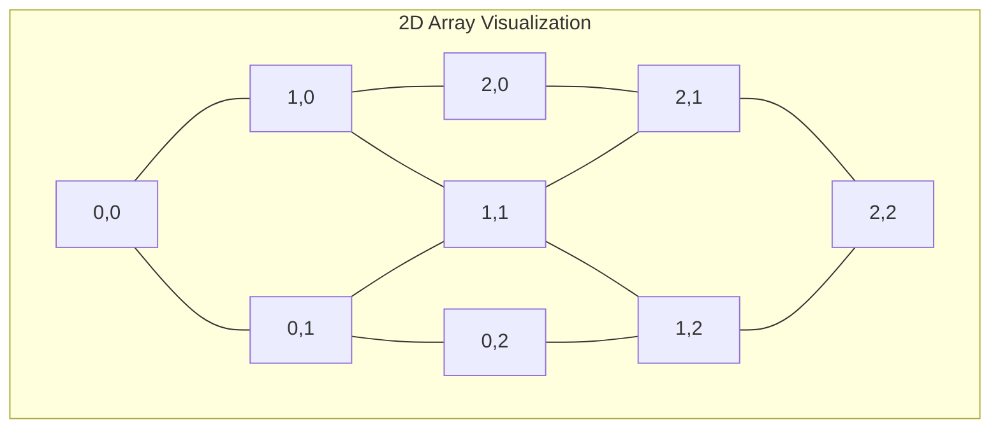

# C++ Multidimensional Arrays

## Introduction

In programming, we often need to work with data that has multiple dimensions. While one-dimensional arrays are useful for storing linear collections of elements, they become limiting when dealing with tabular data (like spreadsheets), matrices, or three-dimensional structures.

Multidimensional arrays solve this problem by allowing us to organize data in multiple dimensions. In C++, you can create arrays with two, three, or even more dimensions to represent complex data structures.

In this tutorial, we'll focus on:
- What multidimensional arrays are and why they're useful
- How to declare and initialize 2D and 3D arrays
- Accessing and manipulating elements
- Common operations and patterns
- Practical applications

## Understanding Multidimensional Arrays

A multidimensional array is an array of arrays. The most common type is a two-dimensional (2D) array, which can be visualized as a table with rows and columns.



## Two-Dimensional Arrays

### Declaration and Initialization

You can declare a 2D array in C++ using the following syntax:

```cpp
data_type array_name[row_size][column_size];
```

Here are examples of declaring and initializing 2D arrays:

```cpp
// Declaration only
int matrix[3][4];  // 3 rows, 4 columns

// Declaration with initialization
int grid[2][3] = {
    {1, 2, 3},    // Row 0
    {4, 5, 6}     // Row 1
};

// C++11 and later allows simpler initialization
int simple[2][2] = {{1, 2}, {3, 4}};

// If you provide all elements, you can omit the first dimension
int auto_rows[][3] = {{1, 2, 3}, {4, 5, 6}, {7, 8, 9}};  // 3 rows inferred
```

### Accessing Elements

To access elements in a 2D array, you need two indices: one for the row and one for the column.

```cpp
#include <iostream>
using namespace std;

int main() {
    int grid[2][3] = {
        {1, 2, 3},
        {4, 5, 6}
    };
    
    // Accessing an element
    cout << "Element at grid[1][2]: " << grid[1][2] << endl;
    
    // Modifying an element
    grid[0][1] = 10;
    cout << "Modified element at grid[0][1]: " << grid[0][1] << endl;
    
    return 0;
}
```

**Output:**
```
Element at grid[1][2]: 6
Modified element at grid[0][1]: 10
```

### Traversing a 2D Array

You can traverse all elements in a 2D array using nested loops:

```cpp
#include <iostream>
using namespace std;

int main() {
    int grid[3][3] = {
        {1, 2, 3},
        {4, 5, 6},
        {7, 8, 9}
    };
    
    cout << "Traversing the 2D array:" << endl;
    
    // Outer loop for rows
    for(int i = 0; i < 3; i++) {
        // Inner loop for columns
        for(int j = 0; j < 3; j++) {
            cout << grid[i][j] << " ";
        }
        cout << endl;  // New line after each row
    }
    
    return 0;
}
```

**Output:**
```
Traversing the 2D array:
1 2 3 
4 5 6 
7 8 9 
```

## Three-Dimensional Arrays

A three-dimensional (3D) array adds another dimension, which you can visualize as a collection of 2D arrays stacked together.

### Declaration and Initialization

```cpp
// Declaration
int cube[2][3][4];  // 2 planes, each with 3 rows and 4 columns

// Initialization
int threeDim[2][2][2] = {
    {  // First plane
        {1, 2},
        {3, 4}
    },
    {  // Second plane
        {5, 6},
        {7, 8}
    }
};
```

### Accessing Elements

To access elements in a 3D array, you need three indices:

```cpp
#include <iostream>
using namespace std;

int main() {
    int threeDim[2][2][2] = {
        {{1, 2}, {3, 4}},
        {{5, 6}, {7, 8}}
    };
    
    // Accessing an element
    cout << "Element at threeDim[1][0][1]: " << threeDim[1][0][1] << endl;
    
    return 0;
}
```

**Output:**
```
Element at threeDim[1][0][1]: 6
```

### Traversing a 3D Array

You can traverse a 3D array using triple-nested loops:

```cpp
#include <iostream>
using namespace std;

int main() {
    int threeDim[2][2][2] = {
        {{1, 2}, {3, 4}},
        {{5, 6}, {7, 8}}
    };
    
    cout << "Traversing the 3D array:" << endl;
    
    for(int i = 0; i < 2; i++) {
        cout << "Plane " << i << ":" << endl;
        for(int j = 0; j < 2; j++) {
            for(int k = 0; k < 2; k++) {
                cout << threeDim[i][j][k] << " ";
            }
            cout << endl;
        }
        cout << endl;
    }
    
    return 0;
}
```

**Output:**
```
Traversing the 3D array:
Plane 0:
1 2 
3 4 

Plane 1:
5 6 
7 8 
```

## Memory Layout of Multidimensional Arrays

In C++, multidimensional arrays are stored in row-major order. This means that elements are stored row by row in consecutive memory locations.

For a 2D array `int arr[3][4]`, the memory layout would be:
```
arr[0][0], arr[0][1], arr[0][2], arr[0][3], arr[1][0], arr[1][1], ...
```

Understanding this layout is important for optimizing performance when working with large arrays.

## Common Operations on Multidimensional Arrays

### Finding the Sum of All Elements

```cpp
#include <iostream>
using namespace std;

int main() {
    int matrix[3][3] = {
        {1, 2, 3},
        {4, 5, 6},
        {7, 8, 9}
    };
    
    int sum = 0;
    
    for(int i = 0; i < 3; i++) {
        for(int j = 0; j < 3; j++) {
            sum += matrix[i][j];
        }
    }
    
    cout << "Sum of all elements: " << sum << endl;
    
    return 0;
}
```

**Output:**
```
Sum of all elements: 45
```

### Finding Maximum Element

```cpp
#include <iostream>
#include <climits>  // For INT_MIN
using namespace std;

int main() {
    int matrix[3][3] = {
        {1, 8, 3},
        {4, 5, 15},
        {7, 2, 9}
    };
    
    int maxElement = INT_MIN;
    int maxRow = 0, maxCol = 0;
    
    for(int i = 0; i < 3; i++) {
        for(int j = 0; j < 3; j++) {
            if(matrix[i][j] > maxElement) {
                maxElement = matrix[i][j];
                maxRow = i;
                maxCol = j;
            }
        }
    }
    
    cout << "Maximum element: " << maxElement << endl;
    cout << "Located at position: [" << maxRow << "][" << maxCol << "]" << endl;
    
    return 0;
}
```

**Output:**
```
Maximum element: 15
Located at position: [1][2]
```

## Practical Applications

### 1. Matrix Operations

Matrices are commonly represented using 2D arrays. Here's an example of matrix addition:

```cpp
#include <iostream>
using namespace std;

int main() {
    int matrixA[2][2] = {{1, 2}, {3, 4}};
    int matrixB[2][2] = {{5, 6}, {7, 8}};
    int result[2][2];
    
    cout << "Matrix Addition:" << endl;
    
    // Performing addition
    for(int i = 0; i < 2; i++) {
        for(int j = 0; j < 2; j++) {
            result[i][j] = matrixA[i][j] + matrixB[i][j];
        }
    }
    
    // Displaying the result
    for(int i = 0; i < 2; i++) {
        for(int j = 0; j < 2; j++) {
            cout << result[i][j] << " ";
        }
        cout << endl;
    }
    
    return 0;
}
```

**Output:**
```
Matrix Addition:
6 8 
10 12 
```

### 2. Game Development: Representing a Board

Multidimensional arrays are perfect for representing game boards like tic-tac-toe:

```cpp
#include <iostream>
using namespace std;

void displayBoard(char board[3][3]) {
    cout << "Current Board:" << endl;
    for(int i = 0; i < 3; i++) {
        for(int j = 0; j < 3; j++) {
            cout << board[i][j] << " | ";
        }
        cout << endl << "---------" << endl;
    }
}

int main() {
    // Initialize empty tic-tac-toe board
    char board[3][3] = {
        {' ', ' ', ' '},
        {' ', ' ', ' '},
        {' ', ' ', ' '}
    };
    
    // Make some moves
    board[0][0] = 'X';
    board[1][1] = 'O';
    board[0][1] = 'X';
    
    displayBoard(board);
    
    return 0;
}
```

**Output:**
```
Current Board:
X | X |   | 
---------
  | O |   | 
---------
  |   |   | 
---------
```

### 3. Image Processing

In image processing, a grayscale image can be represented as a 2D array where each element corresponds to a pixel's intensity. Here's a simple example that inverts a small grayscale image:

```cpp
#include <iostream>
using namespace std;

int main() {
    // A 4x4 grayscale image (0-255 intensity values)
    int image[4][4] = {
        {50, 100, 150, 200},
        {150, 50, 200, 100},
        {200, 150, 50, 100},
        {100, 200, 150, 50}
    };
    
    cout << "Original Image:" << endl;
    for(int i = 0; i < 4; i++) {
        for(int j = 0; j < 4; j++) {
            cout << image[i][j] << "\t";
        }
        cout << endl;
    }
    
    // Invert the image (255 - pixel value)
    for(int i = 0; i < 4; i++) {
        for(int j = 0; j < 4; j++) {
            image[i][j] = 255 - image[i][j];
        }
    }
    
    cout << "\nInverted Image:" << endl;
    for(int i = 0; i < 4; i++) {
        for(int j = 0; j < 4; j++) {
            cout << image[i][j] << "\t";
        }
        cout << endl;
    }
    
    return 0;
}
```

**Output:**
```
Original Image:
50      100     150     200
150     50      200     100
200     150     50      100
100     200     150     50

Inverted Image:
205     155     105     55
105     205     55      155
55      105     205     155
155     55      105     205
```

## Common Pitfalls and Best Practices

### 1. Array Bounds Checking

C++ doesn't perform bounds checking on arrays. Accessing elements outside the array bounds leads to undefined behavior:

```cpp
int matrix[2][3];
matrix[2][3] = 10;  // Out of bounds! The valid indices are 0-1 for rows and 0-2 for columns
```

Always ensure your indices are within bounds.

### 2. Passing Multidimensional Arrays to Functions

When passing multidimensional arrays to functions, you must specify the dimensions (except for the first one):

```cpp
void processMatrix(int matrix[][3], int rows) {
    // Process the matrix
}

int main() {
    int myMatrix[2][3] = {{1, 2, 3}, {4, 5, 6}};
    processMatrix(myMatrix, 2);
    return 0;
}
```

### 3. Dynamic Allocation

For larger or run-time determined sizes, consider using dynamic allocation:

```cpp
#include <iostream>
using namespace std;

int main() {
    int rows = 3, cols = 4;
    
    // Allocate memory for a 2D array
    int** dynamicArray = new int*[rows];
    for(int i = 0; i < rows; i++) {
        dynamicArray[i] = new int[cols];
    }
    
    // Initialize and use the array
    for(int i = 0; i < rows; i++) {
        for(int j = 0; j < cols; j++) {
            dynamicArray[i][j] = i * cols + j;
            cout << dynamicArray[i][j] << " ";
        }
        cout << endl;
    }
    
    // Free memory
    for(int i = 0; i < rows; i++) {
        delete[] dynamicArray[i];
    }
    delete[] dynamicArray;
    
    return 0;
}
```

## Summary

Multidimensional arrays in C++ provide a powerful way to organize and manipulate data in multiple dimensions. They're particularly useful for representing matrices, game boards, images, and other structured data.

Key points to remember:
- 2D arrays are declared as `type array_name[rows][columns]`
- 3D arrays add another dimension: `type array_name[depth][rows][columns]`
- Elements are accessed using multiple indices: `array[i][j]` or `array[i][j][k]`
- Multidimensional arrays are stored in row-major order in memory
- Always check array bounds to prevent undefined behavior
- When passing to functions, all dimensions except the first must be specified

## Exercises

1. Write a program to multiply two 3×3 matrices.
2. Create a program that transposes a matrix (swaps rows and columns).
3. Implement a simple Conway's Game of Life simulation using a 2D array to represent the grid.
4. Write a function that rotates a 2D array 90 degrees clockwise.
5. Create a 3D array to represent a simple 3D space and implement a function to navigate through it.

## Additional Resources

- [C++ Reference: Arrays](https://en.cppreference.com/w/cpp/language/array)
- [Introduction to Matrices in Linear Algebra](https://www.mathsisfun.com/algebra/matrix-introduction.html)
- [Multidimensional Arrays in C++ - GeeksforGeeks](https://www.geeksforgeeks.org/multidimensional-arrays-in-c/)
- [Conway's Game of Life - Wikipedia](https://en.wikipedia.org/wiki/Conway%27s_Game_of_Life)

Happy coding!