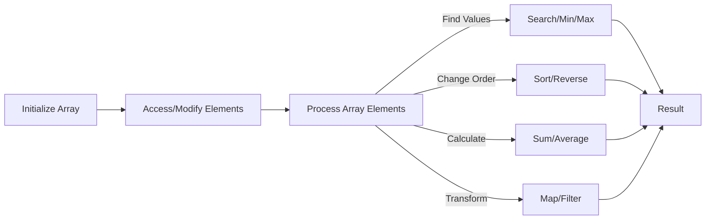

# C++ Array Functions

Arrays are fundamental data structures in C++ that allow you to store multiple elements of the same type. While C++ arrays are relatively simple, there are numerous operations and functions you can use to manipulate them efficiently. This tutorial explores the essential array functions and operations that every beginner should know.

## Introduction to Array Operations

When working with arrays, you'll regularly need to perform several common operations:

- Initializing arrays
- Accessing and modifying elements
- Searching for elements
- Sorting arrays
- Calculating statistics (sum, average, min, max)
- Copying and merging arrays

While C++ doesn't have built-in array functions like some higher-level languages, we can implement these operations using standard library algorithms or our own custom functions.

## Array Initialization Techniques

Let's start with different ways to initialize arrays in C++:

```cpp
#include <iostream>
using namespace std;

int main() {
    // Method 1: Declaring without initialization (contains garbage values)
    int numbers[5];
    
    // Method 2: Initialize with explicit values
    int scores[5] = {95, 80, 75, 90, 85};
    
    // Method 3: Partial initialization (remaining elements are set to 0)
    int values[5] = {10, 20};  // values will be {10, 20, 0, 0, 0}
    
    // Method 4: Let compiler determine size
    int days[] = {31, 28, 31, 30, 31, 30, 31, 31, 30, 31, 30, 31};
    
    // Method 5: Initialize all elements to the same value
    int zeros[10] = {}; // All elements initialized to 0
    
    // Method 6: Using a loop for custom initialization
    int squares[10];
    for(int i = 0; i < 10; i++) {
        squares[i] = i * i;
    }
    
    // Print the squares array
    cout << "Squares of numbers 0-9:" << endl;
    for(int i = 0; i < 10; i++) {
        cout << squares[i] << " ";
    }
    cout << endl;
    
    return 0;
}
```

**Output:**
```
Squares of numbers 0-9:
0 1 4 9 16 25 36 49 64 81
```

## Basic Array Operations

### 1. Finding the Size of an Array

To find the size of an array, you can use the `sizeof` operator:

```cpp
#include <iostream>
using namespace std;

int main() {
    int numbers[] = {10, 20, 30, 40, 50};
    
    // Calculate number of elements
    int size = sizeof(numbers) / sizeof(numbers[0]);
    
    cout << "Array size: " << size << endl;
    return 0;
}
```

**Output:**
```
Array size: 5
```

### 2. Accessing and Modifying Elements

Array elements are accessed using zero-based indexing:

```cpp
#include <iostream>
using namespace std;

int main() {
    int grades[5] = {85, 90, 75, 95, 80};
    
    // Reading array elements
    cout << "First grade: " << grades[0] << endl;
    cout << "Last grade: " << grades[4] << endl;
    
    // Modifying array elements
    grades[2] = 88;
    
    cout << "Updated grades: ";
    for(int i = 0; i < 5; i++) {
        cout << grades[i] << " ";
    }
    cout << endl;
    
    return 0;
}
```

**Output:**
```
First grade: 85
Last grade: 80
Updated grades: 85 90 88 95 80
```

## Implementing Common Array Functions

### 1. Summing Array Elements

```cpp
#include <iostream>
using namespace std;

// Function to calculate sum of array elements
int calculateSum(int arr[], int size) {
    int sum = 0;
    for(int i = 0; i < size; i++) {
        sum += arr[i];
    }
    return sum;
}

int main() {
    int numbers[] = {10, 20, 30, 40, 50};
    int size = sizeof(numbers) / sizeof(numbers[0]);
    
    int sum = calculateSum(numbers, size);
    double average = static_cast<double>(sum) / size;
    
    cout << "Sum of elements: " << sum << endl;
    cout << "Average: " << average << endl;
    
    return 0;
}
```

**Output:**
```
Sum of elements: 150
Average: 30
```

### 2. Finding Minimum and Maximum Elements

```cpp
#include <iostream>
using namespace std;

// Function to find minimum element
int findMin(int arr[], int size) {
    int min = arr[0];
    for(int i = 1; i < size; i++) {
        if(arr[i] < min) {
            min = arr[i];
        }
    }
    return min;
}

// Function to find maximum element
int findMax(int arr[], int size) {
    int max = arr[0];
    for(int i = 1; i < size; i++) {
        if(arr[i] > max) {
            max = arr[i];
        }
    }
    return max;
}

int main() {
    int temperatures[] = {32, 45, 27, 38, 42, 30, 35};
    int size = sizeof(temperatures) / sizeof(temperatures[0]);
    
    cout << "Minimum temperature: " << findMin(temperatures, size) << endl;
    cout << "Maximum temperature: " << findMax(temperatures, size) << endl;
    
    return 0;
}
```

**Output:**
```
Minimum temperature: 27
Maximum temperature: 45
```

### 3. Searching for an Element

Let's implement linear search to find an element in an array:

```cpp
#include <iostream>
using namespace std;

// Function to search for an element (returns index or -1 if not found)
int linearSearch(int arr[], int size, int key) {
    for(int i = 0; i < size; i++) {
        if(arr[i] == key) {
            return i;  // Element found at index i
        }
    }
    return -1;  // Element not found
}

int main() {
    int id_numbers[] = {1001, 5432, 3478, 9876, 2345, 6789};
    int size = sizeof(id_numbers) / sizeof(id_numbers[0]);
    
    int search_id = 9876;
    int result = linearSearch(id_numbers, size, search_id);
    
    if(result != -1) {
        cout << "ID " << search_id << " found at position " << result << endl;
    } else {
        cout << "ID " << search_id << " not found in the database" << endl;
    }
    
    return 0;
}
```

**Output:**
```
ID 9876 found at position 3
```

### 4. Reversing an Array

```cpp
#include <iostream>
using namespace std;

// Function to reverse an array
void reverseArray(int arr[], int size) {
    int start = 0;
    int end = size - 1;
    
    while(start < end) {
        // Swap elements at start and end
        int temp = arr[start];
        arr[start] = arr[end];
        arr[end] = temp;
        
        // Move pointers inward
        start++;
        end--;
    }
}

int main() {
    int values[] = {10, 20, 30, 40, 50};
    int size = sizeof(values) / sizeof(values[0]);
    
    cout << "Original array: ";
    for(int i = 0; i < size; i++) {
        cout << values[i] << " ";
    }
    cout << endl;
    
    reverseArray(values, size);
    
    cout << "Reversed array: ";
    for(int i = 0; i < size; i++) {
        cout << values[i] << " ";
    }
    cout << endl;
    
    return 0;
}
```

**Output:**
```
Original array: 10 20 30 40 50
Reversed array: 50 40 30 20 10
```

### 5. Sorting an Array

Here's a simple implementation of the bubble sort algorithm:

```cpp
#include <iostream>
using namespace std;

// Function to sort an array using bubble sort
void bubbleSort(int arr[], int size) {
    for(int i = 0; i < size-1; i++) {
        for(int j = 0; j < size-i-1; j++) {
            if(arr[j] > arr[j+1]) {
                // Swap elements
                int temp = arr[j];
                arr[j] = arr[j+1];
                arr[j+1] = temp;
            }
        }
    }
}

int main() {
    int scores[] = {78, 65, 90, 82, 88, 72};
    int size = sizeof(scores) / sizeof(scores[0]);
    
    cout << "Unsorted scores: ";
    for(int i = 0; i < size; i++) {
        cout << scores[i] << " ";
    }
    cout << endl;
    
    bubbleSort(scores, size);
    
    cout << "Sorted scores: ";
    for(int i = 0; i < size; i++) {
        cout << scores[i] << " ";
    }
    cout << endl;
    
    return 0;
}
```

**Output:**
```
Unsorted scores: 78 65 90 82 88 72
Sorted scores: 65 72 78 82 88 90
```

## Using Standard Library Algorithms

C++ provides powerful algorithms in the `<algorithm>` header that can be used with arrays:

```cpp
#include <iostream>
#include <algorithm>
using namespace std;

int main() {
    int numbers[] = {45, 12, 89, 34, 67, 23, 56};
    int size = sizeof(numbers) / sizeof(numbers[0]);
    
    // Using std::sort
    sort(numbers, numbers + size);
    
    cout << "Sorted array: ";
    for(int i = 0; i < size; i++) {
        cout << numbers[i] << " ";
    }
    cout << endl;
    
    // Using std::find
    int key = 67;
    int* found = find(numbers, numbers + size, key);
    
    if(found != numbers + size) {
        cout << key << " found at position " << (found - numbers) << endl;
    } else {
        cout << key << " not found" << endl;
    }
    
    // Using std::min_element and std::max_element
    int* min = min_element(numbers, numbers + size);
    int* max = max_element(numbers, numbers + size);
    
    cout << "Minimum element: " << *min << endl;
    cout << "Maximum element: " << *max << endl;
    
    return 0;
}
```

**Output:**
```
Sorted array: 12 23 34 45 56 67 89
67 found at position 5
Minimum element: 12
Maximum element: 89
```

## Real-World Application: Temperature Analysis

Let's create a practical application that analyzes temperature data:

```cpp
#include <iostream>
#include <algorithm>
using namespace std;

// Function to calculate average
double calculateAverage(int arr[], int size) {
    int sum = 0;
    for(int i = 0; i < size; i++) {
        sum += arr[i];
    }
    return static_cast<double>(sum) / size;
}

// Function to count values above threshold
int countAboveThreshold(int arr[], int size, int threshold) {
    int count = 0;
    for(int i = 0; i < size; i++) {
        if(arr[i] > threshold) count++;
    }
    return count;
}

int main() {
    // Daily temperatures for a month (in Celsius)
    int temperatures[] = {22, 24, 19, 21, 23, 25, 29, 31, 33, 32, 
                         30, 28, 26, 25, 24, 22, 20, 19, 21, 24, 
                         25, 27, 29, 28, 26, 25, 23, 22, 24, 25};
    
    int size = sizeof(temperatures) / sizeof(temperatures[0]);
    
    // Find minimum and maximum temperatures
    int* min_temp = min_element(temperatures, temperatures + size);
    int* max_temp = max_element(temperatures, temperatures + size);
    
    // Calculate average temperature
    double avg_temp = calculateAverage(temperatures, size);
    
    // Count hot days (above 28°C)
    int hot_days = countAboveThreshold(temperatures, temperatures + size, 28);
    
    // Print the analysis
    cout << "Temperature Analysis for the Month:" << endl;
    cout << "--------------------------------" << endl;
    cout << "Minimum temperature: " << *min_temp << "°C" << endl;
    cout << "Maximum temperature: " << *max_temp << "°C" << endl;
    cout << "Average temperature: " << avg_temp << "°C" << endl;
    cout << "Number of hot days (>28°C): " << hot_days << endl;
    
    return 0;
}
```

**Output:**
```
Temperature Analysis for the Month:
--------------------------------
Minimum temperature: 19°C
Maximum temperature: 33°C
Average temperature: 25.2°C
Number of hot days (>28°C): 7
```

## Copying and Merging Arrays

### 1. Copying Elements

```cpp
#include <iostream>
using namespace std;

int main() {
    int source[] = {10, 20, 30, 40, 50};
    int size = sizeof(source) / sizeof(source[0]);
    
    // Create a new array with the same size
    int destination[size];
    
    // Copy elements
    for(int i = 0; i < size; i++) {
        destination[i] = source[i];
    }
    
    // Print the copied array
    cout << "Copied array: ";
    for(int i = 0; i < size; i++) {
        cout << destination[i] << " ";
    }
    cout << endl;
    
    return 0;
}
```

**Output:**
```
Copied array: 10 20 30 40 50
```

### 2. Merging Two Arrays

```cpp
#include <iostream>
using namespace std;

int main() {
    int first[] = {1, 3, 5, 7, 9};
    int second[] = {2, 4, 6, 8, 10};
    
    int size1 = sizeof(first) / sizeof(first[0]);
    int size2 = sizeof(second) / sizeof(second[0]);
    
    // Create a merged array with size of both arrays
    int merged[size1 + size2];
    
    // Copy elements from first array
    for(int i = 0; i < size1; i++) {
        merged[i] = first[i];
    }
    
    // Copy elements from second array
    for(int i = 0; i < size2; i++) {
        merged[size1 + i] = second[i];
    }
    
    // Print the merged array
    cout << "Merged array: ";
    for(int i = 0; i < size1 + size2; i++) {
        cout << merged[i] << " ";
    }
    cout << endl;
    
    return 0;
}
```

**Output:**
```
Merged array: 1 3 5 7 9 2 4 6 8 10
```

## The Flow of Array Operations

<div className="text-center">


</div>

## Summary

In this tutorial, we've covered essential C++ array functions and operations:

- Different methods for initializing arrays
- Basic array operations (accessing, modifying, and finding the size)
- Finding sum, average, minimum, and maximum values
- Searching for elements using linear search
- Reversing and sorting arrays
- Using standard library algorithms with arrays
- Copying and merging arrays
- A practical example of analyzing temperature data

Arrays form the foundation of more complex data structures and understanding how to manipulate them efficiently is crucial for becoming a proficient C++ programmer.

## Exercises

1. Create a function to check if an array is a palindrome (reads the same forwards and backwards).
2. Write a program to find the second largest element in an array.
3. Implement a function to remove duplicate elements from an array.
4. Create a program that counts the frequency of each element in an array.
5. Write a function that rotates the elements of an array to the left by a specified number of positions.
6. Implement binary search on a sorted array.
7. Create a function to merge two sorted arrays into a single sorted array.
8. Write a program that finds all pairs of elements in an array whose sum equals a specified value.

## Additional Resources

- [C++ Reference - Arrays](https://en.cppreference.com/w/cpp/language/array)
- [C++ Standard Library - Algorithm](https://en.cppreference.com/w/cpp/algorithm)
- [Data Structures and Algorithms in C++ (Book)](https://www.amazon.com/Data-Structures-Algorithms-Michael-Goodrich/dp/0470383275)
- [GeeksforGeeks - Array Data Structure](https://www.geeksforgeeks.org/array-data-structure/)

Happy coding with arrays in C++!