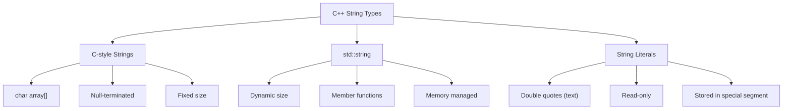

# C++ Strings

## Introduction

Strings are sequences of characters used to store and manipulate text. In C++, you have two main ways to work with strings:

1. C-style strings (character arrays)
2. The `std::string` class from the C++ Standard Library

This guide will cover both approaches, with a focus on the more modern and user-friendly `std::string` class. By the end of this tutorial, you'll be comfortable working with strings in your C++ programs and understand how to perform common string operations.

## C-style Strings

Before the `std::string` class was introduced, C++ inherited C-style strings, which are simply arrays of characters ending with a null character (`'\0'`).

### Declaration and Initialization

```cpp
// Method 1: Using string literal
char greeting[] = "Hello";

// Method 2: Character by character (don't forget the null character!)
char message[6] = {'H', 'e', 'l', 'l', 'o', '\0'};

// Method 3: Declare first, initialize later
char name[10];
strcpy(name, "John");
```

### Limitations of C-style Strings

C-style strings have several limitations:

- No built-in bounds checking
- Manual memory management
- Limited functionality for manipulation
- Difficult to resize
- Prone to buffer overflow errors

```cpp
#include <iostream>
#include <cstring>

int main() {
    // Example of potential issues with C-style strings
    char shortBuffer[5];
    strcpy(shortBuffer, "This is too long"); // Buffer overflow!
    
    std::cout << shortBuffer << std::endl; // Undefined behavior
    
    return 0;
}
```

## The `std::string` Class

The `std::string` class provides a safer and more flexible way to work with strings. It handles memory management automatically and offers many useful methods.

### Declaration and Initialization

```cpp
#include <iostream>
#include <string>

int main() {
    // Different ways to initialize strings
    std::string s1 = "Hello";
    std::string s2("World");
    std::string s3(5, 'a');  // Creates "aaaaa"
    std::string s4 = s1;     // Copy of s1
    
    // Output
    std::cout << "s1: " << s1 << std::endl;
    std::cout << "s2: " << s2 << std::endl;
    std::cout << "s3: " << s3 << std::endl;
    std::cout << "s4: " << s4 << std::endl;
    
    return 0;
}
```

**Output:**
```
s1: Hello
s2: World
s3: aaaaa
s4: Hello
```

### Basic String Operations

#### String Length

```cpp
#include <iostream>
#include <string>

int main() {
    std::string text = "Hello, C++!";
    
    // Two ways to get string length
    size_t length1 = text.length();
    size_t length2 = text.size();  // Same as length()
    
    std::cout << "String: " << text << std::endl;
    std::cout << "Length: " << length1 << std::endl;
    
    return 0;
}
```

**Output:**
```
String: Hello, C++!
Length: 11
```

#### Accessing Individual Characters

```cpp
#include <iostream>
#include <string>

int main() {
    std::string text = "Hello";
    
    // Method 1: Using array notation
    std::cout << "First character: " << text[0] << std::endl;
    
    // Method 2: Using at() method (with bounds checking)
    std::cout << "Last character: " << text.at(text.length() - 1) << std::endl;
    
    // Modifying characters
    text[0] = 'J';
    std::cout << "Modified string: " << text << std::endl;
    
    return 0;
}
```

**Output:**
```
First character: H
Last character: o
Modified string: Jello
```

### String Concatenation

```cpp
#include <iostream>
#include <string>

int main() {
    std::string first = "Hello";
    std::string second = "World";
    
    // Method 1: Using + operator
    std::string combined = first + " " + second;
    std::cout << combined << std::endl;
    
    // Method 2: Using append() method
    first.append(" ");
    first.append(second);
    std::cout << first << std::endl;
    
    // Method 3: Using += operator
    std::string greeting = "Hello";
    greeting += " beautiful ";
    greeting += "World!";
    std::cout << greeting << std::endl;
    
    return 0;
}
```

**Output:**
```
Hello World
Hello World
Hello beautiful World!
```

### String Comparison

```cpp
#include <iostream>
#include <string>

int main() {
    std::string s1 = "apple";
    std::string s2 = "banana";
    std::string s3 = "apple";
    
    if (s1 == s3) {
        std::cout << "s1 and s3 are equal" << std::endl;
    }
    
    if (s1 != s2) {
        std::cout << "s1 and s2 are different" << std::endl;
    }
    
    if (s1 < s2) {
        std::cout << "s1 comes before s2 lexicographically" << std::endl;
    }
    
    // Using compare() method
    int result = s1.compare(s2);
    if (result < 0) {
        std::cout << "s1 is less than s2" << std::endl;
    } else if (result > 0) {
        std::cout << "s1 is greater than s2" << std::endl;
    } else {
        std::cout << "s1 is equal to s2" << std::endl;
    }
    
    return 0;
}
```

**Output:**
```
s1 and s3 are equal
s1 and s2 are different
s1 comes before s2 lexicographically
s1 is less than s2
```

## Common String Operations

### Substrings

```cpp
#include <iostream>
#include <string>

int main() {
    std::string sentence = "The quick brown fox";
    
    // Extract "quick"
    std::string word = sentence.substr(4, 5);
    std::cout << "Extracted word: " << word << std::endl;
    
    // Extract from position 10 to the end
    std::string end_part = sentence.substr(10);
    std::cout << "End part: " << end_part << std::endl;
    
    return 0;
}
```

**Output:**
```
Extracted word: quick
End part: brown fox
```

### Finding Substrings

```cpp
#include <iostream>
#include <string>

int main() {
    std::string text = "C++ programming is fun and C++ is powerful";
    
    // Find first occurrence of "C++"
    size_t first = text.find("C++");
    if (first != std::string::npos) {
        std::cout << "First 'C++' found at position: " << first << std::endl;
    }
    
    // Find occurrence of "C++" starting from position 5
    size_t second = text.find("C++", 5);
    if (second != std::string::npos) {
        std::cout << "Second 'C++' found at position: " << second << std::endl;
    }
    
    // Find last occurrence of "C++"
    size_t last = text.rfind("C++");
    if (last != std::string::npos) {
        std::cout << "Last 'C++' found at position: " << last << std::endl;
    }
    
    // Find first occurrence of any vowel
    size_t vowel = text.find_first_of("aeiou");
    if (vowel != std::string::npos) {
        std::cout << "First vowel at position: " << vowel 
                 << " ('" << text[vowel] << "')" << std::endl;
    }
    
    return 0;
}
```

**Output:**
```
First 'C++' found at position: 0
Second 'C++' found at position: 25
Last 'C++' found at position: 25
First vowel at position: 4 ('p')
```

### Inserting and Erasing

```cpp
#include <iostream>
#include <string>

int main() {
    std::string text = "C++ is cool";
    
    // Insert "very " before "cool"
    text.insert(8, "very ");
    std::cout << "After insert: " << text << std::endl;
    
    // Erase "very "
    text.erase(8, 5);
    std::cout << "After erase: " << text << std::endl;
    
    // Replace "cool" with "awesome"
    text.replace(8, 4, "awesome");
    std::cout << "After replace: " << text << std::endl;
    
    return 0;
}
```

**Output:**
```
After insert: C++ is very cool
After erase: C++ is cool
After replace: C++ is awesome
```

### Transforming Strings

```cpp
#include <iostream>
#include <string>
#include <algorithm>

int main() {
    std::string text = "Hello, World!";
    std::string copy = text;
    
    // Convert to uppercase
    for (char &c : text) {
        c = std::toupper(c);
    }
    std::cout << "Uppercase: " << text << std::endl;
    
    // Convert to lowercase
    std::transform(copy.begin(), copy.end(), copy.begin(), 
                  [](unsigned char c){ return std::tolower(c); });
    std::cout << "Lowercase: " << copy << std::endl;
    
    return 0;
}
```

**Output:**
```
Uppercase: HELLO, WORLD!
Lowercase: hello, world!
```

## Input and Output with Strings

### Reading a Single Word

```cpp
#include <iostream>
#include <string>

int main() {
    std::string name;
    
    std::cout << "Enter your name: ";
    std::cin >> name;  // Reads until whitespace
    
    std::cout << "Hello, " << name << "!" << std::endl;
    
    return 0;
}
```

**Input:**
```
John Doe
```

**Output:**
```
Enter your name: Hello, John!
```

Note that only "John" was read, as `std::cin >>` stops at whitespace.

### Reading a Line of Text

```cpp
#include <iostream>
#include <string>

int main() {
    std::string fullName;
    
    std::cout << "Enter your full name: ";
    std::cin.ignore();  // Clear any previous input
    std::getline(std::cin, fullName);
    
    std::cout << "Hello, " << fullName << "!" << std::endl;
    
    return 0;
}
```

**Input:**
```
John Doe
```

**Output:**
```
Enter your full name: Hello, John Doe!
```

## Practical Examples

### Email Validator

```cpp
#include <iostream>
#include <string>

bool isValidEmail(const std::string& email) {
    // Check for @ symbol
    size_t atPos = email.find('@');
    if (atPos == std::string::npos || atPos == 0) {
        return false;
    }
    
    // Check for dot after @ symbol
    size_t dotPos = email.find('.', atPos);
    if (dotPos == std::string::npos || dotPos == email.length() - 1) {
        return false;
    }
    
    // Check if there's content between @ and .
    if (dotPos - atPos <= 1) {
        return false;
    }
    
    return true;
}

int main() {
    std::string email;
    
    std::cout << "Enter an email address: ";
    std::cin >> email;
    
    if (isValidEmail(email)) {
        std::cout << "Valid email format!" << std::endl;
    } else {
        std::cout << "Invalid email format!" << std::endl;
    }
    
    return 0;
}
```

### Word Counter

```cpp
#include <iostream>
#include <string>
#include <sstream>

int countWords(const std::string& text) {
    std::stringstream ss(text);
    std::string word;
    int count = 0;
    
    while (ss >> word) {
        count++;
    }
    
    return count;
}

int main() {
    std::string text;
    
    std::cout << "Enter a sentence: ";
    std::getline(std::cin, text);
    
    int wordCount = countWords(text);
    
    std::cout << "Word count: " << wordCount << std::endl;
    
    return 0;
}
```

### Password Strength Checker

```cpp
#include <iostream>
#include <string>
#include <cctype>

std::string checkPasswordStrength(const std::string& password) {
    if (password.length() < 8) {
        return "Weak: Password should be at least 8 characters";
    }
    
    bool hasUpper = false;
    bool hasLower = false;
    bool hasDigit = false;
    bool hasSpecial = false;
    
    for (char c : password) {
        if (std::isupper(c)) hasUpper = true;
        else if (std::islower(c)) hasLower = true;
        else if (std::isdigit(c)) hasDigit = true;
        else hasSpecial = true;
    }
    
    int strength = hasUpper + hasLower + hasDigit + hasSpecial;
    
    if (strength == 4) {
        return "Strong: Excellent password";
    } else if (strength == 3) {
        return "Medium: Good, but could be stronger";
    } else {
        return "Weak: Use a mix of uppercase, lowercase, digits, and special characters";
    }
}

int main() {
    std::string password;
    
    std::cout << "Enter a password: ";
    std::cin >> password;
    
    std::string result = checkPasswordStrength(password);
    std::cout << result << std::endl;
    
    return 0;
}
```

## String vs String Literals vs Character Arrays

Here's a mermaid diagram illustrating the differences between string types in C++:



## Summary

In this tutorial, we covered:

1. **C-style strings** - character arrays with null termination
2. **std::string class** - a more powerful and safer alternative
3. **Basic string operations** - length, concatenation, comparison
4. **Advanced operations** - finding, replacing, transforming strings
5. **Input/output** with strings
6. **Practical examples** showcasing real-world applications

The `std::string` class offers many advantages over C-style strings, including automatic memory management, dynamic resizing, and a rich set of member functions. For modern C++ programming, especially for beginners, using `std::string` is highly recommended.

## Exercises

1. Write a program that takes a sentence and reverses each word but keeps the word order the same.
2. Create a simple text encryption program that shifts each character by a specific number (Caesar cipher).
3. Write a function that counts the frequency of each character in a string.
4. Implement a string tokenizer that splits a string by a specified delimiter.
5. Create a simple spell checker that compares words against a dictionary (array of correct words).

## Additional Resources

- [C++ Reference - std::string](https://en.cppreference.com/w/cpp/string/basic_string)
- [C++ Strings Tutorial by LearnCPP](https://www.learncpp.com/cpp-tutorial/introduction-to-stdstring/)
- [String Stream Documentation](https://en.cppreference.com/w/cpp/io/basic_stringstream)
- Book: "Effective STL" by Scott Meyers - Contains great advice on string handling
- Book: "C++ Primer" by Stanley Lippman - Excellent coverage of C++ strings

Now you're ready to effectively work with strings in your C++ programs. Remember that string manipulation is a fundamental skill in programming and is used in virtually every type of application!