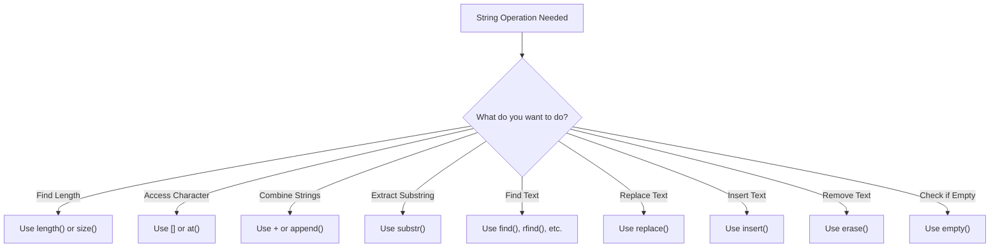

# C++ String Functions

## Introduction

Strings are one of the most commonly used data types in programming. In C++, the `std::string` class provides a rich set of functions for manipulating and working with text. Understanding these functions is essential for effective C++ programming, as they allow you to perform operations like searching, modifying, and comparing strings without having to implement these operations manually.

In this tutorial, we'll explore the most important string functions in C++, with clear examples and explanations to help you understand how to use them in your code.

## Prerequisites

Before diving into string functions, you should have:
- Basic knowledge of C++ syntax
- Understanding of variables and data types
- Familiarity with the concept of strings

## The std::string Class

In C++, the recommended way to work with strings is using the `std::string` class from the Standard Template Library (STL). This class is defined in the `<string>` header.

```cpp
#include <iostream>
#include <string>

int main() {
    std::string greeting = "Hello, World!";
    std::cout << greeting << std::endl;
    return 0;
}
```

**Output:**
```
Hello, World!
```

## Essential String Functions

### 1. String Length

To find the length of a string, use the `length()` or `size()` function (they are identical):

```cpp
#include <iostream>
#include <string>

int main() {
    std::string text = "C++ Programming";
    
    std::cout << "Length using length(): " << text.length() << std::endl;
    std::cout << "Length using size(): " << text.size() << std::endl;
    
    return 0;
}
```

**Output:**
```
Length using length(): 15
Length using size(): 15
```

### 2. Accessing Characters

You can access individual characters in a string using the array notation `[]` or the `at()` function:

```cpp
#include <iostream>
#include <string>

int main() {
    std::string language = "C++";
    
    // Using array notation
    std::cout << "First character: " << language[0] << std::endl;
    
    // Using at() function
    std::cout << "Second character: " << language.at(1) << std::endl;
    
    // The difference: at() performs bounds checking
    try {
        std::cout << language.at(10) << std::endl; // This will throw an exception
    } catch(const std::out_of_range& e) {
        std::cout << "Exception caught: " << e.what() << std::endl;
    }
    
    return 0;
}
```

**Output:**
```
First character: C
Second character: +
Exception caught: basic_string::at: __n (which is 10) >= this->size() (which is 3)
```

### 3. String Concatenation

You can combine strings using the `+` operator or the `append()` function:

```cpp
#include <iostream>
#include <string>

int main() {
    std::string first_name = "John";
    std::string last_name = "Doe";
    
    // Using + operator
    std::string full_name1 = first_name + " " + last_name;
    std::cout << "Full name (using +): " << full_name1 << std::endl;
    
    // Using append()
    std::string full_name2 = first_name;
    full_name2.append(" ").append(last_name);
    std::cout << "Full name (using append): " << full_name2 << std::endl;
    
    return 0;
}
```

**Output:**
```
Full name (using +): John Doe
Full name (using append): John Doe
```

### 4. Substring Extraction

To extract a portion of a string, use the `substr()` function:

```cpp
#include <iostream>
#include <string>

int main() {
    std::string sentence = "The quick brown fox jumps over the lazy dog";
    
    // substr(position, length)
    std::string word = sentence.substr(4, 5); // Starting at index 4, take 5 characters
    std::cout << "Extracted word: " << word << std::endl;
    
    // substr(position) - extracts from position to the end
    std::string end_part = sentence.substr(20);
    std::cout << "End part: " << end_part << std::endl;
    
    return 0;
}
```

**Output:**
```
Extracted word: quick
End part: jumps over the lazy dog
```

### 5. Finding Substrings

The `find()` function helps you locate substrings within a string:

```cpp
#include <iostream>
#include <string>

int main() {
    std::string text = "Programming in C++ is fun and challenging";
    
    // Find the position of "C++"
    size_t position = text.find("C++");
    
    if (position != std::string::npos) {
        std::cout << "Found 'C++' at position: " << position << std::endl;
    } else {
        std::cout << "'C++' not found" << std::endl;
    }
    
    // Find "Java" which doesn't exist in the string
    position = text.find("Java");
    
    if (position != std::string::npos) {
        std::cout << "Found 'Java' at position: " << position << std::endl;
    } else {
        std::cout << "'Java' not found" << std::endl;
    }
    
    return 0;
}
```

**Output:**
```
Found 'C++' at position: 15
'Java' not found
```

### 6. Replacing Substrings

The `replace()` function allows you to substitute parts of a string:

```cpp
#include <iostream>
#include <string>

int main() {
    std::string text = "I like Java programming";
    
    // replace(position, length, new_string)
    text.replace(7, 4, "C++");
    std::cout << "After replace: " << text << std::endl;
    
    return 0;
}
```

**Output:**
```
After replace: I like C++ programming
```

### 7. Inserting Text

You can insert text at a specific position using the `insert()` function:

```cpp
#include <iostream>
#include <string>

int main() {
    std::string sentence = "I learning programming";
    
    // Insert "am " at position 2
    sentence.insert(2, "am ");
    std::cout << "After insert: " << sentence << std::endl;
    
    return 0;
}
```

**Output:**
```
After insert: I am learning programming
```

### 8. Erasing Characters

To remove characters from a string, use the `erase()` function:

```cpp
#include <iostream>
#include <string>

int main() {
    std::string text = "Hello, beautiful world!";
    
    // erase(position, length)
    text.erase(7, 10); // Remove "beautiful "
    std::cout << "After erase: " << text << std::endl;
    
    return 0;
}
```

**Output:**
```
After erase: Hello, world!
```

### 9. Converting Case

C++ doesn't have built-in functions for case conversion in the string class, but you can use functions from the `<algorithm>` header:

```cpp
#include <iostream>
#include <string>
#include <algorithm>

int main() {
    std::string text = "Hello World";
    std::string lower_text = text;
    std::string upper_text = text;
    
    // Convert to lowercase
    std::transform(lower_text.begin(), lower_text.end(), lower_text.begin(), 
                   [](unsigned char c){ return std::tolower(c); });
    
    // Convert to uppercase
    std::transform(upper_text.begin(), upper_text.end(), upper_text.begin(), 
                   [](unsigned char c){ return std::toupper(c); });
    
    std::cout << "Original: " << text << std::endl;
    std::cout << "Lowercase: " << lower_text << std::endl;
    std::cout << "Uppercase: " << upper_text << std::endl;
    
    return 0;
}
```

**Output:**
```
Original: Hello World
Lowercase: hello world
Uppercase: HELLO WORLD
```

### 10. Checking if a String is Empty

Use the `empty()` function to check if a string contains no characters:

```cpp
#include <iostream>
#include <string>

int main() {
    std::string text1 = "Hello";
    std::string text2 = "";
    
    std::cout << "Text1 is " << (text1.empty() ? "empty" : "not empty") << std::endl;
    std::cout << "Text2 is " << (text2.empty() ? "empty" : "not empty") << std::endl;
    
    return 0;
}
```

**Output:**
```
Text1 is not empty
Text2 is empty
```

## Practical Examples

### Example 1: Simple Text Analyzer

This program counts the number of vowels, consonants, and special characters in a string:

```cpp
#include <iostream>
#include <string>
#include <cctype>

int main() {
    std::string text;
    int vowels = 0, consonants = 0, special = 0;
    
    std::cout << "Enter a string: ";
    std::getline(std::cin, text);
    
    for (char c : text) {
        // Convert to lowercase for easier checking
        char lower_c = std::tolower(c);
        
        if (std::isalpha(c)) {
            if (lower_c == 'a' || lower_c == 'e' || lower_c == 'i' || 
                lower_c == 'o' || lower_c == 'u') {
                vowels++;
            } else {
                consonants++;
            }
        } else {
            special++;
        }
    }
    
    std::cout << "Vowels: " << vowels << std::endl;
    std::cout << "Consonants: " << consonants << std::endl;
    std::cout << "Special characters: " << special << std::endl;
    
    return 0;
}
```

**Example Input/Output:**
```
Enter a string: Hello, World! 123
Vowels: 3
Consonants: 7
Special characters: 8
```

### Example 2: Simple Word Counter

This program counts the number of words in a sentence:

```cpp
#include <iostream>
#include <string>
#include <sstream>

int main() {
    std::string sentence;
    std::cout << "Enter a sentence: ";
    std::getline(std::cin, sentence);
    
    std::stringstream ss(sentence);
    std::string word;
    int count = 0;
    
    while (ss >> word) {
        count++;
    }
    
    std::cout << "Number of words: " << count << std::endl;
    
    return 0;
}
```

**Example Input/Output:**
```
Enter a sentence: The quick brown fox jumps over the lazy dog
Number of words: 9
```

### Example 3: Simple String Tokenizer

This program splits a comma-separated string into individual tokens:

```cpp
#include <iostream>
#include <string>
#include <vector>

int main() {
    std::string csv = "apple,banana,cherry,date,elderberry";
    std::vector<std::string> fruits;
    
    size_t pos = 0;
    std::string token;
    
    // Find each occurrence of delimiter and extract the token
    while ((pos = csv.find(',')) != std::string::npos) {
        token = csv.substr(0, pos);
        fruits.push_back(token);
        csv.erase(0, pos + 1);  // Erase the processed part including delimiter
    }
    
    // Don't forget the last token after the last delimiter
    fruits.push_back(csv);
    
    // Print all tokens
    std::cout << "Extracted fruits:" << std::endl;
    for (const auto& fruit : fruits) {
        std::cout << "- " << fruit << std::endl;
    }
    
    return 0;
}
```

**Output:**
```
Extracted fruits:
- apple
- banana
- cherry
- date
- elderberry
```

## String Function Comparison

Here's a diagram showing when to use different string functions:



## Summary

In this tutorial, we've covered the most commonly used string functions in C++:

- Length determination with `length()` and `size()`
- Character access with `[]` and `at()`
- String concatenation with `+` and `append()`
- Substring extraction with `substr()`
- Finding text with `find()`
- Replacing text with `replace()`
- Inserting text with `insert()`
- Removing text with `erase()`
- Checking if a string is empty with `empty()`

We've also explored practical examples to demonstrate how these functions can be used in real-world scenarios.

String manipulation is a fundamental skill in programming, and mastering these functions will help you handle text processing effectively in your C++ applications.

## Exercises

1. Write a program that reverses a string without using any built-in reverse function.
2. Create a program that counts the occurrences of a specific word in a text.
3. Implement a simple password validator that checks if a password:
   - Is at least 8 characters long
   - Contains at least one uppercase letter
   - Contains at least one lowercase letter
   - Contains at least one digit
4. Write a program that converts a sentence to "Title Case" (capitalize the first letter of each word).
5. Create a function that replaces all occurrences of a substring in a string with another substring.

## Additional Resources

- [C++ Reference - std::string](https://en.cppreference.com/w/cpp/string/basic_string)
- [C++ String Tutorials on cplusplus.com](http://www.cplusplus.com/reference/string/string/)
- [C++ String Algorithms](https://en.cppreference.com/w/cpp/algorithm)

Happy coding!