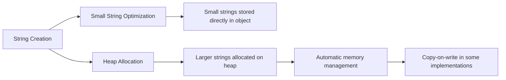

# C++ String Manipulation

## Introduction

String manipulation is a fundamental skill in programming. In C++, strings are sequences of characters that can be modified, searched, and transformed in various ways. Whether you're building a text editor, parsing data, or creating a user interface, understanding how to manipulate strings effectively is essential.

In this tutorial, we'll explore the `std::string` class from the C++ Standard Library, which provides powerful tools for working with text. We'll learn how to create strings, modify their contents, search within them, and transform them to meet our needs.

## String Basics

### Creating Strings

In C++, the most common way to work with strings is using the `std::string` class from the Standard Library.

```cpp
#include <iostream>
#include <string>

int main() {
    // Different ways to create strings
    std::string s1 = "Hello, World!";           // Using string literal
    std::string s2("C++ Programming");          // Using constructor
    std::string s3(5, 'A');                     // String with 5 'A' characters
    std::string s4 = s1;                        // Copy of another string
    
    // Output
    std::cout << "s1: " << s1 << std::endl;
    std::cout << "s2: " << s2 << std::endl;
    std::cout << "s3: " << s3 << std::endl;
    std::cout << "s4: " << s4 << std::endl;
    
    return 0;
}
```

**Output:**
```
s1: Hello, World!
s2: C++ Programming
s3: AAAAA
s4: Hello, World!
```

### Accessing Characters

You can access individual characters in a string using array-style indexing or the `at()` method:

```cpp
#include <iostream>
#include <string>

int main() {
    std::string message = "Hello";
    
    // Using array-style indexing
    std::cout << "First character: " << message[0] << std::endl;
    
    // Using at() method (safer, includes bounds checking)
    std::cout << "Last character: " << message.at(message.length() - 1) << std::endl;
    
    // Modifying characters
    message[0] = 'J';
    std::cout << "Modified message: " << message << std::endl;
    
    return 0;
}
```

**Output:**
```
First character: H
Last character: o
Modified message: Jello
```

:::caution
Using `[]` for accessing characters does not perform bounds checking. If you access an index that's out of range, it leads to undefined behavior. The `at()` method is safer as it throws an exception if the index is out of bounds.
:::

## String Modifications

### Concatenation

Combining strings (concatenation) is a common operation in string manipulation:

```cpp
#include <iostream>
#include <string>

int main() {
    std::string first = "Hello";
    std::string second = "World";
    
    // Using the + operator
    std::string combined = first + " " + second + "!";
    std::cout << "Combined: " << combined << std::endl;
    
    // Using the append() method
    std::string greeting = "Welcome to ";
    greeting.append("C++ programming");
    std::cout << "Greeting: " << greeting << std::endl;
    
    // Using the += operator
    std::string message = "Learn ";
    message += "C++ ";
    message += "today!";
    std::cout << "Message: " << message << std::endl;
    
    return 0;
}
```

**Output:**
```
Combined: Hello World!
Greeting: Welcome to C++ programming
Message: Learn C++ today!
```

### Substring Operations

You can extract parts of a string using the `substr()` method:

```cpp
#include <iostream>
#include <string>

int main() {
    std::string sentence = "The quick brown fox jumps over the lazy dog";
    
    // Extract a substring (starting position, length)
    std::string word = sentence.substr(4, 5);  // Extract "quick"
    std::cout << "Extracted word: " << word << std::endl;
    
    // Extract from position to the end
    std::string end_part = sentence.substr(20);
    std::cout << "End part: " << end_part << std::endl;
    
    return 0;
}
```

**Output:**
```
Extracted word: quick
End part: jumps over the lazy dog
```

### Inserting and Erasing

You can insert characters into a string or erase parts of it:

```cpp
#include <iostream>
#include <string>

int main() {
    std::string text = "The fox jumps.";
    
    // Insert at a specific position
    text.insert(4, "quick ");
    std::cout << "After insert: " << text << std::endl;
    
    // Insert a character multiple times
    text.insert(10, 5, '-');
    std::cout << "After inserting dashes: " << text << std::endl;
    
    // Erase a portion (start position, count)
    text.erase(10, 5);
    std::cout << "After erase: " << text << std::endl;
    
    return 0;
}
```

**Output:**
```
After insert: The quick fox jumps.
After inserting dashes: The quick -----fox jumps.
After erase: The quick fox jumps.
```

### Replacing

The `replace()` method allows you to replace parts of a string:

```cpp
#include <iostream>
#include <string>

int main() {
    std::string sentence = "The red car drove down the road.";
    
    // Replace a substring (position, length, new string)
    sentence.replace(4, 3, "blue");
    std::cout << "After replace: " << sentence << std::endl;
    
    // Replace all occurrences of "the" with "a"
    size_t pos = 0;
    while ((pos = sentence.find("the", pos)) != std::string::npos) {
        sentence.replace(pos, 3, "a");
        pos += 1;  // Move past the replaced string
    }
    
    std::cout << "After replacing all 'the': " << sentence << std::endl;
    
    return 0;
}
```

**Output:**
```
After replace: The blue car drove down the road.
After replacing all 'the': The blue car drove down a road.
```

## Searching in Strings

### Finding Substrings

The `find()` method helps you locate substrings within a string:

```cpp
#include <iostream>
#include <string>

int main() {
    std::string haystack = "The quick brown fox jumps over the lazy dog";
    
    // Find the first occurrence
    size_t pos = haystack.find("fox");
    if (pos != std::string::npos) {
        std::cout << "Found 'fox' at position: " << pos << std::endl;
    } else {
        std::cout << "'fox' not found" << std::endl;
    }
    
    // Find all occurrences of "the"
    pos = 0;
    while ((pos = haystack.find("the", pos)) != std::string::npos) {
        std::cout << "Found 'the' at position: " << pos << std::endl;
        pos++; // Move to the next character to continue searching
    }
    
    return 0;
}
```

**Output:**
```
Found 'fox' at position: 16
Found 'the' at position: 31
```

### Find First/Last of Characters

You can find the first or last occurrence of any character from a set:

```cpp
#include <iostream>
#include <string>

int main() {
    std::string text = "Hello, world! 123";
    
    // Find the first digit
    size_t pos = text.find_first_of("0123456789");
    if (pos != std::string::npos) {
        std::cout << "First digit found at position: " << pos << std::endl;
    }
    
    // Find the first non-alphanumeric character
    pos = text.find_first_not_of("abcdefghijklmnopqrstuvwxyzABCDEFGHIJKLMNOPQRSTUVWXYZ0123456789");
    if (pos != std::string::npos) {
        std::cout << "First non-alphanumeric character: '" << text[pos] << "' at position: " << pos << std::endl;
    }
    
    // Find the last letter
    pos = text.find_last_of("abcdefghijklmnopqrstuvwxyzABCDEFGHIJKLMNOPQRSTUVWXYZ");
    if (pos != std::string::npos) {
        std::cout << "Last letter: '" << text[pos] << "' at position: " << pos << std::endl;
    }
    
    return 0;
}
```

**Output:**
```
First digit found at position: 14
First non-alphanumeric character: ',' at position: 5
Last letter: 'd' at position: 12
```

## String Transformations

### Case Conversion

Although C++ doesn't have built-in methods for case conversion, you can use algorithms from the `<algorithm>` header:

```cpp
#include <iostream>
#include <string>
#include <algorithm>

int main() {
    std::string text = "Hello, World!";
    
    // Convert to uppercase
    std::string upper_text = text;
    std::transform(upper_text.begin(), upper_text.end(), upper_text.begin(), 
                   [](unsigned char c) { return std::toupper(c); });
    std::cout << "Uppercase: " << upper_text << std::endl;
    
    // Convert to lowercase
    std::string lower_text = text;
    std::transform(lower_text.begin(), lower_text.end(), lower_text.begin(), 
                   [](unsigned char c) { return std::tolower(c); });
    std::cout << "Lowercase: " << lower_text << std::endl;
    
    return 0;
}
```

**Output:**
```
Uppercase: HELLO, WORLD!
Lowercase: hello, world!
```

### Trimming Whitespace

Trimming whitespace is a common operation that requires custom implementation in C++:

```cpp
#include <iostream>
#include <string>
#include <algorithm>

// Function to trim leading whitespace
std::string ltrim(const std::string &s) {
    std::string result = s;
    result.erase(result.begin(), 
                 std::find_if(result.begin(), result.end(), 
                              [](unsigned char ch) { return !std::isspace(ch); }));
    return result;
}

// Function to trim trailing whitespace
std::string rtrim(const std::string &s) {
    std::string result = s;
    result.erase(std::find_if(result.rbegin(), result.rend(), 
                              [](unsigned char ch) { return !std::isspace(ch); }).base(), 
                 result.end());
    return result;
}

// Function to trim both ends
std::string trim(const std::string &s) {
    return rtrim(ltrim(s));
}

int main() {
    std::string text = "   Hello, World!   ";
    
    std::cout << "Original: '" << text << "'" << std::endl;
    std::cout << "Left trimmed: '" << ltrim(text) << "'" << std::endl;
    std::cout << "Right trimmed: '" << rtrim(text) << "'" << std::endl;
    std::cout << "Fully trimmed: '" << trim(text) << "'" << std::endl;
    
    return 0;
}
```

**Output:**
```
Original: '   Hello, World!   '
Left trimmed: 'Hello, World!   '
Right trimmed: '   Hello, World!'
Fully trimmed: 'Hello, World!'
```

## Real-World Applications

### Password Validation

Let's build a simple password validator that checks if a password meets certain criteria:

```cpp
#include <iostream>
#include <string>
#include <regex>

bool isValidPassword(const std::string& password) {
    // Check length
    if (password.length() < 8) {
        return false;
    }
    
    // Check for uppercase letter
    bool has_upper = false;
    for (char c : password) {
        if (std::isupper(c)) {
            has_upper = true;
            break;
        }
    }
    if (!has_upper) return false;
    
    // Check for digit
    bool has_digit = false;
    for (char c : password) {
        if (std::isdigit(c)) {
            has_digit = true;
            break;
        }
    }
    if (!has_digit) return false;
    
    // Check for special character
    bool has_special = false;
    std::string special_chars = "!@#$%^&*()-_=+[]{}|;:'\",.<>/?";
    for (char c : password) {
        if (special_chars.find(c) != std::string::npos) {
            has_special = true;
            break;
        }
    }
    
    return has_special;
}

int main() {
    std::string password;
    std::cout << "Enter a password: ";
    std::cin >> password;
    
    if (isValidPassword(password)) {
        std::cout << "Password is valid!" << std::endl;
    } else {
        std::cout << "Password must be at least 8 characters long and contain:" << std::endl;
        std::cout << "- At least one uppercase letter" << std::endl;
        std::cout << "- At least one digit" << std::endl;
        std::cout << "- At least one special character" << std::endl;
    }
    
    return 0;
}
```

**Example Input/Output:**
```
Enter a password: hello123
Password must be at least 8 characters long and contain:
- At least one uppercase letter
- At least one digit
- At least one special character

Enter a password: Hello123!
Password is valid!
```

### Text Processing: Word Counter

Here's a simple word counter application:

```cpp
#include <iostream>
#include <string>
#include <sstream>
#include <map>

void countWords(const std::string& text) {
    std::map<std::string, int> wordCount;
    std::stringstream ss(text);
    std::string word;
    int totalWords = 0;
    
    while (ss >> word) {
        // Remove punctuation at the end of words
        if (ispunct(word.back())) {
            word.pop_back();
        }
        
        // Convert to lowercase for case-insensitive counting
        std::transform(word.begin(), word.end(), word.begin(),
                      [](unsigned char c) { return std::tolower(c); });
        
        wordCount[word]++;
        totalWords++;
    }
    
    std::cout << "Total words: " << totalWords << std::endl;
    std::cout << "Unique words: " << wordCount.size() << std::endl;
    std::cout << "\nWord frequency:" << std::endl;
    
    for (const auto& pair : wordCount) {
        std::cout << pair.first << ": " << pair.second << std::endl;
    }
}

int main() {
    std::string text = "C++ is a powerful language. C++ is used in many applications. "
                        "Learning C++ opens many opportunities for programmers.";
    
    std::cout << "Text: " << text << std::endl << std::endl;
    countWords(text);
    
    return 0;
}
```

**Output:**
```
Text: C++ is a powerful language. C++ is used in many applications. Learning C++ opens many opportunities for programmers.

Total words: 19
Unique words: 14

Word frequency:
a: 1
applications: 1
c++: 3
for: 1
in: 1
is: 2
language: 1
learning: 1
many: 2
opens: 1
opportunities: 1
powerful: 1
programmers: 1
used: 1
```

## String Input/Output Operations

### Reading Strings

There are several ways to read strings in C++:

```cpp
#include <iostream>
#include <string>

int main() {
    std::string name;
    std::string description;
    
    // Reading a word (stops at whitespace)
    std::cout << "Enter your name: ";
    std::cin >> name;
    
    // Clear the input buffer
    std::cin.ignore(std::numeric_limits<std::streamsize>::max(), '\n');
    
    // Reading a full line
    std::cout << "Enter a brief description: ";
    std::getline(std::cin, description);
    
    std::cout << "Hello, " << name << "!" << std::endl;
    std::cout << "About you: " << description << std::endl;
    
    return 0;
}
```

**Example Input/Output:**
```
Enter your name: John
Enter a brief description: I am a software developer who loves C++.
Hello, John!
About you: I am a software developer who loves C++.
```

:::tip
When mixing `cin >>` with `getline()`, it's important to clear the input buffer using `cin.ignore()` to avoid skipping the `getline()` call.
:::

### Formatting Output

You can format string output using stream manipulators:

```cpp
#include <iostream>
#include <string>
#include <iomanip>

int main() {
    std::string names[] = {"Alice", "Bob", "Charlie", "David"};
    int scores[] = {95, 87, 92, 78};
    
    // Print a table with aligned columns
    std::cout << std::left << std::setw(15) << "Name" 
              << std::right << std::setw(10) << "Score" << std::endl;
    std::cout << std::string(25, '-') << std::endl;
    
    for (int i = 0; i < 4; i++) {
        std::cout << std::left << std::setw(15) << names[i] 
                  << std::right << std::setw(10) << scores[i] << std::endl;
    }
    
    return 0;
}
```

**Output:**
```
Name                 Score
-------------------------
Alice                    95
Bob                      87
Charlie                  92
David                    78
```

## Working with String Streams

String streams let you convert between strings and other data types:

```cpp
#include <iostream>
#include <string>
#include <sstream>
#include <vector>

int main() {
    // Converting numbers to string
    int num = 42;
    double pi = 3.14159;
    
    std::stringstream ss1;
    ss1 << "The answer is " << num << " and pi is approximately " << std::fixed << std::setprecision(2) << pi;
    std::string result = ss1.str();
    
    std::cout << result << std::endl;
    
    // Parsing from string
    std::string input = "10 20 30 40 50";
    std::stringstream ss2(input);
    
    std::vector<int> numbers;
    int value;
    
    while (ss2 >> value) {
        numbers.push_back(value);
    }
    
    std::cout << "Parsed numbers: ";
    for (int n : numbers) {
        std::cout << n << " ";
    }
    std::cout << std::endl;
    
    return 0;
}
```

**Output:**
```
The answer is 42 and pi is approximately 3.14
Parsed numbers: 10 20 30 40 50 
```

## String and Memory Management

Understanding how strings manage memory is important for efficient programming:



Most C++ string implementations use techniques like Small String Optimization (SSO) to avoid heap allocations for small strings, making operations more efficient.

## Summary

In this tutorial, we've covered the essentials of string manipulation in C++:

- Creating and accessing strings
- Modifying strings through concatenation, insertion, and replacement
- Searching within strings
- Transforming strings (case conversion, trimming)
- Real-world applications of string manipulation
- Input/output operations with strings
- Using string streams for conversions

String manipulation is a fundamental skill that you'll use in almost every C++ program. The `std::string` class provides a rich set of methods that make working with text easier and safer than using raw character arrays.

## Additional Resources

- [C++ Reference: std::string](https://en.cppreference.com/w/cpp/string/basic_string)
- [C++ String Algorithms](https://en.cppreference.com/w/cpp/algorithm)
- [C++ String Streams](https://en.cppreference.com/w/cpp/io/basic_stringstream)

## Exercises

1. **Word Reverser**: Write a program that reverses each word in a sentence while keeping the words in the same order.
   - Input: "Hello world programming"
   - Output: "olleH dlrow gnimmargorp"

2. **URL Parser**: Create a function that extracts the protocol, domain, and path from a URL string.
   - Example: From "https://www.example.com/page?id=123", extract:
     - Protocol: "https"
     - Domain: "www.example.com"
     - Path: "/page?id=123"

3. **CSV Parser**: Implement a simple CSV parser that reads a string in CSV format and converts it into a 2D vector of strings.

4. **String Compression**: Write a function that performs basic string compression by counting repeated characters.
   - Example: "aaabcccccaaa" should become "a3b1c5a3"

5. **Template Renderer**: Create a simple template engine that replaces placeholders in a string with actual values.
   - Example: `"Hello, {{name}}!" with {"name": "Alice"}` should become "Hello, Alice!"