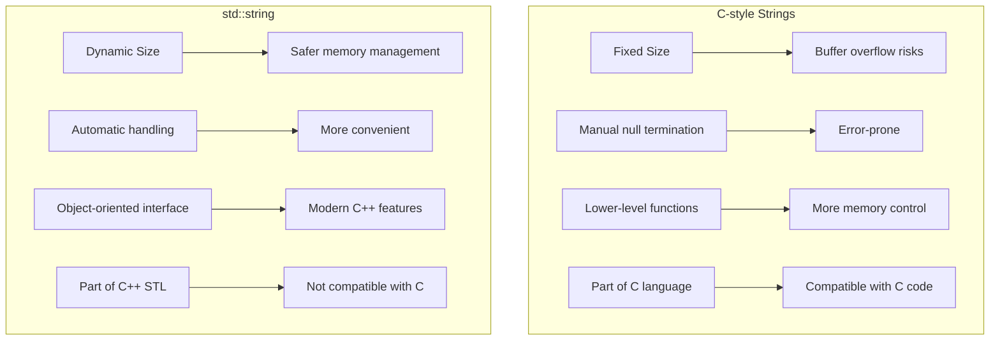

# C++ C-Style Strings

## Introduction

In C++, there are two ways to work with strings: using the modern `std::string` class from the Standard Library, and using the traditional C-style strings inherited from the C language. C-style strings are essentially character arrays with a special null character (`'\0'`) marking the end of the string. 

Despite the availability of the more convenient `std::string` class, understanding C-style strings is important for several reasons:

- Legacy code maintenance
- Interfacing with C libraries
- Understanding memory management
- Performance-critical applications
- Building a strong foundation in programming concepts

In this tutorial, we'll explore C-style strings in depth, including their declaration, initialization, manipulation, and common operations.

## What is a C-Style String?

A C-style string is an array of characters (`char`) that ends with a null character (`'\0'`). This null character serves as a terminator, indicating where the string ends.

```cpp
char greeting[6] = {'H', 'e', 'l', 'l', 'o', '\0'};
```

The null character is crucial - without it, it's just a character array, not a string. The system wouldn't know where the string ends when processing it.

## Declaring and Initializing C-Style Strings

There are several ways to declare and initialize C-style strings:

### Method 1: Individual Character Initialization

```cpp
char str[6] = {'H', 'e', 'l', 'l', 'o', '\0'};
```

### Method 2: String Literal (Compiler adds the null terminator)

```cpp
char str[6] = "Hello";
```

### Method 3: Let the Compiler Determine Size

```cpp
char str[] = "Hello"; // Compiler allocates 6 characters (including '\0')
```

### Method 4: Using String Pointers

```cpp
const char* str = "Hello"; // Points to a string literal in read-only memory
```

Let's see these methods in action:

```cpp
#include <iostream>

int main() {
    // Method 1: Individual characters
    char str1[6] = {'H', 'e', 'l', 'l', 'o', '\0'};
    
    // Method 2: String literal with specified size
    char str2[6] = "Hello";
    
    // Method 3: Compiler determines size
    char str3[] = "Hello";
    
    // Method 4: String pointer
    const char* str4 = "Hello";
    
    // Display all strings
    std::cout << "str1: " << str1 << std::endl;
    std::cout << "str2: " << str2 << std::endl;
    std::cout << "str3: " << str3 << std::endl;
    std::cout << "str4: " << str4 << std::endl;
    
    return 0;
}
```

**Output:**
```
str1: Hello
str2: Hello
str3: Hello
str4: Hello
```

## Important Considerations

### 1. Memory Allocation

When declaring a character array for a string, you must allocate enough space for all characters *plus* the null terminator:

```cpp
char name[10] = "John"; // Can store strings up to 9 characters (plus '\0')
```

### 2. String Termination

Always ensure your C-style strings are properly null-terminated. Missing the null terminator can lead to undefined behavior:

```cpp
char bad_str[5] = {'H', 'e', 'l', 'l', 'o'}; // Missing '\0', not a proper string
char good_str[6] = {'H', 'e', 'l', 'l', 'o', '\0'}; // Properly terminated
```

### 3. Memory Overflow

Be careful not to exceed the allocated size:

```cpp
char small[5];
// The following can cause buffer overflow (dangerous!)
// small = "Hello, World!"; // Incorrect and won't compile
strcpy(small, "Hello, World!"); // This will compile but overflow the buffer
```

## String Input and Output

### Reading Strings

You can read C-style strings using `cin`, but it has limitations:

```cpp
#include <iostream>

int main() {
    char name[50];
    std::cout << "Enter your name: ";
    std::cin >> name;  // Only reads until the first whitespace
    std::cout << "Hello, " << name << "!" << std::endl;
    
    return 0;
}
```

**Input:** `John Doe`  
**Output:** `Hello, John!`

Notice that only "John" was stored because `cin` stops reading at whitespace.

### Reading Whole Lines

To read entire lines including spaces, use `cin.getline()`:

```cpp
#include <iostream>

int main() {
    char fullName[50];
    std::cout << "Enter your full name: ";
    std::cin.getline(fullName, 50);  // Reads up to 49 characters or until newline
    std::cout << "Hello, " << fullName << "!" << std::endl;
    
    return 0;
}
```

**Input:** `John Doe`  
**Output:** `Hello, John Doe!`

## C-Style String Manipulation

C++ provides a set of functions in the `<cstring>` header for manipulating C-style strings.

### String Length - `strlen()`

Returns the length of a string (not counting the null terminator):

```cpp
#include <iostream>
#include <cstring>

int main() {
    char greeting[] = "Hello, World!";
    std::cout << "Length: " << strlen(greeting) << std::endl;
    
    return 0;
}
```

**Output:** `Length: 13`

### String Copy - `strcpy()` and `strncpy()`

Copies one string to another:

```cpp
#include <iostream>
#include <cstring>

int main() {
    char source[] = "Hello, World!";
    char destination[20];
    
    // Copy source to destination
    strcpy(destination, source);
    std::cout << "After strcpy(): " << destination << std::endl;
    
    // Safer version with size limit
    char limited[10];
    strncpy(limited, source, 9);
    limited[9] = '\0';  // Always add null terminator when using strncpy
    std::cout << "After strncpy(): " << limited << std::endl;
    
    return 0;
}
```

**Output:**
```
After strcpy(): Hello, World!
After strncpy(): Hello, Wo
```

### String Concatenation - `strcat()` and `strncat()`

Appends one string to another:

```cpp
#include <iostream>
#include <cstring>

int main() {
    char greeting[50] = "Hello";
    char name[] = ", John!";
    
    // Concatenate name to greeting
    strcat(greeting, name);
    std::cout << "After strcat(): " << greeting << std::endl;
    
    // Safer version with size limit
    char limited[15] = "Hi";
    strncat(limited, ", World!!!!!!", 9);  // Limits appended characters
    std::cout << "After strncat(): " << limited << std::endl;
    
    return 0;
}
```

**Output:**
```
After strcat(): Hello, John!
After strncat(): Hi, World!!
```

### String Comparison - `strcmp()` and `strncmp()`

Compares two strings:

```cpp
#include <iostream>
#include <cstring>

int main() {
    char str1[] = "apple";
    char str2[] = "banana";
    char str3[] = "apple";
    
    std::cout << "Comparing 'apple' and 'banana': " << strcmp(str1, str2) << std::endl;
    std::cout << "Comparing 'apple' and 'apple': " << strcmp(str1, str3) << std::endl;
    std::cout << "Comparing 'banana' and 'apple': " << strcmp(str2, str1) << std::endl;
    
    // Compare only first 3 characters
    std::cout << "Comparing first 3 chars of 'apple' and 'application': " 
              << strncmp(str1, "application", 3) << std::endl;
    
    return 0;
}
```

**Output:**
```
Comparing 'apple' and 'banana': -1
Comparing 'apple' and 'apple': 0
Comparing 'banana' and 'apple': 1
Comparing first 3 chars of 'apple' and 'application': 0
```

The return value of `strcmp()` is:
- 0 if strings are equal
- Negative if first string comes before second string alphabetically
- Positive if first string comes after second string alphabetically

### String Search - `strchr()` and `strstr()`

Find characters or substrings:

```cpp
#include <iostream>
#include <cstring>

int main() {
    char text[] = "Hello, World! Welcome to C++";
    
    // Find first occurrence of a character
    char* charPos = strchr(text, 'o');
    if (charPos != nullptr) {
        std::cout << "First 'o' found at position: " << (charPos - text) << std::endl;
        std::cout << "Substring from 'o': " << charPos << std::endl;
    }
    
    // Find first occurrence of a substring
    char* substrPos = strstr(text, "World");
    if (substrPos != nullptr) {
        std::cout << "Substring 'World' found at position: " << (substrPos - text) << std::endl;
        std::cout << "Substring from 'World': " << substrPos << std::endl;
    }
    
    return 0;
}
```

**Output:**
```
First 'o' found at position: 4
Substring from 'o': o, World! Welcome to C++
Substring 'World' found at position: 7
Substring from 'World': World! Welcome to C++
```

## Converting Between Numbers and Strings

### String to Numeric Conversion

The `<cstdlib>` header provides functions to convert strings to numbers:

```cpp
#include <iostream>
#include <cstdlib>

int main() {
    char numStr1[] = "123";
    char numStr2[] = "123.456";
    char numStr3[] = "0xFF"; // Hexadecimal
    
    // String to int
    int num1 = atoi(numStr1);
    std::cout << "atoi(\"123\"): " << num1 << std::endl;
    
    // String to double
    double num2 = atof(numStr2);
    std::cout << "atof(\"123.456\"): " << num2 << std::endl;
    
    // String to long with base specification
    long num3 = strtol(numStr3, nullptr, 16); // Convert from base 16
    std::cout << "strtol(\"0xFF\", nullptr, 16): " << num3 << std::endl;
    
    return 0;
}
```

**Output:**
```
atoi("123"): 123
atof("123.456"): 123.456
strtol("0xFF", nullptr, 16): 255
```

### Numeric to String Conversion

The `<cstdio>` header provides `sprintf()` for converting numbers to strings:

```cpp
#include <iostream>
#include <cstdio>

int main() {
    char buffer[50];
    
    // Convert int to string
    int num1 = 123;
    sprintf(buffer, "%d", num1);
    std::cout << "sprintf(\"%d\", 123): " << buffer << std::endl;
    
    // Convert float to string with formatting
    double num2 = 123.456;
    sprintf(buffer, "%.2f", num2);
    std::cout << "sprintf(\"%.2f\", 123.456): " << buffer << std::endl;
    
    // Multiple values to string
    sprintf(buffer, "Int: %d, Double: %.1f", num1, num2);
    std::cout << "Formatted string: " << buffer << std::endl;
    
    return 0;
}
```

**Output:**
```
sprintf("%d", 123): 123
sprintf("%.2f", 123.456): 123.46
Formatted string: Int: 123, Double: 123.5
```

## Practical Example: Simple String Parser

Let's create a practical example that parses a comma-separated string into individual components:

```cpp
#include <iostream>
#include <cstring>

int main() {
    // A CSV-like string
    char data[] = "John,Doe,35,New York";
    
    // Create a copy to work with (strtok modifies the string)
    char dataCopy[50];
    strcpy(dataCopy, data);
    
    // Parse the string
    char* token = strtok(dataCopy, ",");
    
    // Variables to store parsed data
    char firstName[20], lastName[20], age[5], city[30];
    
    // Extract first name
    if (token != nullptr) {
        strcpy(firstName, token);
        token = strtok(nullptr, ",");
    }
    
    // Extract last name
    if (token != nullptr) {
        strcpy(lastName, token);
        token = strtok(nullptr, ",");
    }
    
    // Extract age
    if (token != nullptr) {
        strcpy(age, token);
        token = strtok(nullptr, ",");
    }
    
    // Extract city
    if (token != nullptr) {
        strcpy(city, token);
    }
    
    // Display the parsed information
    std::cout << "Original String: " << data << std::endl;
    std::cout << "Parsed Information:" << std::endl;
    std::cout << "First Name: " << firstName << std::endl;
    std::cout << "Last Name: " << lastName << std::endl;
    std::cout << "Age: " << age << std::endl;
    std::cout << "City: " << city << std::endl;
    
    // Convert age to integer and perform a calculation
    int ageValue = atoi(age);
    int yearOfBirth = 2023 - ageValue; // Assuming current year is 2023
    
    std::cout << "Year of Birth (approx.): " << yearOfBirth << std::endl;
    
    return 0;
}
```

**Output:**
```
Original String: John,Doe,35,New York
Parsed Information:
First Name: John
Last Name: Doe
Age: 35
City: New York
Year of Birth (approx.): 1988
```

## Comparison with std::string

Here's a quick comparison between C-style strings and `std::string`:



While `std::string` is generally recommended for modern C++ programming, understanding C-style strings is still valuable knowledge.

## Common Pitfalls and How to Avoid Them

### 1. Buffer Overflow

**Problem:** Writing beyond the allocated array size.

**Solution:** Always ensure you have enough space, and use the `n` variants of string functions (`strncpy`, `strncat`, etc.) that limit the number of characters processed.

### 2. Missing Null Terminator

**Problem:** Forgetting to include the null terminator.

**Solution:** Always allocate one extra character for the null terminator and ensure it's properly set, especially when using `strncpy()`.

### 3. String Modification

**Problem:** Attempting to modify string literals.

**Solution:** If you need to modify a string, make sure it's stored in a modifiable array:

```cpp
// INCORRECT - will likely cause a runtime error
const char* str = "Hello";
str[0] = 'J';  // Trying to modify a string literal

// CORRECT
char str[] = "Hello";
str[0] = 'J';  // OK because str is an array, not a pointer to a literal
```

### 4. Memory Leaks in Dynamic Strings

**Problem:** Not freeing memory allocated for strings.

**Solution:** Always free dynamically allocated memory:

```cpp
char* dynamicStr = new char[100];
strcpy(dynamicStr, "Hello, World!");
// Use the string...
delete[] dynamicStr;  // Free the memory when done
```

## Summary

C-style strings are an important concept in C++ programming, especially when working with legacy code or interfacing with C libraries. Key points to remember:

- C-style strings are character arrays that end with the null character (`'\0'`)
- They require careful memory management to avoid buffer overflows
- The `<cstring>` library provides functions for string manipulation
- While `std::string` is often more convenient, understanding C-style strings builds a strong foundation

By mastering C-style strings, you'll gain a deeper understanding of how strings work at a low level, which will make you a more effective C++ programmer.

## Exercises

1. Write a program that reverses a C-style string in place (without using additional strings).
2. Create a function that counts the occurrences of a specific character in a C-style string.
3. Implement a simple string tokenizer that splits a sentence into words.
4. Write a program that converts a C-style string to uppercase without using built-in functions.
5. Create a simple encryption/decryption program using C-style strings.

## Further Resources

- [C++ Reference - cstring](https://en.cppreference.com/w/cpp/header/cstring)
- [C++ Reference - cstdio](https://en.cppreference.com/w/cpp/header/cstdio)
- [C++ Reference - cstdlib](https://en.cppreference.com/w/cpp/header/cstdlib)
- "The C Programming Language" by Kernighan and Ritchie
- "Effective C++" by Scott Meyers