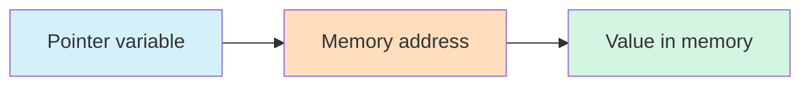

# C++ Pointers Basics

## Introduction

Pointers are one of the most powerful yet challenging concepts to grasp in C++. At their core, pointers are variables that store memory addresses instead of actual values. They provide direct access to memory, allowing for more efficient code and enabling features like dynamic memory allocation, data structures, and function callbacks.

In this tutorial, we'll explore the fundamentals of C++ pointers, from declaration to practical applications, with easy-to-follow examples.

## What Are Pointers?

In your computer, every variable you create occupies a specific location in memory. A pointer is simply a variable that contains the memory address of another variable.



This indirection gives pointers their power and flexibility.

## Declaring and Initializing Pointers

### Pointer Declaration Syntax

To declare a pointer in C++, you use the asterisk (`*`) symbol:

```cpp
data_type *pointer_name;
```

For example:

```cpp
int *ptr;       // A pointer to an integer
double *dptr;   // A pointer to a double
char *cptr;     // A pointer to a character
```

### Initializing Pointers

You can initialize a pointer with the address of another variable using the address-of operator (`&`):

```cpp
#include <iostream>
using namespace std;

int main() {
    int num = 42;      // A normal integer variable
    int *ptr = &num;   // Pointer initialized with address of num
    
    cout << "Value of num: " << num << endl;
    cout << "Address of num: " << &num << endl;
    cout << "Value stored in ptr: " << ptr << endl;
    
    return 0;
}
```

**Output:**
```
Value of num: 42
Address of num: 0x7ffd4573c52c (this will be different on your computer)
Value stored in ptr: 0x7ffd4573c52c (same as the address of num)
```

In this example, `ptr` does not contain the value `42`. Instead, it contains the memory address where `42` is stored.

## Dereferencing Pointers

Dereferencing is the process of accessing the value at the memory address stored in a pointer. We use the dereference operator (`*`) for this:

```cpp
#include <iostream>
using namespace std;

int main() {
    int num = 42;
    int *ptr = &num;
    
    cout << "Value of num: " << num << endl;
    cout << "Value pointed to by ptr: " << *ptr << endl;
    
    // Changing the value using the pointer
    *ptr = 100;
    
    cout << "New value of num: " << num << endl;
    cout << "New value pointed to by ptr: " << *ptr << endl;
    
    return 0;
}
```

**Output:**
```
Value of num: 42
Value pointed to by ptr: 42
New value of num: 100
New value pointed to by ptr: 100
```

When we modify `*ptr`, we're actually modifying the value at the memory location that `ptr` points to, which is the variable `num`.

## The Null Pointer

A null pointer is a pointer that doesn't point to any memory location. It's a good practice to initialize pointers to `nullptr` (or `NULL` in older C++ code) if you're not immediately assigning them a valid address:

```cpp
#include <iostream>
using namespace std;

int main() {
    int *ptr = nullptr;  // Modern C++ null pointer
    
    if (ptr == nullptr) {
        cout << "This is a null pointer." << endl;
    }
    
    // Attempting to dereference a null pointer would cause a crash
    // *ptr = 100;  // This would cause a segmentation fault/access violation
    
    return 0;
}
```

**Output:**
```
This is a null pointer.
```

## Pointer Arithmetic

C++ allows you to perform arithmetic operations on pointers. This feature is particularly useful when working with arrays:

```cpp
#include <iostream>
using namespace std;

int main() {
    int numbers[] = {10, 20, 30, 40, 50};
    int *ptr = numbers;  // Points to the first element of the array
    
    cout << "First element: " << *ptr << endl;          // Outputs 10
    
    ptr++;  // Moves to the next integer in memory
    cout << "Second element: " << *ptr << endl;         // Outputs 20
    
    ptr += 2;  // Moves forward by 2 integers
    cout << "Fourth element: " << *ptr << endl;         // Outputs 40
    
    ptr--;  // Moves back by 1 integer
    cout << "Third element: " << *ptr << endl;          // Outputs 30
    
    return 0;
}
```

**Output:**
```
First element: 10
Second element: 20
Fourth element: 40
Third element: 30
```

Note that pointer arithmetic takes the size of the data type into account. When you increment an `int` pointer, it advances by 4 bytes (on most systems) because that's the size of an `int`.

## Pointers and Arrays

In C++, there's a close relationship between pointers and arrays:

```cpp
#include <iostream>
using namespace std;

int main() {
    int numbers[5] = {10, 20, 30, 40, 50};
    int *ptr = numbers;  // No need for &numbers - array name is already a pointer
    
    // Two ways to access elements
    for(int i = 0; i < 5; i++) {
        cout << "Element " << i << " using array notation: " << numbers[i] << endl;
        cout << "Element " << i << " using pointer notation: " << *(ptr + i) << endl;
    }
    
    return 0;
}
```

**Output:**
```
Element 0 using array notation: 10
Element 0 using pointer notation: 10
Element 1 using array notation: 20
Element 1 using pointer notation: 20
Element 2 using array notation: 30
Element 2 using pointer notation: 30
Element 3 using array notation: 40
Element 3 using pointer notation: 40
Element 4 using array notation: 50
Element 4 using pointer notation: 50
```

This example demonstrates that array notation (`numbers[i]`) and pointer notation (`*(ptr + i)`) can be used interchangeably.

## Pointers and Functions

### Passing Pointers to Functions

Passing pointers to functions allows the function to modify the original variable:

```cpp
#include <iostream>
using namespace std;

// Function that modifies the value through a pointer
void modifyValue(int *ptr) {
    *ptr = *ptr * 2;  // Double the value
}

int main() {
    int num = 10;
    cout << "Original value: " << num << endl;
    
    modifyValue(&num);  // Pass the address of num
    
    cout << "Modified value: " << num << endl;
    
    return 0;
}
```

**Output:**
```
Original value: 10
Modified value: 20
```

### Returning Pointers from Functions

Functions can also return pointers:

```cpp
#include <iostream>
using namespace std;

// Function that returns a pointer to the larger of two integers
int* getLarger(int *a, int *b) {
    if(*a > *b) {
        return a;
    } else {
        return b;
    }
}

int main() {
    int x = 100;
    int y = 200;
    
    int *larger = getLarger(&x, &y);
    
    cout << "The larger value is: " << *larger << endl;
    
    return 0;
}
```

**Output:**
```
The larger value is: 200
```

## Real-World Application: Dynamic Memory Allocation

One of the most important uses of pointers is dynamic memory allocation, which allows programs to request memory during runtime:

```cpp
#include <iostream>
using namespace std;

int main() {
    // Get the size from user
    int size;
    cout << "Enter the number of elements: ";
    cin >> size;
    
    // Dynamically allocate an array
    int *dynamicArray = new int[size];
    
    // Fill the array with values
    cout << "Enter " << size << " integers:" << endl;
    for(int i = 0; i < size; i++) {
        cin >> dynamicArray[i];
    }
    
    // Calculate sum of elements
    int sum = 0;
    for(int i = 0; i < size; i++) {
        sum += dynamicArray[i];
    }
    
    cout << "Sum of all elements: " << sum << endl;
    
    // Free the allocated memory
    delete[] dynamicArray;
    
    return 0;
}
```

**Example Input:**
```
Enter the number of elements: 4
Enter 4 integers:
10 20 30 40
```

**Output:**
```
Sum of all elements: 100
```

This example demonstrates creating an array whose size is determined at runtime (not compile time) and then properly freeing the memory when done.

## Common Pointer Mistakes

### Dereferencing Null or Uninitialized Pointers

```cpp
int *ptr;  // Uninitialized - contains garbage address
*ptr = 10;  // DANGEROUS: could corrupt memory or crash program

int *ptr2 = nullptr;
*ptr2 = 20;  // DANGEROUS: will cause a program crash
```

### Memory Leaks

```cpp
void leakyFunction() {
    int *ptr = new int;  // Allocate memory
    *ptr = 42;
    // Function ends without 'delete ptr' - memory leak!
}
```

Always `delete` memory that was allocated with `new`.

### Dangling Pointers

```cpp
int *ptr = new int;
delete ptr;  // Memory freed
*ptr = 10;   // DANGEROUS: ptr is now a dangling pointer
```

After deletion, set the pointer to `nullptr` to avoid accidental use.

## Summary

Pointers are powerful tools in C++ that allow for direct memory manipulation. In this tutorial, we covered:

- What pointers are and how they work
- Declaring and initializing pointers
- Dereferencing pointers to access and modify values
- Null pointers and their importance
- Pointer arithmetic and its relationship with arrays
- Using pointers with functions
- Dynamic memory allocation using pointers
- Common mistakes to avoid when working with pointers

Understanding pointers is essential for becoming proficient in C++, as they enable advanced features and optimizations that wouldn't otherwise be possible.

## Exercises

1. Write a program that swaps two integers using pointers.
2. Create a function that takes an array and its size as parameters, then reverses the array in place using pointer notation only.
3. Write a program that dynamically allocates memory for a structure containing student information (name, ID, grade), then frees the memory properly.
4. Implement a function that takes a string and returns a pointer to the first occurrence of a space character.
5. Create a program that uses pointers to find both the minimum and maximum values in an array with a single function.

## Additional Resources

- [CPlusPlus.com - Pointers](http://www.cplusplus.com/doc/tutorial/pointers/)
- [GeeksforGeeks - C++ Pointers](https://www.geeksforgeeks.org/cpp-pointers/)
- [C++ Reference - Pointers](https://en.cppreference.com/w/cpp/language/pointer)
- Book: "Effective C++" by Scott Meyers, which covers proper use of pointers and memory management

Remember, mastering pointers takes practice. Start with simple examples and gradually work your way to more complex applications!