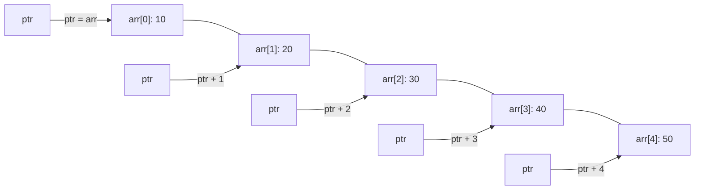

# C++ Pointer Arithmetic

## Introduction

Pointer arithmetic is one of the most powerful yet potentially confusing aspects of C++ programming. Unlike regular arithmetic which operates on values, pointer arithmetic operates on memory addresses. Understanding how to manipulate pointers through arithmetic operations allows you to navigate through arrays, implement data structures, and optimize your code.

In this tutorial, we'll explore how pointer arithmetic works in C++, the rules that govern it, and how you can apply it in practical scenarios.

## What is Pointer Arithmetic?

Pointer arithmetic refers to the operations (addition, subtraction, comparison) that can be performed on pointers. Unlike regular arithmetic, pointer arithmetic takes into account the size of the data type the pointer is pointing to.

The primary operations in pointer arithmetic are:

1. Adding an integer to a pointer
2. Subtracting an integer from a pointer
3. Subtracting one pointer from another
4. Comparing pointers

Let's explore each of these operations in detail.

## Basic Pointer Arithmetic

### Adding an Integer to a Pointer

When you add an integer `n` to a pointer, the pointer is incremented by `n * sizeof(data_type)` bytes.

```cpp
#include <iostream>
using namespace std;

int main() {
    int arr[5] = {10, 20, 30, 40, 50};
    int *ptr = arr;  // ptr points to the first element of arr
    
    cout << "Address of ptr: " << ptr << endl;
    cout << "Value at ptr: " << *ptr << endl;
    
    ptr = ptr + 2;  // Move pointer 2 integers forward
    
    cout << "Address of ptr after ptr + 2: " << ptr << endl;
    cout << "Value at ptr after ptr + 2: " << *ptr << endl;
    
    return 0;
}
```

Output:
```
Address of ptr: 0x7ffd4c1e2a50
Value at ptr: 10
Address of ptr after ptr + 2: 0x7ffd4c1e2a58
Value at ptr after ptr + 2: 30
```

Note that the address increased by 8 bytes (from 0x7ffd4c1e2a50 to 0x7ffd4c1e2a58), which is `2 * sizeof(int)`. On most systems, an integer is 4 bytes, so the pointer moved 8 bytes forward in memory.

### Subtracting an Integer from a Pointer

Similarly, when you subtract an integer from a pointer, the pointer is decremented by the corresponding number of bytes.

```cpp
#include <iostream>
using namespace std;

int main() {
    int arr[5] = {10, 20, 30, 40, 50};
    int *ptr = &arr[3];  // ptr points to the fourth element of arr (value 40)
    
    cout << "Address of ptr: " << ptr << endl;
    cout << "Value at ptr: " << *ptr << endl;
    
    ptr = ptr - 2;  // Move pointer 2 integers backward
    
    cout << "Address of ptr after ptr - 2: " << ptr << endl;
    cout << "Value at ptr after ptr - 2: " << *ptr << endl;
    
    return 0;
}
```

Output:
```
Address of ptr: 0x7ffd4c1e2a5c
Value at ptr: 40
Address of ptr after ptr - 2: 0x7ffd4c1e2a54
Value at ptr after ptr - 2: 20
```

### Increment and Decrement Operators

The increment (`++`) and decrement (`--`) operators can also be used with pointers. They work the same way as adding or subtracting 1 from the pointer.

```cpp
#include <iostream>
using namespace std;

int main() {
    int arr[5] = {10, 20, 30, 40, 50};
    int *ptr = arr;  // ptr points to the first element of arr
    
    cout << "Initial value: " << *ptr << endl;
    
    ptr++;  // Move to next integer
    cout << "After ptr++: " << *ptr << endl;
    
    ptr--;  // Move back to previous integer
    cout << "After ptr--: " << *ptr << endl;
    
    return 0;
}
```

Output:
```
Initial value: 10
After ptr++: 20
After ptr--: 10
```

## Subtracting Pointers

When you subtract one pointer from another, the result is the number of elements between them (not the number of bytes).

```cpp
#include <iostream>
using namespace std;

int main() {
    int arr[5] = {10, 20, 30, 40, 50};
    int *ptr1 = arr;        // points to the first element
    int *ptr2 = &arr[4];    // points to the fifth element
    
    ptrdiff_t diff = ptr2 - ptr1;
    
    cout << "Difference between pointers: " << diff << " elements" << endl;
    cout << "Difference in bytes: " << diff * sizeof(int) << " bytes" << endl;
    
    return 0;
}
```

Output:
```
Difference between pointers: 4 elements
Difference in bytes: 16 bytes
```

Note that we use the `ptrdiff_t` type, which is specifically designed to store the result of pointer subtraction.

## Comparing Pointers

Pointers can be compared using the standard comparison operators (`==`, `!=`, `<`, `>`, `<=`, `>=`). This is useful for comparing the relative positions of pointers within the same array.

```cpp
#include <iostream>
using namespace std;

int main() {
    int arr[5] = {10, 20, 30, 40, 50};
    int *ptr1 = arr;        // points to the first element
    int *ptr2 = &arr[3];    // points to the fourth element
    
    if (ptr1 < ptr2) {
        cout << "ptr1 points to an element that comes before ptr2" << endl;
    } else {
        cout << "ptr1 points to an element that comes after ptr2" << endl;
    }
    
    return 0;
}
```

Output:
```
ptr1 points to an element that comes before ptr2
```

## Practical Applications of Pointer Arithmetic

### Traversing Arrays

One of the most common uses of pointer arithmetic is to traverse arrays:

```cpp
#include <iostream>
using namespace std;

int main() {
    int arr[5] = {10, 20, 30, 40, 50};
    int *ptr = arr;
    
    cout << "Array traversal using pointer arithmetic:" << endl;
    
    for (int i = 0; i < 5; i++) {
        cout << "Element " << i << ": " << *(ptr + i) << endl;
    }
    
    // Alternative method
    cout << "\nAlternative method:" << endl;
    ptr = arr;  // Reset pointer to start of array
    
    for (int i = 0; i < 5; i++) {
        cout << "Element " << i << ": " << *ptr << endl;
        ptr++;
    }
    
    return 0;
}
```

Output:
```
Array traversal using pointer arithmetic:
Element 0: 10
Element 1: 20
Element 2: 30
Element 3: 40
Element 4: 50

Alternative method:
Element 0: 10
Element 1: 20
Element 2: 30
Element 3: 40
Element 4: 50
```

### Processing Strings

Pointer arithmetic is widely used for string manipulation:

```cpp
#include <iostream>
#include <cstring>
using namespace std;

int main() {
    const char *str = "Hello, World!";
    
    // Calculate string length using pointer arithmetic
    const char *end = str;
    while (*end != '\0') {
        end++;
    }
    
    cout << "String: " << str << endl;
    cout << "Length: " << end - str << endl;
    
    // Print each character with its position
    cout << "Characters and positions:" << endl;
    for (const char *ptr = str; *ptr != '\0'; ptr++) {
        cout << "Position " << ptr - str << ": '" << *ptr << "'" << endl;
    }
    
    return 0;
}
```

Output:
```
String: Hello, World!
Length: 13
Characters and positions:
Position 0: 'H'
Position 1: 'e'
Position 2: 'l'
Position 3: 'l'
Position 4: 'o'
Position 5: ','
Position 6: ' '
Position 7: 'W'
Position 8: 'o'
Position 9: 'r'
Position 10: 'l'
Position 11: 'd'
Position 12: '!'
```

### Implementing Data Structures

Pointer arithmetic is essential for implementing dynamic data structures like linked lists:

```cpp
#include <iostream>
using namespace std;

struct Node {
    int data;
    Node* next;
    
    Node(int value) : data(value), next(nullptr) {}
};

void printList(Node* head) {
    Node* current = head;
    while (current != nullptr) {
        cout << current->data;
        current = current->next;
        if (current != nullptr) {
            cout << " -> ";
        }
    }
    cout << endl;
}

int main() {
    // Create a simple linked list: 10 -> 20 -> 30
    Node* head = new Node(10);
    head->next = new Node(20);
    head->next->next = new Node(30);
    
    cout << "Linked list: ";
    printList(head);
    
    // Clean up memory
    Node* current = head;
    while (current != nullptr) {
        Node* temp = current;
        current = current->next;
        delete temp;
    }
    
    return 0;
}
```

Output:
```
Linked list: 10 -> 20 -> 30
```

## Potential Pitfalls and Warnings

While pointer arithmetic is powerful, it can lead to dangerous bugs if used incorrectly:

1. **Array bounds violations**: Adding or subtracting values that cause a pointer to point outside the bounds of an array can lead to undefined behavior.

2. **Invalid pointer arithmetic**: Performing arithmetic on pointers that don't point to array elements can cause problems.

3. **Arithmetic on pointers to different arrays**: Comparing or subtracting pointers to different arrays is undefined behavior.

```cpp
#include <iostream>
using namespace std;

int main() {
    int arr[5] = {10, 20, 30, 40, 50};
    int *ptr = arr;
    
    // DANGEROUS: Going beyond array bounds
    ptr = ptr + 10;  // ptr points to an invalid memory location
    
    // DANGEROUS: Dereferencing an invalid pointer
    // cout << *ptr << endl;  // This could crash your program or cause undefined behavior
    
    cout << "This example demonstrates dangerous pointer operations" << endl;
    cout << "The commented-out line would likely crash the program" << endl;
    
    return 0;
}
```

Output:
```
This example demonstrates dangerous pointer operations
The commented-out line would likely crash the program
```

## Visualizing Pointer Arithmetic

Let's visualize how pointer arithmetic works with a memory diagram:



## Summary

Pointer arithmetic is a fundamental concept in C++ that allows precise memory manipulation. Key points to remember:

1. When adding or subtracting an integer `n` from a pointer, the actual memory address changes by `n * sizeof(data_type)` bytes.

2. Pointer subtraction returns the number of elements between two pointers, not the byte difference.

3. Pointer comparisons work based on memory addresses, allowing us to determine the relative positions of memory locations.

4. Pointer arithmetic is essential for efficient array manipulation, string processing, and implementing data structures.

5. Be careful to avoid going beyond array boundaries or performing operations on pointers to different arrays.

Understanding pointer arithmetic is vital for many advanced C++ programming tasks, including memory management, algorithm optimization, and systems programming.

## Exercises

To strengthen your understanding of pointer arithmetic, try these exercises:

1. Write a function that reverses an array using only pointer arithmetic (no indexing with square brackets).

2. Implement a function to find the length of a C-style string using pointer arithmetic.

3. Write a program that searches for a value in an array using pointers.

4. Create a function that compares two strings lexicographically using only pointer operations.

5. Implement a simple version of the `memcpy` function that copies data from one memory location to another using pointers.

## Additional Resources

- [C++ Reference: Pointer Arithmetic](https://en.cppreference.com/w/cpp/language/operator_arithmetic#Pointer_arithmetic)
- Book: "Programming: Principles and Practice Using C++" by Bjarne Stroustrup
- Book: "Effective C++" by Scott Meyers
- Online course: "The C++ Programming Language" on coursera.org

Happy coding!