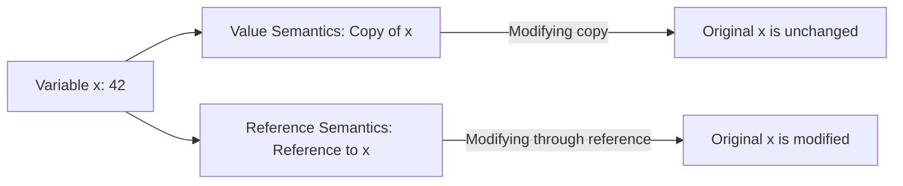

# C++ References

## Introduction

References are one of C++'s powerful features that often confuse beginners but become indispensable as you gain experience. A reference is essentially an **alias** or an alternative name for an existing variable. Unlike pointers, references provide a more straightforward and safer way to work with memory addresses without explicit dereferencing.

In this guide, we'll explore C++ references in depth, understand how they differ from pointers, and learn when and how to use them effectively.

## What is a Reference?

A reference in C++ is a derived type that refers to (or "aliases") another object or value. Once a reference is initialized, it cannot be changed to refer to another object. This is one of the fundamental differences between references and pointers.

### Basic Syntax

To declare a reference, you use the ampersand (`&`) symbol:

```cpp
int original = 42;    // Regular variable
int& ref = original;  // Reference to 'original'
```

In this example, `ref` is a reference to `original`. Any changes made through `ref` will affect `original` and vice versa.

## Key Characteristics of References

Let's examine the important properties of references:

1. **Must be initialized when declared** - References cannot exist without referring to something
2. **Cannot be reassigned** - Once a reference is bound to a variable, it can't be changed
3. **Cannot be null** - References always refer to valid objects
4. **No reference arithmetic** - Unlike pointers, you can't perform arithmetic on references
5. **No reference to reference** - You cannot create a reference to a reference directly

## References vs. Pointers

To understand references better, let's compare them with pointers:

| Feature | References | Pointers |
|---------|------------|----------|
| Nullability | Cannot be null | Can be null |
| Reassignment | Cannot be reassigned | Can point to different objects |
| Initialization | Must be initialized | Can be initialized later |
| Dereferencing | Automatic | Requires explicit dereferencing (`*`) |
| Arithmetic | Not supported | Supported (pointer arithmetic) |
| Memory | No extra memory (typically) | Requires memory to store address |

### Example Comparing References and Pointers

```cpp
#include <iostream>

int main() {
    int value = 10;

    // Using a pointer
    int* ptr = &value;
    *ptr = 20;  // Need to dereference
    
    std::cout << "Value after pointer modification: " << value << std::endl;
    
    // Using a reference
    int& ref = value;
    ref = 30;   // No need to dereference
    
    std::cout << "Value after reference modification: " << value << std::endl;
    
    return 0;
}
```

**Output:**
```
Value after pointer modification: 20
Value after reference modification: 30
```

## Types of References in C++

C++ has three main types of references:

### 1. Lvalue References (`&`)

The standard reference type that refers to an object that persists beyond a single expression.

```cpp
int x = 10;
int& ref = x;  // lvalue reference to x
```

### 2. Const References (`const &`)

References that cannot modify the referred object:

```cpp
int x = 10;
const int& ref = x;  // const reference to x
// ref = 20;  // Error! Cannot modify through const reference
```

### 3. Rvalue References (`&&`) - C++11 and later

References that can bind to temporary values (rvalues):

```cpp
int&& ref = 10;  // rvalue reference to temporary value 10
```

Rvalue references are particularly important for move semantics and perfect forwarding in modern C++, but they're an advanced topic beyond the scope of this beginner guide.

## Common Use Cases for References

References are incredibly useful in several scenarios:

### 1. Function Parameters

References are frequently used as function parameters to avoid copying large objects:

```cpp
#include <iostream>
#include <string>

// Without references - makes a copy (inefficient for large objects)
void withoutRef(std::string str) {
    std::cout << "String length: " << str.length() << std::endl;
}

// With reference - no copy is made
void withRef(const std::string& str) {
    std::cout << "String length: " << str.length() << std::endl;
}

int main() {
    std::string longText = "This is a somewhat long text that would be inefficient to copy.";
    
    withoutRef(longText);  // Makes a copy
    withRef(longText);     // Uses a reference, no copy
    
    return 0;
}
```

### 2. Function Return Values

References can be returned from functions to provide access to internal data:

```cpp
#include <iostream>
#include <vector>

class DataContainer {
private:
    std::vector<int> data{1, 2, 3, 4, 5};

public:
    // Returns a reference to an element
    int& get(int index) {
        return data[index];
    }
    
    // Display all elements
    void display() {
        for (int num : data) {
            std::cout << num << " ";
        }
        std::cout << std::endl;
    }
};

int main() {
    DataContainer container;
    
    std::cout << "Before modification: ";
    container.display();
    
    // Modify the container through the reference
    container.get(2) = 99;
    
    std::cout << "After modification: ";
    container.display();
    
    return 0;
}
```

**Output:**
```
Before modification: 1 2 3 4 5
After modification: 1 2 99 4 5
```

### 3. Avoiding Object Slicing

References help prevent object slicing when working with inheritance:

```cpp
#include <iostream>

class Base {
public:
    virtual void display() {
        std::cout << "Base class" << std::endl;
    }
    virtual ~Base() {}
};

class Derived : public Base {
public:
    void display() override {
        std::cout << "Derived class" << std::endl;
    }
};

// Takes a reference - no slicing
void processReference(Base& obj) {
    obj.display();
}

// Takes by value - causes slicing
void processValue(Base obj) {
    obj.display();
}

int main() {
    Derived d;
    
    std::cout << "Using reference: ";
    processReference(d);  // Calls Derived::display()
    
    std::cout << "Using value: ";
    processValue(d);      // Calls Base::display() due to slicing
    
    return 0;
}
```

**Output:**
```
Using reference: Derived class
Using value: Base class
```

## Reference Semantics vs. Value Semantics

Let's visualize the difference between reference semantics and value semantics:



## Common Mistakes and Pitfalls

### 1. Dangling References

A dangling reference occurs when the referenced object goes out of scope or is deleted:

```cpp
int& getDanglingReference() {
    int local = 42;
    return local;  // DANGER: returning reference to local variable
}  // 'local' is destroyed here

int main() {
    int& ref = getDanglingReference();  // ref is now dangling
    std::cout << ref << std::endl;  // Undefined behavior!
    
    return 0;
}
```

### 2. Forgetting Reference Nature

```cpp
#include <iostream>

int main() {
    int x = 10;
    int& ref = x;
    
    ref = 20;  // This modifies x, not just ref
    
    std::cout << "x: " << x << std::endl;  // Outputs 20, not 10
    
    return 0;
}
```

### 3. Const Correctness Issues

```cpp
void processData(const std::string& data) {
    // data[0] = 'X';  // Error! Cannot modify through const reference
    
    // Correct: create a modifiable copy if needed
    std::string mutableCopy = data;
    mutableCopy[0] = 'X';
}
```

## Advanced Reference Techniques

### Reference to Constant

A reference to a constant value means the reference cannot modify the value:

```cpp
int value = 10;
const int& ref = value;  // ref cannot modify value
// ref = 20;  // Error: assignment of read-only reference
```

### Constant Reference

A constant reference cannot be changed to refer to a different object (though this is true for all references):

```cpp
int value1 = 10;
int value2 = 20;
int& const ref = value1;  // Redundant 'const' - all references are inherently const
// ref = value2;  // This assigns value2 to value1, not making ref refer to value2
```

## Practical Application: Swap Function

A classic example of reference usage is the swap function:

```cpp
#include <iostream>

// Swap using references
void swap(int& a, int& b) {
    int temp = a;
    a = b;
    b = temp;
}

int main() {
    int x = 5, y = 10;
    
    std::cout << "Before swap: x = " << x << ", y = " << y << std::endl;
    
    swap(x, y);
    
    std::cout << "After swap: x = " << x << ", y = " << y << std::endl;
    
    return 0;
}
```

**Output:**
```
Before swap: x = 5, y = 10
After swap: x = 10, y = 5
```

## Best Practices for References

1. **Use references for function parameters** when you want to avoid copying large objects
2. **Use `const` references** when you don't need to modify the parameter
3. **Avoid returning references to local variables** from functions
4. **Prefer references over pointers** for simple cases where null is not a valid option
5. **Use references in range-based for loops** to avoid copies and allow modifications:

```cpp
std::vector<int> nums = {1, 2, 3, 4, 5};

// Using references to modify elements
for (int& num : nums) {
    num *= 2;
}

// Using const references to access without copying
for (const int& num : nums) {
    std::cout << num << " ";
}
```

## Summary

References in C++ provide a powerful mechanism for creating aliases to existing objects without the complexity of pointer dereferencing. They offer a safer alternative to pointers in many situations, particularly when:

- Passing large objects to functions
- Allowing functions to modify their arguments
- Working with objects in inheritance hierarchies
- Implementing operator overloading

Understanding references is essential for writing efficient and clean C++ code. Remember their key properties: they must be initialized, cannot be null, cannot be reassigned, and they always provide direct access to the object they reference.

## Exercises

1. Write a function that takes a reference to an array and its size, then reverses the elements in the array.
2. Create a class with a method that returns a reference to an internal data member. Use this reference to modify the internal data.
3. Implement a function that uses references to find both the minimum and maximum values in an array, returning them through reference parameters.
4. Write a program that demonstrates the difference between passing by reference and passing by value, with timing measurements for large objects.
5. Create a linked list implementation where each node contains a reference to the next node rather than a pointer.

## Additional Resources

- [C++ Reference Documentation](https://en.cppreference.com/w/cpp/language/reference)
- Scott Meyers' "Effective C++" contains excellent advice on using references effectively
- "The C++ Programming Language" by Bjarne Stroustrup, the creator of C++
- [C++ Core Guidelines: References](https://isocpp.github.io/CppCoreGuidelines/CppCoreGuidelines#f42-return-a-t-not-a-t-or-a-const-t-when-copying-is-cheap)

Happy coding! Remember that mastering references is a significant step toward becoming proficient in C++.