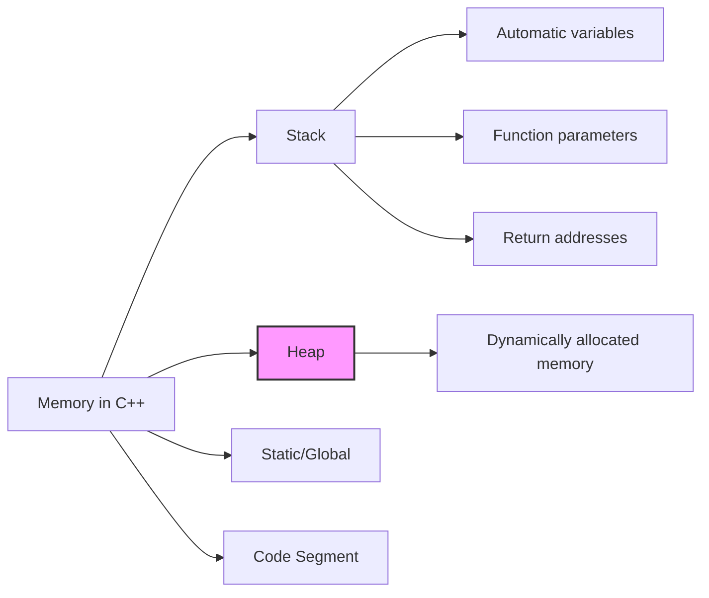

# C++ Dynamic Memory

## Introduction

In C++, memory management is a critical aspect of programming that directly impacts your application's performance and reliability. While automatic variables (declared inside functions) are allocated on the stack and have a limited lifetime, dynamic memory allocation allows you to request memory from the heap during runtime, giving you more flexibility and control.

Dynamic memory allocation is essential when:
- You don't know how much memory you need at compile time
- You need to allocate large blocks of memory
- You need data to persist beyond the scope of the function where it's created
- You're building complex data structures like linked lists, trees, or graphs

In this tutorial, we'll explore how C++ handles dynamic memory through pointers and the `new`/`delete` operators.

## Understanding Memory in C++

Before diving into dynamic memory, let's understand how memory is organized in C++:



- **Stack**: Fast, automatically managed memory with limited size
- **Heap**: Larger, manually managed memory for dynamic allocation
- **Static/Global**: Memory for global variables and static members
- **Code Segment**: Where your compiled code resides

In this tutorial, we'll focus on the heap memory (highlighted above).

## Basic Dynamic Memory Allocation

### The `new` Operator

In C++, we use the `new` operator to allocate memory dynamically. It returns a pointer to the allocated memory.

```cpp
// Allocating a single integer
int* ptr = new int;

// Allocating and initializing
int* ptr2 = new int(42);

// Allocating an array of 10 integers
int* arr = new int[10];
```

### The `delete` Operator

When you're done with dynamically allocated memory, you must release it using the `delete` operator.

```cpp
// Deallocating a single variable
delete ptr;

// Deallocating an array
delete[] arr;
```

### Example: Simple Dynamic Memory Allocation

```cpp
#include <iostream>
using namespace std;

int main() {
    // Allocate a single integer
    int* number = new int;
    
    // Assign a value to it
    *number = 42;
    
    // Use the dynamically allocated memory
    cout << "Dynamically allocated number: " << *number << endl;
    
    // Release the memory when done
    delete number;
    
    // Nullify the pointer after deletion (best practice)
    number = nullptr;
    
    return 0;
}
```

**Output:**
```
Dynamically allocated number: 42
```

## Working with Dynamic Arrays

Dynamic arrays are useful when you need to determine array size at runtime.

### Example: Dynamic Array

```cpp
#include <iostream>
using namespace std;

int main() {
    // Get the size of the array from the user
    int size;
    cout << "Enter the size of the array: ";
    cin >> size;
    
    // Allocate an array of the specified size
    int* dynamicArray = new int[size];
    
    // Fill the array with values
    cout << "Enter " << size << " integers:" << endl;
    for(int i = 0; i < size; i++) {
        cin >> dynamicArray[i];
    }
    
    // Calculate the sum of elements
    int sum = 0;
    for(int i = 0; i < size; i++) {
        sum += dynamicArray[i];
    }
    
    cout << "Sum of all elements: " << sum << endl;
    
    // Release the memory
    delete[] dynamicArray;
    dynamicArray = nullptr;
    
    return 0;
}
```

**Sample Input/Output:**
```
Enter the size of the array: 4
Enter 4 integers:
10 20 30 40
Sum of all elements: 100
```

## Common Pitfalls in Dynamic Memory Management

### 1. Memory Leaks

Memory leaks occur when you allocate memory but forget to deallocate it.

```cpp
void leakyFunction() {
    int* data = new int[1000];
    // Function ends without 'delete[] data'
    // This memory is now leaked!
}
```

### 2. Dangling Pointers

Dangling pointers occur when you use a pointer after the memory it points to has been deallocated.

```cpp
int* ptr = new int(42);
delete ptr;  // Memory is deallocated
cout << *ptr;  // DANGEROUS: Accessing deallocated memory
```

### 3. Double Deletion

Attempting to delete the same memory twice can cause runtime errors.

```cpp
int* ptr = new int;
delete ptr;
delete ptr;  // ERROR: Double deletion
```

### 4. Using Wrong Delete Form

Using `delete` for arrays or `delete[]` for single objects can cause undefined behavior.

```cpp
int* single = new int;
int* array = new int[10];

delete[] single;  // WRONG: Should use delete
delete array;     // WRONG: Should use delete[]
```

## Best Practices for Dynamic Memory

1. **Always match `new` with `delete` and `new[]` with `delete[]`**
2. **Set pointers to `nullptr` after deletion**
3. **Use smart pointers whenever possible (covered in advanced tutorials)**
4. **Check if memory allocation was successful**
5. **Keep track of all dynamic allocations**

### Example with Best Practices

```cpp
#include <iostream>
using namespace std;

int main() {
    // Allocate memory
    int* data = nullptr;  // Initialize to nullptr
    
    try {
        data = new int[100];  // Try to allocate
    } catch (const bad_alloc& e) {
        cerr << "Memory allocation failed: " << e.what() << endl;
        return 1;
    }
    
    // Use the memory
    for(int i = 0; i < 100; i++) {
        data[i] = i * 2;
    }
    
    // Display some values
    cout << "Some values from the array:" << endl;
    for(int i = 0; i < 5; i++) {
        cout << "data[" << i << "] = " << data[i] << endl;
    }
    
    // Clean up properly
    delete[] data;
    data = nullptr;  // Set to nullptr after deletion
    
    return 0;
}
```

**Output:**
```
Some values from the array:
data[0] = 0
data[1] = 2
data[2] = 4
data[3] = 6
data[4] = 8
```

## Real-World Application: Dynamic String Builder

Let's implement a simple dynamic string builder that automatically grows as needed:

```cpp
#include <iostream>
#include <cstring>
using namespace std;

class DynamicStringBuilder {
private:
    char* buffer;
    int capacity;
    int length;
    
    void resize(int newCapacity) {
        char* newBuffer = new char[newCapacity];
        // Copy existing content
        for (int i = 0; i < length; i++) {
            newBuffer[i] = buffer[i];
        }
        // Delete old buffer
        delete[] buffer;
        // Update to new buffer
        buffer = newBuffer;
        capacity = newCapacity;
    }
    
public:
    DynamicStringBuilder(int initialCapacity = 10) {
        capacity = initialCapacity;
        buffer = new char[capacity];
        length = 0;
        buffer[0] = '\0';
    }
    
    ~DynamicStringBuilder() {
        delete[] buffer;
    }
    
    void append(const char* str) {
        int strLength = strlen(str);
        
        // Check if we need to resize
        if (length + strLength + 1 > capacity) {
            resize(capacity * 2 + strLength);
        }
        
        // Append the string
        for (int i = 0; i < strLength; i++) {
            buffer[length + i] = str[i];
        }
        
        length += strLength;
        buffer[length] = '\0';
    }
    
    const char* toString() const {
        return buffer;
    }
};

int main() {
    DynamicStringBuilder builder;
    
    builder.append("Hello, ");
    builder.append("dynamic ");
    builder.append("memory ");
    builder.append("management!");
    
    cout << "Built string: " << builder.toString() << endl;
    
    return 0;
}
```

**Output:**
```
Built string: Hello, dynamic memory management!
```

This example demonstrates how dynamic memory allows you to build data structures that can grow as needed during runtime.

## Common Allocation Patterns with Dynamic Memory

### 1. Dynamic 2D Arrays

```cpp
// Create a 2D array of size rows × cols
int rows = 3;
int cols = 4;

// Allocate an array of pointers
int** matrix = new int*[rows];

// Allocate each row
for(int i = 0; i < rows; i++) {
    matrix[i] = new int[cols];
}

// Use the matrix
for(int i = 0; i < rows; i++) {
    for(int j = 0; j < cols; j++) {
        matrix[i][j] = i * cols + j;
        cout << matrix[i][j] << "\t";
    }
    cout << endl;
}

// Clean up - delete each row first
for(int i = 0; i < rows; i++) {
    delete[] matrix[i];
}
// Then delete the array of pointers
delete[] matrix;
```

### 2. Dynamic Objects

```cpp
class Person {
public:
    string name;
    int age;
    
    Person(string n, int a) : name(n), age(a) {
        cout << "Person " << name << " created." << endl;
    }
    
    ~Person() {
        cout << "Person " << name << " destroyed." << endl;
    }
    
    void introduce() {
        cout << "Hi, I'm " << name << " and I'm " << age << " years old." << endl;
    }
};

// Create a dynamic Person object
Person* person = new Person("Alice", 25);
person->introduce();
delete person;  // Don't forget to delete!
```

## Memory Management vs. Garbage Collection

Unlike languages with garbage collection (like Java or Python), C++ requires manual memory management. This gives you greater control but also more responsibility:

| Manual Memory Management (C++) | Garbage Collection |
|--------------------------|------------------|
| Complete control over when memory is freed | Automatic memory recovery |
| Potentially better performance | Potential performance pauses |
| Risk of memory leaks, dangling pointers | Safer, fewer memory-related bugs |
| Explicit release of resources | Resources may be held longer than needed |

## Advanced Memory Management (Preview)

While this tutorial covers the basics, C++ offers more sophisticated tools for memory management:

- **Smart Pointers**: `unique_ptr`, `shared_ptr`, and `weak_ptr` that automatically manage memory
- **Placement new**: Construct objects at specific memory addresses
- **Custom allocators**: Create specialized memory allocation strategies
- **RAII (Resource Acquisition Is Initialization)**: Tie resource management to object lifetime

## Summary

Dynamic memory allocation is a powerful feature in C++ that allows you to:

- Allocate memory at runtime
- Create data structures that can grow and shrink
- Manage memory resources explicitly

Key points to remember:
- Use `new` to allocate memory and `delete` to free it
- Always match `new` with `delete` and `new[]` with `delete[]`
- Set pointers to `nullptr` after deletion
- Be aware of memory leaks, dangling pointers, and double deletion
- Follow best practices to prevent memory-related issues

## Exercises

1. Create a program that dynamically allocates an array based on user input, then finds the maximum and minimum values.
2. Implement a simple linked list using dynamic memory allocation.
3. Write a function that takes a string and returns a dynamically allocated copy with all vowels removed.
4. Create a dynamic matrix multiplication program that allocates two 2D matrices of sizes determined at runtime.
5. Implement a function that checks for memory leaks by tracking allocations and deallocations.

## Additional Resources

- [cppreference - Dynamic memory management](https://en.cppreference.com/w/cpp/memory)
- [C++ Core Guidelines - Resource Management](https://isocpp.github.io/CppCoreGuidelines/CppCoreGuidelines#r-resource-management)
- [Effective C++: 55 Specific Ways to Improve Your Programs and Designs](https://www.amazon.com/Effective-Specific-Improve-Programs-Designs/dp/0321334876)
- [Understanding and Avoiding Memory Leaks in C++](https://www.cppstories.com/2019/02/dynamic-memory-leaks-cpp/)