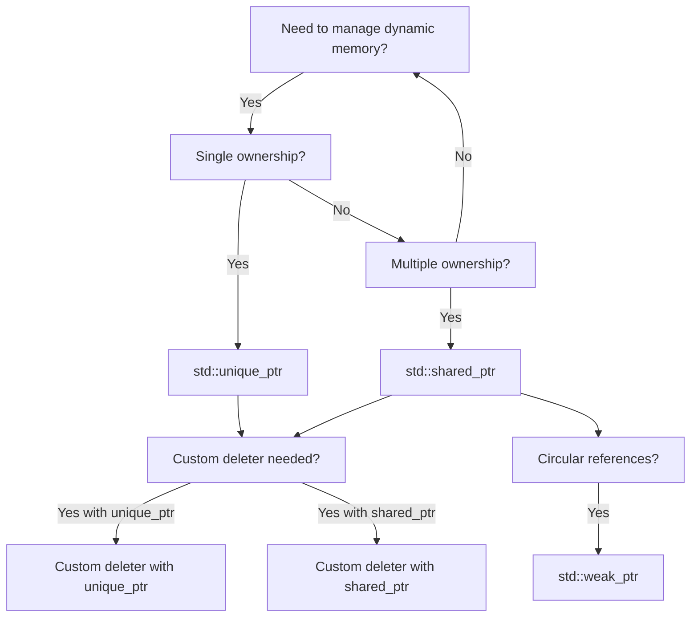

# C++ Smart Pointers

## Introduction

In modern C++ programming, memory management is a critical aspect that every developer needs to master. While traditional raw pointers are powerful, they come with significant risks: memory leaks, dangling pointers, and double deletions are common issues that can lead to program crashes or unpredictable behavior.

Smart pointers were introduced to solve these problems. They are objects that act like regular pointers but provide additional features that help manage the lifetime of dynamically allocated memory automatically. By using the Resource Acquisition Is Initialization (RAII) principle, smart pointers ensure that memory is properly deallocated when it's no longer needed.

In this tutorial, we'll explore the three main types of smart pointers available in the C++ Standard Library since C++11:

1. `std::unique_ptr`: For exclusive ownership
2. `std::shared_ptr`: For shared ownership
3. `std::weak_ptr`: For temporary references to shared objects

## Why Smart Pointers?

Before diving into the details, let's understand why smart pointers are essential in modern C++ programming:

```cpp
// Traditional approach with raw pointers
void functionWithMemoryLeak() {
    int* data = new int[1000]; // Allocate memory
    
    // Some operations...
    
    // Oops! We forgot to delete
    // Memory leak occurs here
}

// Better approach with smart pointers
void functionWithSmartPointer() {
    std::unique_ptr<int[]> data = std::make_unique<int[]>(1000);
    
    // Some operations...
    
    // No need to manually delete
    // Memory automatically freed when data goes out of scope
}
```

## std::unique_ptr

The `std::unique_ptr` is designed for scenarios where you need exclusive ownership of a dynamically allocated resource. It ensures that there's only one owner for the resource and automatically frees the memory when it goes out of scope.

### Basic Usage

```cpp
#include <iostream>
#include <memory>

int main() {
    // Create a unique_ptr
    std::unique_ptr<int> ptr1 = std::make_unique<int>(42);
    
    // Use the pointer
    std::cout << "Value: " << *ptr1 << std::endl;
    
    // Modify the value
    *ptr1 = 100;
    std::cout << "Modified value: " << *ptr1 << std::endl;
    
    // ptr1 will automatically delete the memory when it goes out of scope
    return 0;
}
```

Output:
```
Value: 42
Modified value: 100
```

### Ownership Transfer

One key aspect of `unique_ptr` is that it cannot be copied, only moved. This enforces the exclusive ownership semantic:

```cpp
#include <iostream>
#include <memory>

void processData(std::unique_ptr<int> ptr) {
    std::cout << "Processing value: " << *ptr << std::endl;
    // ptr is automatically deleted when this function ends
}

int main() {
    std::unique_ptr<int> ptr1 = std::make_unique<int>(42);
    
    // The following would cause a compilation error:
    // std::unique_ptr<int> ptr2 = ptr1; // Error: copy constructor is deleted
    
    // Instead, we can transfer ownership using std::move:
    processData(std::move(ptr1));
    
    // ptr1 is now nullptr after ownership transfer
    if (ptr1 == nullptr) {
        std::cout << "ptr1 is now empty after ownership transfer" << std::endl;
    }
    
    return 0;
}
```

Output:
```
Processing value: 42
ptr1 is now empty after ownership transfer
```

### Managing Arrays

`unique_ptr` can also manage arrays with a special form:

```cpp
#include <iostream>
#include <memory>

int main() {
    // Create a unique_ptr to an array
    std::unique_ptr<int[]> array = std::make_unique<int[]>(5);
    
    // Initialize the array
    for (int i = 0; i < 5; i++) {
        array[i] = i * 10;
    }
    
    // Access the array elements
    for (int i = 0; i < 5; i++) {
        std::cout << "array[" << i << "] = " << array[i] << std::endl;
    }
    
    // Memory is automatically freed when array goes out of scope
    return 0;
}
```

Output:
```
array[0] = 0
array[1] = 10
array[2] = 20
array[3] = 30
array[4] = 40
```

## std::shared_ptr

While `unique_ptr` enforces exclusive ownership, many scenarios require multiple owners for a resource. This is where `std::shared_ptr` comes in. It maintains a reference count of how many shared pointers point to the resource and only deletes the resource when this count reaches zero.

### Basic Usage

```cpp
#include <iostream>
#include <memory>

int main() {
    // Create a shared_ptr
    std::shared_ptr<int> ptr1 = std::make_shared<int>(42);
    
    // Create another shared_ptr pointing to the same resource
    std::shared_ptr<int> ptr2 = ptr1;
    
    // Both pointers point to the same memory
    std::cout << "ptr1 value: " << *ptr1 << std::endl;
    std::cout << "ptr2 value: " << *ptr2 << std::endl;
    
    // Modify the value through ptr2
    *ptr2 = 100;
    
    // The change is visible through ptr1 as well
    std::cout << "ptr1 value after modification: " << *ptr1 << std::endl;
    
    // Check reference count
    std::cout << "Reference count: " << ptr1.use_count() << std::endl;
    
    // Memory is freed only when all shared_ptrs go out of scope
    return 0;
}
```

Output:
```
ptr1 value: 42
ptr2 value: 42
ptr1 value after modification: 100
Reference count: 2
```

### Resource Sharing Example

Here's a more practical example demonstrating how `shared_ptr` enables resource sharing:

```cpp
#include <iostream>
#include <memory>
#include <vector>
#include <string>

class Person {
private:
    std::string name;
    int age;

public:
    Person(const std::string& n, int a) : name(n), age(a) {
        std::cout << "Person created: " << name << std::endl;
    }
    
    ~Person() {
        std::cout << "Person destroyed: " << name << std::endl;
    }
    
    void introduce() {
        std::cout << "Hi, I'm " << name << " and I'm " << age << " years old." << std::endl;
    }
};

int main() {
    // Create a vector of shared_ptrs
    std::vector<std::shared_ptr<Person>> people;
    
    // Add people to the vector
    auto alice = std::make_shared<Person>("Alice", 30);
    people.push_back(alice);
    
    {
        // Create a shared_ptr in a nested scope
        auto bob = std::make_shared<Person>("Bob", 25);
        people.push_back(bob);
        
        // Both Alice and Bob have at least two references: 
        // One in 'people' vector and one in the named variable
        std::cout << "Alice reference count: " << alice.use_count() << std::endl;
        std::cout << "Bob reference count inside nested scope: " << bob.use_count() << std::endl;
        
        // Bob's named variable will go out of scope but the vector still has a reference
    }
    
    // Introduce everyone
    for (const auto& person : people) {
        person->introduce();
    }
    
    std::cout << "Alice reference count: " << alice.use_count() << std::endl;
    std::cout << "Clearing vector..." << std::endl;
    
    // Clear the vector, reducing reference counts
    people.clear();
    
    std::cout << "Alice reference count: " << alice.use_count() << std::endl;
    
    // Alice's object still exists because of the named variable
    alice->introduce();
    
    // When alice goes out of scope, the Person object will be destroyed
    return 0;
}
```

Output (approximately):
```
Person created: Alice
Person created: Bob
Alice reference count: 2
Bob reference count inside nested scope: 2
Hi, I'm Alice and I'm 30 years old.
Hi, I'm Bob and I'm 25 years old.
Alice reference count: 2
Clearing vector...
Person destroyed: Bob
Alice reference count: 1
Hi, I'm Alice and I'm 30 years old.
Person destroyed: Alice
```

## std::weak_ptr

A `std::weak_ptr` provides a non-owning "weak" reference to an object managed by a `std::shared_ptr`. It doesn't increase the reference count and doesn't prevent the object from being destroyed. It's primarily used to break circular references that would otherwise cause memory leaks.

### Breaking Circular References

One of the common issues with `shared_ptr` is circular references:

```cpp
#include <iostream>
#include <memory>

class B; // Forward declaration

class A {
public:
    std::shared_ptr<B> b_ptr;
    
    A() {
        std::cout << "A constructed" << std::endl;
    }
    
    ~A() {
        std::cout << "A destroyed" << std::endl;
    }
};

class B {
public:
    std::shared_ptr<A> a_ptr; // This creates a circular reference with A
    
    B() {
        std::cout << "B constructed" << std::endl;
    }
    
    ~B() {
        std::cout << "B destroyed" << std::endl;
    }
};

void createCircularReference() {
    auto a = std::make_shared<A>();
    auto b = std::make_shared<B>();
    
    std::cout << "Setting up circular reference..." << std::endl;
    
    // Create circular reference
    a->b_ptr = b;
    b->a_ptr = a;
    
    std::cout << "Leaving function scope..." << std::endl;
    // Even though a and b go out of scope, their reference count never reaches zero
    // due to the circular reference, causing a memory leak
}

int main() {
    createCircularReference();
    std::cout << "Back in main - notice that A and B were not destroyed!" << std::endl;
    
    // The program ends but A and B objects are not destroyed
    return 0;
}
```

Output:
```
A constructed
B constructed
Setting up circular reference...
Leaving function scope...
Back in main - notice that A and B were not destroyed!
```

Now let's solve this using `std::weak_ptr`:

```cpp
#include <iostream>
#include <memory>

class B; // Forward declaration

class A {
public:
    std::shared_ptr<B> b_ptr;
    
    A() {
        std::cout << "A constructed" << std::endl;
    }
    
    ~A() {
        std::cout << "A destroyed" << std::endl;
    }
};

class B {
public:
    std::weak_ptr<A> a_ptr; // Using weak_ptr breaks the circular reference
    
    B() {
        std::cout << "B constructed" << std::endl;
    }
    
    ~B() {
        std::cout << "B destroyed" << std::endl;
    }
    
    void doSomethingWithA() {
        // Check if the weak_ptr can be locked (if A still exists)
        if (auto a = a_ptr.lock()) {
            std::cout << "A still exists, doing something with it" << std::endl;
        } else {
            std::cout << "A no longer exists" << std::endl;
        }
    }
};

void createNonCircularReference() {
    auto a = std::make_shared<A>();
    auto b = std::make_shared<B>();
    
    std::cout << "Setting up reference..." << std::endl;
    
    // Set up references
    a->b_ptr = b;
    b->a_ptr = a;
    
    std::cout << "Leaving function scope..." << std::endl;
    // Now the objects will be properly destroyed
}

int main() {
    createNonCircularReference();
    std::cout << "Back in main - A and B were properly destroyed!" << std::endl;
    
    return 0;
}
```

Output:
```
A constructed
B constructed
Setting up reference...
Leaving function scope...
B destroyed
A destroyed
Back in main - A and B were properly destroyed!
```

### Using weak_ptr

To use a `weak_ptr`, you need to convert it to a `shared_ptr` first by calling `lock()`:

```cpp
#include <iostream>
#include <memory>

void demonstrateWeakPtr() {
    // Create a shared_ptr
    std::shared_ptr<int> shared = std::make_shared<int>(42);
    
    // Create a weak_ptr from it
    std::weak_ptr<int> weak = shared;
    
    // Check if the resource still exists
    if (auto ptr = weak.lock()) {
        std::cout << "Resource still exists, value: " << *ptr << std::endl;
    } else {
        std::cout << "Resource has been freed" << std::endl;
    }
    
    // Reset the shared_ptr, which will destroy the resource
    std::cout << "Resetting shared_ptr..." << std::endl;
    shared.reset();
    
    // Try to access again using weak_ptr
    if (auto ptr = weak.lock()) {
        std::cout << "Resource still exists, value: " << *ptr << std::endl;
    } else {
        std::cout << "Resource has been freed" << std::endl;
    }
}

int main() {
    demonstrateWeakPtr();
    return 0;
}
```

Output:
```
Resource still exists, value: 42
Resetting shared_ptr...
Resource has been freed
```

## Custom Deleters

Sometimes you need to perform special cleanup actions when a resource is destroyed. Smart pointers allow you to specify custom deleters for this purpose:

```cpp
#include <iostream>
#include <memory>
#include <fstream>

void customDeleterExample() {
    // Custom deleter for a file handle
    auto fileDeleter = [](std::FILE* file) {
        std::cout << "Custom deleter: Closing file" << std::endl;
        if (file) {
            std::fclose(file);
        }
    };
    
    // Create a shared_ptr with custom deleter
    std::shared_ptr<std::FILE> filePtr(std::fopen("example.txt", "w"), fileDeleter);
    
    if (filePtr) {
        std::cout << "File opened successfully" << std::endl;
        std::fputs("Hello, Smart Pointers!", filePtr.get());
    } else {
        std::cout << "Failed to open file" << std::endl;
    }
    
    // The file will be properly closed when filePtr goes out of scope
}

int main() {
    customDeleterExample();
    
    // Try to read the file to see if it was created properly
    std::ifstream file("example.txt");
    if (file.is_open()) {
        std::string content;
        file >> content;
        std::cout << "File content: " << content << std::endl;
    }
    
    return 0;
}
```

Output:
```
File opened successfully
Custom deleter: Closing file
File content: Hello,
```

## Performance Considerations

When using smart pointers, it's important to be aware of their performance implications:

1. `std::unique_ptr` has almost zero overhead compared to raw pointers
2. `std::shared_ptr` has some overhead due to reference counting
3. Always use `std::make_unique` and `std::make_shared` when possible for better exception safety and performance

```cpp
#include <iostream>
#include <memory>
#include <chrono>

const int ITERATIONS = 10000000;

void measurePerformance() {
    auto start = std::chrono::high_resolution_clock::now();
    
    // Raw pointer
    for (int i = 0; i < ITERATIONS; i++) {
        int* ptr = new int(i);
        delete ptr;
    }
    
    auto rawEnd = std::chrono::high_resolution_clock::now();
    
    // unique_ptr
    for (int i = 0; i < ITERATIONS; i++) {
        std::unique_ptr<int> ptr = std::make_unique<int>(i);
    }
    
    auto uniqueEnd = std::chrono::high_resolution_clock::now();
    
    // shared_ptr
    for (int i = 0; i < ITERATIONS; i++) {
        std::shared_ptr<int> ptr = std::make_shared<int>(i);
    }
    
    auto sharedEnd = std::chrono::high_resolution_clock::now();
    
    auto rawTime = std::chrono::duration_cast<std::chrono::milliseconds>(rawEnd - start).count();
    auto uniqueTime = std::chrono::duration_cast<std::chrono::milliseconds>(uniqueEnd - rawEnd).count();
    auto sharedTime = std::chrono::duration_cast<std::chrono::milliseconds>(sharedEnd - uniqueEnd).count();
    
    std::cout << "Raw pointer time: " << rawTime << "ms" << std::endl;
    std::cout << "unique_ptr time: " << uniqueTime << "ms" << std::endl;
    std::cout << "shared_ptr time: " << sharedTime << "ms" << std::endl;
}

int main() {
    measurePerformance();
    return 0;
}
```

The output varies by system, but typically:
```
Raw pointer time: ~100ms
unique_ptr time: ~110ms
shared_ptr time: ~200ms
```

## Best Practices

Here are some guidelines for using smart pointers effectively:

1. **Prefer `std::unique_ptr`** as the default choice for managing single objects
2. Use `std::shared_ptr` only when multiple ownership is truly needed
3. Use `std::weak_ptr` to break circular references in `std::shared_ptr` relationships
4. Always use `std::make_unique` and `std::make_shared` for exception safety and performance
5. Avoid mixing raw and smart pointers for the same resource
6. Remember that smart pointers themselves are objects that copy/move like values



## Real-World Example: Resource Manager

Here's a practical example showing how smart pointers can be used in a real-world scenario:

```cpp
#include <iostream>
#include <memory>
#include <map>
#include <string>
#include <vector>

// Resource class that needs management
class Resource {
private:
    std::string name;
    size_t size;

public:
    Resource(const std::string& n, size_t s) : name(n), size(s) {
        std::cout << "Resource '" << name << "' created with size " << size << std::endl;
    }
    
    ~Resource() {
        std::cout << "Resource '" << name << "' destroyed" << std::endl;
    }
    
    void use() {
        std::cout << "Using resource '" << name << "'" << std::endl;
    }
    
    size_t getSize() const { return size; }
    const std::string& getName() const { return name; }
};

// Resource cache that manages shared objects
class ResourceManager {
private:
    std::map<std::string, std::shared_ptr<Resource>> resources;
    size_t maxSize;
    size_t currentSize;

public:
    ResourceManager(size_t maxSz) : maxSize(maxSz), currentSize(0) {
        std::cout << "Resource manager created with max size " << maxSize << std::endl;
    }
    
    ~ResourceManager() {
        std::cout << "Resource manager destroyed" << std::endl;
    }
    
    // Get a resource (creates if not exists)
    std::shared_ptr<Resource> getResource(const std::string& name, size_t size) {
        auto it = resources.find(name);
        
        if (it != resources.end()) {
            std::cout << "Returning existing resource '" << name << "'" << std::endl;
            return it->second;
        }
        
        // Check if adding this resource would exceed the limit
        if (currentSize + size > maxSize) {
            cleanupUnusedResources();
            
            // If still too large, cannot create
            if (currentSize + size > maxSize) {
                std::cout << "Cannot create resource '" << name 
                         << "', would exceed size limit" << std::endl;
                return nullptr;
            }
        }
        
        // Create new resource
        auto resource = std::make_shared<Resource>(name, size);
        resources[name] = resource;
        currentSize += size;
        
        return resource;
    }
    
    // Clean up any resources that are no longer used elsewhere
    void cleanupUnusedResources() {
        auto it = resources.begin();
        while (it != resources.end()) {
            // Check if this is the only reference (use_count == 1)
            if (it->second.use_count() == 1) {
                std::cout << "Cleaning up unused resource '" << it->second->getName() << "'" << std::endl;
                currentSize -= it->second->getSize();
                it = resources.erase(it);
            } else {
                ++it;
            }
        }
    }
    
    void printStatus() {
        std::cout << "Resource Manager Status:" << std::endl;
        std::cout << "Current size: " << currentSize << "/" << maxSize << std::endl;
        std::cout << "Managed resources: " << std::endl;
        
        for (const auto& pair : resources) {
            std::cout << " - '" << pair.first << "': size=" << pair.second->getSize()
                     << ", ref_count=" << pair.second.use_count() << std::endl;
        }
    }
};

int main() {
    // Create a resource manager with maximum size of 100
    ResourceManager manager(100);
    
    // Vector to hold resources being used
    std::vector<std::shared_ptr<Resource>> activeResources;
    
    // Get and use some resources
    auto res1 = manager.getResource("database", 40);
    auto res2 = manager.getResource("network", 30);
    auto res3 = manager.getResource("logger", 20);
    
    // Keep references to some resources
    activeResources.push_back(res1);
    activeResources.push_back(res2);
    
    // Print status
    manager.printStatus();
    
    // Try to create a resource that's too large
    auto res4 = manager.getResource("graphics", 20);
    if (res4) {
        activeResources.push_back(res4);
    }
    
    // Release a reference to one resource
    res1.reset();
    std::cout << "Released reference to database resource" << std::endl;
    
    // Try cleanup
    manager.cleanupUnusedResources();
    manager.printStatus();
    
    // Try to create a resource now that we've freed some space
    auto res5 = manager.getResource("audio", 15);
    if (res5) {
        activeResources.push_back(res5);
    }
    
    manager.printStatus();
    
    // Clear all active resources
    std::cout << "Clearing all active resources..." << std::endl;
    activeResources.clear();
    
    // Final cleanup
    manager.cleanupUnusedResources();
    manager.printStatus();
    
    return 0;
}
```

Output would be something like:
```
Resource manager created with max size 100
Resource 'database' created with size 40
Returning existing resource 'database'
Resource 'network' created with size 30
Resource 'logger' created with size 20
Resource Manager Status:
Current size: 90/100
Managed resources: 
 - 'database': size=40, ref_count=3
 - 'logger': size=20, ref_count=1
 - 'network': size=30, ref_count=2
Cannot create resource 'graphics', would exceed size limit
Released reference to database resource
Cleaning up unused resource 'logger'
Resource 'logger' destroyed
Resource Manager Status:
Current size: 70/100
Managed resources: 
 - 'database': size=40, ref_count=2
 - 'network': size=30, ref_count=2
Resource 'audio' created with size 15
Resource Manager Status:
Current size: 85/100
Managed resources: 
 - 'audio': size=15, ref_count=2
 - 'database': size=40, ref_count=2
 - 'network': size=30, ref_count=2
Clearing all active resources...
Cleaning up unused resource 'audio'
Resource 'audio' destroyed
Cleaning up unused resource 'database'
Resource 'database' destroyed
Cleaning up unused resource 'network'
Resource 'network' destroyed
Resource Manager Status:
Current size: 0/100
Managed resources: 
Resource manager destroyed
```

## Summary

Smart pointers provide an elegant solution to the memory management challenges in C++. They help prevent common issues like memory leaks, dangling pointers, and double deletions by automating the cleanup process.

Here's a quick recap:

- **`std::unique_ptr`**: For exclusive ownership with zero overhead
- **`std::shared_ptr`**: For shared ownership with reference counting
- **`std::weak_ptr`**: For breaking circular references in shared ownership scenarios

By using smart pointers, you can write safer, more maintainable code with fewer memory-related bugs. They embody the RAII principle, ensuring that resources are properly released when they're no longer needed.

## Exercises

1. Create a class `DataProcessor` that uses `unique_ptr` to manage a dynamically allocated array of integers. Implement methods to add elements, find the maximum value, and calculate the average.

2. Implement a simple file reader class that uses `shared_ptr` with a custom deleter to ensure files are properly closed.

3. Create a parent-child relationship between two classes where the parent holds a `shared_ptr` to the child, and the child holds a `weak_ptr` to the parent to avoid circular references.

4. Build a simple cache system that uses `weak_ptr` to store recently used objects that can be garbage collected when memory is needed.

5. Extend the Resource Manager example to include priority-based eviction policy where resources have different priorities and lower priority resources are removed first when space is needed.

## Additional Resources

- [C++ Core Guidelines: Smart Pointers](https://isocpp.github.io/CppCoreGuidelines/CppCoreGuidelines#Rr-smartptr)
- [C++ Reference for Smart Pointers](https://en.cppreference.com/w/cpp/memory)
- [Effective Modern C++](https://www.oreilly.com/library/view/effective-modern-c/9781491908419/) by Scott Meyers (Items 18-21)
- [C++ Smart Pointers - when and why should I use them?](https://stackoverflow.com/questions/106508/what-is-a-smart-pointer-and-when-should-i-use-one)

Smart pointers are an essential tool in modern C++ programming, and mastering them will greatly improve the quality and reliability of your code. With the knowledge from this tutorial, you're now equipped to use them effectively in your projects!