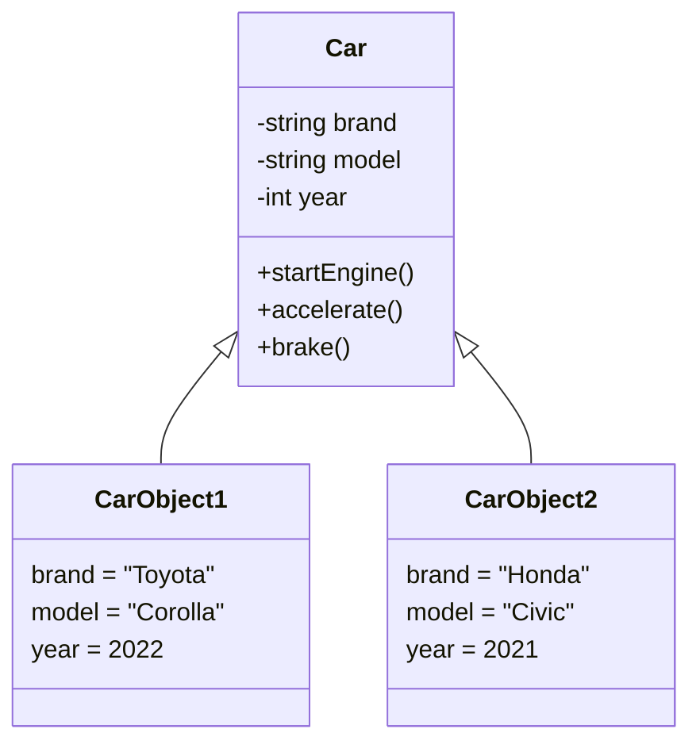

import Tabs from '@theme/Tabs';
import TabItem from '@theme/TabItem';

# C++ Classes and Objects

## Introduction

Welcome to the world of Object-Oriented Programming (OOP) in C++! In this tutorial, we'll explore classes and objects—the fundamental building blocks of OOP that transform how we structure and organize our code.

If you've been working with procedural programming (using functions and data separately), classes introduce a powerful paradigm shift. They allow you to bundle data and functions together into cohesive units, which leads to more organized, reusable, and maintainable code.

## What Are Classes and Objects?

### The Class Concept

Think of a class as a blueprint or template for creating objects. It defines:

- **Attributes** (data members): The properties or characteristics of the class
- **Methods** (member functions): The behaviors or actions the class can perform

A class by itself doesn't occupy memory for its data members. It simply defines the structure.

### Objects: Classes Come to Life

An object is an instance of a class—a concrete entity created from the class blueprint that occupies memory. When you create an object, you're essentially bringing the class definition to life.



## Defining a Class in C++

Let's create our first class:

```cpp
class Student {
  // Private members - accessible only within the class
  private:
    int rollNumber;
    float gpa;
    
  // Public members - accessible from outside the class
  public:
    string name;
    int age;
    
    // Member function to display student info
    void displayInfo() {
      cout << "Name: " << name << endl;
      cout << "Age: " << age << endl;
      cout << "Roll Number: " << rollNumber << endl;
      cout << "GPA: " << gpa << endl;
    }
    
    // Member function to set private data
    void setRollAndGPA(int roll, float studentGPA) {
      rollNumber = roll;
      gpa = studentGPA;
    }
};
```

### Key Components:

1. **Class declaration**: Begins with the `class` keyword followed by the class name
2. **Access specifiers**: 
   - `private`: Members are accessible only within the class (default if not specified)
   - `public`: Members are accessible from outside the class
   - `protected`: We'll cover this later when discussing inheritance
3. **Data members**: Variables defined within the class
4. **Member functions**: Functions defined within the class

## Creating and Using Objects

Once we've defined a class, we can create objects and interact with them:

```cpp
#include <iostream>
#include <string>
using namespace std;

// Student class definition as above

int main() {
    // Creating objects of Student class
    Student student1;
    Student student2;
    
    // Accessing and setting public members
    student1.name = "Alex";
    student1.age = 20;
    student1.setRollAndGPA(101, 3.8);
    
    student2.name = "Emma";
    student2.age = 21;
    student2.setRollAndGPA(102, 3.9);
    
    // Calling member functions
    cout << "Student 1 Information:" << endl;
    student1.displayInfo();
    
    cout << "\nStudent 2 Information:" << endl;
    student2.displayInfo();
    
    return 0;
}
```

**Output:**
```
Student 1 Information:
Name: Alex
Age: 20
Roll Number: 101
GPA: 3.8

Student 2 Information:
Name: Emma
Age: 21
Roll Number: 102
GPA: 3.9
```

### Observations:
- We created two different `Student` objects, each with its own copy of data members
- Public members can be accessed directly using the dot (`.`) operator
- Private members can only be accessed through public member functions

## Constructors and Destructors

### Constructors

Constructors are special member functions that are automatically called when an object is created. They have the same name as the class and don't have a return type.

<Tabs>
  <TabItem value="default" label="Default Constructor" default>

```cpp
class Rectangle {
private:
    int length;
    int width;
    
public:
    // Default constructor
    Rectangle() {
        length = 0;
        width = 0;
        cout << "Default constructor called" << endl;
    }
    
    void setDimensions(int l, int w) {
        length = l;
        width = w;
    }
    
    int getArea() {
        return length * width;
    }
};
```

  </TabItem>
  <TabItem value="parameterized" label="Parameterized Constructor">

```cpp
class Rectangle {
private:
    int length;
    int width;
    
public:
    // Parameterized constructor
    Rectangle(int l, int w) {
        length = l;
        width = w;
        cout << "Parameterized constructor called" << endl;
    }
    
    int getArea() {
        return length * width;
    }
};
```

  </TabItem>
  <TabItem value="multiple" label="Multiple Constructors">

```cpp
class Rectangle {
private:
    int length;
    int width;
    
public:
    // Default constructor
    Rectangle() {
        length = 0;
        width = 0;
        cout << "Default constructor called" << endl;
    }
    
    // Parameterized constructor
    Rectangle(int l, int w) {
        length = l;
        width = w;
        cout << "Parameterized constructor called" << endl;
    }
    
    // Copy constructor
    Rectangle(const Rectangle &rect) {
        length = rect.length;
        width = rect.width;
        cout << "Copy constructor called" << endl;
    }
    
    int getArea() {
        return length * width;
    }
};
```

  </TabItem>
</Tabs>

### Destructors

Destructors are special member functions that are automatically called when an object is destroyed. They have the same name as the class prefixed with a tilde (`~`) and don't have parameters or return types.

```cpp
class DynamicArray {
private:
    int* data;
    int size;
    
public:
    // Constructor
    DynamicArray(int sz) {
        size = sz;
        data = new int[size];  // Allocate memory
        cout << "Constructor: Allocated memory for " << size << " integers" << endl;
    }
    
    // Destructor
    ~DynamicArray() {
        delete[] data;  // Release allocated memory
        cout << "Destructor: Released memory" << endl;
    }
    
    void setValue(int index, int value) {
        if (index >= 0 && index < size) {
            data[index] = value;
        }
    }
    
    int getValue(int index) {
        if (index >= 0 && index < size) {
            return data[index];
        }
        return -1;
    }
};
```

### Example Using Constructors and Destructors

```cpp
#include <iostream>
using namespace std;

// DynamicArray class definition as above

int main() {
    cout << "Program started" << endl;
    
    {
        // Create object using parameterized constructor
        DynamicArray arr(5);
        
        // Set some values
        for (int i = 0; i < 5; i++) {
            arr.setValue(i, i * 10);
        }
        
        // Display values
        for (int i = 0; i < 5; i++) {
            cout << "arr[" << i << "] = " << arr.getValue(i) << endl;
        }
        
        // Destructor will be called automatically when arr goes out of scope
    }
    
    cout << "Program ending" << endl;
    return 0;
}
```

**Output:**
```
Program started
Constructor: Allocated memory for 5 integers
arr[0] = 0
arr[1] = 10
arr[2] = 20
arr[3] = 30
arr[4] = 40
Destructor: Released memory
Program ending
```

## Real-World Example: A Bank Account Class

Let's create a practical example of a `BankAccount` class that models a real-world bank account:

```cpp
#include <iostream>
#include <string>
using namespace std;

class BankAccount {
private:
    string accountNumber;
    string ownerName;
    double balance;
    
    // Private utility function to log transactions
    void logTransaction(string type, double amount) {
        cout << "Transaction: " << type << " of $" << amount;
        cout << " | New Balance: $" << balance << endl;
    }
    
public:
    // Constructor
    BankAccount(string accNum, string name, double initialBalance = 0.0) {
        accountNumber = accNum;
        ownerName = name;
        
        if (initialBalance < 0) {
            cout << "Warning: Initial balance cannot be negative. Setting to 0." << endl;
            balance = 0.0;
        } else {
            balance = initialBalance;
        }
        
        cout << "Account created for " << ownerName << " (#" << accountNumber << ")";
        cout << " with initial balance: $" << balance << endl;
    }
    
    // Deposit money
    void deposit(double amount) {
        if (amount <= 0) {
            cout << "Error: Deposit amount must be positive." << endl;
            return;
        }
        
        balance += amount;
        logTransaction("Deposit", amount);
    }
    
    // Withdraw money
    bool withdraw(double amount) {
        if (amount <= 0) {
            cout << "Error: Withdrawal amount must be positive." << endl;
            return false;
        }
        
        if (amount > balance) {
            cout << "Error: Insufficient funds. Withdrawal canceled." << endl;
            return false;
        }
        
        balance -= amount;
        logTransaction("Withdrawal", amount);
        return true;
    }
    
    // Check balance
    double getBalance() const {
        return balance;
    }
    
    // Display account information
    void displayInfo() const {
        cout << "Account Information:" << endl;
        cout << "Account Number: " << accountNumber << endl;
        cout << "Owner Name: " << ownerName << endl;
        cout << "Current Balance: $" << balance << endl;
    }
};

int main() {
    // Create two bank accounts
    BankAccount account1("AC001", "John Smith", 1000.0);
    BankAccount account2("AC002", "Jane Doe");
    
    cout << "\n--- Transactions for John's Account ---" << endl;
    account1.deposit(500.0);
    account1.withdraw(200.0);
    account1.withdraw(2000.0);  // Should fail
    
    cout << "\n--- Transactions for Jane's Account ---" << endl;
    account2.deposit(1000.0);
    account2.withdraw(500.0);
    
    cout << "\n--- Final Account Information ---" << endl;
    account1.displayInfo();
    cout << endl;
    account2.displayInfo();
    
    return 0;
}
```

**Output:**
```
Account created for John Smith (#AC001) with initial balance: $1000
Account created for Jane Doe (#AC002) with initial balance: $0

--- Transactions for John's Account ---
Transaction: Deposit of $500 | New Balance: $1500
Transaction: Withdrawal of $200 | New Balance: $1300
Error: Insufficient funds. Withdrawal canceled.

--- Transactions for Jane's Account ---
Transaction: Deposit of $1000 | New Balance: $1000
Transaction: Withdrawal of $500 | New Balance: $500

--- Final Account Information ---
Account Information:
Account Number: AC001
Owner Name: John Smith
Current Balance: $1300

Account Information:
Account Number: AC002
Owner Name: Jane Doe
Current Balance: $500
```

### Analysis of the Bank Account Example:

1. **Encapsulation**: The account data (number, name, balance) is private and can only be accessed through public methods
2. **Data validation**: Deposits and withdrawals are checked for validity before processing
3. **Abstraction**: The internal transaction logging is hidden from users
4. **Constructor with defaults**: The initial balance parameter has a default value of 0.0

## Summary

In this tutorial, we've covered:

- The concept of classes as blueprints for objects
- How to define classes with private and public members
- Creating objects and accessing their members
- Constructors for initializing objects
- Destructors for cleaning up resources
- A practical example of modeling a real-world entity

Classes and objects are the foundation of object-oriented programming in C++. They enable you to build modular, reusable, and organized code that models real-world entities and their behaviors.

## Exercises

To practice what you've learned:

1. Create a `Time` class with hours, minutes, and seconds as data members. Include methods to set the time, display it, and add two time objects.

2. Design a `Library` class that manages books. It should have methods to add books, remove books, and search for books by title or author.

3. Implement a `Rectangle` class with length and width as private members. Add constructors, methods to calculate area and perimeter, and a method to check if it's a square.

4. Create a `Counter` class that keeps track of the number of instances created. (Hint: Use a static variable)

5. Design a `Student` class with data members for name, ID, and grades in multiple subjects. Include methods to calculate the average grade and determine if the student passed.

## Additional Resources

- [C++ Classes and Objects - CPlusPlus.com](https://cplusplus.com/doc/tutorial/classes/)
- [Object-Oriented Programming in C++ - GeeksforGeeks](https://www.geeksforgeeks.org/object-oriented-programming-in-cpp/)
- [C++ Classes - W3Schools](https://www.w3schools.com/cpp/cpp_classes.asp)
- "C++ Primer" by Stanley B. Lippman (Book)
- "Effective C++" by Scott Meyers (Book)

In the next tutorial, we'll explore more advanced OOP concepts like inheritance and polymorphism.