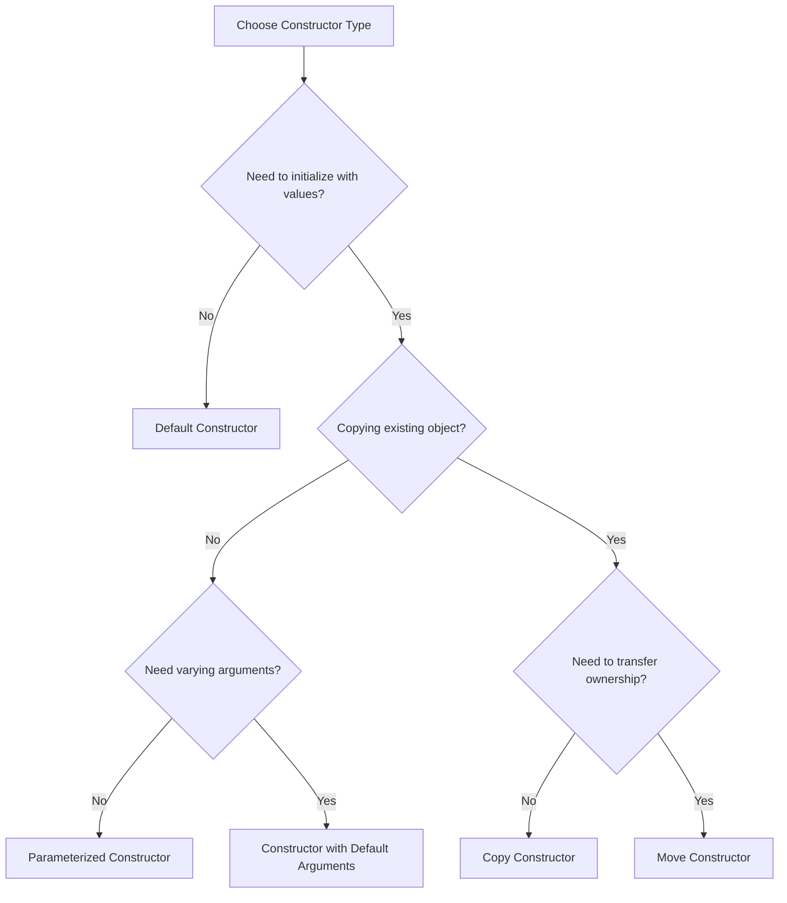

# C++ Constructors

## Introduction

In C++ object-oriented programming, a **constructor** is a special member function that is automatically called when an object of a class is created. Constructors are used to initialize the object's data members and allocate necessary resources the object might need during its lifetime.

Constructors have the same name as the class and do not have a return type (not even `void`). They are crucial for ensuring that objects start their life in a valid and well-defined state.

## Types of Constructors

C++ supports several types of constructors, each serving a specific purpose:

1. Default Constructor
2. Parameterized Constructor
3. Copy Constructor
4. Move Constructor (C++11 and later)
5. Delegating Constructor (C++11 and later)

Let's explore each type in detail.

## Default Constructor

A default constructor takes no parameters (or all parameters have default values). If you don't define any constructor for your class, the compiler automatically generates a default constructor.

### Example

```cpp
#include <iostream>
using namespace std;

class Rectangle {
private:
    int length;
    int width;

public:
    // Default constructor
    Rectangle() {
        length = 0;
        width = 0;
        cout << "Default constructor called" << endl;
    }
    
    void display() {
        cout << "Length: " << length << ", Width: " << width << endl;
    }
};

int main() {
    // Creating object using default constructor
    Rectangle rect;
    rect.display();
    
    return 0;
}
```

**Output:**
```
Default constructor called
Length: 0, Width: 0
```

In this example, when we create a `Rectangle` object without parameters, the default constructor is called, which initializes both `length` and `width` to 0.

## Parameterized Constructor

A parameterized constructor accepts parameters that can be used to initialize data members with specific values when an object is created.

### Example

```cpp
#include <iostream>
using namespace std;

class Rectangle {
private:
    int length;
    int width;

public:
    // Default constructor
    Rectangle() {
        length = 0;
        width = 0;
        cout << "Default constructor called" << endl;
    }
    
    // Parameterized constructor
    Rectangle(int l, int w) {
        length = l;
        width = w;
        cout << "Parameterized constructor called" << endl;
    }
    
    void display() {
        cout << "Length: " << length << ", Width: " << width << endl;
    }
};

int main() {
    // Creating object using default constructor
    Rectangle rect1;
    rect1.display();
    
    // Creating object using parameterized constructor
    Rectangle rect2(5, 10);
    rect2.display();
    
    return 0;
}
```

**Output:**
```
Default constructor called
Length: 0, Width: 0
Parameterized constructor called
Length: 5, Width: 10
```

In this example, we added a parameterized constructor that allows us to specify the length and width when creating a `Rectangle` object.

## Constructor Initialization List

C++ provides a more efficient way to initialize class members using an initialization list. This is particularly important for const members and reference members which can only be initialized, not assigned.

### Example

```cpp
#include <iostream>
#include <string>
using namespace std;

class Student {
private:
    int id;
    string name;
    const string university;

public:
    // Constructor with initialization list
    Student(int i, string n, string u) 
        : id(i), name(n), university(u) {
        cout << "Student initialized with initialization list" << endl;
    }
    
    void display() {
        cout << "ID: " << id << ", Name: " << name 
             << ", University: " << university << endl;
    }
};

int main() {
    Student student(101, "John Doe", "MIT");
    student.display();
    
    return 0;
}
```

**Output:**
```
Student initialized with initialization list
ID: 101, Name: John Doe, University: MIT
```

The initialization list (following the colon) initializes the members before the constructor body executes, which is more efficient than assigning values inside the constructor.

## Copy Constructor

A copy constructor creates a new object as a copy of an existing object. It takes a reference to an object of the same class as a parameter.

### Example

```cpp
#include <iostream>
using namespace std;

class Rectangle {
private:
    int length;
    int width;

public:
    // Parameterized constructor
    Rectangle(int l, int w) : length(l), width(w) {
        cout << "Parameterized constructor called" << endl;
    }
    
    // Copy constructor
    Rectangle(const Rectangle &rect) : length(rect.length), width(rect.width) {
        cout << "Copy constructor called" << endl;
    }
    
    void display() {
        cout << "Length: " << length << ", Width: " << width << endl;
    }
};

int main() {
    Rectangle rect1(5, 10);
    rect1.display();
    
    // Using copy constructor
    Rectangle rect2 = rect1;  // This calls the copy constructor
    rect2.display();
    
    // Another way to use copy constructor
    Rectangle rect3(rect1);
    rect3.display();
    
    return 0;
}
```

**Output:**
```
Parameterized constructor called
Length: 5, Width: 10
Copy constructor called
Length: 5, Width: 10
Copy constructor called
Length: 5, Width: 10
```

The copy constructor is called when you initialize a new object with an existing object. If you don't provide a copy constructor, the compiler will generate one that performs member-wise copying.

## Move Constructor (C++11)

Move constructors were introduced in C++11 to optimize performance by allowing resources to be moved instead of copied, especially useful for classes managing dynamic resources.

### Example

```cpp
#include <iostream>
#include <vector>
using namespace std;

class DynamicArray {
private:
    int* data;
    size_t size;

public:
    // Parameterized constructor
    DynamicArray(size_t n) : size(n) {
        data = new int[size];
        cout << "Parameterized constructor: allocated " << size << " integers" << endl;
    }
    
    // Copy constructor
    DynamicArray(const DynamicArray& other) : size(other.size) {
        data = new int[size];
        for (size_t i = 0; i < size; ++i) {
            data[i] = other.data[i];
        }
        cout << "Copy constructor: copied " << size << " integers" << endl;
    }
    
    // Move constructor
    DynamicArray(DynamicArray&& other) noexcept : data(other.data), size(other.size) {
        other.data = nullptr;
        other.size = 0;
        cout << "Move constructor: moved " << size << " integers" << endl;
    }
    
    // Destructor
    ~DynamicArray() {
        delete[] data;
        cout << "Destructor: freed memory" << endl;
    }
};

int main() {
    // Create a DynamicArray object
    DynamicArray arr1(1000);
    
    // Use copy constructor
    DynamicArray arr2 = arr1;
    
    // Use move constructor
    DynamicArray arr3 = std::move(arr1);
    
    return 0;
}
```

**Output:**
```
Parameterized constructor: allocated 1000 integers
Copy constructor: copied 1000 integers
Move constructor: moved 1000 integers
Destructor: freed memory
Destructor: freed memory
Destructor: freed memory
```

The move constructor takes an rvalue reference (`&&`) and "steals" the resources from the source object instead of copying them, which is more efficient for large resources.

## Delegating Constructors (C++11)

Starting from C++11, a constructor can call another constructor of the same class, which is known as constructor delegation. This helps eliminate code duplication.

### Example

```cpp
#include <iostream>
#include <string>
using namespace std;

class Person {
private:
    string name;
    int age;
    string address;

public:
    // Primary constructor
    Person(string n, int a, string addr) : name(n), age(a), address(addr) {
        cout << "Primary constructor called" << endl;
    }
    
    // Delegating constructor
    Person(string n, int a) : Person(n, a, "Unknown") {
        cout << "Delegating constructor with 2 parameters called" << endl;
    }
    
    // Another delegating constructor
    Person() : Person("John Doe", 0) {
        cout << "Delegating constructor with no parameters called" << endl;
    }
    
    void display() {
        cout << "Name: " << name << ", Age: " << age << ", Address: " << address << endl;
    }
};

int main() {
    Person p1("Alice", 30, "123 Main St");
    p1.display();
    
    Person p2("Bob", 25);
    p2.display();
    
    Person p3;
    p3.display();
    
    return 0;
}
```

**Output:**
```
Primary constructor called
Name: Alice, Age: 30, Address: 123 Main St
Primary constructor called
Delegating constructor with 2 parameters called
Name: Bob, Age: 25, Address: Unknown
Primary constructor called
Delegating constructor with 2 parameters called
Delegating constructor with no parameters called
Name: John Doe, Age: 0, Address: Unknown
```

Delegating constructors help to reduce code duplication and maintain a single point of initialization.

## Real-World Example: String Class

Let's see how constructors might be used in a simplified string class:

```cpp
#include <iostream>
#include <cstring>
using namespace std;

class MyString {
private:
    char* data;
    size_t length;

    // Helper to allocate memory and copy a C-style string
    void allocateAndCopy(const char* str) {
        if (str) {
            length = strlen(str);
            data = new char[length + 1];
            strcpy(data, str);
        } else {
            length = 0;
            data = new char[1];
            data[0] = '\0';
        }
    }

public:
    // Default constructor
    MyString() : data(nullptr), length(0) {
        allocateAndCopy("");
        cout << "Default constructor called" << endl;
    }
    
    // Parameterized constructor
    MyString(const char* str) : data(nullptr), length(0) {
        allocateAndCopy(str);
        cout << "Parameterized constructor called" << endl;
    }
    
    // Copy constructor
    MyString(const MyString& other) : data(nullptr), length(0) {
        allocateAndCopy(other.data);
        cout << "Copy constructor called" << endl;
    }
    
    // Move constructor
    MyString(MyString&& other) noexcept : data(other.data), length(other.length) {
        other.data = nullptr;
        other.length = 0;
        cout << "Move constructor called" << endl;
    }
    
    // Destructor
    ~MyString() {
        delete[] data;
    }
    
    // Display method
    void display() const {
        cout << "String: " << (data ? data : "null") << ", Length: " << length << endl;
    }
};

int main() {
    // Using default constructor
    MyString s1;
    s1.display();
    
    // Using parameterized constructor
    MyString s2("Hello, World!");
    s2.display();
    
    // Using copy constructor
    MyString s3 = s2;
    s3.display();
    
    // Using move constructor
    MyString s4 = std::move(s2);
    s4.display();
    s2.display();  // s2 has been moved from, so it should be empty
    
    return 0;
}
```

**Output:**
```
Default constructor called
String: , Length: 0
Parameterized constructor called
String: Hello, World!, Length: 13
Copy constructor called
String: Hello, World!, Length: 13
Move constructor called
String: Hello, World!, Length: 13
String: null, Length: 0
```

This example demonstrates how constructors are used to properly initialize objects that manage dynamic memory, ensuring that resources are correctly allocated and preventing memory leaks.

## Constructors with Default Arguments

You can provide default values for constructor parameters, allowing objects to be created with varying numbers of arguments.

### Example

```cpp
#include <iostream>
#include <string>
using namespace std;

class User {
private:
    string username;
    string email;
    int age;
    bool active;

public:
    // Constructor with default arguments
    User(string uname, string mail, int a = 18, bool act = true) 
        : username(uname), email(mail), age(a), active(act) {
        cout << "User created with " << (active ? "active" : "inactive") << " status" << endl;
    }
    
    void display() {
        cout << "Username: " << username << endl;
        cout << "Email: " << email << endl;
        cout << "Age: " << age << endl;
        cout << "Status: " << (active ? "Active" : "Inactive") << endl;
        cout << "------------------------" << endl;
    }
};

int main() {
    // Create users with different numbers of arguments
    User user1("alex123", "alex@example.com");
    user1.display();
    
    User user2("emma456", "emma@example.com", 25);
    user2.display();
    
    User user3("charlie789", "charlie@example.com", 30, false);
    user3.display();
    
    return 0;
}
```

**Output:**
```
User created with active status
Username: alex123
Email: alex@example.com
Age: 18
Status: Active
------------------------
User created with active status
Username: emma456
Email: emma@example.com
Age: 25
Status: Active
------------------------
User created with inactive status
Username: charlie789
Email: charlie@example.com
Age: 30
Status: Inactive
------------------------
```

This approach provides flexibility when creating objects while still ensuring that all data members are initialized properly.

## When is Each Constructor Type Used?

Here's a guide for when to use each type of constructor:



## Common Mistakes and Best Practices

### Mistakes to Avoid:

1. **Forgetting to initialize all members**: Always initialize all data members in your constructors.
2. **Not providing a copy constructor for classes with dynamic memory**: This can lead to shallow copies and memory issues.
3. **Calling virtual functions in constructors**: During construction, virtual functions don't behave polymorphically.

### Best Practices:

1. Use initialization lists instead of assignments in the constructor body when possible.
2. Consider making constructors `explicit` to prevent unintended implicit conversions.
3. Follow the "Rule of Three/Five/Zero" - if you need to define one of `{destructor, copy constructor, copy assignment operator}`, you probably need to define all three. In C++11 and later, this extends to move constructors and move assignment operators.
4. Use delegating constructors to avoid code duplication.

## Summary

Constructors are special member functions used to initialize objects of a class. They ensure that objects start their life in a valid state. C++ provides various types of constructors:

- **Default constructor**: Takes no parameters
- **Parameterized constructor**: Takes specific parameters to initialize an object
- **Copy constructor**: Creates a new object as a copy of an existing object
- **Move constructor**: Creates a new object by transferring resources from another object
- **Delegating constructor**: Calls another constructor from the same class

Understanding constructors is essential for proper object initialization, resource management, and creating well-designed C++ classes.

## Exercises

1. Create a `BankAccount` class with a default constructor and parameterized constructor. The class should have attributes for account number, holder name, and balance.

2. Design a `Matrix` class with a default constructor, a parameterized constructor that takes dimensions, and a copy constructor. Include code to allocate and deallocate memory correctly.

3. Implement a `SmartPointer` class that demonstrates the use of move constructors when transferring ownership of a dynamically allocated resource.

4. Create a class hierarchy (base and derived classes) and demonstrate how constructors are called in inheritance scenarios.

## Additional Resources

- [C++ Reference: Constructors](https://en.cppreference.com/w/cpp/language/constructor)
- [Move Semantics in C++](https://en.cppreference.com/w/cpp/language/move_constructor)
- [C++ Core Guidelines: Constructors](https://isocpp.github.io/CppCoreGuidelines/CppCoreGuidelines#c-ctor)
- Book: "Effective Modern C++" by Scott Meyers (Items related to constructors)