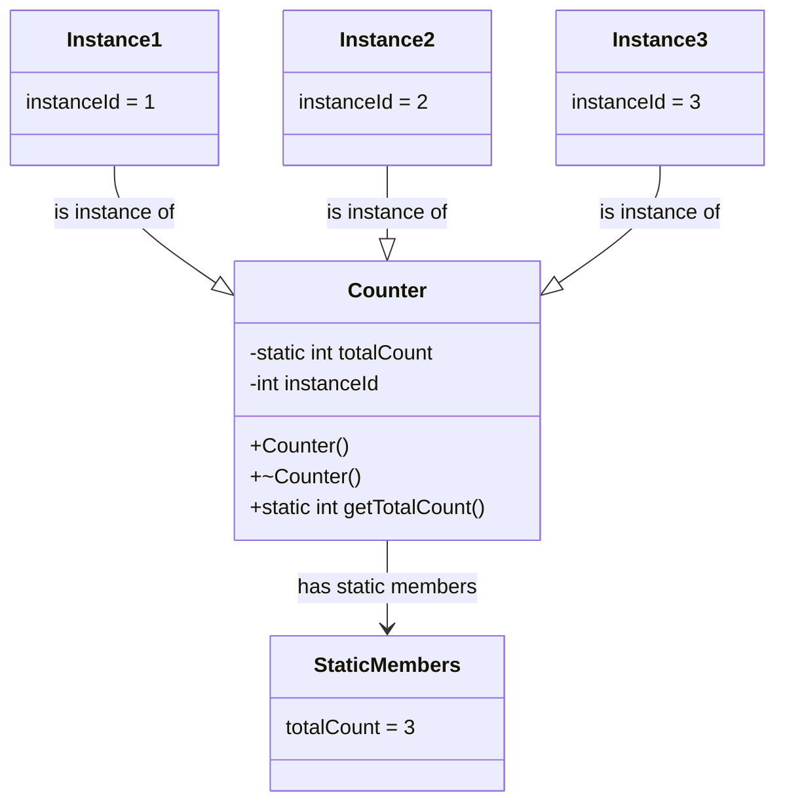

# C++ Static Members

## Introduction

In C++ object-oriented programming, **static members** are special class elements that belong to the class itself rather than to individual objects created from the class. They represent class-wide properties and behaviors that are shared across all instances of the class.

Static members come in two forms:
- **Static member variables** (data members)
- **Static member functions** (methods)

Understanding static members is crucial for writing efficient C++ code, as they provide a way to maintain data and functionality that needs to be shared across all objects of a class without duplicating memory or code.

## Static Member Variables

### What Are Static Member Variables?

Static member variables (also called static data members) are variables that:
- Belong to the class, not to objects
- Exist even when no objects of the class exist
- Are shared by all objects of the class
- Have only one copy in memory, regardless of how many objects are created

### Declaring and Defining Static Member Variables

Static member variables require a two-step process:

1. **Declaration** inside the class definition using the `static` keyword
2. **Definition** outside the class (usually in a .cpp file)

Let's see this in action:

```cpp
// Declaration in the class definition (usually in a .h file)
class Counter {
private:
    static int totalCount;  // Declaration of static member variable
    int instanceId;

public:
    Counter();
    ~Counter();
    static int getTotalCount();  // Static member function to access static data
};

// Definition outside the class (usually in a .cpp file)
int Counter::totalCount = 0;  // Initialize the static member variable

Counter::Counter() {
    totalCount++;      // Increment the shared counter
    instanceId = totalCount;
    std::cout << "Created counter #" << instanceId << std::endl;
}

Counter::~Counter() {
    std::cout << "Destroyed counter #" << instanceId << std::endl;
    totalCount--;
}

int Counter::getTotalCount() {
    return totalCount;
}
```

Here's how to use this class:

```cpp
#include <iostream>
#include "Counter.h"  // Assuming the class is in this header

int main() {
    std::cout << "Starting count: " << Counter::getTotalCount() << std::endl;
    
    // Create some counters
    Counter c1;
    Counter c2;
    
    std::cout << "After creating two counters: " << Counter::getTotalCount() << std::endl;
    
    {
        Counter c3;
        std::cout << "After creating another counter: " << Counter::getTotalCount() << std::endl;
    }  // c3 goes out of scope here
    
    std::cout << "After c3 is destroyed: " << Counter::getTotalCount() << std::endl;
    
    return 0;
}
```

**Output:**
```
Starting count: 0
Created counter #1
Created counter #2
After creating two counters: 2
Created counter #3
After creating another counter: 3
Destroyed counter #3
After c3 is destroyed: 2
Destroyed counter #2
Destroyed counter #1
```

### Key Points About Static Member Variables

- They must be defined exactly once outside the class
- They exist even before any objects of the class are created
- They can be accessed using the class name (e.g., `Counter::getTotalCount()`)
- They can also be accessed through any object of the class
- They don't contribute to the size of individual objects

## Static Member Functions

### What Are Static Member Functions?

Static member functions are methods that:
- Belong to the class, not to objects
- Can be called without creating an instance of the class
- Cannot access non-static members directly (they have no `this` pointer)
- Can only directly access other static members of the class

### Declaring and Using Static Member Functions

```cpp
class MathUtils {
public:
    static double pi;
    static double square(double num) {
        return num * num;
    }
    
    static double getCircleArea(double radius) {
        return pi * square(radius);
    }
};

// Define the static member variable
double MathUtils::pi = 3.14159265359;
```

Let's use this class:

```cpp
#include <iostream>

int main() {
    // No need to create an object
    std::cout << "Pi: " << MathUtils::pi << std::endl;
    std::cout << "3 squared: " << MathUtils::square(3) << std::endl;
    std::cout << "Area of circle with radius 5: " << MathUtils::getCircleArea(5) << std::endl;
    
    // Can change static members
    MathUtils::pi = 3.14;
    std::cout << "Area with rounded pi: " << MathUtils::getCircleArea(5) << std::endl;
    
    return 0;
}
```

**Output:**
```
Pi: 3.14159
3 squared: 9
Area of circle with radius 5: 78.5398
Area with rounded pi: 78.5
```

### Limitations of Static Member Functions

Static member functions cannot:
- Access non-static member variables or functions directly
- Use the `this` pointer (since they're not associated with an object)
- Be declared as `const`, `volatile`, or `virtual`

## Real-World Applications of Static Members

### 1. Counting Instances

As shown in our `Counter` example, static members are perfect for keeping track of how many objects of a class have been created.

### 2. Singleton Pattern

The Singleton design pattern ensures that a class has only one instance. Static members are central to this pattern:

```cpp
class Singleton {
private:
    static Singleton* instance;
    
    // Private constructor prevents direct instantiation
    Singleton() {
        std::cout << "Singleton instance created" << std::endl;
    }
    
public:
    // Public static method to access the instance
    static Singleton* getInstance() {
        if (instance == nullptr) {
            instance = new Singleton();
        }
        return instance;
    }
    
    void doSomething() {
        std::cout << "Singleton is doing something" << std::endl;
    }
};

// Initialize static member
Singleton* Singleton::instance = nullptr;
```

Using the singleton:

```cpp
int main() {
    // Get the singleton instance
    Singleton* s1 = Singleton::getInstance();
    s1->doSomething();
    
    // Try to get another instance
    Singleton* s2 = Singleton::getInstance();
    
    // Both pointers refer to the same instance
    std::cout << "Are s1 and s2 the same instance? " 
              << (s1 == s2 ? "Yes" : "No") << std::endl;
    
    return 0;
}
```

**Output:**
```
Singleton instance created
Singleton is doing something
Are s1 and s2 the same instance? Yes
```

### 3. Configuration Management

Static members can store global configuration values:

```cpp
class AppConfig {
private:
    static std::string serverUrl;
    static int maxConnections;
    static bool debugMode;
    
public:
    static void initialize(const std::string& url, int connections, bool debug) {
        serverUrl = url;
        maxConnections = connections;
        debugMode = debug;
    }
    
    static std::string getServerUrl() { return serverUrl; }
    static int getMaxConnections() { return maxConnections; }
    static bool isDebugMode() { return debugMode; }
};

// Initialize static members
std::string AppConfig::serverUrl = "http://localhost";
int AppConfig::maxConnections = 10;
bool AppConfig::debugMode = false;
```

### 4. Factory Methods

Static functions are often used as factory methods to create objects:

```cpp
class Shape {
public:
    virtual void draw() = 0;
    virtual ~Shape() {}
};

class Circle : public Shape {
public:
    void draw() override {
        std::cout << "Drawing a circle" << std::endl;
    }
};

class Rectangle : public Shape {
public:
    void draw() override {
        std::cout << "Drawing a rectangle" << std::endl;
    }
};

class ShapeFactory {
public:
    static Shape* createShape(const std::string& type) {
        if (type == "circle") {
            return new Circle();
        }
        else if (type == "rectangle") {
            return new Rectangle();
        }
        return nullptr;
    }
};
```

Using the factory:

```cpp
int main() {
    Shape* circle = ShapeFactory::createShape("circle");
    Shape* rectangle = ShapeFactory::createShape("rectangle");
    
    circle->draw();
    rectangle->draw();
    
    delete circle;
    delete rectangle;
    
    return 0;
}
```

**Output:**
```
Drawing a circle
Drawing a rectangle
```

## Static Constants and Constexpr

C++11 introduced the ability to initialize static constants directly inside the class:

```cpp
class MathConstants {
public:
    // Static const integral types can be initialized in-class
    static const int DIMENSIONS = 3;
    
    // Static constexpr can be used for any type (C++11 and later)
    static constexpr double PI = 3.14159265359;
    static constexpr double E = 2.71828182846;
};
```

No separate definition is needed for these types of static members.

## Class Diagrams

Here's a visual representation of how static members relate to objects:



## Common Pitfalls and Best Practices

### Pitfalls to Avoid

1. **Initialization Order**: Static member initialization happens in file inclusion order, which can lead to the "static initialization order fiasco" when one static depends on another from a different file.

2. **Thread Safety**: Static members are shared across all threads, which can lead to race conditions if not properly synchronized.

3. **Forgetting Definition**: Forgetting to define a static member outside the class (except for const/constexpr members).

### Best Practices

1. **Use for Class-Wide Concepts**: Only make members static when they truly represent a class-wide concept.

2. **Consider Thread Safety**: Use thread synchronization mechanisms when static members are accessed from multiple threads.

3. **Initialize Static Members Safely**: Use the Singleton pattern with thread-safe initialization.

4. **Prefer constexpr When Possible**: For constants, prefer `static constexpr` over `static const` for better compile-time optimization.

## Summary

Static members in C++ are powerful tools for creating class-wide properties and behaviors:

- **Static member variables** are shared across all instances of a class
- **Static member functions** belong to the class itself and can be called without creating objects
- Static members are useful for counting instances, implementing design patterns, managing global configurations, and creating factory methods
- Static members require careful handling regarding their initialization and thread safety

## Exercises

1. Create a `Logger` class with static methods for logging messages with different severity levels (info, warning, error).

2. Implement a `Bank` class with static member variables to track total deposits and withdrawals across all accounts.

3. Create a `UniqueID` class that generates a unique ID for each new instance using a static counter.

4. Implement the Singleton pattern for a `DatabaseConnection` class that manages a connection to a database.

5. Create a `MathUtils` class with static methods for common mathematical operations and constants.

## Additional Resources

- [C++ Reference: Static members](https://en.cppreference.com/w/cpp/language/static)
- "Effective C++" by Scott Meyers (discusses static member usage)
- "Design Patterns: Elements of Reusable Object-Oriented Software" by Gamma et al. (covers Singleton pattern)
- "Modern C++ Design" by Andrei Alexandrescu (advanced static member techniques)