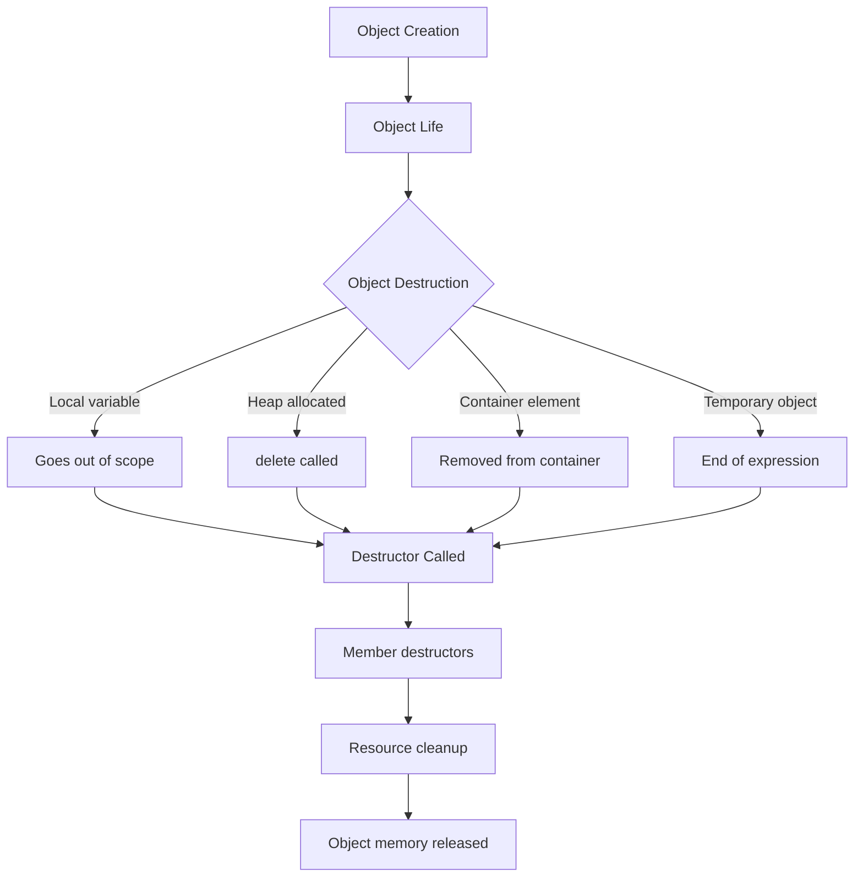

# C++ Destructors

## Introduction

In C++ object-oriented programming, **destructors** are special member functions that are automatically called when an object is destroyed or goes out of scope. Just as constructors initialize objects, destructors clean up resources before an object's memory is reclaimed.

Destructors are crucial for proper resource management in C++, especially when dealing with:
- Dynamically allocated memory (using `new`/`delete`)
- Open files
- Network connections
- Database connections
- Any resources that need explicit cleanup

## Understanding Destructors

### What is a Destructor?

A destructor is a member function that is called automatically when an object is destroyed. It has the following characteristics:

- Named with a tilde (~) followed by the class name: `~ClassName()`
- Takes no arguments
- Has no return type, not even void
- Cannot be overloaded (a class can have only one destructor)
- Cannot be declared as static or const

### When Are Destructors Called?

Destructors are automatically called in the following scenarios:

1. When a local object goes out of scope
2. When a program ends and global/static objects are destroyed
3. When `delete` is used on a pointer to an object
4. When a temporary object's lifetime ends
5. When an object stored in a container is removed

## Basic Destructor Syntax and Operation

Here's how to define a destructor:

```cpp
class MyClass {
public:
    // Constructor
    MyClass() {
        // Initialization code
    }
    
    // Destructor
    ~MyClass() {
        // Cleanup code
    }
};
```

Let's see a simple example:

```cpp
#include <iostream>

class Counter {
private:
    int* count;
public:
    // Constructor
    Counter() {
        count = new int(0);
        std::cout << "Constructor: Created a Counter object" << std::endl;
    }
    
    // Destructor
    ~Counter() {
        std::cout << "Destructor: Deleting Counter with value " << *count << std::endl;
        delete count;  // Free the memory
    }
    
    void increment() {
        (*count)++;
    }
    
    int getValue() const {
        return *count;
    }
};

int main() {
    std::cout << "Creating a Counter..." << std::endl;
    {  // Creating a new scope
        Counter c;
        c.increment();
        c.increment();
        std::cout << "Current count: " << c.getValue() << std::endl;
        // Destructor will be called when 'c' goes out of scope
    }
    std::cout << "After the Counter is destroyed" << std::endl;
    
    return 0;
}
```

Output:
```
Creating a Counter...
Constructor: Created a Counter object
Current count: 2
Destructor: Deleting Counter with value 2
After the Counter is destroyed
```

In this example, our `Counter` class allocates memory in its constructor and releases it in its destructor, preventing memory leaks.

## Destructor Rules and Best Practices

### 1. Virtual Destructors

When working with inheritance, it's important to make base class destructors virtual:

```cpp
#include <iostream>

class Base {
public:
    Base() { std::cout << "Base constructor" << std::endl; }
    virtual ~Base() { std::cout << "Base destructor" << std::endl; }
};

class Derived : public Base {
public:
    Derived() { std::cout << "Derived constructor" << std::endl; }
    ~Derived() { std::cout << "Derived destructor" << std::endl; }
};

int main() {
    // Case 1: Using a base pointer to a derived object
    Base* ptr = new Derived();
    delete ptr;  // Without virtual, only Base destructor would be called
    
    std::cout << "\n";
    
    // Case 2: Normal derived object creation
    Derived d;  // Both destructors will be called when d goes out of scope
    
    return 0;
}
```

Output:
```
Base constructor
Derived constructor
Derived destructor
Base destructor

Base constructor
Derived constructor
Derived destructor
Base destructor
```

Without the `virtual` keyword, deleting a derived object through a base pointer would only call the base class destructor, potentially leading to resource leaks.

### 2. Never Throw Exceptions from Destructors

Destructors should never throw exceptions. If an exception escapes a destructor during stack unwinding from another exception, the program will terminate immediately:

```cpp
class SafeClass {
public:
    ~SafeClass() {
        try {
            // Potentially throwing operation
            // ...
        } catch (const std::exception& e) {
            // Handle the exception within the destructor
            std::cerr << "Error during cleanup: " << e.what() << std::endl;
        }
    }
};
```

### 3. Release Resources in Reverse Order of Acquisition

Always release resources in the opposite order from which they were acquired:

```cpp
class ResourceManager {
private:
    FILE* fileHandle;
    int* buffer;
    
public:
    ResourceManager() {
        fileHandle = fopen("data.txt", "r");  // First resource
        buffer = new int[1000];               // Second resource
    }
    
    ~ResourceManager() {
        delete[] buffer;     // Release second resource first
        if (fileHandle) {
            fclose(fileHandle);  // Release first resource last
        }
    }
};
```

## RAII: Resource Acquisition Is Initialization

Destructors play a crucial role in the RAII (Resource Acquisition Is Initialization) idiom, which is a cornerstone of C++ resource management:

```cpp
#include <iostream>
#include <fstream>
#include <string>

class FileHandler {
private:
    std::fstream file;
    std::string filename;
    
public:
    // Constructor acquires the resource
    FileHandler(const std::string& name) : filename(name) {
        file.open(filename, std::ios::out);
        if (!file) {
            throw std::runtime_error("Could not open file: " + filename);
        }
        std::cout << "File opened: " << filename << std::endl;
    }
    
    // Write to file
    void write(const std::string& data) {
        if (file.is_open()) {
            file << data << std::endl;
        }
    }
    
    // Destructor releases the resource
    ~FileHandler() {
        if (file.is_open()) {
            file.close();
            std::cout << "File closed: " << filename << std::endl;
        }
    }
};

void processData() {
    // FileHandler automatically opens the file
    FileHandler log("logfile.txt");
    
    log.write("Processing started");
    
    // Do some work
    for (int i = 0; i < 3; i++) {
        log.write("Data point " + std::to_string(i));
    }
    
    log.write("Processing completed");
    
    // No need to explicitly close the file
    // The FileHandler destructor will be called automatically,
    // closing the file even if an exception occurs
}

int main() {
    try {
        processData();
    } catch (const std::exception& e) {
        std::cerr << "Error: " << e.what() << std::endl;
    }
    
    return 0;
}
```

Output:
```
File opened: logfile.txt
File closed: logfile.txt
```

In this example, the `FileHandler` class follows RAII by:
1. Acquiring the resource (opening the file) in the constructor
2. Providing methods to use the resource safely
3. Releasing the resource (closing the file) in the destructor

## Default Destructors

If you don't define a destructor, C++ will provide a default one that calls the destructors of the member objects. For simple classes without raw pointers or resources, this is often sufficient:

```cpp
class SimpleClass {
private:
    int x;
    std::string name; // std::string has its own destructor
    
public:
    SimpleClass(int val, const std::string& n) : x(val), name(n) {}
    
    // No destructor defined - compiler generates a default one
    // The default destructor will call the destructor for 'name'
};
```

## Real-World Application: Smart Resource Management

Here's a more complex example showing how destructors can be used to manage multiple resources:

```cpp
#include <iostream>
#include <fstream>
#include <string>
#include <vector>

class DatabaseConnection {
public:
    DatabaseConnection() { 
        std::cout << "Database connection established" << std::endl; 
    }
    
    ~DatabaseConnection() { 
        std::cout << "Database connection closed" << std::endl; 
    }
    
    void query(const std::string& q) {
        std::cout << "Executing query: " << q << std::endl;
    }
};

class LogManager {
private:
    std::ofstream logFile;
    
public:
    LogManager() { 
        logFile.open("app.log", std::ios::app);
        std::cout << "Log file opened" << std::endl; 
    }
    
    ~LogManager() {
        if (logFile.is_open()) {
            logFile.close();
            std::cout << "Log file closed" << std::endl;
        }
    }
    
    void log(const std::string& message) {
        if (logFile.is_open()) {
            logFile << message << std::endl;
        }
    }
};

class DataProcessor {
private:
    DatabaseConnection db;
    LogManager logger;
    std::vector<int>* data;
    
public:
    DataProcessor() : data(new std::vector<int>) {
        std::cout << "DataProcessor initialized" << std::endl;
    }
    
    ~DataProcessor() {
        // Clean up in reverse order of acquisition
        delete data;
        std::cout << "DataProcessor resources released" << std::endl;
        // db and logger will be destructed automatically
    }
    
    void process() {
        for (int i = 0; i < 5; i++) {
            data->push_back(i * 10);
        }
        
        logger.log("Processing data...");
        db.query("SELECT * FROM transactions");
        
        logger.log("Data processed: " + std::to_string(data->size()) + " items");
    }
};

int main() {
    std::cout << "Program starting" << std::endl;
    {
        DataProcessor processor;
        processor.process();
    }
    std::cout << "Program ending" << std::endl;
    
    return 0;
}
```

Output:
```
Program starting
Database connection established
Log file opened
DataProcessor initialized
Executing query: SELECT * FROM transactions
DataProcessor resources released
Log file closed
Database connection closed
Program ending
```

This example shows:
- Multiple resources being managed (database connection, log file, dynamic memory)
- Proper destruction order (most recently acquired resources destroyed first)
- Automatic cleanup regardless of how the function exits

## Mermaid Diagram: Destructor Lifecycle

Here's a diagram showing when destructors are called during an object's lifecycle:



## Summary

Destructors are essential components in C++ object-oriented programming:

- They automatically clean up resources when objects are destroyed
- They're crucial for implementing RAII (Resource Acquisition Is Initialization)
- They help prevent resource leaks, especially with dynamically allocated memory
- Base class destructors should be virtual when inheritance is used
- Destructors should never throw exceptions
- Resources should be released in reverse order of acquisition

Understanding destructors is key to writing robust, leak-free C++ code. They are one of the features that set C++ apart from garbage-collected languages, giving programmers precise control over resource management.

## Exercises

1. Create a class `DynamicArray` that manages an array of integers using dynamic memory allocation. Implement a constructor that allocates memory and a destructor that properly frees it.

2. Extend the `DynamicArray` class to include copy constructor and assignment operator to implement the Rule of Three.

3. Write a program that demonstrates polymorphic destruction by creating various shapes through base class pointers and ensuring all resources are properly cleaned up.

4. Implement a simple smart pointer class that uses a destructor to automatically delete the managed object when the smart pointer goes out of scope.

5. Design a resource manager class that opens multiple files and ensures they are properly closed when an object is destroyed, even if exceptions occur.

## Additional Resources

- [C++ Reference: Destructors](https://en.cppreference.com/w/cpp/language/destructor)
- [RAII: Resource Acquisition Is Initialization](https://en.cppreference.com/w/cpp/language/raii)
- Scott Meyers, "Effective C++: 55 Specific Ways to Improve Your Programs and Designs"
- Herb Sutter, "Exceptional C++: 47 Engineering Puzzles, Programming Problems, and Solutions"