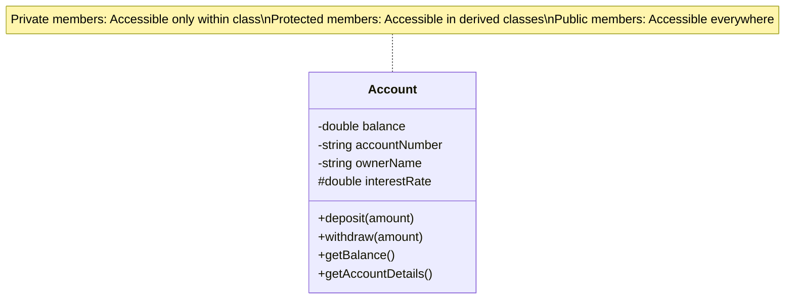

# C++ Access Modifiers

## Introduction

Access modifiers are a fundamental concept in Object-Oriented Programming (OOP) that control the visibility and accessibility of class members (attributes and methods). In C++, access modifiers help implement encapsulation, one of the four pillars of OOP, by restricting access to certain components of a class from outside entities.

C++ provides three main access modifiers:
- **public** - members are accessible from anywhere
- **private** - members are accessible only within the class
- **protected** - members are accessible within the class and its derived classes

Understanding these modifiers is crucial for designing well-structured, secure, and maintainable object-oriented programs.

## Access Modifiers Basics

### Public Access Modifier

When class members are declared as `public`, they can be accessed from anywhere in the program where the object is visible.

```cpp
#include <iostream>
using namespace std;

class Student {
public:  // Public access modifier
    string name;  // Public attribute
    int age;      // Public attribute
    
    // Public method
    void displayInfo() {
        cout << "Name: " << name << ", Age: " << age << endl;
    }
};

int main() {
    Student student1;
    
    // Directly accessing public members from outside the class
    student1.name = "Alice";  // Allowed
    student1.age = 20;        // Allowed
    student1.displayInfo();   // Allowed
    
    return 0;
}
```

**Output:**
```
Name: Alice, Age: 20
```

### Private Access Modifier

`private` members can only be accessed within the class they are declared in. They're not accessible from outside the class, including derived classes.

```cpp
#include <iostream>
using namespace std;

class BankAccount {
private:  // Private access modifier
    double balance;  // Private attribute
    string accountNumber;  // Private attribute
    
    // Private method
    bool isValidAmount(double amount) {
        return amount > 0;
    }
    
public:
    // Constructor
    BankAccount(string accNum, double initialBalance) {
        accountNumber = accNum;
        balance = initialBalance;
    }
    
    // Public methods to access private members
    void deposit(double amount) {
        if (isValidAmount(amount)) {
            balance += amount;
            cout << "Deposit successful. New balance: " << balance << endl;
        } else {
            cout << "Invalid amount for deposit." << endl;
        }
    }
    
    void displayBalance() {
        cout << "Account " << accountNumber << " has balance: " << balance << endl;
    }
};

int main() {
    BankAccount account("ACC123456", 1000.0);
    
    // account.balance = 2000.0;  // Error! Cannot access private member
    // account.accountNumber = "ACC789";  // Error! Cannot access private member
    // bool valid = account.isValidAmount(500);  // Error! Cannot access private method
    
    account.deposit(500.0);  // Allowed
    account.displayBalance();  // Allowed
    
    return 0;
}
```

**Output:**
```
Deposit successful. New balance: 1500
Account ACC123456 has balance: 1500
```

### Protected Access Modifier

`protected` members are accessible within the class they're declared in, as well as in any class derived from it. They're not accessible by objects of the class or from outside the class hierarchy.

```cpp
#include <iostream>
using namespace std;

class Person {
protected:  // Protected access modifier
    string name;
    int age;
    
public:
    Person(string n, int a) : name(n), age(a) {}
    
    void displayBasicInfo() {
        cout << "Name: " << name << ", Age: " << age << endl;
    }
};

class Employee : public Person {
private:
    string employeeId;
    double salary;
    
public:
    Employee(string n, int a, string id, double s) : Person(n, a) {
        employeeId = id;
        salary = s;
    }
    
    void displayEmployeeInfo() {
        // Can access protected members from the base class
        cout << "Employee: " << name << " (ID: " << employeeId << ")" << endl;
        cout << "Age: " << age << ", Salary: $" << salary << endl;
    }
};

int main() {
    Person person("John", 30);
    Employee employee("Jane", 28, "EMP101", 55000.0);
    
    // person.name = "John Doe";  // Error! Cannot access protected member
    // person.age = 31;  // Error! Cannot access protected member
    
    person.displayBasicInfo();  // Allowed
    employee.displayEmployeeInfo();  // Allowed
    
    return 0;
}
```

**Output:**
```
Name: John, Age: 30
Employee: Jane (ID: EMP101)
Age: 28, Salary: $55000
```

## Access Modifiers and Class Structure

In C++, class members are `private` by default, while in `struct`, members are `public` by default. This is actually the main difference between a `class` and a `struct` in C++.

```cpp
#include <iostream>
using namespace std;

class ClassExample {
    // Private by default
    int x;
    
public:
    int y;
    
    ClassExample(int a, int b) : x(a), y(b) {}
    
    void display() {
        cout << "ClassExample: x = " << x << ", y = " << y << endl;
    }
};

struct StructExample {
    // Public by default
    int x;
    int y;
    
private:
    int z;
    
public:
    StructExample(int a, int b, int c) : x(a), y(b), z(c) {}
    
    void display() {
        cout << "StructExample: x = " << x << ", y = " << y << ", z = " << z << endl;
    }
};

int main() {
    ClassExample classObj(5, 10);
    StructExample structObj(15, 20, 25);
    
    // classObj.x = 6;  // Error! x is private
    classObj.y = 11;    // OK
    
    structObj.x = 16;   // OK
    structObj.y = 21;   // OK
    // structObj.z = 26;  // Error! z is private
    
    classObj.display();
    structObj.display();
    
    return 0;
}
```

**Output:**
```
ClassExample: x = 5, y = 11
StructExample: x = 16, y = 21, z = 25
```

## Access Modifiers within Class Sections

You can use access modifiers multiple times within a class definition to create different sections:

```cpp
#include <iostream>
using namespace std;

class MixedAccess {
public:
    int publicVar1;
    
private:
    int privateVar1;
    
public:
    int publicVar2;
    
    MixedAccess() : publicVar1(1), privateVar1(2), publicVar2(3), protectedVar(4) {}
    
    void displayAll() {
        cout << "publicVar1 = " << publicVar1 << endl;
        cout << "privateVar1 = " << privateVar1 << endl;
        cout << "publicVar2 = " << publicVar2 << endl;
        cout << "protectedVar = " << protectedVar << endl;
    }
    
protected:
    int protectedVar;
};

int main() {
    MixedAccess obj;
    
    obj.publicVar1 = 10;
    // obj.privateVar1 = 20;  // Error! Cannot access private member
    obj.publicVar2 = 30;
    // obj.protectedVar = 40;  // Error! Cannot access protected member
    
    obj.displayAll();
    
    return 0;
}
```

**Output:**
```
publicVar1 = 10
privateVar1 = 2
publicVar2 = 30
protectedVar = 4
```

## Friend Functions and Classes

C++ provides the `friend` keyword that allows external functions or classes to access private and protected members of a class. This can be useful in certain scenarios but should be used sparingly as it breaks encapsulation.

```cpp
#include <iostream>
using namespace std;

class Rectangle {
private:
    int width, height;
    
public:
    Rectangle(int w, int h) : width(w), height(h) {}
    
    // Friend function declaration
    friend void displayRectangleInfo(const Rectangle& rect);
    
    // Friend class declaration
    friend class RectangleHelper;
};

// Friend function definition
void displayRectangleInfo(const Rectangle& rect) {
    // Can access private members of Rectangle
    cout << "Rectangle: width = " << rect.width << ", height = " << rect.height << endl;
}

// Friend class
class RectangleHelper {
public:
    static int calculateArea(const Rectangle& rect) {
        // Can access private members of Rectangle
        return rect.width * rect.height;
    }
    
    static void scaleRectangle(Rectangle& rect, double factor) {
        // Can modify private members of Rectangle
        rect.width *= factor;
        rect.height *= factor;
    }
};

int main() {
    Rectangle rect(5, 10);
    
    displayRectangleInfo(rect);
    
    cout << "Area: " << RectangleHelper::calculateArea(rect) << endl;
    
    RectangleHelper::scaleRectangle(rect, 1.5);
    displayRectangleInfo(rect);
    
    return 0;
}
```

**Output:**
```
Rectangle: width = 5, height = 10
Area: 50
Rectangle: width = 7, height = 15
```

## Real-World Example: Library Management System

Let's create a more comprehensive example of a simple library management system to demonstrate the use of access modifiers in a real-world scenario:

```cpp
#include <iostream>
#include <vector>
#include <string>
using namespace std;

class Date {
private:
    int day, month, year;
    
public:
    Date(int d, int m, int y) : day(d), month(m), year(y) {}
    
    string toString() const {
        return to_string(day) + "/" + to_string(month) + "/" + to_string(year);
    }
};

class Book {
private:
    string isbn;
    string title;
    string author;
    bool isAvailable;
    
public:
    Book(string i, string t, string a) 
        : isbn(i), title(t), author(a), isAvailable(true) {}
    
    string getIsbn() const { return isbn; }
    string getTitle() const { return title; }
    string getAuthor() const { return author; }
    bool getAvailability() const { return isAvailable; }
    
    void borrowBook() {
        if (isAvailable) {
            isAvailable = false;
            cout << "Book '" << title << "' has been borrowed." << endl;
        } else {
            cout << "Book '" << title << "' is not available for borrowing." << endl;
        }
    }
    
    void returnBook() {
        if (!isAvailable) {
            isAvailable = true;
            cout << "Book '" << title << "' has been returned." << endl;
        } else {
            cout << "Error: Book '" << title << "' was not borrowed." << endl;
        }
    }
    
    void displayInfo() const {
        cout << "ISBN: " << isbn << endl;
        cout << "Title: " << title << endl;
        cout << "Author: " << author << endl;
        cout << "Status: " << (isAvailable ? "Available" : "Borrowed") << endl;
    }
};

class Member {
private:
    string memberId;
    string name;
    vector<Book*> borrowedBooks;
    
protected:
    Date membershipDate;
    
public:
    Member(string id, string n, Date date) 
        : memberId(id), name(n), membershipDate(date) {}
    
    string getMemberId() const { return memberId; }
    string getName() const { return name; }
    
    void borrowBook(Book* book) {
        if (book->getAvailability()) {
            borrowedBooks.push_back(book);
            book->borrowBook();
        }
    }
    
    void returnBook(Book* book) {
        for (auto it = borrowedBooks.begin(); it != borrowedBooks.end(); ++it) {
            if ((*it)->getIsbn() == book->getIsbn()) {
                borrowedBooks.erase(it);
                book->returnBook();
                return;
            }
        }
        cout << "Error: Member " << name << " did not borrow this book." << endl;
    }
    
    void displayInfo() const {
        cout << "Member ID: " << memberId << endl;
        cout << "Name: " << name << endl;
        cout << "Membership Date: " << membershipDate.toString() << endl;
        cout << "Borrowed Books: " << borrowedBooks.size() << endl;
        
        if (!borrowedBooks.empty()) {
            cout << "Books currently borrowed:" << endl;
            for (const auto& book : borrowedBooks) {
                cout << "  - " << book->getTitle() << " by " << book->getAuthor() << endl;
            }
        }
    }
};

class PremiumMember : public Member {
private:
    int membershipPoints;
    
public:
    PremiumMember(string id, string n, Date date) 
        : Member(id, n, date), membershipPoints(0) {}
    
    void addPoints(int points) {
        membershipPoints += points;
        cout << "Added " << points << " points. New total: " << membershipPoints << endl;
    }
    
    void displayInfo() const {
        Member::displayInfo();
        cout << "Membership Points: " << membershipPoints << endl;
        cout << "Membership Date: " << membershipDate.toString() << endl; // Can access protected member
    }
};

class Library {
private:
    vector<Book> books;
    vector<Member*> members;
    
    // Private method for internal validation
    bool isValidMember(const string& memberId) const {
        for (const auto& member : members) {
            if (member->getMemberId() == memberId) {
                return true;
            }
        }
        return false;
    }
    
public:
    void addBook(const Book& book) {
        books.push_back(book);
    }
    
    void addMember(Member* member) {
        members.push_back(member);
    }
    
    Book* findBook(const string& isbn) {
        for (auto& book : books) {
            if (book.getIsbn() == isbn) {
                return &book;
            }
        }
        return nullptr;
    }
    
    Member* findMember(const string& memberId) {
        for (auto& member : members) {
            if (member->getMemberId() == memberId) {
                return member;
            }
        }
        return nullptr;
    }
    
    void borrowBook(const string& memberId, const string& isbn) {
        if (!isValidMember(memberId)) {
            cout << "Error: Invalid member ID." << endl;
            return;
        }
        
        Member* member = findMember(memberId);
        Book* book = findBook(isbn);
        
        if (book == nullptr) {
            cout << "Error: Book not found." << endl;
            return;
        }
        
        member->borrowBook(book);
    }
    
    void displayAllBooks() const {
        cout << "\n=== Library Books ===" << endl;
        for (const auto& book : books) {
            book.displayInfo();
            cout << "-------------------" << endl;
        }
    }
    
    void displayAllMembers() const {
        cout << "\n=== Library Members ===" << endl;
        for (const auto& member : members) {
            member->displayInfo();
            cout << "----------------------" << endl;
        }
    }
};

int main() {
    Library library;
    
    // Create some books
    Book book1("978-0262033848", "Introduction to Algorithms", "Thomas H. Cormen");
    Book book2("978-0134685991", "Effective Modern C++", "Scott Meyers");
    Book book3("978-0201633610", "Design Patterns", "Erich Gamma");
    
    // Add books to library
    library.addBook(book1);
    library.addBook(book2);
    library.addBook(book3);
    
    // Create some members
    Member* member1 = new Member("M001", "Alice Smith", Date(15, 6, 2022));
    PremiumMember* member2 = new PremiumMember("P001", "Bob Johnson", Date(20, 3, 2023));
    
    // Add members to library
    library.addMember(member1);
    library.addMember(member2);
    
    // Display initial library state
    library.displayAllBooks();
    library.displayAllMembers();
    
    // Borrow books
    library.borrowBook("M001", "978-0262033848");
    library.borrowBook("P001", "978-0134685991");
    
    // Add points to premium member
    member2->addPoints(50);
    
    // Display updated library state
    library.displayAllBooks();
    library.displayAllMembers();
    
    // Return a book
    Book* book = library.findBook("978-0262033848");
    member1->returnBook(book);
    
    // Final library state
    library.displayAllBooks();
    library.displayAllMembers();
    
    // Clean up
    delete member1;
    delete member2;
    
    return 0;
}
```

This example demonstrates:
- `private` members for internal data (like book details, member info)
- `protected` members for data accessible to derived classes (like membership date)
- `public` interfaces that allow controlled access to the class functionality
- Class hierarchy with inheritance showing access control across class boundaries

## Access Modifiers and Encapsulation

Access modifiers are key to implementing encapsulation, a fundamental principle of OOP that bundles data and methods operating on that data, restricting direct access to some of the object's components.



### Benefits of Proper Encapsulation:

1. **Data Protection**: Private members cannot be modified directly from outside the class
2. **Controlled Access**: Public methods provide a controlled interface to manipulate private data
3. **Flexibility**: Implementation can change without affecting code that uses the class
4. **Maintainability**: Easier to debug and maintain because the data is accessed in a controlled manner

## Best Practices for Using Access Modifiers

1. **Make data members private**: This prevents direct access and allows validation in setter methods
2. **Use public methods as interfaces**: Create public methods for controlled access to private data
3. **Minimize protected members**: Use protected only when derived classes genuinely need access
4. **Use friend declarations sparingly**: Excessive use of friends breaks encapsulation
5. **Keep the public interface minimal**: Only expose what's necessary for users of your class

## Summary

Access modifiers in C++ are essential tools for implementing encapsulation and controlling how class members can be accessed:

- **public**: Members are accessible from anywhere
- **private**: Members are accessible only within the class
- **protected**: Members are accessible within the class and derived classes

By properly using access modifiers, you can create more robust, maintainable, and secure object-oriented programs. Remember that good encapsulation is about exposing only what's necessary and keeping implementation details hidden.

## Additional Resources

- [C++ Documentation on Classes](https://en.cppreference.com/w/cpp/language/classes)
- [C++ Access Specifiers - W3Schools](https://www.w3schools.com/cpp/cpp_access_specifiers.asp)
- [Encapsulation in C++ - GeeksforGeeks](https://www.geeksforgeeks.org/encapsulation-in-c/)

## Exercises

1. Create a `BankAccount` class with private data members for balance and account number. Implement public methods for deposit, withdrawal, and checking balance.

2. Extend the `BankAccount` class to create `SavingsAccount` and `CheckingAccount` classes. Use protected members where appropriate.

3. Implement a `Student` class with private attributes for name, ID, and grades. Create public methods to add grades and calculate GPA.

4. Design a class hierarchy for shape objects (Circle, Rectangle, Triangle). Use appropriate access modifiers for the coordinates and dimensions.

5. Create a `Playlist` class that contains a private vector of `Song` objects. Implement public methods to add, remove, and shuffle songs.