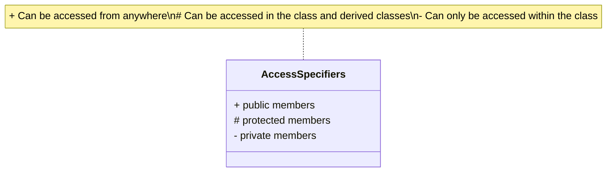

# C++ Encapsulation

## Introduction

Encapsulation is one of the four fundamental Object-Oriented Programming (OOP) principles in C++, alongside inheritance, polymorphism, and abstraction. At its core, encapsulation is about **bundling data and the methods that operate on that data into a single unit** (a class) and **restricting direct access** to some of the object's components.

Think of encapsulation like a protective capsule around your data - it helps you:

- Hide the implementation details of a class
- Protect data from unauthorized access
- Control how data is accessed and modified
- Create more maintainable and robust code

In this tutorial, we'll explore encapsulation in C++, understand its importance, and learn how to implement it effectively.

## Understanding Encapsulation

### Key Components of Encapsulation

Encapsulation in C++ involves two main aspects:

1. **Data Bundling**: Combining related variables and functions into a single unit (class)
2. **Data Hiding**: Restricting access to certain components using access specifiers

### Access Specifiers in C++

C++ provides three access specifiers to implement encapsulation:

- **public**: Members are accessible from outside the class
- **private**: Members are only accessible within the class
- **protected**: Similar to private, but accessible in derived classes (we'll cover this more when discussing inheritance)



## Implementing Encapsulation in C++

Let's see a basic example of encapsulation:

```cpp
#include <iostream>
#include <string>
using namespace std;

class BankAccount {
private:
    // Private data members (attributes)
    string accountHolderName;
    double balance;
    string accountNumber;
    
public:
    // Public member functions (methods)
    
    // Constructor
    BankAccount(string name, string accNum, double initialBalance) {
        accountHolderName = name;
        accountNumber = accNum;
        
        // We can add validation here
        if (initialBalance < 0) {
            balance = 0;
            cout << "Initial balance cannot be negative. Setting to 0." << endl;
        } else {
            balance = initialBalance;
        }
    }
    
    // Getter methods
    string getAccountHolderName() {
        return accountHolderName;
    }
    
    string getAccountNumber() {
        return accountNumber;
    }
    
    double getBalance() {
        return balance;
    }
    
    // Setter methods
    void setAccountHolderName(string name) {
        accountHolderName = name;
    }
    
    // Functionality methods
    void deposit(double amount) {
        if (amount > 0) {
            balance += amount;
            cout << amount << " deposited successfully." << endl;
        } else {
            cout << "Cannot deposit negative or zero amount." << endl;
        }
    }
    
    void withdraw(double amount) {
        if (amount <= 0) {
            cout << "Withdrawal amount must be positive." << endl;
        } else if (amount > balance) {
            cout << "Insufficient funds." << endl;
        } else {
            balance -= amount;
            cout << amount << " withdrawn successfully." << endl;
        }
    }
    
    void displayAccountInfo() {
        cout << "Account Holder: " << accountHolderName << endl;
        cout << "Account Number: " << accountNumber << endl;
        cout << "Current Balance: $" << balance << endl;
    }
};

int main() {
    // Create a bank account object
    BankAccount account1("John Doe", "AC1234567", 1000.0);
    
    // Display account information
    account1.displayAccountInfo();
    
    // Perform some operations
    account1.deposit(500.0);
    account1.withdraw(200.0);
    account1.withdraw(2000.0); // This should fail
    
    // Check the updated information
    account1.displayAccountInfo();
    
    // Change account holder name
    account1.setAccountHolderName("John Smith");
    cout << "Account holder name changed to: " << account1.getAccountHolderName() << endl;
    
    return 0;
}
```

**Output:**
```
Account Holder: John Doe
Account Number: AC1234567
Current Balance: $1000
500 deposited successfully.
200 withdrawn successfully.
Insufficient funds.
Account Holder: John Doe
Account Number: AC1234567
Current Balance: $1300
Account holder name changed to: John Smith
```

### Analysis of the Example

In this example:

1. **Data Bundling**: All the account-related data (`accountHolderName`, `balance`, `accountNumber`) and operations (deposit, withdraw) are bundled within the `BankAccount` class.

2. **Data Hiding**: The data members are declared as `private`, making them inaccessible from outside the class. This prevents direct manipulation of account information.

3. **Controlled Access**: Public methods like `deposit()`, `withdraw()`, and getters/setters provide controlled access to private data.

4. **Data Validation**: The class methods ensure data integrity by validating inputs (no negative deposits, no withdrawals exceeding balance).

## Benefits of Encapsulation

### 1. Data Protection

By making data members private, we protect them from unintended modifications:

```cpp
// This would cause a compilation error
account1.balance = -5000; // Error: 'balance' is a private member
```

Instead, we must use the provided methods which include validation:

```cpp
account1.withdraw(5000); // This is checked and denied if insufficient funds
```

### 2. Flexibility to Change Implementation

Encapsulation allows you to change the internal implementation without affecting code that uses the class:

```cpp
class BankAccount {
private:
    // We could change how we store data internally
    struct AccountData {
        string name;
        double balance;
        string number;
    };
    AccountData data;
    
public:
    // But the interface stays the same
    double getBalance() {
        return data.balance; // Changed implementation
    }
    // Other methods...
};
```

### 3. Better Maintainability

When code is properly encapsulated, bugs are easier to locate and fix since data manipulation is centralized in the class methods.

## Real-World Application: Student Information System

Let's see encapsulation in a more practical context with a Student Information System:

```cpp
#include <iostream>
#include <string>
#include <vector>
using namespace std;

class Course {
private:
    string courseCode;
    string courseName;
    int credits;
    
public:
    Course(string code, string name, int cred) : 
           courseCode(code), courseName(name), credits(cred) {}
    
    string getCode() const { return courseCode; }
    string getName() const { return courseName; }
    int getCredits() const { return credits; }
};

class Student {
private:
    // Private data members
    string studentId;
    string name;
    string dateOfBirth;
    vector<Course> enrolledCourses;
    double gpa;
    
    // Private utility method
    void recalculateGPA() {
        // Simplified GPA calculation (in a real system this would be more complex)
        double totalGradePoints = 0.0;
        int totalCredits = 0;
        
        // Just a dummy calculation for demonstration
        for (const Course& course : enrolledCourses) {
            totalCredits += course.getCredits();
        }
        
        if (totalCredits > 0) {
            gpa = 3.5; // Dummy value, in real system this would be calculated
        } else {
            gpa = 0.0;
        }
    }
    
public:
    // Constructor
    Student(string id, string studentName, string dob) : 
            studentId(id), name(studentName), dateOfBirth(dob), gpa(0.0) {}
    
    // Getters
    string getId() const { return studentId; }
    string getName() const { return name; }
    string getDOB() const { return dateOfBirth; }
    double getGPA() const { return gpa; }
    
    // Functionality
    void enrollInCourse(const Course& course) {
        // Check if already enrolled (simplified)
        for (const Course& c : enrolledCourses) {
            if (c.getCode() == course.getCode()) {
                cout << "Already enrolled in " << course.getName() << endl;
                return;
            }
        }
        
        enrolledCourses.push_back(course);
        cout << "Enrolled in " << course.getName() << " successfully." << endl;
        recalculateGPA();
    }
    
    void dropCourse(string courseCode) {
        for (auto it = enrolledCourses.begin(); it != enrolledCourses.end(); ++it) {
            if (it->getCode() == courseCode) {
                cout << "Dropped course: " << it->getName() << endl;
                enrolledCourses.erase(it);
                recalculateGPA();
                return;
            }
        }
        cout << "Course not found in enrolled courses." << endl;
    }
    
    void displayStudentInfo() const {
        cout << "\n--- Student Information ---" << endl;
        cout << "ID: " << studentId << endl;
        cout << "Name: " << name << endl;
        cout << "Date of Birth: " << dateOfBirth << endl;
        cout << "GPA: " << gpa << endl;
        cout << "Enrolled Courses:" << endl;
        
        if (enrolledCourses.empty()) {
            cout << "  None" << endl;
        } else {
            for (const Course& course : enrolledCourses) {
                cout << "  " << course.getCode() << " - " 
                     << course.getName() << " (" 
                     << course.getCredits() << " credits)" << endl;
            }
        }
        cout << "-------------------------\n" << endl;
    }
};

int main() {
    // Create courses
    Course cs101("CS101", "Introduction to Programming", 3);
    Course cs102("CS102", "Data Structures", 4);
    Course math101("MATH101", "Calculus I", 4);
    
    // Create a student
    Student student1("S12345", "Alice Johnson", "2001-05-15");
    
    // Display initial info
    student1.displayStudentInfo();
    
    // Enroll in courses
    student1.enrollInCourse(cs101);
    student1.enrollInCourse(math101);
    student1.displayStudentInfo();
    
    // Try enrolling in the same course again
    student1.enrollInCourse(cs101);
    
    // Drop a course
    student1.dropCourse("CS101");
    student1.displayStudentInfo();
    
    // Enroll in another course
    student1.enrollInCourse(cs102);
    student1.displayStudentInfo();
    
    return 0;
}
```

**Output:**
```
--- Student Information ---
ID: S12345
Name: Alice Johnson
Date of Birth: 2001-05-15
GPA: 0
Enrolled Courses:
  None
-------------------------

Enrolled in Introduction to Programming successfully.
Enrolled in Calculus I successfully.

--- Student Information ---
ID: S12345
Name: Alice Johnson
Date of Birth: 2001-05-15
GPA: 3.5
Enrolled Courses:
  CS101 - Introduction to Programming (3 credits)
  MATH101 - Calculus I (4 credits)
-------------------------

Already enrolled in Introduction to Programming
Dropped course: Introduction to Programming

--- Student Information ---
ID: S12345
Name: Alice Johnson
Date of Birth: 2001-05-15
GPA: 3.5
Enrolled Courses:
  MATH101 - Calculus I (4 credits)
-------------------------

Enrolled in Data Structures successfully.

--- Student Information ---
ID: S12345
Name: Alice Johnson
Date of Birth: 2001-05-15
GPA: 3.5
Enrolled Courses:
  MATH101 - Calculus I (4 credits)
  CS102 - Data Structures (4 credits)
-------------------------
```

### Analysis of the Student Information System

This example demonstrates several important encapsulation principles:

1. **Information Hiding**: Student details like ID, name, and GPA are private and cannot be directly modified.

2. **Controlled Access**: Methods like `enrollInCourse()` and `dropCourse()` provide controlled ways to modify the student's state.

3. **Internal Implementation**: The `recalculateGPA()` method is private because it's an internal implementation detail not meant to be called from outside.

4. **Business Logic**: Validation logic (checking for duplicate course enrollment) is encapsulated within the class methods.

5. **Class Relationships**: The `Student` class contains `Course` objects, demonstrating composition as another form of encapsulation.

## Best Practices for Encapsulation

1. **Make Class Members Private by Default**: Only expose what's necessary through public methods.

2. **Use Getters and Setters Judiciously**: Don't automatically create getters/setters for every attribute; only add them when needed.

3. **Validate Data in Setters**: Always validate input data before assigning it to private members.

4. **Implement Immutable Data When Appropriate**: For some attributes (like ID), consider making them read-only.

5. **Keep Public Interfaces Simple**: A well-encapsulated class should hide complexity and expose a clean, intuitive interface.

## Encapsulation vs Abstraction

While closely related, encapsulation and abstraction serve different purposes:

- **Encapsulation** is about bundling data and methods together and restricting access (the "how").
- **Abstraction** is about hiding complex implementation details and showing only essential features (the "what").

An analogy: A car's engine is **encapsulated** under the hood (hidden), while the steering wheel and pedals provide an **abstraction** for controlling the car (simplified interface).

## Summary

Encapsulation is a powerful OOP principle that allows you to:

- Group related data and functions into a single unit
- Hide implementation details
- Control access to data through well-defined interfaces
- Ensure data integrity through validation
- Create more maintainable, modular code

By properly encapsulating your classes, you make your code more robust, easier to maintain, and less prone to bugs. It's an essential practice for building well-structured C++ applications.

## Exercises

To solidify your understanding of encapsulation, try these exercises:

1. Create a `Rectangle` class with private attributes for length and width. Add methods to calculate area and perimeter, and ensure that length and width cannot be set to negative values.

2. Extend the `BankAccount` example to include a transaction history that records all deposits and withdrawals.

3. Create a `Library` class that manages a collection of books. Include functionality to add books, check books out to patrons, and return books. Use encapsulation to ensure books can only be added by librarians.

4. Modify the `Student` class to include a grade system, where each enrolled course has an associated grade. Ensure that grades can only be set by authorized users.

## Additional Resources

- [C++ Classes and Objects](https://www.cplusplus.com/doc/tutorial/classes/)
- [Object-Oriented Programming Concepts](https://docs.oracle.com/javase/tutorial/java/concepts/)
- [Effective C++](https://www.amazon.com/Effective-Specific-Improve-Programs-Designs/dp/0321334876) by Scott Meyers
- [C++ Primer](https://www.amazon.com/Primer-5th-Stanley-B-Lippman/dp/0321714113) by Stanley B. Lippman

Happy coding!