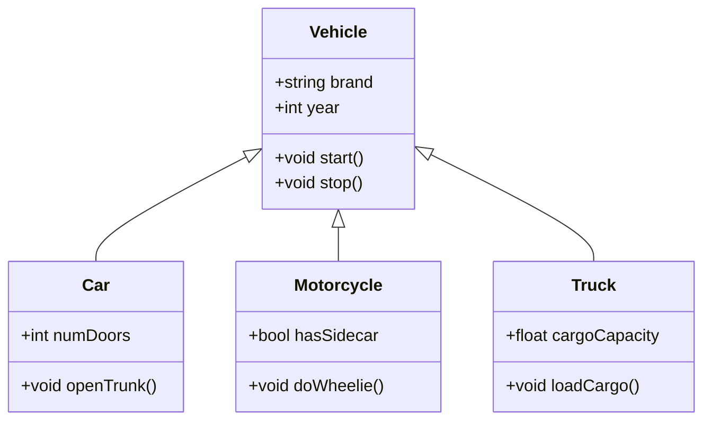

# C++ Inheritance

## Introduction

Inheritance is one of the four fundamental concepts of object-oriented programming (alongside encapsulation, abstraction, and polymorphism). It allows a class (called a derived class or subclass) to inherit attributes and methods from another class (called a base class or parent class). This powerful mechanism enables code reuse, establishes relationships between classes, and supports the concept of hierarchy.

In this tutorial, we'll explore:
- What inheritance is and why it's useful
- The syntax and types of inheritance in C++
- How to create and work with derived classes
- Access specifiers in inheritance
- Function overriding and virtual functions
- Real-world applications of inheritance

## Basic Inheritance Concept

Inheritance represents an "is-a" relationship. For example, a Car "is-a" Vehicle, or a Dog "is-a" Animal. This relationship allows us to model real-world hierarchies in our code.



## Basic Syntax of Inheritance

Here's the basic syntax for creating a derived class in C++:

```cpp
class BaseClass {
    // Base class members
};

class DerivedClass : access_specifier BaseClass {
    // Derived class members
};
```

The `access_specifier` can be:
- `public`: Public and protected members of the base class become public and protected members of the derived class
- `protected`: Public and protected members of the base class become protected members of the derived class
- `private`: Public and protected members of the base class become private members of the derived class

If you don't specify an access specifier, it defaults to `private` for classes.

## Your First Inheritance Example

Let's create a simple example of inheritance with a `Person` class as the base class and a `Student` class as the derived class:

```cpp
#include <iostream>
#include <string>
using namespace std;

// Base class
class Person {
protected:
    string name;
    int age;
    
public:
    Person(string n, int a) : name(n), age(a) {}
    
    void introduce() {
        cout << "Hi, my name is " << name << " and I am " << age << " years old." << endl;
    }
};

// Derived class
class Student : public Person {
private:
    string studentId;
    string major;
    
public:
    Student(string n, int a, string id, string m) : 
        Person(n, a), // Call base class constructor
        studentId(id), 
        major(m) {}
    
    void study() {
        cout << name << " is studying " << major << "." << endl;
    }
    
    void displayStudentInfo() {
        cout << "Student ID: " << studentId << endl;
        cout << "Major: " << major << endl;
    }
};

int main() {
    // Create a Person object
    Person person("John", 30);
    person.introduce();
    
    cout << endl;
    
    // Create a Student object
    Student student("Alice", 20, "S12345", "Computer Science");
    student.introduce(); // Inherited from Person
    student.study();     // Defined in Student
    student.displayStudentInfo();
    
    return 0;
}
```

**Output:**
```
Hi, my name is John and I am 30 years old.

Hi, my name is Alice and I am 20 years old.
Alice is studying Computer Science.
Student ID: S12345
Major: Computer Science
```

In this example:
1. `Person` is our base class with `name` and `age` attributes
2. `Student` is a derived class that inherits from `Person` using public inheritance
3. The `Student` class adds its own attributes (`studentId` and `major`) and methods
4. The `Student` constructor calls the `Person` constructor to initialize the inherited attributes
5. The `Student` class can access the protected `name` member from `Person`
6. The `Student` object can use the `introduce()` method inherited from `Person`

## Types of Inheritance in C++

C++ supports five types of inheritance:

1. **Single Inheritance**: A derived class inherits from only one base class
   ```cpp
   class Animal {};
   class Dog : public Animal {};
   ```

2. **Multiple Inheritance**: A derived class inherits from more than one base class
   ```cpp
   class Animal {};
   class Pet {};
   class Dog : public Animal, public Pet {};
   ```

3. **Multilevel Inheritance**: A derived class inherits from a class that itself is derived from another class
   ```cpp
   class Animal {};
   class Mammal : public Animal {};
   class Dog : public Mammal {};
   ```

4. **Hierarchical Inheritance**: Multiple derived classes inherit from a single base class
   ```cpp
   class Animal {};
   class Dog : public Animal {};
   class Cat : public Animal {};
   ```

5. **Hybrid Inheritance**: A combination of two or more types of inheritance
   ```cpp
   class Animal {};
   class Mammal : public Animal {};
   class Pet {};
   class Dog : public Mammal, public Pet {};
   ```

## Access Specifiers in Inheritance

Understanding how access specifiers work with inheritance is crucial:

```cpp
#include <iostream>
using namespace std;

class Base {
public:
    int publicVar;
protected:
    int protectedVar;
private:
    int privateVar;
    
public:
    Base() : publicVar(1), protectedVar(2), privateVar(3) {}
    
    void display() {
        cout << "Base class: " << endl;
        cout << "Public: " << publicVar << endl;
        cout << "Protected: " << protectedVar << endl;
        cout << "Private: " << privateVar << endl;
    }
};

class PublicDerived : public Base {
public:
    void display() {
        cout << "PublicDerived class: " << endl;
        cout << "Public from base: " << publicVar << endl;        // Accessible
        cout << "Protected from base: " << protectedVar << endl;  // Accessible
        // cout << "Private from base: " << privateVar << endl;   // Not accessible
    }
};

class ProtectedDerived : protected Base {
public:
    void display() {
        cout << "ProtectedDerived class: " << endl;
        cout << "Public from base: " << publicVar << endl;        // Accessible
        cout << "Protected from base: " << protectedVar << endl;  // Accessible
        // cout << "Private from base: " << privateVar << endl;   // Not accessible
    }
};

class PrivateDerived : private Base {
public:
    void display() {
        cout << "PrivateDerived class: " << endl;
        cout << "Public from base: " << publicVar << endl;        // Accessible
        cout << "Protected from base: " << protectedVar << endl;  // Accessible
        // cout << "Private from base: " << privateVar << endl;   // Not accessible
    }
};

int main() {
    Base base;
    PublicDerived pubDerived;
    ProtectedDerived protDerived;
    PrivateDerived privDerived;
    
    // Accessing base class members
    base.publicVar = 10;               // Accessible
    // base.protectedVar = 20;         // Not accessible
    // base.privateVar = 30;           // Not accessible
    
    // Accessing PublicDerived members
    pubDerived.publicVar = 40;         // Accessible
    // pubDerived.protectedVar = 50;   // Not accessible
    // pubDerived.privateVar = 60;     // Not accessible
    
    // Accessing ProtectedDerived members
    // protDerived.publicVar = 70;     // Not accessible (becomes protected)
    // protDerived.protectedVar = 80;  // Not accessible
    // protDerived.privateVar = 90;    // Not accessible
    
    // Accessing PrivateDerived members
    // privDerived.publicVar = 100;    // Not accessible (becomes private)
    // privDerived.protectedVar = 110; // Not accessible
    // privDerived.privateVar = 120;   // Not accessible
    
    base.display();
    cout << endl;
    pubDerived.display();
    cout << endl;
    protDerived.display();
    cout << endl;
    privDerived.display();
    
    return 0;
}
```

**Output:**
```
Base class: 
Public: 10
Protected: 2
Private: 3

PublicDerived class: 
Public from base: 40
Protected from base: 2

ProtectedDerived class: 
Public from base: 1
Protected from base: 2

PrivateDerived class: 
Public from base: 1
Protected from base: 2
```

This example demonstrates how access specifiers affect member accessibility in derived classes.

## Function Overriding and Inheritance

Function overriding occurs when a derived class provides a specific implementation for a function already defined in its base class. This is a key aspect of polymorphism.

```cpp
#include <iostream>
using namespace std;

class Animal {
public:
    void makeSound() {
        cout << "Animal makes a generic sound" << endl;
    }
};

class Dog : public Animal {
public:
    // Override the makeSound function
    void makeSound() {
        cout << "Dog barks: Woof! Woof!" << endl;
    }
};

class Cat : public Animal {
public:
    // Override the makeSound function
    void makeSound() {
        cout << "Cat meows: Meow!" << endl;
    }
};

int main() {
    Animal animal;
    Dog dog;
    Cat cat;
    
    animal.makeSound();
    dog.makeSound();
    cat.makeSound();
    
    return 0;
}
```

**Output:**
```
Animal makes a generic sound
Dog barks: Woof! Woof!
Cat meows: Meow!
```

### Using `override` Keyword (C++11 and later)

The `override` keyword helps ensure that you're actually overriding a base class function and not creating a new one:

```cpp
class Animal {
public:
    virtual void makeSound() {
        cout << "Animal makes a generic sound" << endl;
    }
};

class Dog : public Animal {
public:
    // Using override keyword makes it explicit
    void makeSound() override {
        cout << "Dog barks: Woof! Woof!" << endl;
    }
};
```

## Virtual Functions and Polymorphism

Virtual functions allow us to achieve runtime polymorphism. When a function is declared as `virtual` in a base class, C++ determines which function to call at runtime based on the actual object type, not the reference or pointer type.

```cpp
#include <iostream>
using namespace std;

class Animal {
public:
    virtual void makeSound() {
        cout << "Animal makes a generic sound" << endl;
    }
    
    // Virtual destructor is important when using polymorphism
    virtual ~Animal() {
        cout << "Animal destructor called" << endl;
    }
};

class Dog : public Animal {
public:
    void makeSound() override {
        cout << "Dog barks: Woof! Woof!" << endl;
    }
    
    ~Dog() override {
        cout << "Dog destructor called" << endl;
    }
};

class Cat : public Animal {
public:
    void makeSound() override {
        cout << "Cat meows: Meow!" << endl;
    }
    
    ~Cat() override {
        cout << "Cat destructor called" << endl;
    }
};

int main() {
    // Polymorphism through pointers
    Animal* animals[3];
    animals[0] = new Animal();
    animals[1] = new Dog();
    animals[2] = new Cat();
    
    for (int i = 0; i < 3; i++) {
        animals[i]->makeSound();  // Virtual function call
    }
    
    // Clean up
    for (int i = 0; i < 3; i++) {
        delete animals[i];  // Virtual destructor ensures proper cleanup
    }
    
    return 0;
}
```

**Output:**
```
Animal makes a generic sound
Dog barks: Woof! Woof!
Cat meows: Meow!
Animal destructor called
Dog destructor called
Animal destructor called
Cat destructor called
Animal destructor called
```

## Constructors and Destructors in Inheritance

When an object of a derived class is created:
1. The base class constructor is called first
2. Then the derived class constructor is executed

When an object is destroyed:
1. The derived class destructor is called first
2. Then the base class destructor is called

```cpp
#include <iostream>
using namespace std;

class Base {
public:
    Base() {
        cout << "Base constructor called" << endl;
    }
    
    ~Base() {
        cout << "Base destructor called" << endl;
    }
};

class Derived : public Base {
public:
    Derived() {
        cout << "Derived constructor called" << endl;
    }
    
    ~Derived() {
        cout << "Derived destructor called" << endl;
    }
};

int main() {
    cout << "Creating a Derived object:" << endl;
    {
        Derived d;  // Create an object in a local scope
    }
    cout << "Derived object destroyed" << endl;
    
    return 0;
}
```

**Output:**
```
Creating a Derived object:
Base constructor called
Derived constructor called
Derived destructor called
Base destructor called
Derived object destroyed
```

## Real-World Application: Shape Hierarchy

Let's create a more practical example using shapes:

```cpp
#include <iostream>
#include <vector>
#include <cmath>
using namespace std;

// Base class
class Shape {
protected:
    string name;

public:
    Shape(string n) : name(n) {}
    
    // Pure virtual function makes Shape an abstract class
    virtual double area() const = 0;
    
    // Virtual function that can be overridden
    virtual double perimeter() const = 0;
    
    string getName() const {
        return name;
    }
    
    virtual void display() const {
        cout << "Shape: " << name << endl;
        cout << "Area: " << area() << endl;
        cout << "Perimeter: " << perimeter() << endl;
    }
    
    virtual ~Shape() {}
};

// Derived class
class Circle : public Shape {
private:
    double radius;
    
public:
    Circle(double r) : Shape("Circle"), radius(r) {}
    
    double area() const override {
        return M_PI * radius * radius;
    }
    
    double perimeter() const override {
        return 2 * M_PI * radius;
    }
    
    double getRadius() const {
        return radius;
    }
};

// Derived class
class Rectangle : public Shape {
private:
    double width;
    double height;
    
public:
    Rectangle(double w, double h) : Shape("Rectangle"), width(w), height(h) {}
    
    double area() const override {
        return width * height;
    }
    
    double perimeter() const override {
        return 2 * (width + height);
    }
    
    double getWidth() const {
        return width;
    }
    
    double getHeight() const {
        return height;
    }
};

// Derived from Rectangle
class Square : public Rectangle {
public:
    Square(double side) : Rectangle(side, side) {
        name = "Square"; // Modifying the inherited name
    }
    
    // No need to override area() or perimeter() - they work from Rectangle
    
    double getSide() const {
        return getWidth(); // Width and height are the same
    }
};

// Function to process any shape
void processShape(const Shape& shape) {
    shape.display();
    cout << "--------------------------------" << endl;
}

int main() {
    // Create different shapes
    Circle circle(5.0);
    Rectangle rectangle(4.0, 6.0);
    Square square(4.0);
    
    // Store shapes in a vector
    vector<Shape*> shapes;
    shapes.push_back(&circle);
    shapes.push_back(&rectangle);
    shapes.push_back(&square);
    
    // Process all shapes polymorphically
    cout << "Shape Information:" << endl;
    cout << "================================" << endl;
    for (const auto& shape : shapes) {
        processShape(*shape);
    }
    
    return 0;
}
```

**Output:**
```
Shape Information:
================================
Shape: Circle
Area: 78.5398
Perimeter: 31.4159
--------------------------------
Shape: Rectangle
Area: 24
Perimeter: 20
--------------------------------
Shape: Square
Area: 16
Perimeter: 16
--------------------------------
```

This example demonstrates several key inheritance concepts:
1. `Shape` is an abstract base class with pure virtual functions
2. `Circle` and `Rectangle` inherit from `Shape` and implement the abstract methods
3. `Square` inherits from `Rectangle`, reusing its area and perimeter calculations
4. We use polymorphism to process different shapes through a common interface

## Inheritance and Memory Layout

Understanding how inheritance affects memory layout can be helpful:

```
Base class memory layout:
+----------------+
| Base members   |
+----------------+

Derived class memory layout:
+----------------+
| Base members   |
+----------------+
| Derived members|
+----------------+
```

The derived class object contains all the base class members, followed by its own members.

## Common Inheritance Pitfalls

1. **Object Slicing**: Occurs when a derived class object is assigned to a base class object, losing derived class-specific members.

```cpp
Dog dog;
Animal animal = dog; // Object slicing - dog-specific members are lost
animal.makeSound();  // Calls Animal::makeSound(), not Dog::makeSound()
```

2. **Multiple Inheritance Ambiguity**: The famous "diamond problem" occurs with multiple inheritance.

```cpp
class A { public: void show(); };
class B : public A {};
class C : public A {};
class D : public B, public C {}; // Diamond problem

D d;
d.show(); // Ambiguous - is it B::show() or C::show()?
```

This can be resolved using virtual inheritance:

```cpp
class B : virtual public A {};
class C : virtual public A {};
```

## Summary

Inheritance is a powerful feature of C++ that enables:
- Code reuse through base classes
- Establishing "is-a" relationships between classes
- Implementing polymorphic behavior
- Creating well-organized class hierarchies

We've covered:
- The basics of inheritance syntax and types
- Access specifiers and their effects on inheritance
- Function overriding and virtual functions
- Constructors and destructors in inheritance context
- Practical applications with a shape hierarchy example

Inheritance is a key component of object-oriented programming, but it should be used judiciously. Always prefer composition over inheritance when the relationship between classes is more of a "has-a" than an "is-a" relationship.

## Additional Resources

To deepen your understanding of C++ inheritance:

1. [C++ Documentation on Inheritance](https://en.cppreference.com/w/cpp/language/derived_class)
2. "Effective C++" by Scott Meyers (especially items related to inheritance and polymorphism)
3. "C++ Primer" by Stanley Lippman
4. "Design Patterns: Elements of Reusable Object-Oriented Software" by Gamma, Helm, Johnson, and Vlissides

## Exercises

1. Create a base class `Vehicle` with properties like `brand`, `year`, and methods like `start()`, `stop()`. Then create derived classes `Car`, `Motorcycle`, and `Truck`.

2. Implement a class hierarchy for a banking system with a `BankAccount` base class and derived classes like `SavingsAccount`, `CheckingAccount`, and `FixedDeposit`.

3. Create a shape hierarchy that includes `Triangle` and `Ellipse` classes in addition to our example classes.

4. Implement a simple game character system with a `Character` base class and different character types as derived classes.

5. Create a class hierarchy to model an e-commerce system with classes for `Product`, `PhysicalProduct`, `DigitalProduct`, and `SubscriptionProduct`.