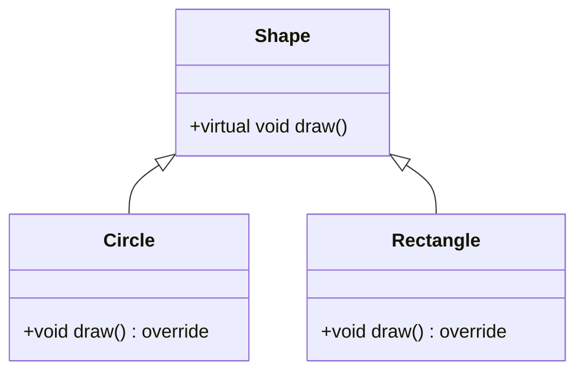

# C++ Polymorphism

## Introduction

Polymorphism is one of the four fundamental principles of object-oriented programming (OOP), alongside encapsulation, inheritance, and abstraction. The word "polymorphism" comes from Greek roots meaning "many forms," and in programming, it allows objects of different classes to be treated as objects of a common base class.

In C++, polymorphism enables you to write code that can work with objects of multiple types without needing to know their specific class at compile time. This creates more flexible, maintainable, and extensible code.

In this tutorial, we'll explore:
- What polymorphism is and why it's important
- Runtime polymorphism with virtual functions
- Compile-time polymorphism with function overloading and operators
- Abstract classes and pure virtual functions
- Practical examples showing polymorphism in action

## Understanding Polymorphism in C++

Polymorphism in C++ comes in two main forms:

1. **Compile-time Polymorphism (Static Binding)**: Achieved through function overloading and operator overloading.
2. **Run-time Polymorphism (Dynamic Binding)**: Implemented using virtual functions and inheritance.

Let's explore each type in detail.

## Compile-time Polymorphism

### Function Overloading

Function overloading occurs when multiple functions have the same name but different parameters. The compiler determines which function to call based on the arguments passed.

```cpp
#include <iostream>
using namespace std;

class Calculator {
public:
    // Overloaded functions
    int add(int a, int b) {
        return a + b;
    }
    
    float add(float a, float b) {
        return a + b;
    }
    
    int add(int a, int b, int c) {
        return a + b + c;
    }
};

int main() {
    Calculator calc;
    
    cout << "Adding two integers: " << calc.add(5, 3) << endl;
    cout << "Adding two floats: " << calc.add(3.5f, 2.7f) << endl;
    cout << "Adding three integers: " << calc.add(1, 2, 3) << endl;
    
    return 0;
}
```

**Output:**
```
Adding two integers: 8
Adding two floats: 6.2
Adding three integers: 6
```

Here, the `add` function is overloaded with different parameter types and numbers, and the appropriate version is selected at compile time.

### Operator Overloading

C++ also allows operators to be overloaded, enabling custom behavior when operators are used with user-defined types.

```cpp
#include <iostream>
using namespace std;

class Complex {
private:
    double real;
    double imag;
    
public:
    Complex(double r = 0, double i = 0) : real(r), imag(i) {}
    
    // Overload the + operator
    Complex operator+(const Complex& other) {
        return Complex(real + other.real, imag + other.imag);
    }
    
    void display() {
        cout << real << " + " << imag << "i";
    }
};

int main() {
    Complex c1(3.0, 4.0);
    Complex c2(1.5, 2.5);
    
    // Using the overloaded + operator
    Complex c3 = c1 + c2;
    
    cout << "c1 = "; c1.display(); cout << endl;
    cout << "c2 = "; c2.display(); cout << endl;
    cout << "c1 + c2 = "; c3.display(); cout << endl;
    
    return 0;
}
```

**Output:**
```
c1 = 3 + 4i
c2 = 1.5 + 2.5i
c1 + c2 = 4.5 + 6.5i
```

## Runtime Polymorphism

Runtime polymorphism is achieved through virtual functions and inheritance. It lets you defer the decision of which function to call until runtime.

### Virtual Functions

A virtual function is a member function that is declared in a base class and redefined in derived classes. When you refer to a derived class object using a pointer or reference to the base class, you can call a virtual function for that object and execute the derived class's version.

```cpp
#include <iostream>
using namespace std;

class Shape {
public:
    virtual void draw() {
        cout << "Drawing a shape" << endl;
    }
};

class Circle : public Shape {
public:
    void draw() override {
        cout << "Drawing a circle" << endl;
    }
};

class Rectangle : public Shape {
public:
    void draw() override {
        cout << "Drawing a rectangle" << endl;
    }
};

int main() {
    Shape* shape1 = new Circle();
    Shape* shape2 = new Rectangle();
    Shape* shape3 = new Shape();
    
    shape1->draw();  // Calls Circle's draw
    shape2->draw();  // Calls Rectangle's draw
    shape3->draw();  // Calls Shape's draw
    
    delete shape1;
    delete shape2;
    delete shape3;
    
    return 0;
}
```

**Output:**
```
Drawing a circle
Drawing a rectangle
Drawing a shape
```

The `virtual` keyword tells the compiler to perform dynamic binding (late binding) on this function. The `override` keyword (introduced in C++11) is optional but recommended as it helps catch errors if the function signature doesn't match a virtual function in the base class.

### How Virtual Functions Work

When a class contains virtual functions, the compiler creates a virtual function table (vtable) for that class. Each object of the class has a hidden pointer (vptr) that points to this vtable. At runtime, when a virtual function is called through a base class pointer, the vtable is used to resolve which function to execute.



## Virtual Destructors

When using polymorphism, it's essential to make base class destructors virtual. This ensures that when an object is deleted through a base class pointer, the derived class's destructor is called.

```cpp
#include <iostream>
using namespace std;

class Base {
public:
    Base() {
        cout << "Base constructor" << endl;
    }
    
    virtual ~Base() {
        cout << "Base destructor" << endl;
    }
};

class Derived : public Base {
public:
    Derived() {
        cout << "Derived constructor" << endl;
    }
    
    ~Derived() override {
        cout << "Derived destructor" << endl;
    }
};

int main() {
    Base* b = new Derived();
    delete b;  // Will call both destructors because Base's destructor is virtual
    
    return 0;
}
```

**Output:**
```
Base constructor
Derived constructor
Derived destructor
Base destructor
```

Without the `virtual` keyword for the base class destructor, only the base class destructor would be called, potentially leading to memory leaks.

## Abstract Classes and Pure Virtual Functions

An abstract class is a class that contains at least one pure virtual function. A pure virtual function is a virtual function with no implementation in the base class, indicated by `= 0`.

Abstract classes cannot be instantiated directly; they serve as interfaces that derived classes must implement.

```cpp
#include <iostream>
#include <vector>
using namespace std;

// Abstract class
class Animal {
public:
    // Pure virtual function
    virtual void makeSound() = 0;
    
    // Regular virtual function
    virtual void eat() {
        cout << "Animal is eating" << endl;
    }
    
    virtual ~Animal() {}
};

class Dog : public Animal {
public:
    // Must implement the pure virtual function
    void makeSound() override {
        cout << "Woof!" << endl;
    }
    
    // Can override other virtual functions too
    void eat() override {
        cout << "Dog is eating" << endl;
    }
};

class Cat : public Animal {
public:
    void makeSound() override {
        cout << "Meow!" << endl;
    }
};

int main() {
    // Animal animal; // Error: Cannot instantiate an abstract class
    
    vector<Animal*> animals;
    animals.push_back(new Dog());
    animals.push_back(new Cat());
    
    for (Animal* animal : animals) {
        animal->makeSound();
        animal->eat();
        cout << "-------------------" << endl;
    }
    
    // Clean up
    for (Animal* animal : animals) {
        delete animal;
    }
    
    return 0;
}
```

**Output:**
```
Woof!
Dog is eating
-------------------
Meow!
Animal is eating
-------------------
```

## Real-world Application: Game Characters

Let's create a practical example of polymorphism for a simple game with different character types.

```cpp
#include <iostream>
#include <vector>
#include <string>
using namespace std;

// Base class
class Character {
protected:
    string name;
    int health;
    int power;
    
public:
    Character(string n, int h, int p) : name(n), health(h), power(p) {}
    
    virtual void attack() = 0;
    virtual void specialAbility() = 0;
    
    virtual void displayInfo() {
        cout << "Name: " << name << endl;
        cout << "Health: " << health << endl;
        cout << "Power: " << power << endl;
    }
    
    virtual ~Character() {}
};

// Derived classes
class Warrior : public Character {
public:
    Warrior(string n) : Character(n, 200, 80) {}
    
    void attack() override {
        cout << name << " swings a mighty sword!" << endl;
    }
    
    void specialAbility() override {
        cout << name << " performs Whirlwind Attack, hitting all enemies!" << endl;
    }
    
    void displayInfo() override {
        cout << "Warrior ";
        Character::displayInfo();
    }
};

class Mage : public Character {
private:
    int mana;
    
public:
    Mage(string n) : Character(n, 120, 150), mana(200) {}
    
    void attack() override {
        cout << name << " casts a fireball!" << endl;
    }
    
    void specialAbility() override {
        cout << name << " casts Arcane Explosion, damaging all nearby enemies!" << endl;
    }
    
    void displayInfo() override {
        cout << "Mage ";
        Character::displayInfo();
        cout << "Mana: " << mana << endl;
    }
};

class Archer : public Character {
private:
    int arrows;
    
public:
    Archer(string n) : Character(n, 150, 100), arrows(50) {}
    
    void attack() override {
        cout << name << " shoots an arrow!" << endl;
    }
    
    void specialAbility() override {
        cout << name << " fires a volley of arrows!" << endl;
    }
    
    void displayInfo() override {
        cout << "Archer ";
        Character::displayInfo();
        cout << "Arrows: " << arrows << endl;
    }
};

// Game class that uses polymorphism
class Game {
private:
    vector<Character*> characters;
    
public:
    void addCharacter(Character* character) {
        characters.push_back(character);
    }
    
    void showAllCharacters() {
        cout << "\n=== All Characters ===\n";
        for (auto character : characters) {
            character->displayInfo();
            cout << endl;
        }
    }
    
    void simulateBattle() {
        cout << "\n=== Battle Simulation ===\n";
        for (auto character : characters) {
            character->attack();
            character->specialAbility();
            cout << endl;
        }
    }
    
    ~Game() {
        for (auto character : characters) {
            delete character;
        }
    }
};

int main() {
    Game gameWorld;
    
    gameWorld.addCharacter(new Warrior("Aragorn"));
    gameWorld.addCharacter(new Mage("Gandalf"));
    gameWorld.addCharacter(new Archer("Legolas"));
    
    gameWorld.showAllCharacters();
    gameWorld.simulateBattle();
    
    return 0;
}
```

**Output:**
```
=== All Characters ===
Warrior Name: Aragorn
Health: 200
Power: 80

Mage Name: Gandalf
Health: 120
Power: 150
Mana: 200

Archer Name: Legolas
Health: 150
Power: 100
Arrows: 50

=== Battle Simulation ===
Aragorn swings a mighty sword!
Aragorn performs Whirlwind Attack, hitting all enemies!

Gandalf casts a fireball!
Gandalf casts Arcane Explosion, damaging all nearby enemies!

Legolas shoots an arrow!
Legolas fires a volley of arrows!
```

This example demonstrates how polymorphism allows you to:
1. Define a common interface (the `Character` class)
2. Implement specialized behavior in derived classes
3. Work with objects of different types through a common interface

## Considerations and Best Practices

1. **Always make destructors virtual** in base classes when using inheritance.
2. **Use the `override` keyword** (C++11 and later) when overriding virtual functions.
3. **Be careful with slicing**: When a derived class object is assigned to a base class object (not a pointer or reference), the derived part gets "sliced off."
4. **Consider using `final`** (C++11) for classes or virtual functions that shouldn't be derived from or overridden.
5. **Avoid deep inheritance hierarchies**: They can become difficult to understand and maintain.

## Summary

Polymorphism is a powerful feature of C++ that enables more flexible and extensible code. We've covered:

- **Compile-time polymorphism**:
  - Function overloading
  - Operator overloading

- **Runtime polymorphism**:
  - Virtual functions
  - Virtual destructors
  - Abstract classes and pure virtual functions

- **Practical applications** of polymorphism in game development

By leveraging polymorphism, you can write code that works with objects of different types through a common interface, making your code more modular and easier to extend.

## Exercises

1. Create a `Shape` hierarchy with a base `Shape` class and derived classes like `Circle`, `Rectangle`, and `Triangle`. Implement a `calculateArea()` virtual function that each derived class overrides.

2. Implement a simple text-based adventure game with different character classes (similar to our game example), but add an inventory system and interaction between characters.

3. Create a basic banking system with an abstract `Account` class and derived classes like `SavingsAccount`, `CheckingAccount`, and `LoanAccount`, each with different behaviors for deposits, withdrawals, and interest calculations.

## Further Reading

- [C++ Virtual Functions (cppreference.com)](https://en.cppreference.com/w/cpp/language/virtual)
- [Abstract Classes in C++ (GeeksforGeeks)](https://www.geeksforgeeks.org/pure-virtual-functions-and-abstract-classes-in-c/)
- "Effective C++" by Scott Meyers - Chapter on inheritance and object-oriented design
- "Design Patterns: Elements of Reusable Object-Oriented Software" by Gamma, Helm, Johnson, and Vlissides - For more advanced polymorphic design patterns

Happy coding with polymorphism!