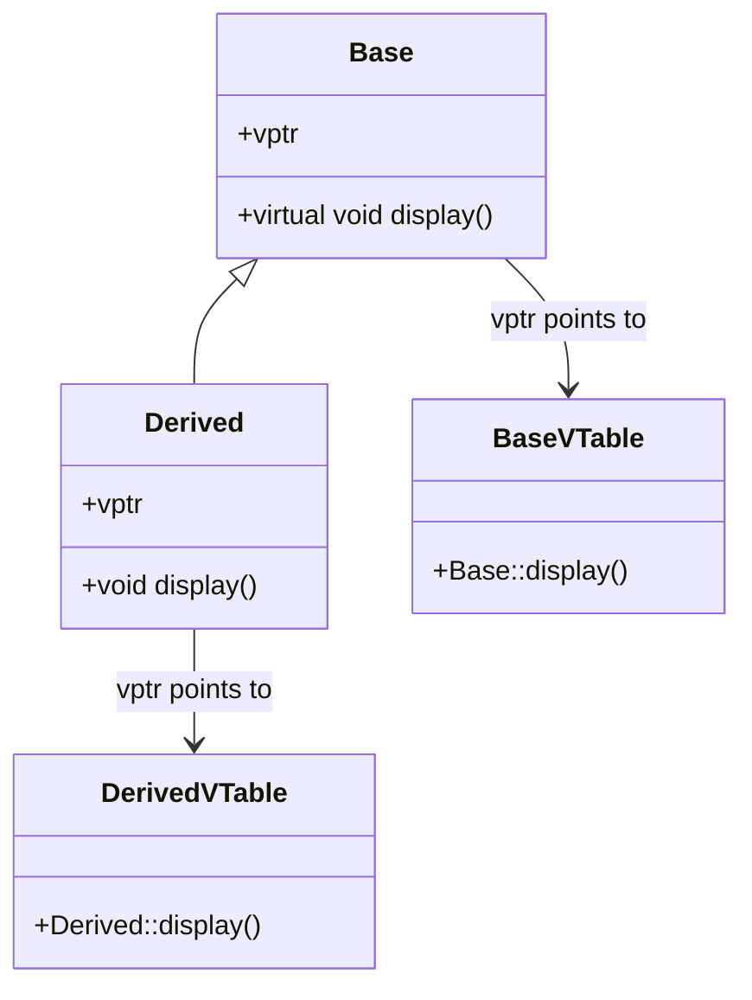

# C++ Virtual Functions

## Introduction

Virtual functions are a fundamental concept in C++ object-oriented programming that enables **polymorphism** - one of the four pillars of OOP. They allow a program to call methods that are appropriate for an object's type, even when that object is being referenced by a pointer or reference of a base class type.

In this tutorial, we'll explore:
- What virtual functions are
- How they enable runtime polymorphism
- The mechanics of virtual function tables
- Best practices for using virtual functions
- Real-world applications

## What Are Virtual Functions?

In C++, a virtual function is a member function in a base class that you expect to be redefined in derived classes. When you refer to a derived class object using a pointer or reference to the base class, you can call a virtual function for that object and execute the derived class's version of the function.

Virtual functions are declared with the `virtual` keyword in the base class and are automatically considered virtual in all derived classes.

## The Problem Virtual Functions Solve

Let's first understand the problem virtual functions solve. Consider this example without virtual functions:

```cpp
#include <iostream>
using namespace std;

class Base {
public:
    void display() {
        cout << "Display from Base class" << endl;
    }
};

class Derived : public Base {
public:
    void display() {
        cout << "Display from Derived class" << endl;
    }
};

int main() {
    Derived derivedObj;
    Base* basePtr = &derivedObj;
    
    // Calls Base's display even though basePtr points to a Derived object
    basePtr->display();
    
    return 0;
}
```

**Output:**
```
Display from Base class
```

Wait, that's not what we might expect! Even though `basePtr` points to a `Derived` object, the `Base` class's `display()` method is called. This is because C++ uses **static binding** by default, which means the function call is resolved at compile time based on the pointer's type, not the object it points to.

## Implementing Virtual Functions

Here's how we solve this problem using virtual functions:

```cpp
#include <iostream>
using namespace std;

class Base {
public:
    virtual void display() {
        cout << "Display from Base class" << endl;
    }
};

class Derived : public Base {
public:
    void display() override {
        cout << "Display from Derived class" << endl;
    }
};

int main() {
    Derived derivedObj;
    Base* basePtr = &derivedObj;
    
    // Now calls Derived's display because the function is virtual
    basePtr->display();
    
    return 0;
}
```

**Output:**
```
Display from Derived class
```

By adding the `virtual` keyword to the base class's function and the `override` keyword to the derived class's function (the latter is optional but recommended), we've enabled **dynamic binding**. Now the function call is resolved at runtime based on the actual type of the object, not the pointer type.

## How Virtual Functions Work: The Virtual Table (vtable)

When a class contains virtual functions, the compiler creates a special table called the **virtual table** (vtable) for that class. Each class with virtual functions has its own vtable containing function pointers to its virtual functions.

Additionally, objects of classes with virtual functions contain a hidden pointer (vptr) that points to their class's vtable. This mechanism allows the program to determine at runtime which function to call.



This vtable mechanism is what enables dynamic binding, allowing the correct function to be called based on the object's actual type rather than the pointer's type.

## Pure Virtual Functions and Abstract Classes

A **pure virtual function** is a virtual function that has no implementation in the base class and must be implemented by any concrete derived class. It is declared using the `= 0` syntax:

```cpp
class Shape {
public:
    virtual double area() = 0;  // Pure virtual function
    virtual double perimeter() = 0;  // Pure virtual function
};
```

A class containing at least one pure virtual function is called an **abstract class**. Abstract classes:
- Cannot be instantiated
- Serve as interfaces that derived classes must implement
- Can contain implemented methods and data members

Here's a complete example:

```cpp
#include <iostream>
using namespace std;

class Shape {
public:
    virtual double area() = 0;  // Pure virtual function
    virtual double perimeter() = 0;  // Pure virtual function
    virtual void display() {
        cout << "Area: " << area() << endl;
        cout << "Perimeter: " << perimeter() << endl;
    }
    virtual ~Shape() {}  // Virtual destructor (more on this below)
};

class Circle : public Shape {
private:
    double radius;
public:
    Circle(double r) : radius(r) {}
    
    double area() override {
        return 3.14159 * radius * radius;
    }
    
    double perimeter() override {
        return 2 * 3.14159 * radius;
    }
};

class Rectangle : public Shape {
private:
    double width, height;
public:
    Rectangle(double w, double h) : width(w), height(h) {}
    
    double area() override {
        return width * height;
    }
    
    double perimeter() override {
        return 2 * (width + height);
    }
};

int main() {
    // Shape shape; // Error: Cannot instantiate abstract class
    
    Circle circle(5);
    Rectangle rectangle(4, 6);
    
    Shape* shapes[2] = {&circle, &rectangle};
    
    for (Shape* shape : shapes) {
        shape->display();
        cout << "---------------" << endl;
    }
    
    return 0;
}
```

**Output:**
```
Area: 78.5398
Perimeter: 31.4159
---------------
Area: 24
Perimeter: 20
---------------
```

## Virtual Destructors

When using polymorphism, it's crucial to declare the base class's destructor as virtual. This ensures that when an object is deleted through a base class pointer, the correct destructor chain is called (derived class's destructor first, then base class's).

```cpp
#include <iostream>
using namespace std;

class Base {
public:
    Base() {
        cout << "Base constructor" << endl;
    }
    virtual ~Base() {
        cout << "Base destructor" << endl;
    }
};

class Derived : public Base {
public:
    Derived() {
        cout << "Derived constructor" << endl;
    }
    ~Derived() {
        cout << "Derived destructor" << endl;
    }
};

int main() {
    Base* ptr = new Derived();
    delete ptr;  // Without virtual destructor, only Base's destructor would be called
    
    return 0;
}
```

**Output:**
```
Base constructor
Derived constructor
Derived destructor
Base destructor
```

If we removed the `virtual` keyword from `~Base()`, we would get:

```
Base constructor
Derived constructor
Base destructor
```

This would lead to a memory leak because the Derived part of the object would not be properly cleaned up.

## The `override` and `final` Specifiers

C++11 introduced the `override` and `final` specifiers to help prevent errors in virtual function declarations:

### The `override` Specifier

The `override` specifier ensures that the function is actually overriding a virtual function from a base class. If it's not, the compiler will generate an error.

```cpp
class Base {
public:
    virtual void foo() { }
};

class Derived : public Base {
public:
    void foo() override { }  // OK
    void bar() override { }  // Error: no function to override
};
```

### The `final` Specifier

The `final` specifier prevents a function or class from being overridden or derived from further:

```cpp
class Base {
public:
    virtual void foo() { }
};

class Derived : public Base {
public:
    void foo() final { }  // No further derived classes can override this
};

class Further : public Derived {
public:
    void foo() { }  // Error: cannot override final function
};
```

## Real-World Application: Game Engine Entity System

Let's look at a practical example of virtual functions in a simple game engine entity system:

```cpp
#include <iostream>
#include <vector>
#include <string>

class GameObject {
private:
    std::string name;
    float x, y;

public:
    GameObject(const std::string& name, float x, float y) 
        : name(name), x(x), y(y) {}
    
    virtual void update(float deltaTime) = 0;
    virtual void render() = 0;
    
    virtual std::string getType() const = 0;
    
    void setPosition(float newX, float newY) {
        x = newX;
        y = newY;
    }
    
    std::string getName() const { return name; }
    float getX() const { return x; }
    float getY() const { return y; }
    
    virtual ~GameObject() {}
};

class Player : public GameObject {
private:
    int health;
    float speed;
    
public:
    Player(const std::string& name, float x, float y)
        : GameObject(name, x, y), health(100), speed(5.0f) {}
    
    void update(float deltaTime) override {
        // In a real game, we would handle player input and physics here
        std::cout << "Updating player " << getName() << " with dt=" << deltaTime << std::endl;
    }
    
    void render() override {
        std::cout << "Rendering player " << getName() << " at (" 
                  << getX() << ", " << getY() << ")" << std::endl;
    }
    
    std::string getType() const override {
        return "Player";
    }
};

class Enemy : public GameObject {
private:
    int damage;
    
public:
    Enemy(const std::string& name, float x, float y)
        : GameObject(name, x, y), damage(10) {}
    
    void update(float deltaTime) override {
        // In a real game, we would handle AI behavior here
        std::cout << "Updating enemy " << getName() << " with dt=" << deltaTime << std::endl;
    }
    
    void render() override {
        std::cout << "Rendering enemy " << getName() << " at (" 
                  << getX() << ", " << getY() << ")" << std::endl;
    }
    
    std::string getType() const override {
        return "Enemy";
    }
};

class GameWorld {
private:
    std::vector<GameObject*> gameObjects;
    
public:
    void addGameObject(GameObject* obj) {
        gameObjects.push_back(obj);
    }
    
    void updateAll(float deltaTime) {
        for (auto obj : gameObjects) {
            obj->update(deltaTime);
        }
    }
    
    void renderAll() {
        for (auto obj : gameObjects) {
            obj->render();
        }
    }
    
    ~GameWorld() {
        for (auto obj : gameObjects) {
            delete obj;
        }
    }
};

int main() {
    GameWorld world;
    
    world.addGameObject(new Player("Hero", 10.0f, 20.0f));
    world.addGameObject(new Enemy("Goblin", 30.0f, 40.0f));
    world.addGameObject(new Enemy("Orc", 50.0f, 60.0f));
    
    // Game loop (simplified)
    float deltaTime = 0.016f;  // ~60 fps
    world.updateAll(deltaTime);
    world.renderAll();
    
    return 0;
}
```

**Output:**
```
Updating player Hero with dt=0.016
Updating enemy Goblin with dt=0.016
Updating enemy Orc with dt=0.016
Rendering player Hero at (10, 20)
Rendering enemy Goblin at (30, 40)
Rendering enemy Orc at (50, 60)
```

In this example:
1. `GameObject` is an abstract base class with pure virtual functions
2. `Player` and `Enemy` implement the virtual functions differently
3. `GameWorld` interacts with game objects polymorphically through base class pointers
4. The appropriate override is called for each object type

This architecture is scalable and maintainable because:
- You can add new game object types without changing the game world code
- The behavior is encapsulated in each class
- Common functionality is defined once in the base class

## Best Practices for Virtual Functions

1. **Always make destructors virtual** in base classes
2. **Use the `override` specifier** for derived class functions to catch errors
3. **Make your base class interface narrow and stable** to minimize the impact of changes
4. **Avoid deep inheritance hierarchies** (prefer composition over inheritance when possible)
5. **Be mindful of performance costs** - virtual functions have a small overhead due to the vtable lookup
6. **Use pure virtual functions** when derived classes must implement the functionality
7. **Keep virtual functions non-static, non-inline, and non-template**

## Summary

In this tutorial, we've explored virtual functions in C++ and their critical role in enabling polymorphism. We've learned:

- Virtual functions allow base class pointers to call the appropriate derived class methods
- How the vtable mechanism works behind the scenes
- Pure virtual functions and abstract classes
- Why virtual destructors are essential
- Best practices for using virtual functions effectively
- A real-world application in a game entity system

Virtual functions are a powerful tool that allows you to write flexible, extendable code following the "Open-Closed Principle" – open for extension but closed for modification. By mastering virtual functions, you can create elegant object-oriented designs that efficiently model complex systems.

## Exercises

1. Create a `Shape` hierarchy with classes `Circle`, `Rectangle`, and `Triangle`. Implement virtual functions for calculating area and perimeter.

2. Implement a simple file system model with a base class `FSItem` and derived classes `File` and `Directory`. Include virtual functions for getting size, printing details, etc.

3. Create a `Vehicle` class hierarchy with different vehicle types. Include virtual functions for calculating fuel efficiency, maximum speed, etc.

4. Extend the game engine example with additional game object types and behaviors.

5. Implement a class hierarchy for GUI elements with virtual functions for drawing, handling input, etc.

## Additional Resources

- [C++ Core Guidelines on Virtual Functions](https://isocpp.github.io/CppCoreGuidelines/CppCoreGuidelines#Rh-virtual)
- [C++ Virtual Functions on cppreference.com](https://en.cppreference.com/w/cpp/language/virtual)
- [Design Patterns: Elements of Reusable Object-Oriented Software](https://www.amazon.com/Design-Patterns-Elements-Reusable-Object-Oriented/dp/0201633612) - Many design patterns rely on virtual functions