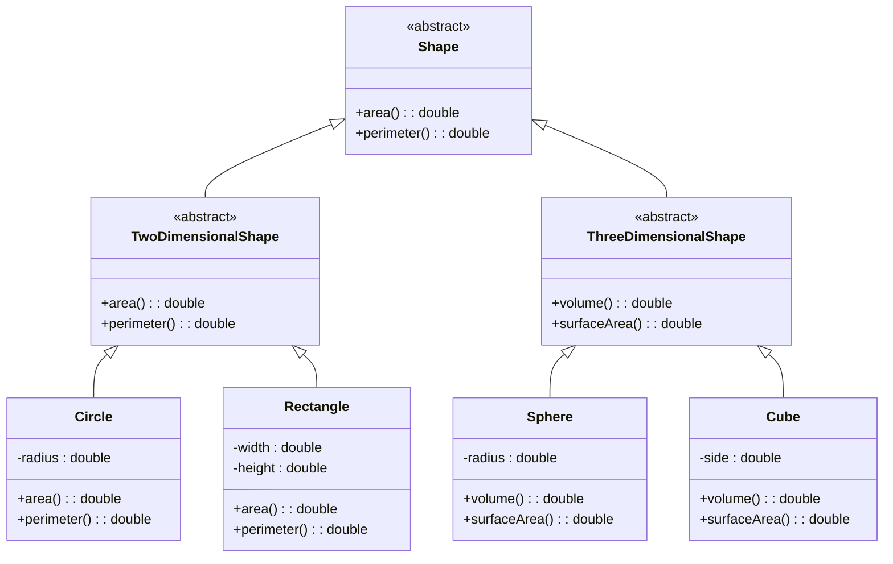

# C++ Abstract Classes

## Introduction

Abstract classes are a fundamental concept in C++ object-oriented programming that allows you to create blueprints for other classes without implementing all the functionality. They serve as a template for derived classes, ensuring that certain methods are defined while allowing flexibility in how they're implemented.

An abstract class is a class that cannot be instantiated on its own and is designed to be used as a base class for other classes. It typically contains at least one **pure virtual function** - a function that has no implementation in the abstract class and must be implemented by any concrete (non-abstract) derived class.

## Why Use Abstract Classes?

Abstract classes are useful when:

1. You want to define a common interface for a group of related classes
2. You need to establish a contract that derived classes must fulfill
3. You want to share code among several closely related classes
4. You want to prevent users from creating objects of a base class when it doesn't make sense

## Pure Virtual Functions

A pure virtual function is declared using the `= 0` syntax:

```cpp
virtual return_type function_name(parameters) = 0;
```

Let's look at a simple example:

```cpp
class Shape { // Abstract class
public:
    // Pure virtual function
    virtual double area() = 0;
};
```

In this example, `Shape` is an abstract class with a pure virtual function `area()`. Since `area()` is a pure virtual function, the `Shape` class cannot be instantiated directly.

## Creating an Abstract Class

Let's create a more complete example:

```cpp
#include <iostream>
using namespace std;

// Abstract class
class Shape {
protected:
    double width;
    double height;
public:
    // Constructor
    Shape(double w = 0, double h = 0) : width(w), height(h) {}
    
    // Pure virtual function
    virtual double area() = 0;
    
    // Regular method
    void setDimensions(double w, double h) {
        width = w;
        height = h;
    }
    
    // Virtual destructor (good practice)
    virtual ~Shape() {
        cout << "Shape destructor called" << endl;
    }
};

// Derived class
class Rectangle : public Shape {
public:
    Rectangle(double w = 0, double h = 0) : Shape(w, h) {}
    
    // Implementation of the pure virtual function
    double area() override {
        return width * height;
    }
    
    ~Rectangle() {
        cout << "Rectangle destructor called" << endl;
    }
};

// Another derived class
class Triangle : public Shape {
public:
    Triangle(double w = 0, double h = 0) : Shape(w, h) {}
    
    // Implementation of the pure virtual function
    double area() override {
        return 0.5 * width * height;
    }
    
    ~Triangle() {
        cout << "Triangle destructor called" << endl;
    }
};

int main() {
    // Shape shape; // Error: Cannot instantiate abstract class
    
    Rectangle rect(5, 4);
    Triangle tri(5, 4);
    
    cout << "Rectangle area: " << rect.area() << endl;
    cout << "Triangle area: " << tri.area() << endl;
    
    // Using polymorphism
    Shape* shapes[2];
    shapes[0] = &rect;
    shapes[1] = &tri;
    
    for(int i = 0; i < 2; i++) {
        cout << "Shape " << i+1 << " area: " << shapes[i]->area() << endl;
    }
    
    return 0;
}
```

**Output:**
```
Rectangle area: 20
Triangle area: 10
Shape 1 area: 20
Shape 2 area: 10
Triangle destructor called
Shape destructor called
Rectangle destructor called
Shape destructor called
```

In this example:
- `Shape` is an abstract class with a pure virtual function `area()`
- `Rectangle` and `Triangle` are concrete classes that inherit from `Shape` and implement the `area()` function
- We can't create instances of `Shape` directly (commented out line would cause a compilation error)
- We can use polymorphism with pointers to the abstract class

## Abstract Classes vs. Interfaces

In some OOP languages like Java or C#, there's a specific concept of an "interface" that contains only method declarations. In C++, abstract classes can serve a similar purpose:

- An **abstract class** with at least one pure virtual function cannot be instantiated
- An **interface-like abstract class** would have only pure virtual functions and no data members

Here's an example of an "interface" in C++:

```cpp
// Interface-like abstract class
class Drawable {
public:
    virtual void draw() = 0;
    virtual void resize() = 0;
    virtual ~Drawable() {}  // Virtual destructor
};
```

Any class that inherits from `Drawable` must implement both `draw()` and `resize()` methods.

## Abstract Classes with Concrete Methods

Abstract classes can also contain regular (concrete) methods that provide implementation:

```cpp
#include <iostream>
#include <string>
using namespace std;

// Abstract class with concrete methods
class Animal {
protected:
    string name;
    
public:
    Animal(const string& n) : name(n) {}
    
    // Pure virtual function
    virtual void makeSound() = 0;
    
    // Concrete method
    void introduce() {
        cout << "I am a " << name << " and I sound like: ";
        makeSound();  // Will call the derived class implementation
    }
    
    virtual ~Animal() {}
};

class Dog : public Animal {
public:
    Dog(const string& n) : Animal(n) {}
    
    // Implementation of pure virtual function
    void makeSound() override {
        cout << "Woof!" << endl;
    }
};

class Cat : public Animal {
public:
    Cat(const string& n) : Animal(n) {}
    
    // Implementation of pure virtual function
    void makeSound() override {
        cout << "Meow!" << endl;
    }
};

int main() {
    Dog dog("dog");
    Cat cat("cat");
    
    dog.introduce();
    cat.introduce();
    
    return 0;
}
```

**Output:**
```
I am a dog and I sound like: Woof!
I am a cat and I sound like: Meow!
```

In this example, `Animal` is an abstract class with:
- A pure virtual function `makeSound()`
- A concrete method `introduce()` that calls the pure virtual function

## Real-World Application: Document Processing System

Let's explore a more practical example of using abstract classes in a document processing system:

```cpp
#include <iostream>
#include <string>
#include <vector>
using namespace std;

// Abstract Document class
class Document {
protected:
    string filename;
    string content;
    
public:
    Document(const string& name) : filename(name) {}
    
    // Pure virtual functions
    virtual void open() = 0;
    virtual void save() = 0;
    
    // Concrete methods
    void setContent(const string& text) {
        content = text;
    }
    
    string getContent() const {
        return content;
    }
    
    string getFilename() const {
        return filename;
    }
    
    virtual ~Document() {}
};

// Concrete PDF Document class
class PDFDocument : public Document {
public:
    PDFDocument(const string& name) : Document(name) {}
    
    void open() override {
        cout << "Opening PDF document " << filename << endl;
        // PDF-specific opening code
    }
    
    void save() override {
        cout << "Saving PDF document " << filename << endl;
        // PDF-specific saving code
    }
};

// Concrete Word Document class
class WordDocument : public Document {
private:
    bool trackChanges;
    
public:
    WordDocument(const string& name) : Document(name), trackChanges(false) {}
    
    void open() override {
        cout << "Opening Word document " << filename << endl;
        // Word-specific opening code
    }
    
    void save() override {
        cout << "Saving Word document " << filename << endl;
        // Word-specific saving code
    }
    
    void setTrackChanges(bool track) {
        trackChanges = track;
        cout << "Track changes set to: " << (track ? "ON" : "OFF") << endl;
    }
};

// Document manager class
class DocumentManager {
private:
    vector<Document*> documents;
    
public:
    void addDocument(Document* doc) {
        documents.push_back(doc);
    }
    
    void openAll() {
        for (auto doc : documents) {
            doc->open();
        }
    }
    
    void saveAll() {
        for (auto doc : documents) {
            doc->save();
        }
    }
    
    ~DocumentManager() {
        // In a real application, you might want to delete the documents
        // But for this example, we'll assume external ownership
    }
};

int main() {
    PDFDocument pdf("report.pdf");
    WordDocument doc("letter.docx");
    
    pdf.setContent("This is a PDF report");
    doc.setContent("This is a Word letter");
    doc.setTrackChanges(true);
    
    DocumentManager manager;
    manager.addDocument(&pdf);
    manager.addDocument(&doc);
    
    cout << "Opening all documents:" << endl;
    manager.openAll();
    
    cout << "\nSaving all documents:" << endl;
    manager.saveAll();
    
    return 0;
}
```

**Output:**
```
Track changes set to: ON
Opening all documents:
Opening PDF document report.pdf
Opening Word document letter.docx

Saving all documents:
Saving PDF document report.pdf
Saving Word document letter.docx
```

In this example:
1. `Document` is an abstract class defining common operations for all document types
2. `PDFDocument` and `WordDocument` are concrete implementations with specific behaviors
3. `DocumentManager` works with the abstract `Document` type, demonstrating polymorphism

This architecture allows you to:
- Add new document types without changing the document manager
- Ensure all document types have the necessary operations
- Share common functionality in the base class
- Use polymorphism to work with different document types uniformly

## Abstract Class Hierarchy

Abstract classes can form hierarchies, where one abstract class inherits from another:



## Best Practices

When working with abstract classes in C++:

1. **Always declare a virtual destructor** in your abstract class to ensure proper cleanup of derived classes
2. **Use the `override` keyword** for implementing pure virtual functions to catch errors
3. **Keep the abstract class focused** on a single responsibility or concept
4. **Use protected or public access** for members that derived classes need to access
5. **Consider using abstract classes** for defining interfaces and common functionality
6. **Don't create deep inheritance hierarchies** that are difficult to understand

## Summary

Abstract classes in C++ are a powerful object-oriented programming tool that enables you to:

- Define common interfaces for related classes
- Enforce that derived classes implement certain functionality
- Share code among derived classes
- Create polymorphic behavior through a common base class
- Design hierarchical relationships between classes

By using abstract classes, you separate the "what" (interface) from the "how" (implementation), leading to more modular, flexible, and maintainable code.

## Exercises

1. Create an abstract `Vehicle` class with pure virtual functions `startEngine()` and `stopEngine()`. Then implement concrete classes for `Car` and `Motorcycle`.

2. Extend the document processing example to include a new `SpreadsheetDocument` class with a method for formulas.

3. Create an abstract `DatabaseConnection` class with methods for `connect()`, `disconnect()`, `executeQuery()`, and then implement concrete classes for MySQL and SQLite.

4. Implement a simple game with an abstract `Character` class and derived classes for different types of characters (e.g., `Warrior`, `Mage`, `Archer`).

5. Design an abstract class hierarchy for a GUI system with classes like `Widget`, `Button`, `TextField`, etc.

## Additional Resources

- [C++ Reference: Virtual Functions](https://en.cppreference.com/w/cpp/language/virtual)
- [Abstract Classes in C++](https://isocpp.org/wiki/faq/virtual-functions#abstract-classes)
- *Design Patterns: Elements of Reusable Object-Oriented Software* by Gamma, Helm, Johnson, and Vlissides
- *Effective C++* by Scott Meyers (Items related to inheritance and polymorphism)