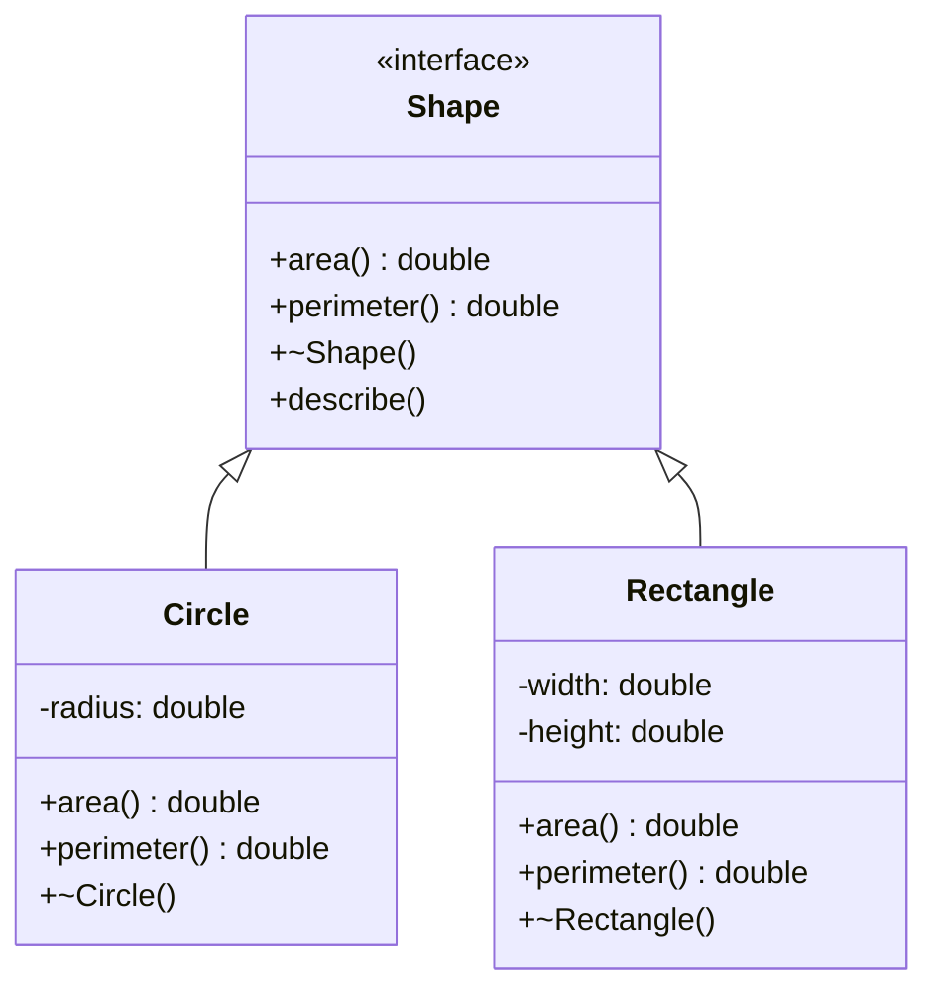

# C++ Interfaces

## Introduction

In object-oriented programming, an interface defines a contract that classes must fulfill. While C++ doesn't have a specific `interface` keyword like Java or C#, it achieves the same functionality through **abstract classes** containing **pure virtual functions**. Interfaces are crucial for implementing polymorphism, ensuring code modularity, and creating flexible, maintainable software architectures.

In this tutorial, you'll learn:
- What interfaces are in C++ and why they're important
- How to create interfaces using abstract classes
- How to implement interfaces in derived classes
- Best practices for interface design
- Real-world applications of interfaces

## Understanding Interfaces in C++

In C++, an interface is an abstract class that:
- Contains only pure virtual functions (methods without implementation)
- May contain constants but no member variables
- Cannot be instantiated directly
- Serves as a contract that derived classes must fulfill by implementing all methods

A pure virtual function is declared by adding `= 0` to the function declaration:

```cpp
virtual void someFunction() = 0;
```

## Creating Your First C++ Interface

Let's create a simple `Shape` interface that can be implemented by different shape classes:

```cpp
#include <iostream>

// Interface (Abstract class)
class Shape {
public:
    // Pure virtual functions
    virtual double area() const = 0;
    virtual double perimeter() const = 0;
    
    // Virtual destructor is necessary for proper cleanup
    virtual ~Shape() {
        std::cout << "Shape destructor called" << std::endl;
    }
    
    // Interfaces can have implemented methods too
    void describe() const {
        std::cout << "This is a shape with:" << std::endl;
        std::cout << "- Area: " << area() << std::endl;
        std::cout << "- Perimeter: " << perimeter() << std::endl;
    }
};
```

In this example:
- `Shape` is our interface with two pure virtual functions: `area()` and `perimeter()`
- We've included a virtual destructor (important for proper cleanup when deleting derived objects through base pointers)
- We've added a concrete method `describe()` that uses the pure virtual functions

## Implementing the Interface

Now, let's implement this interface with two concrete shape classes:

```cpp
// Circle class implementing the Shape interface
class Circle : public Shape {
private:
    double radius;
    
public:
    Circle(double r) : radius(r) {}
    
    // Implementing the pure virtual functions
    double area() const override {
        return 3.14159 * radius * radius;
    }
    
    double perimeter() const override {
        return 2 * 3.14159 * radius;
    }
    
    ~Circle() {
        std::cout << "Circle destructor called" << std::endl;
    }
};

// Rectangle class implementing the Shape interface
class Rectangle : public Shape {
private:
    double width;
    double height;
    
public:
    Rectangle(double w, double h) : width(w), height(h) {}
    
    // Implementing the pure virtual functions
    double area() const override {
        return width * height;
    }
    
    double perimeter() const override {
        return 2 * (width + height);
    }
    
    ~Rectangle() {
        std::cout << "Rectangle destructor called" << std::endl;
    }
};
```

## Using the Interface

Now let's see how to use our interface to work with different shapes polymorphically:

```cpp
int main() {
    // Shape shape; // Error: Cannot instantiate an abstract class
    
    // Create derived objects
    Circle circle(5.0);
    Rectangle rectangle(4.0, 6.0);
    
    // Use the interface methods directly
    std::cout << "Circle area: " << circle.area() << std::endl;
    std::cout << "Rectangle perimeter: " << rectangle.perimeter() << std::endl;
    
    // Using polymorphism with pointers
    Shape* shapes[2];
    shapes[0] = &circle;
    shapes[1] = &rectangle;
    
    for (int i = 0; i < 2; i++) {
        std::cout << "\nShape " << i+1 << ":" << std::endl;
        shapes[i]->describe(); // Polymorphic call
    }
    
    // Using polymorphism with references
    std::cout << "\nUsing references:" << std::endl;
    displayShapeInfo(circle);
    displayShapeInfo(rectangle);
    
    return 0;
}

// Function using the interface via reference
void displayShapeInfo(const Shape& shape) {
    shape.describe();
}
```

**Output:**
```
Circle area: 78.5398
Rectangle perimeter: 20

Shape 1:
This is a shape with:
- Area: 78.5398
- Perimeter: 31.4159

Shape 2:
This is a shape with:
- Area: 24
- Perimeter: 20

Using references:
This is a shape with:
- Area: 78.5398
- Perimeter: 31.4159
This is a shape with:
- Area: 24
- Perimeter: 20

Rectangle destructor called
Circle destructor called
Shape destructor called
Shape destructor called
```

## Multiple Interfaces

Unlike some languages, C++ supports multiple inheritance, allowing a class to implement multiple interfaces:

```cpp
// Drawable interface
class Drawable {
public:
    virtual void draw() const = 0;
    virtual ~Drawable() {}
};

// Movable interface
class Movable {
public:
    virtual void move(double x, double y) = 0;
    virtual ~Movable() {}
};

// A class implementing both interfaces
class MovableCircle : public Circle, public Drawable, public Movable {
private:
    double x, y; // Position
    
public:
    MovableCircle(double r, double xPos, double yPos) 
        : Circle(r), x(xPos), y(yPos) {}
    
    void draw() const override {
        std::cout << "Drawing Circle at (" << x << ", " << y << ") with radius " 
                  << getRadius() << std::endl;
    }
    
    void move(double xNew, double yNew) override {
        x = xNew;
        y = yNew;
        std::cout << "Circle moved to (" << x << ", " << y << ")" << std::endl;
    }
    
    // Need to add getter for radius since it's private in Circle
    double getRadius() const {
        // Access the radius through a method or make it protected in Circle
        return Circle::area() / 3.14159;
    }
};
```

## Real-World Application: Plugin System

Interfaces are commonly used in plugin systems. Here's a simplified example of a media player with different audio format plugins:

```cpp
// AudioPlugin interface
class AudioPlugin {
public:
    virtual bool canPlay(const std::string& format) const = 0;
    virtual void play(const std::string& filename) = 0;
    virtual std::string getName() const = 0;
    virtual ~AudioPlugin() {}
};

// MP3 Plugin implementation
class MP3Plugin : public AudioPlugin {
public:
    bool canPlay(const std::string& format) const override {
        return format == "mp3";
    }
    
    void play(const std::string& filename) override {
        std::cout << "Playing MP3 file: " << filename << std::endl;
        // MP3 decoding logic would go here
    }
    
    std::string getName() const override {
        return "MP3 Plugin v1.0";
    }
};

// WAV Plugin implementation
class WAVPlugin : public AudioPlugin {
public:
    bool canPlay(const std::string& format) const override {
        return format == "wav";
    }
    
    void play(const std::string& filename) override {
        std::cout << "Playing WAV file: " << filename << std::endl;
        // WAV decoding logic would go here
    }
    
    std::string getName() const override {
        return "WAV Plugin v2.1";
    }
};

// Media Player that uses plugins
class MediaPlayer {
private:
    std::vector<AudioPlugin*> plugins;
    
public:
    void registerPlugin(AudioPlugin* plugin) {
        plugins.push_back(plugin);
        std::cout << "Registered plugin: " << plugin->getName() << std::endl;
    }
    
    void playFile(const std::string& filename) {
        // Extract file extension
        size_t dotPos = filename.find_last_of('.');
        if (dotPos == std::string::npos) {
            std::cout << "Unknown file format!" << std::endl;
            return;
        }
        
        std::string format = filename.substr(dotPos + 1);
        
        // Find suitable plugin
        for (AudioPlugin* plugin : plugins) {
            if (plugin->canPlay(format)) {
                plugin->play(filename);
                return;
            }
        }
        
        std::cout << "No plugin found to play format: " << format << std::endl;
    }
    
    ~MediaPlayer() {
        // Note: In a real application, we might or might not own these plugins
        // depending on the design
    }
};

// Example usage:
int main() {
    MediaPlayer player;
    
    MP3Plugin mp3Plugin;
    WAVPlugin wavPlugin;
    
    player.registerPlugin(&mp3Plugin);
    player.registerPlugin(&wavPlugin);
    
    player.playFile("song.mp3");
    player.playFile("recording.wav");
    player.playFile("video.mp4");
    
    return 0;
}
```

**Output:**
```
Registered plugin: MP3 Plugin v1.0
Registered plugin: WAV Plugin v2.1
Playing MP3 file: song.mp3
Playing WAV file: recording.wav
No plugin found to play format: mp4
```

## Interface Design Best Practices

1. **Interface Segregation Principle**: Create small, focused interfaces rather than large, monolithic ones.
   
2. **Dependency Inversion**: Depend on interfaces, not concrete implementations.

3. **Always include a virtual destructor**: This ensures proper cleanup when objects are deleted through base pointers.

4. **Keep interfaces simple**: Ideally, interfaces should have 5 or fewer methods.

5. **Name interfaces clearly**: Common conventions include:
   - Prefixing with "I" (e.g., `IShape`)
   - Using descriptive action names (e.g., `Drawable`, `Serializable`)

6. **Use `override` keyword**: Always use the `override` keyword when implementing interface methods to catch errors.

7. **Document the contract**: Clearly document what implementing classes must do to fulfill the interface.

## Visualization of Interfaces

Here's a diagram showing the relationship between interfaces and implementations:



## Summary

In C++, interfaces are implemented using abstract classes with pure virtual functions. They provide a way to:

- Define a contract that derived classes must fulfill
- Enable polymorphism and dynamic binding
- Separate interface from implementation
- Create modular, extensible code
- Support dependency injection and inversion of control

While C++ doesn't have a dedicated `interface` keyword, its approach to interfaces through abstract classes offers greater flexibility, including the ability to provide default implementations and mix interfaces with implementation inheritance.

## Exercises

1. Create a `Sortable` interface with a `compare` method, then implement it in classes representing different data types.

2. Design an `Animal` interface with methods like `eat()`, `sleep()`, and `makeSound()`. Implement this interface for different animal types.

3. Create a simple game engine with interfaces for `Renderable`, `Collidable`, and `Movable` objects.

4. Extend the `Shape` interface to include a `Drawable` interface with methods for rendering shapes on different outputs (console, GUI, etc.).

5. Implement a simple plugin system using interfaces for a text editor that supports different file formats.

## Additional Resources

- [C++ Polymorphism and Virtual Functions](https://en.cppreference.com/w/cpp/language/virtual)
- "Design Patterns: Elements of Reusable Object-Oriented Software" by Gang of Four
- "Clean Code" by Robert C. Martin
- "Modern C++ Design" by Andrei Alexandrescu