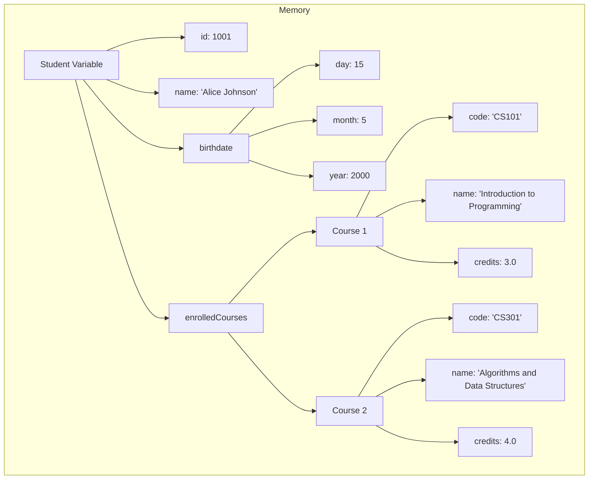

# C++ Structures

## Introduction

In real-world programming, we often need to group related data together. For example, when representing a student, we might want to store their name, ID, grades, and other information as a single unit. C++ structures (often abbreviated as `struct`) provide a way to create custom data types that can hold different types of data under a single name.

A structure is a user-defined data type that allows you to combine data items of different kinds, forming a composite data type that can be treated as a single unit. Structures are fundamental building blocks for more complex data organization and lay the groundwork for object-oriented programming concepts.

## Basic Structure Syntax

Here's the basic syntax for defining a structure in C++:

```cpp
struct StructureName {
    // Member variables
    dataType1 member1;
    dataType2 member2;
    // ... more members
};
```

Let's create a simple structure to represent a point in 2D space:

```cpp
struct Point {
    int x;
    int y;
};
```

## Creating and Using Structure Variables

Once you've defined a structure, you can create variables of that structure type:

```cpp
#include <iostream>
using namespace std;

struct Point {
    int x;
    int y;
};

int main() {
    // Declaring a structure variable
    Point p1;
    
    // Accessing and assigning values to structure members
    p1.x = 10;
    p1.y = 20;
    
    // Displaying the values
    cout << "Point coordinates: (" << p1.x << ", " << p1.y << ")" << endl;
    
    return 0;
}
```

**Output:**
```
Point coordinates: (10, 20)
```

Notice how we use the dot (`.`) operator to access individual members of the structure.

## Initializing Structure Variables

There are several ways to initialize a structure:

### Method 1: Member-by-member assignment

```cpp
Point p1;
p1.x = 10;
p1.y = 20;
```

### Method 2: Using an initializer list (C++11 and later)

```cpp
Point p2 = {15, 25};
```

### Method 3: Using designated initializers (C++20 and later)

```cpp
Point p3 = {.x = 30, .y = 40};
```

### Method 4: Using constructors (we'll cover this in more detail later)

Let's see these methods in action:

```cpp
#include <iostream>
using namespace std;

struct Point {
    int x;
    int y;
};

int main() {
    // Method 1
    Point p1;
    p1.x = 10;
    p1.y = 20;
    
    // Method 2
    Point p2 = {15, 25};
    
    // Method 3 (C++20)
    // Point p3 = {.x = 30, .y = 40};
    
    cout << "p1: (" << p1.x << ", " << p1.y << ")" << endl;
    cout << "p2: (" << p2.x << ", " << p2.y << ")" << endl;
    
    return 0;
}
```

**Output:**
```
p1: (10, 20)
p2: (15, 25)
```

## Nested Structures

Structures can be nested, meaning a structure can contain another structure as a member:

```cpp
#include <iostream>
#include <string>
using namespace std;

struct Date {
    int day;
    int month;
    int year;
};

struct Student {
    string name;
    int id;
    Date birthdate;
};

int main() {
    Student student1;
    
    student1.name = "John Doe";
    student1.id = 12345;
    student1.birthdate.day = 15;
    student1.birthdate.month = 8;
    student1.birthdate.year = 2000;
    
    cout << "Student Information:" << endl;
    cout << "Name: " << student1.name << endl;
    cout << "ID: " << student1.id << endl;
    cout << "Birthdate: " << student1.birthdate.day << "/"
         << student1.birthdate.month << "/"
         << student1.birthdate.year << endl;
    
    return 0;
}
```

**Output:**
```
Student Information:
Name: John Doe
ID: 12345
Birthdate: 15/8/2000
```

## Arrays of Structures

You can create arrays of structures to store multiple related data sets:

```cpp
#include <iostream>
#include <string>
using namespace std;

struct Student {
    string name;
    int id;
    float gpa;
};

int main() {
    // Array of 3 Student structures
    Student students[3];
    
    // Initialize the array
    students[0] = {"Alice", 101, 3.8};
    students[1] = {"Bob", 102, 3.5};
    students[2] = {"Charlie", 103, 3.9};
    
    // Display information for all students
    cout << "Student Records:" << endl;
    for (int i = 0; i < 3; i++) {
        cout << "Student " << i+1 << ":" << endl;
        cout << "Name: " << students[i].name << endl;
        cout << "ID: " << students[i].id << endl;
        cout << "GPA: " << students[i].gpa << endl;
        cout << "------------------------" << endl;
    }
    
    return 0;
}
```

**Output:**
```
Student Records:
Student 1:
Name: Alice
ID: 101
GPA: 3.8
------------------------
Student 2:
Name: Bob
ID: 102
GPA: 3.5
------------------------
Student 3:
Name: Charlie
ID: 103
GPA: 3.9
------------------------
```

## Structures and Functions

Structures can be passed to functions or returned from functions just like any other data type.

### Passing Structures to Functions

```cpp
#include <iostream>
using namespace std;

struct Rectangle {
    int length;
    int width;
};

// Function that takes a structure as parameter
int calculateArea(Rectangle rect) {
    return rect.length * rect.width;
}

int main() {
    Rectangle myRect = {5, 10};
    
    cout << "Rectangle dimensions: " << myRect.length << " x " << myRect.width << endl;
    cout << "Area: " << calculateArea(myRect) << endl;
    
    return 0;
}
```

**Output:**
```
Rectangle dimensions: 5 x 10
Area: 50
```

### Passing Structures by Reference

For better performance, especially with large structures, it's often preferable to pass them by reference:

```cpp
#include <iostream>
using namespace std;

struct Rectangle {
    int length;
    int width;
};

// Function that takes a structure by reference
void scaleRectangle(Rectangle& rect, int factor) {
    rect.length *= factor;
    rect.width *= factor;
}

int main() {
    Rectangle myRect = {5, 10};
    
    cout << "Original dimensions: " << myRect.length << " x " << myRect.width << endl;
    
    scaleRectangle(myRect, 2);
    
    cout << "After scaling: " << myRect.length << " x " << myRect.width << endl;
    
    return 0;
}
```

**Output:**
```
Original dimensions: 5 x 10
After scaling: 10 x 20
```

### Returning Structures from Functions

Functions can also return structures:

```cpp
#include <iostream>
using namespace std;

struct Point {
    int x;
    int y;
};

// Function that returns a structure
Point createMidpoint(Point p1, Point p2) {
    Point mid;
    mid.x = (p1.x + p2.x) / 2;
    mid.y = (p1.y + p2.y) / 2;
    return mid;
}

int main() {
    Point point1 = {10, 20};
    Point point2 = {30, 40};
    
    Point midpoint = createMidpoint(point1, point2);
    
    cout << "Point 1: (" << point1.x << ", " << point1.y << ")" << endl;
    cout << "Point 2: (" << point2.x << ", " << point2.y << ")" << endl;
    cout << "Midpoint: (" << midpoint.x << ", " << midpoint.y << ")" << endl;
    
    return 0;
}
```

**Output:**
```
Point 1: (10, 20)
Point 2: (30, 40)
Midpoint: (20, 30)
```

## Pointers to Structures

You can also create pointers to structures, which is especially useful for dynamic memory allocation:

```cpp
#include <iostream>
using namespace std;

struct Rectangle {
    int length;
    int width;
};

int main() {
    // Declare a pointer to Rectangle
    Rectangle* rectPtr;
    
    // Allocate memory for a Rectangle
    rectPtr = new Rectangle;
    
    // Access members using the arrow operator
    rectPtr->length = 5;
    rectPtr->width = 10;
    
    cout << "Rectangle dimensions: " << rectPtr->length << " x " << rectPtr->width << endl;
    cout << "Area: " << (rectPtr->length * rectPtr->width) << endl;
    
    // Free the allocated memory
    delete rectPtr;
    
    return 0;
}
```

**Output:**
```
Rectangle dimensions: 5 x 10
Area: 50
```

Notice the arrow operator (`->`) used to access structure members through a pointer, which is shorthand for `(*rectPtr).length`.

## Structure Alignment and Padding

The C++ compiler may add padding between structure members to align them properly in memory. This can affect the size of your structure:

```cpp
#include <iostream>
using namespace std;

struct Example1 {
    char a;    // 1 byte
    int b;     // 4 bytes
    char c;    // 1 byte
};

struct Example2 {
    char a;    // 1 byte
    char c;    // 1 byte
    int b;     // 4 bytes
};

int main() {
    cout << "Size of Example1: " << sizeof(Example1) << " bytes" << endl;
    cout << "Size of Example2: " << sizeof(Example2) << " bytes" << endl;
    
    return 0;
}
```

**Output (may vary by compiler and platform):**
```
Size of Example1: 12 bytes
Size of Example2: 8 bytes
```

The structure sizes might not be what you'd expect by simply adding up the individual member sizes. This is due to padding inserted by the compiler for memory alignment.

## Real-World Example: Student Management System

Let's implement a simple student management system that demonstrates the practical use of structures:

```cpp
#include <iostream>
#include <string>
#include <vector>
using namespace std;

struct Date {
    int day;
    int month;
    int year;
    
    string getFormattedDate() const {
        return to_string(day) + "/" + to_string(month) + "/" + to_string(year);
    }
};

struct Course {
    string code;
    string name;
    float credits;
};

struct Student {
    int id;
    string name;
    Date birthdate;
    vector<Course> enrolledCourses;
    
    void displayInfo() const {
        cout << "ID: " << id << endl;
        cout << "Name: " << name << endl;
        cout << "Birthdate: " << birthdate.getFormattedDate() << endl;
        
        cout << "Enrolled Courses:" << endl;
        for (const Course& course : enrolledCourses) {
            cout << "  - " << course.code << ": " << course.name 
                 << " (" << course.credits << " credits)" << endl;
        }
    }
    
    void enrollInCourse(const Course& course) {
        enrolledCourses.push_back(course);
        cout << name << " has been enrolled in " << course.name << endl;
    }
};

int main() {
    // Create courses
    Course programming = {"CS101", "Introduction to Programming", 3.0};
    Course database = {"CS202", "Database Systems", 4.0};
    Course algorithms = {"CS301", "Algorithms and Data Structures", 4.0};
    
    // Create a student
    Student student1;
    student1.id = 1001;
    student1.name = "Alice Johnson";
    student1.birthdate = {15, 5, 2000};
    
    // Enroll student in courses
    student1.enrollInCourse(programming);
    student1.enrollInCourse(algorithms);
    
    cout << "\nStudent Information:" << endl;
    cout << "--------------------" << endl;
    student1.displayInfo();
    
    return 0;
}
```

**Output:**
```
Alice Johnson has been enrolled in Introduction to Programming
Alice Johnson has been enrolled in Algorithms and Data Structures

Student Information:
--------------------
ID: 1001
Name: Alice Johnson
Birthdate: 15/5/2000
Enrolled Courses:
  - CS101: Introduction to Programming (3 credits)
  - CS301: Algorithms and Data Structures (4 credits)
```

## Memory Visualization of Structures

Let's visualize how structures are stored in memory:



This diagram shows how the nested structure of our student management system is organized in memory.

## Structures vs. Classes

In C++, structures and classes are very similar. The main difference is that structure members are public by default, while class members are private by default. You'll learn more about classes in the object-oriented programming section. For now, structures are a perfect way to group related data together.

## Summary

C++ structures provide a powerful way to organize related data of different types under a single name. In this tutorial, we've covered:

- Basic structure syntax and definition
- Creating, initializing, and accessing structure variables
- Nested structures
- Arrays of structures
- Passing structures to and from functions
- Pointers to structures
- Memory alignment considerations
- A practical example of a student management system

Structures serve as the foundation for more advanced data organization in C++ and are essential for building complex programs.

## Exercises

1. Create a structure called `Book` with members for title, author, publication year, and ISBN.
2. Write a program that creates an array of 3 books, initializes them with values, and displays their information.
3. Create a nested structure to represent a `Library` that contains multiple `Book` structures.
4. Write a function that takes a `Book` structure as a parameter and returns a string that contains a formatted description of the book.
5. Modify the student management system example to include grades for each course and calculate the GPA.

## Additional Resources

- [CPlusPlus.com - Structures](http://www.cplusplus.com/doc/tutorial/structures/)
- [Microsoft C++ Documentation on Structs](https://docs.microsoft.com/en-us/cpp/cpp/struct-cpp)
- [C++ Data Structures and Algorithms, 4th Edition](https://www.amazon.com/Data-Structures-Algorithms-Adam-Drozdek/dp/1133608426)

Happy coding!