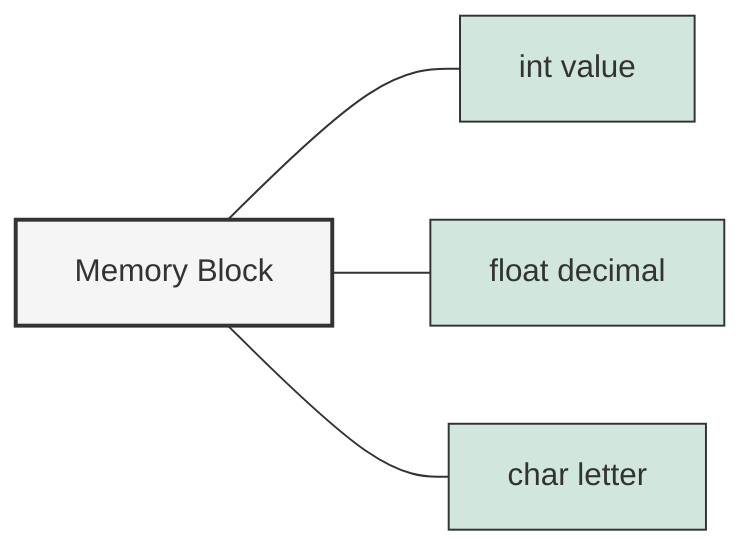

# C++ Unions

## Introduction

Unions are a special data type in C++ that allows you to store different data types in the same memory location. Unlike structures, where each member has its own memory location, all members of a union share the same memory space. This makes unions particularly useful for memory optimization in scenarios where you need to store different types of data, but only one at a time.

In this guide, we'll explore:
- What unions are and how they work
- How to define and use unions
- Memory considerations with unions
- Advanced union concepts
- Practical applications

## What Are Unions and How Do They Work?

A union is a user-defined type where all members share the same memory space. The size of a union is determined by its largest member.



When you assign a value to one member of a union, it overwrites any value previously stored in other members, since they all share the same memory location.

## Defining and Using Unions

### Basic Syntax

Here's how to define a union:

```cpp
union UnionName {
    dataType1 member1;
    dataType2 member2;
    // More members...
};
```

Let's create and use a simple union:

```cpp
#include <iostream>

union Value {
    int intValue;
    float floatValue;
    char charValue;
};

int main() {
    Value val;
    
    val.intValue = 42;
    std::cout << "Integer value: " << val.intValue << std::endl;
    
    val.floatValue = 3.14f;
    std::cout << "Float value: " << val.floatValue << std::endl;
    // At this point, intValue is no longer valid because the memory is now used by floatValue
    std::cout << "Integer value now: " << val.intValue << std::endl; // This will print garbage
    
    val.charValue = 'A';
    std::cout << "Character value: " << val.charValue << std::endl;
    std::cout << "Float value now: " << val.floatValue << std::endl; // This will print garbage
    
    return 0;
}
```

Output:
```
Integer value: 42
Float value: 3.14
Integer value now: 1078523331
Character value: A
Float value now: 3.14e-43
```

Notice how accessing a member that wasn't the last one assigned produces unpredictable results (garbage values). This is because when we set `floatValue`, it overwrites the memory that was previously storing `intValue`.

## Memory Considerations

### Size of Unions

A key advantage of unions is memory efficiency. The size of a union is equal to the size of its largest member.

```cpp
#include <iostream>

union Data {
    int i;       // 4 bytes
    float f;     // 4 bytes
    char str[20]; // 20 bytes
};

int main() {
    Data data;
    
    std::cout << "Size of int: " << sizeof(int) << " bytes" << std::endl;
    std::cout << "Size of float: " << sizeof(float) << " bytes" << std::endl;
    std::cout << "Size of char[20]: " << sizeof(char[20]) << " bytes" << std::endl;
    std::cout << "Size of union: " << sizeof(data) << " bytes" << std::endl;
    
    return 0;
}
```

Output:
```
Size of int: 4 bytes
Size of float: 4 bytes
Size of char[20]: 20 bytes
Size of union: 20 bytes
```

The union `Data` takes 20 bytes of memory, which is the size of its largest member `str[20]`, rather than 28 bytes (4+4+20) if we had used a struct.

### Type Safety Concerns

Unions present type safety challenges since the compiler doesn't track which member was last assigned. It's the programmer's responsibility to keep track of which member is currently active.

## Advanced Union Concepts

### Anonymous Unions

C++ also supports anonymous unions, which don't have a name:

```cpp
#include <iostream>

struct Data {
    int id;
    union {  // Anonymous union
        int intValue;
        float floatValue;
        char charValue;
    };
};

int main() {
    Data data;
    data.id = 1001;
    data.intValue = 42;  // Access union member directly
    
    std::cout << "ID: " << data.id << ", Value: " << data.intValue << std::endl;
    
    data.floatValue = 3.14f;
    std::cout << "ID: " << data.id << ", Value: " << data.floatValue << std::endl;
    
    return 0;
}
```

Output:
```
ID: 1001, Value: 42
ID: 1001, Value: 3.14
```

In an anonymous union, the members appear directly within the scope containing the union declaration.

### Unions with Complex Types

Using unions with complex types like classes with constructors, destructors, or classes with virtual functions can be problematic. C++11 relaxed some restrictions, but proper management is crucial:

```cpp
#include <iostream>
#include <string>
#include <new>  // for placement new

union ComplexUnion {
    int intValue;
    float floatValue;
    std::string stringValue;  // Has constructor and destructor
    
    // Need constructors and destructor to manage the string
    ComplexUnion() : intValue(0) {}  // Default initialize to int
    ~ComplexUnion() {}  // Empty destructor, manual management required
};

int main() {
    ComplexUnion u;
    
    // Using placement new to properly construct the string
    new (&u.stringValue) std::string("Hello, Union!");
    
    std::cout << "String value: " << u.stringValue << std::endl;
    
    // Must explicitly call the destructor
    u.stringValue.~basic_string();
    
    u.floatValue = 3.14f;
    std::cout << "Float value: " << u.floatValue << std::endl;
    
    return 0;
}
```

Output:
```
String value: Hello, Union!
Float value: 3.14
```

## Discriminated Unions

A common pattern is to use a "discriminated union" (also known as a tagged union or variant), where we include a field that indicates which member of the union is currently active:

```cpp
#include <iostream>
#include <string>

enum class ValueType {
    INTEGER,
    FLOAT,
    CHARACTER
};

struct Value {
    ValueType type;
    union {
        int intValue;
        float floatValue;
        char charValue;
    };
};

void printValue(const Value& v) {
    switch (v.type) {
        case ValueType::INTEGER:
            std::cout << "Integer: " << v.intValue << std::endl;
            break;
        case ValueType::FLOAT:
            std::cout << "Float: " << v.floatValue << std::endl;
            break;
        case ValueType::CHARACTER:
            std::cout << "Character: " << v.charValue << std::endl;
            break;
    }
}

int main() {
    Value v;
    
    v.type = ValueType::INTEGER;
    v.intValue = 42;
    printValue(v);
    
    v.type = ValueType::FLOAT;
    v.floatValue = 3.14f;
    printValue(v);
    
    v.type = ValueType::CHARACTER;
    v.charValue = 'A';
    printValue(v);
    
    return 0;
}
```

Output:
```
Integer: 42
Float: 3.14
Character: A
```

This pattern is so useful that C++17 introduced `std::variant` as a type-safe alternative to unions.

## Practical Applications

### 1. Memory Optimization for Embedded Systems

In embedded systems with limited memory, unions help optimize storage for data that can be represented in multiple forms but only needs one form at a time.

```cpp
#include <iostream>

// Example for embedded sensor data
union SensorData {
    struct {
        uint8_t temperature;
        uint8_t humidity;
    } environmental;
    
    struct {
        uint16_t x;
        uint16_t y;
    } position;
    
    uint32_t rawData;  // For direct transmission over network
};

int main() {
    SensorData data;
    
    // Reading from temperature sensor
    data.environmental.temperature = 25;
    data.environmental.humidity = 60;
    
    std::cout << "Temperature: " << static_cast<int>(data.environmental.temperature) 
              << "°C, Humidity: " << static_cast<int>(data.environmental.humidity) 
              << "%" << std::endl;
    
    // Reading from position sensor instead
    data.position.x = 100;
    data.position.y = 200;
    
    std::cout << "Position: (" << data.position.x << ", " 
              << data.position.y << ")" << std::endl;
    
    // Getting raw data for transmission
    std::cout << "Raw data: 0x" << std::hex << data.rawData << std::endl;
    
    return 0;
}
```

### 2. Type Punning (Reinterpreting Memory)

Unions can be used to view data in multiple ways, though C++ has strict aliasing rules that can make this tricky:

```cpp
#include <iostream>
#include <cstring>

union TypeConverter {
    float floatValue;
    uint32_t intValue;
};

int main() {
    TypeConverter converter;
    
    converter.floatValue = 3.14159f;
    std::cout << "Float: " << converter.floatValue << std::endl;
    std::cout << "As integer: 0x" << std::hex << converter.intValue << std::endl;
    
    // Setting a specific bit pattern
    converter.intValue = 0x40490FDB;  // IEEE 754 representation of π (approx 3.14159)
    std::cout << "From integer: " << std::dec << converter.floatValue << std::endl;
    
    return 0;
}
```

Output:
```
Float: 3.14159
As integer: 0x4048f5c3
From integer: 3.14159
```

### 3. Simple Variant Implementation

Before C++17's `std::variant`, unions were commonly used to implement variant types:

```cpp
#include <iostream>
#include <string>
#include <new>

class SimpleVariant {
private:
    enum class Type { INT, DOUBLE, STRING } currentType;
    
    union {
        int intValue;
        double doubleValue;
        std::string stringValue;
    };

public:
    SimpleVariant() : currentType(Type::INT), intValue(0) {}
    
    ~SimpleVariant() {
        if (currentType == Type::STRING) {
            stringValue.~basic_string();
        }
    }
    
    void setInt(int value) {
        if (currentType == Type::STRING) {
            stringValue.~basic_string();
        }
        intValue = value;
        currentType = Type::INT;
    }
    
    void setDouble(double value) {
        if (currentType == Type::STRING) {
            stringValue.~basic_string();
        }
        doubleValue = value;
        currentType = Type::DOUBLE;
    }
    
    void setString(const std::string& value) {
        if (currentType == Type::STRING) {
            stringValue = value;
        } else {
            new (&stringValue) std::string(value);
            currentType = Type::STRING;
        }
    }
    
    void printValue() const {
        switch (currentType) {
            case Type::INT:
                std::cout << "Int: " << intValue << std::endl;
                break;
            case Type::DOUBLE:
                std::cout << "Double: " << doubleValue << std::endl;
                break;
            case Type::STRING:
                std::cout << "String: " << stringValue << std::endl;
                break;
        }
    }
};

int main() {
    SimpleVariant var;
    
    var.setInt(42);
    var.printValue();
    
    var.setDouble(3.14159);
    var.printValue();
    
    var.setString("Hello, Variant!");
    var.printValue();
    
    // Set back to int
    var.setInt(100);
    var.printValue();
    
    return 0;
}
```

Output:
```
Int: 42
Double: 3.14159
String: Hello, Variant!
Int: 100
```

## Modern Alternatives to Unions

While unions are still useful, C++17 introduced safer alternatives:

- **std::variant**: A type-safe union that knows which alternative is active
- **std::any**: For type-erased storage of any single value
- **std::optional**: For representing optional values

These provide type safety that traditional unions lack, but unions still have their place when memory layout control is critical.

## Summary

C++ unions provide a memory-efficient way to store different data types in the same memory location. Key points to remember:

- Unions allow multiple members to share the same memory location
- The size of a union equals the size of its largest member
- Only one member can be active at any time
- Accessing inactive members produces undefined behavior
- Tagged/discriminated unions help track which member is active
- Unions require careful handling with complex types
- Modern C++ alternatives like `std::variant` offer type safety advantages

Unions are particularly valuable in:
- Memory-constrained environments
- Binary file format handling
- Network packet processing
- Type punning (with appropriate care)

While C++ has introduced safer alternatives in newer standards, understanding unions remains important for memory optimization, handling legacy code, and working in resource-constrained environments.

## Exercises

1. Create a union that can store an integer, a floating-point number, and a boolean value. Write code to demonstrate setting and accessing each type.

2. Implement a tagged union that can store either a string or an array of 10 integers. Include functions to safely set and get values based on the current type.

3. Create a memory-efficient representation of a playing card using a union and appropriate enums.

4. Write a program that uses a union to convert between different number formats (decimal, hexadecimal, octal).

5. Implement a simple variant type using a union that can store either an integer, a double, or a string, with proper construction and destruction management.

## Additional Resources

- [C++ Reference: Union Declarations](https://en.cppreference.com/w/cpp/language/union)
- [C++ Reference: std::variant](https://en.cppreference.com/w/cpp/utility/variant)
- [Type Punning in C++](https://en.wikipedia.org/wiki/Type_punning)
- "The C++ Programming Language" by Bjarne Stroustrup, section on Unions