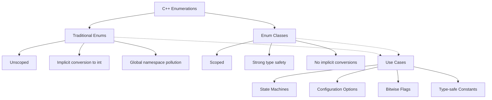

# C++ Enumerations

## Introduction

Enumerations (often called *enums*) are a feature in C++ that allows you to define a type that has a fixed set of possible values. They provide a way to create named constants that improve code readability, type safety, and maintainability. In C++, there are two main types of enumerations:

1. **Traditional enums** (introduced in C and available in all C++ versions)
2. **Enum classes** (introduced in C++11, also known as scoped enumerations)

This guide will help you understand how enumerations work, when to use them, and how they can improve your C++ code.

## Traditional Enumerations

Traditional enumerations provide a way to define a set of named integer constants.

### Basic Syntax

```cpp
enum EnumName {
    Value1,
    Value2,
    Value3,
    // ...
};
```

By default, the first enumerator is assigned the value 0, and each subsequent enumerator is assigned a value one greater than the previous enumerator.

### Example: Days of the Week

```cpp
#include <iostream>

enum DayOfWeek {
    Sunday,    // 0
    Monday,    // 1
    Tuesday,   // 2
    Wednesday, // 3
    Thursday,  // 4
    Friday,    // 5
    Saturday   // 6
};

int main() {
    DayOfWeek today = Wednesday;
    
    std::cout << "Today is day number: " << today << std::endl;
    
    if (today == Wednesday) {
        std::cout << "It's Wednesday, halfway through the work week!" << std::endl;
    }
    
    // We can perform implicit conversion between enum and integers
    int dayNumber = today;
    std::cout << "Day as integer: " << dayNumber << std::endl;
    
    return 0;
}
```

**Output:**
```
Today is day number: 3
It's Wednesday, halfway through the work week!
Day as integer: 3
```

### Custom Values

You can assign specific values to enum members:

```cpp
#include <iostream>

enum HTTPStatus {
    OK = 200,
    Created = 201,
    Accepted = 202,
    BadRequest = 400,
    Unauthorized = 401,
    Forbidden = 403,
    NotFound = 404,
    ServerError = 500
};

int main() {
    HTTPStatus response = NotFound;
    
    std::cout << "HTTP Status Code: " << response << std::endl;
    
    if (response >= 400 && response < 500) {
        std::cout << "Client error occurred" << std::endl;
    } else if (response >= 500) {
        std::cout << "Server error occurred" << std::endl;
    } else {
        std::cout << "Request was successful" << std::endl;
    }
    
    return 0;
}
```

**Output:**
```
HTTP Status Code: 404
Client error occurred
```

### Limitations of Traditional Enums

Traditional enums have several limitations:

1. They are not type-safe (can be implicitly converted to integers)
2. They pollute the global namespace (enum values are visible in the enclosing scope)
3. Forward declaration is not possible
4. Two different enums cannot have members with the same name in the same scope

## Enum Classes (C++11)

To address the limitations of traditional enums, C++11 introduced enum classes (also known as scoped enumerations).

### Syntax

```cpp
enum class EnumName {
    Value1,
    Value2,
    Value3,
    // ...
};
```

### Example: Colors Enum Class

```cpp
#include <iostream>

enum class Color {
    Red,
    Green,
    Blue,
    Yellow,
    Purple
};

int main() {
    // Must use the scope resolution operator
    Color myColor = Color::Blue;
    
    // Can't implicitly convert to int
    // int colorValue = myColor; // Compilation error!
    
    // Need explicit cast
    int colorValue = static_cast<int>(myColor);
    std::cout << "Color value: " << colorValue << std::endl;
    
    // Comparing values
    if (myColor == Color::Blue) {
        std::cout << "The color is blue!" << std::endl;
    }
    
    return 0;
}
```

**Output:**
```
Color value: 2
The color is blue!
```

### Benefits of Enum Classes

1. **Strongly typed**: No implicit conversion to int
2. **Scoped**: The enum values are in the scope of the enum class
3. **Forward declaration**: You can forward declare enum classes
4. **No name clashes**: Different enum classes can have members with the same name

### Specifying Underlying Type

Both traditional enums and enum classes allow you to specify their underlying type:

```cpp
#include <iostream>
#include <cstdint> // For fixed-width integer types

// Using uint8_t (unsigned 8-bit integer) as the underlying type
enum class FilePermission : uint8_t {
    None = 0,
    Read = 1,
    Write = 2,
    Execute = 4,
    ReadWrite = Read | Write,           // 3
    ReadExecute = Read | Execute,       // 5
    WriteExecute = Write | Execute,     // 6
    All = Read | Write | Execute        // 7
};

int main() {
    FilePermission permissions = FilePermission::ReadWrite;
    
    uint8_t value = static_cast<uint8_t>(permissions);
    std::cout << "Permissions value: " << static_cast<int>(value) << std::endl;
    
    // Checking if Read permission is set using bitwise operations
    bool canRead = (value & static_cast<uint8_t>(FilePermission::Read)) != 0;
    std::cout << "Can read: " << (canRead ? "Yes" : "No") << std::endl;
    
    // Checking if Execute permission is set
    bool canExecute = (value & static_cast<uint8_t>(FilePermission::Execute)) != 0;
    std::cout << "Can execute: " << (canExecute ? "Yes" : "No") << std::endl;
    
    return 0;
}
```

**Output:**
```
Permissions value: 3
Can read: Yes
Can execute: No
```

## Practical Applications

### 1. State Machines

Enumerations are perfect for implementing state machines where a system can be in one of a finite number of states.

```cpp
#include <iostream>
#include <string>

enum class TrafficLightState {
    Red,
    Yellow,
    Green
};

class TrafficLight {
private:
    TrafficLightState state;
    
public:
    TrafficLight() : state(TrafficLightState::Red) {}
    
    void changeState() {
        switch(state) {
            case TrafficLightState::Red:
                state = TrafficLightState::Green;
                break;
            case TrafficLightState::Yellow:
                state = TrafficLightState::Red;
                break;
            case TrafficLightState::Green:
                state = TrafficLightState::Yellow;
                break;
        }
    }
    
    std::string getStateString() const {
        switch(state) {
            case TrafficLightState::Red:
                return "Red";
            case TrafficLightState::Yellow:
                return "Yellow";
            case TrafficLightState::Green:
                return "Green";
            default:
                return "Unknown";
        }
    }
};

int main() {
    TrafficLight light;
    
    std::cout << "Initial state: " << light.getStateString() << std::endl;
    
    for (int i = 0; i < 5; ++i) {
        light.changeState();
        std::cout << "New state: " << light.getStateString() << std::endl;
    }
    
    return 0;
}
```

**Output:**
```
Initial state: Red
New state: Green
New state: Yellow
New state: Red
New state: Green
New state: Yellow
```

### 2. Configurable Options

Enums can represent configuration options in a type-safe way:

```cpp
#include <iostream>
#include <vector>

enum class SortDirection {
    Ascending,
    Descending
};

enum class SortBy {
    Name,
    Date,
    Size
};

// A function that sorts files based on given parameters
void sortFiles(std::vector<std::string>& files, SortBy by, SortDirection direction) {
    std::cout << "Sorting files by ";
    
    switch(by) {
        case SortBy::Name:
            std::cout << "name";
            break;
        case SortBy::Date:
            std::cout << "date";
            break;
        case SortBy::Size:
            std::cout << "size";
            break;
    }
    
    std::cout << " in ";
    
    switch(direction) {
        case SortDirection::Ascending:
            std::cout << "ascending";
            break;
        case SortDirection::Descending:
            std::cout << "descending";
            break;
    }
    
    std::cout << " order." << std::endl;
    
    // Actual sorting logic would go here
}

int main() {
    std::vector<std::string> files = {"document.txt", "image.jpg", "video.mp4"};
    
    sortFiles(files, SortBy::Name, SortDirection::Ascending);
    sortFiles(files, SortBy::Date, SortDirection::Descending);
    sortFiles(files, SortBy::Size, SortDirection::Ascending);
    
    return 0;
}
```

**Output:**
```
Sorting files by name in ascending order.
Sorting files by date in descending order.
Sorting files by size in ascending order.
```

### 3. Bitwise Operations (Flags)

Enums are often used to represent flags that can be combined using bitwise operations:

```cpp
#include <iostream>

// Using an enum class with explicit values for bitwise operations
enum class TextStyle : unsigned int {
    Normal = 0,
    Bold = 1 << 0,       // 1
    Italic = 1 << 1,     // 2
    Underline = 1 << 2,  // 4
    Strikethrough = 1 << 3  // 8
};

// Overload the bitwise operators for the enum class
inline TextStyle operator|(TextStyle a, TextStyle b) {
    return static_cast<TextStyle>(
        static_cast<unsigned int>(a) | static_cast<unsigned int>(b)
    );
}

inline TextStyle& operator|=(TextStyle& a, TextStyle b) {
    a = a | b;
    return a;
}

inline bool operator&(TextStyle a, TextStyle b) {
    return (static_cast<unsigned int>(a) & static_cast<unsigned int>(b)) != 0;
}

void applyTextStyle(const std::string& text, TextStyle style) {
    std::cout << "Applying the following styles to \"" << text << "\":" << std::endl;
    
    if (style & TextStyle::Bold) {
        std::cout << "- Bold" << std::endl;
    }
    
    if (style & TextStyle::Italic) {
        std::cout << "- Italic" << std::endl;
    }
    
    if (style & TextStyle::Underline) {
        std::cout << "- Underline" << std::endl;
    }
    
    if (style & TextStyle::Strikethrough) {
        std::cout << "- Strikethrough" << std::endl;
    }
    
    if (static_cast<unsigned int>(style) == 0) {
        std::cout << "- Normal text (no styles)" << std::endl;
    }
}

int main() {
    // Single style
    applyTextStyle("Hello", TextStyle::Bold);
    std::cout << std::endl;
    
    // Multiple styles combined
    TextStyle heading = TextStyle::Bold | TextStyle::Underline;
    applyTextStyle("Chapter Title", heading);
    std::cout << std::endl;
    
    // All styles
    TextStyle mixed = TextStyle::Bold | TextStyle::Italic | TextStyle::Underline | TextStyle::Strikethrough;
    applyTextStyle("Special Text", mixed);
    std::cout << std::endl;
    
    // No style
    applyTextStyle("Plain text", TextStyle::Normal);
    
    return 0;
}
```

**Output:**
```
Applying the following styles to "Hello":
- Bold

Applying the following styles to "Chapter Title":
- Bold
- Underline

Applying the following styles to "Special Text":
- Bold
- Italic
- Underline
- Strikethrough

Applying the following styles to "Plain text":
- Normal text (no styles)
```

## Using Enumerations in Switch Statements

Enumerations work particularly well with switch statements, enabling clear and expressive code:

```cpp
#include <iostream>

enum class Month {
    January = 1, February, March, April, May, June,
    July, August, September, October, November, December
};

int getDaysInMonth(Month month, bool isLeapYear = false) {
    switch (month) {
        case Month::January:
        case Month::March:
        case Month::May:
        case Month::July:
        case Month::August:
        case Month::October:
        case Month::December:
            return 31;
            
        case Month::April:
        case Month::June:
        case Month::September:
        case Month::November:
            return 30;
            
        case Month::February:
            return isLeapYear ? 29 : 28;
            
        default:
            return -1; // Invalid month
    }
}

int main() {
    std::cout << "Days in January: " << getDaysInMonth(Month::January) << std::endl;
    std::cout << "Days in February (non-leap year): " << getDaysInMonth(Month::February) << std::endl;
    std::cout << "Days in February (leap year): " << getDaysInMonth(Month::February, true) << std::endl;
    std::cout << "Days in April: " << getDaysInMonth(Month::April) << std::endl;
    
    return 0;
}
```

**Output:**
```
Days in January: 31
Days in February (non-leap year): 28
Days in February (leap year): 29
Days in April: 30
```

## Visualizing Enum Relationships



## Summary

Enumerations in C++ provide a powerful way to define named constants that improve code readability and maintainability. Let's recap what we've learned:

- **Traditional enums** are simple to use but have limitations regarding type safety and namespace pollution.
- **Enum classes** (C++11) provide better type safety, scoping, and prevent implicit conversions.
- Enumerations can specify their underlying type (e.g., `enum class Color : uint8_t`).
- Common applications include state machines, flags with bitwise operations, and representing configuration options.
- Enum classes require the scope resolution operator (e.g., `Color::Red`).
- Enum values can be assigned custom values and can be used in expressions.

When choosing between traditional enums and enum classes:
- Use **enum classes** for most new code to benefit from better type safety.
- Consider traditional enums only when you need the implicit conversion to integers or when working with legacy code.

## Exercises

1. Create an enum class representing different levels of logging (DEBUG, INFO, WARNING, ERROR, CRITICAL). Write a function that takes a message and a log level and formats it appropriately.

2. Define an enum class for card suits (Hearts, Diamonds, Clubs, Spades) and another for card values (Ace through King). Then create a Card struct that uses these enums.

3. Implement a simple state machine for a vending machine using enum classes for states (Idle, SelectingItem, ProcessingPayment, DispensingItem, ReturningChange).

4. Create a flags-style enum class for document permissions (Read, Write, Delete, Execute) and implement functions to check, add, and remove permissions.

5. Write a function that takes a day of the week (as an enum) and returns whether it's a weekday or weekend.

## Additional Resources

- [C++ Reference - Enumeration declaration](https://en.cppreference.com/w/cpp/language/enum)
- [C++ Core Guidelines: Enum.1: Prefer enumerations over macros](https://isocpp.github.io/CppCoreGuidelines/CppCoreGuidelines#enum1-prefer-enumerations-over-macros)
- [C++ Core Guidelines: Enum.3: Prefer class enums over "plain" enums](https://isocpp.github.io/CppCoreGuidelines/CppCoreGuidelines#enum3-prefer-class-enums-over-plain-enums)
- "Effective Modern C++" by Scott Meyers (discusses enum classes in Item 10)
- "C++ Primer" by Stanley B. Lippman (covers enumerations in depth)

Happy coding with C++ enumerations!