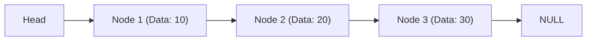
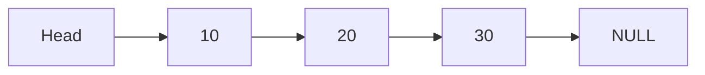
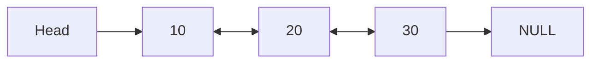
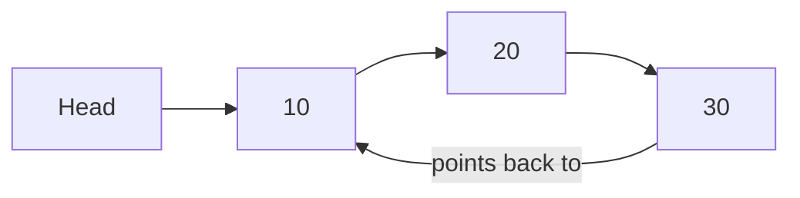

# C++ Linked Lists

## Introduction

Linked lists are fundamental data structures that store collections of elements in a linear order. Unlike arrays, linked lists don't store elements in contiguous memory locations but connect elements using pointers, making them dynamic in size and efficient for insertions and deletions.

In this tutorial, we'll explore:
- What linked lists are and how they work
- Types of linked lists
- Implementing linked lists in C++
- Common operations on linked lists
- Practical applications and use cases

## What is a Linked List?

A linked list is a linear data structure where each element (called a **node**) contains:
1. Data (the value we want to store)
2. A pointer (or reference) to the next node in the sequence

The linked list maintains a pointer to the first node (called the **head**), which allows access to the entire list by traversing from one node to the next.



### Key Characteristics of Linked Lists

- **Dynamic Size**: Linked lists can grow or shrink during execution
- **Efficient Insertions/Deletions**: Adding or removing elements doesn't require shifting other elements
- **No Random Access**: To access a specific element, you must traverse from the beginning
- **Extra Memory**: Requires additional memory for storing pointers

## Types of Linked Lists

### 1. Singly Linked List

In a singly linked list, each node points only to the next node in the sequence.



### 2. Doubly Linked List

In a doubly linked list, each node has two pointers: one pointing to the next node and another pointing to the previous node.



### 3. Circular Linked List

In a circular linked list, the last node points back to the first node, forming a circle.



## Implementing a Singly Linked List in C++

Let's implement a basic singly linked list in C++.

### Node Structure

First, we define the structure of a node:

```cpp
struct Node {
    int data;        // Data stored in the node
    Node* next;      // Pointer to the next node
    
    // Constructor
    Node(int value) : data(value), next(nullptr) {}
};
```

### Linked List Class

Now, let's create a `LinkedList` class to manage the nodes:

```cpp
class LinkedList {
private:
    Node* head;      // Pointer to the first node
    
public:
    // Constructor
    LinkedList() : head(nullptr) {}
    
    // Destructor to free memory
    ~LinkedList() {
        Node* current = head;
        while (current != nullptr) {
            Node* next = current->next;
            delete current;
            current = next;
        }
        head = nullptr;
    }
    
    // Add a new node at the beginning (prepend)
    void prepend(int value) {
        Node* newNode = new Node(value);
        newNode->next = head;
        head = newNode;
    }
    
    // Add a new node at the end (append)
    void append(int value) {
        Node* newNode = new Node(value);
        
        // If the list is empty, make the new node the head
        if (head == nullptr) {
            head = newNode;
            return;
        }
        
        // Traverse to the last node
        Node* current = head;
        while (current->next != nullptr) {
            current = current->next;
        }
        
        // Link the last node to the new node
        current->next = newNode;
    }
    
    // Display the list
    void display() {
        Node* current = head;
        while (current != nullptr) {
            std::cout << current->data;
            if (current->next != nullptr) {
                std::cout << " -> ";
            }
            current = current->next;
        }
        std::cout << std::endl;
    }
};
```

### Example Usage

Let's see how to use our linked list implementation:

```cpp
#include <iostream>

// Node and LinkedList definitions as above

int main() {
    LinkedList list;
    
    // Append elements
    list.append(10);
    list.append(20);
    list.append(30);
    
    std::cout << "List after appending: ";
    list.display();  // Output: 10 -> 20 -> 30
    
    // Prepend an element
    list.prepend(5);
    std::cout << "List after prepending: ";
    list.display();  // Output: 5 -> 10 -> 20 -> 30
    
    return 0;
}
```

Output:
```
List after appending: 10 -> 20 -> 30
List after prepending: 5 -> 10 -> 20 -> 30
```

## Common Linked List Operations

Let's enhance our LinkedList class with more operations:

### Inserting a Node at a Specific Position

```cpp
// Insert a node at a specific position
void insertAt(int position, int value) {
    // If position is 0, prepend
    if (position == 0) {
        prepend(value);
        return;
    }
    
    // Create a new node
    Node* newNode = new Node(value);
    
    // Traverse to the node before the position
    Node* current = head;
    int currentPos = 0;
    
    while (current != nullptr && currentPos < position - 1) {
        current = current->next;
        currentPos++;
    }
    
    // If the position is beyond the end, append
    if (current == nullptr) {
        delete newNode;
        append(value);
        return;
    }
    
    // Insert the new node
    newNode->next = current->next;
    current->next = newNode;
}
```

### Deleting a Node

```cpp
// Delete a node with a specific value
bool deleteNode(int value) {
    // If the list is empty
    if (head == nullptr) {
        return false;
    }
    
    // If the head node has the value
    if (head->data == value) {
        Node* temp = head;
        head = head->next;
        delete temp;
        return true;
    }
    
    // Search for the node with the value
    Node* current = head;
    while (current->next != nullptr && current->next->data != value) {
        current = current->next;
    }
    
    // If the value wasn't found
    if (current->next == nullptr) {
        return false;
    }
    
    // Delete the node
    Node* temp = current->next;
    current->next = current->next->next;
    delete temp;
    return true;
}
```

### Searching for a Value

```cpp
// Search for a value and return its position (0-based)
int search(int value) {
    Node* current = head;
    int position = 0;
    
    while (current != nullptr) {
        if (current->data == value) {
            return position;
        }
        current = current->next;
        position++;
    }
    
    // Value not found
    return -1;
}
```

### Getting the Length of the List

```cpp
// Get the length of the linked list
int length() {
    int count = 0;
    Node* current = head;
    
    while (current != nullptr) {
        count++;
        current = current->next;
    }
    
    return count;
}
```

## Implementing a Doubly Linked List

Let's implement a basic doubly linked list, which allows traversal in both directions:

```cpp
struct DoublyNode {
    int data;
    DoublyNode* next;
    DoublyNode* prev;
    
    DoublyNode(int value) : data(value), next(nullptr), prev(nullptr) {}
};

class DoublyLinkedList {
private:
    DoublyNode* head;
    DoublyNode* tail;
    
public:
    DoublyLinkedList() : head(nullptr), tail(nullptr) {}
    
    ~DoublyLinkedList() {
        DoublyNode* current = head;
        while (current != nullptr) {
            DoublyNode* next = current->next;
            delete current;
            current = next;
        }
        head = tail = nullptr;
    }
    
    // Add a node at the end
    void append(int value) {
        DoublyNode* newNode = new DoublyNode(value);
        
        if (head == nullptr) {
            head = tail = newNode;
            return;
        }
        
        newNode->prev = tail;
        tail->next = newNode;
        tail = newNode;
    }
    
    // Add a node at the beginning
    void prepend(int value) {
        DoublyNode* newNode = new DoublyNode(value);
        
        if (head == nullptr) {
            head = tail = newNode;
            return;
        }
        
        newNode->next = head;
        head->prev = newNode;
        head = newNode;
    }
    
    // Display the list forwards
    void displayForward() {
        DoublyNode* current = head;
        while (current != nullptr) {
            std::cout << current->data;
            if (current->next != nullptr) {
                std::cout << " <-> ";
            }
            current = current->next;
        }
        std::cout << std::endl;
    }
    
    // Display the list backwards
    void displayBackward() {
        DoublyNode* current = tail;
        while (current != nullptr) {
            std::cout << current->data;
            if (current->prev != nullptr) {
                std::cout << " <-> ";
            }
            current = current->prev;
        }
        std::cout << std::endl;
    }
};
```

### Example Usage of Doubly Linked List

```cpp
int main() {
    DoublyLinkedList dll;
    
    dll.append(10);
    dll.append(20);
    dll.append(30);
    
    std::cout << "Forward: ";
    dll.displayForward();  // Output: 10 <-> 20 <-> 30
    
    std::cout << "Backward: ";
    dll.displayBackward(); // Output: 30 <-> 20 <-> 10
    
    return 0;
}
```

Output:
```
Forward: 10 <-> 20 <-> 30
Backward: 30 <-> 20 <-> 10
```

## Practical Applications of Linked Lists

Linked lists are used in many real-world applications:

### 1. Implementing Other Data Structures

Linked lists serve as building blocks for more complex data structures:
- Stacks and Queues
- Hash tables (to handle collisions)
- Adjacency lists for graphs

### 2. Browser History

Web browsers use linked lists to implement back and forward navigation:

```cpp
class BrowserHistory {
private:
    struct Page {
        std::string url;
        Page* next;
        Page* prev;
        
        Page(const std::string& u) : url(u), next(nullptr), prev(nullptr) {}
    };
    
    Page* current;
    
public:
    BrowserHistory(const std::string& homepage) {
        current = new Page(homepage);
    }
    
    void visit(const std::string& url) {
        // Delete forward history
        Page* temp = current->next;
        while (temp != nullptr) {
            Page* next = temp->next;
            delete temp;
            temp = next;
        }
        
        // Create new page
        Page* newPage = new Page(url);
        current->next = newPage;
        newPage->prev = current;
        current = newPage;
    }
    
    std::string back(int steps) {
        while (steps > 0 && current->prev != nullptr) {
            current = current->prev;
            steps--;
        }
        return current->url;
    }
    
    std::string forward(int steps) {
        while (steps > 0 && current->next != nullptr) {
            current = current->next;
            steps--;
        }
        return current->url;
    }
};
```

### 3. Music Player Playlist

A music player can use a circular linked list to implement a playlist:

```cpp
class MusicPlaylist {
private:
    struct Song {
        std::string title;
        Song* next;
        
        Song(const std::string& t) : title(t), next(nullptr) {}
    };
    
    Song* currentSong;
    
public:
    MusicPlaylist() : currentSong(nullptr) {}
    
    void addSong(const std::string& title) {
        Song* newSong = new Song(title);
        
        if (currentSong == nullptr) {
            currentSong = newSong;
            newSong->next = newSong;  // Point to itself (circular)
            return;
        }
        
        // Find the last song
        Song* lastSong = currentSong;
        while (lastSong->next != currentSong) {
            lastSong = lastSong->next;
        }
        
        // Insert the new song
        lastSong->next = newSong;
        newSong->next = currentSong;
    }
    
    std::string playNext() {
        if (currentSong == nullptr) {
            return "No songs in playlist";
        }
        
        currentSong = currentSong->next;
        return "Now playing: " + currentSong->title;
    }
};
```

### 4. Text Editor

Text editors often use linked lists to represent lines of text for efficient insertions and deletions:

```cpp
class TextEditor {
private:
    struct Line {
        std::string text;
        Line* prev;
        Line* next;
        
        Line(const std::string& t) : text(t), prev(nullptr), next(nullptr) {}
    };
    
    Line* firstLine;
    Line* currentLine;
    
public:
    TextEditor() {
        firstLine = new Line("");
        currentLine = firstLine;
    }
    
    void insertLine(const std::string& text) {
        Line* newLine = new Line(text);
        
        newLine->prev = currentLine;
        newLine->next = currentLine->next;
        
        if (currentLine->next != nullptr) {
            currentLine->next->prev = newLine;
        }
        
        currentLine->next = newLine;
        currentLine = newLine;
    }
    
    void deleteLine() {
        if (currentLine == firstLine) {
            return;  // Don't delete the first empty line
        }
        
        Line* lineToDelete = currentLine;
        
        currentLine->prev->next = currentLine->next;
        if (currentLine->next != nullptr) {
            currentLine->next->prev = currentLine->prev;
        }
        
        currentLine = currentLine->prev;
        delete lineToDelete;
    }
};
```

## Performance Comparison: Arrays vs. Linked Lists

| Operation              | Array         | Linked List   |
|------------------------|---------------|---------------|
| Access (by index)      | O(1)          | O(n)          |
| Search                 | O(n)          | O(n)          |
| Insertion (beginning)  | O(n)          | O(1)          |
| Insertion (end)        | O(1)*         | O(1)**        |
| Insertion (middle)     | O(n)          | O(n)          |
| Deletion (beginning)   | O(n)          | O(1)          |
| Deletion (end)         | O(1)          | O(1)**        |
| Deletion (middle)      | O(n)          | O(n)          |
| Memory overhead        | Low           | High          |

\* Amortized for dynamic arrays like vectors  
\** O(1) if you maintain a tail pointer

## Common Mistakes and Best Practices

### Mistakes to Avoid
1. **Memory Leaks**: Always properly delete nodes when removing them from the list
2. **Null Pointer Dereferences**: Check for nullptr before accessing a node
3. **Not Updating Head/Tail**: When modifying the list, make sure to update head and tail pointers
4. **Losing References**: When inserting or removing nodes, ensure all pointers are properly updated

### Best Practices
1. **Use Smart Pointers**: Consider using `std::unique_ptr` to automate memory management
2. **Keep Track of Size**: Maintain a size variable to avoid O(n) traversals for getting the length
3. **Consider Edge Cases**: Empty lists, single-element lists, and operations on the head/tail
4. **Use Sentinel Nodes**: Use dummy nodes at the beginning/end to simplify edge cases

## Summary

Linked lists are versatile data structures that offer efficient insertions and deletions at any position, making them ideal for applications requiring frequent modifications. In this tutorial, we've covered:

- The structure and types of linked lists (singly, doubly, and circular)
- Basic operations like insertion, deletion, and traversal
- Implementation in C++ with practical examples
- Real-world applications of linked lists
- Comparison with arrays and when to use each

While linked lists have some drawbacks, such as slower access times compared to arrays, their flexibility makes them essential tools in a programmer's toolkit.

## Exercises

1. Implement a method to reverse a linked list.
2. Implement a method to detect if a linked list has a cycle.
3. Merge two sorted linked lists into a single sorted linked list.
4. Implement a circular linked list and create a method to count the number of nodes.
5. Create a function to find the middle element of a linked list in a single pass.

## Additional Resources

- [CPlusPlus.com - Linked Lists](http://www.cplusplus.com)
- [GeeksforGeeks - Linked List Data Structure](https://www.geeksforgeeks.org/data-structures/linked-list/)
- [Coursera - Data Structures](https://www.coursera.org/specializations/data-structures-algorithms)
- Book: "Introduction to Algorithms" by Cormen, Leiserson, Rivest, and Stein
- Book: "Data Structures and Algorithms in C++" by Adam Drozdek

Happy coding! 🚀