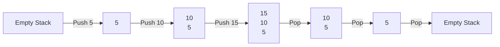

# C++ Stacks

## Introduction

A stack is a fundamental data structure in computer science that follows the Last-In-First-Out (LIFO) principle. This means that the last element added to the stack is the first one to be removed. Think of a stack like a pile of plates in a cafeteria - you can only take the top plate, and you can only add a new plate to the top.

In this tutorial, we'll explore:
- The concept of stacks and their properties
- How to implement and use stacks in C++
- Common operations on stacks
- Real-world applications of stacks
- Advanced stack implementations and techniques

## Stack Fundamentals

### Basic Operations

The stack data structure supports the following primary operations:

1. **Push**: Add an element to the top of the stack
2. **Pop**: Remove the top element from the stack
3. **Top/Peek**: View the top element without removing it
4. **isEmpty**: Check if the stack is empty
5. **Size**: Get the number of elements in the stack

### Visual Representation



## Implementing Stacks in C++

C++ provides a built-in `stack` container in the Standard Template Library (STL). Before we explore that, let's understand how to implement a stack from scratch.

### Array-Based Implementation

Here's a simple implementation of a stack using an array:

```cpp
#include <iostream>
using namespace std;

class Stack {
private:
    int* arr;
    int top;
    int capacity;

public:
    // Constructor
    Stack(int size) {
        capacity = size;
        arr = new int[capacity];
        top = -1;
    }

    // Destructor
    ~Stack() {
        delete[] arr;
    }

    // Push operation
    void push(int x) {
        if (isFull()) {
            cout << "Stack Overflow\n";
            return;
        }
        arr[++top] = x;
        cout << x << " pushed to stack\n";
    }

    // Pop operation
    int pop() {
        if (isEmpty()) {
            cout << "Stack Underflow\n";
            return -1;
        }
        return arr[top--];
    }

    // Top operation
    int peek() {
        if (isEmpty()) {
            cout << "Stack is empty\n";
            return -1;
        }
        return arr[top];
    }

    // Check if stack is empty
    bool isEmpty() {
        return top == -1;
    }

    // Check if stack is full
    bool isFull() {
        return top == capacity - 1;
    }

    // Get stack size
    int size() {
        return top + 1;
    }
};

int main() {
    Stack stack(5);
    
    stack.push(5);
    stack.push(10);
    stack.push(15);
    
    cout << "Top element: " << stack.peek() << endl;
    cout << "Stack size: " << stack.size() << endl;
    
    cout << stack.pop() << " popped from stack\n";
    cout << stack.pop() << " popped from stack\n";
    
    cout << "Is stack empty? " << (stack.isEmpty() ? "Yes" : "No") << endl;
    
    return 0;
}
```

**Output:**
```
5 pushed to stack
10 pushed to stack
15 pushed to stack
Top element: 15
Stack size: 3
15 popped from stack
10 popped from stack
Is stack empty? No
```

### Linked List-Based Implementation

We can also implement a stack using a linked list, which allows for dynamic size management:

```cpp
#include <iostream>
using namespace std;

// Node structure for linked list
struct Node {
    int data;
    Node* next;
    
    Node(int value) : data(value), next(nullptr) {}
};

class LinkedListStack {
private:
    Node* top;
    int stackSize;

public:
    // Constructor
    LinkedListStack() : top(nullptr), stackSize(0) {}
    
    // Destructor
    ~LinkedListStack() {
        while (!isEmpty()) {
            pop();
        }
    }
    
    // Push operation
    void push(int x) {
        Node* newNode = new Node(x);
        newNode->next = top;
        top = newNode;
        stackSize++;
        cout << x << " pushed to stack\n";
    }
    
    // Pop operation
    int pop() {
        if (isEmpty()) {
            cout << "Stack Underflow\n";
            return -1;
        }
        Node* temp = top;
        int popped = temp->data;
        top = top->next;
        delete temp;
        stackSize--;
        return popped;
    }
    
    // Peek operation
    int peek() {
        if (isEmpty()) {
            cout << "Stack is empty\n";
            return -1;
        }
        return top->data;
    }
    
    // Check if stack is empty
    bool isEmpty() {
        return top == nullptr;
    }
    
    // Get stack size
    int size() {
        return stackSize;
    }
};

int main() {
    LinkedListStack stack;
    
    stack.push(5);
    stack.push(10);
    stack.push(15);
    
    cout << "Top element: " << stack.peek() << endl;
    cout << "Stack size: " << stack.size() << endl;
    
    cout << stack.pop() << " popped from stack\n";
    cout << stack.pop() << " popped from stack\n";
    
    cout << "Is stack empty? " << (stack.isEmpty() ? "Yes" : "No") << endl;
    
    return 0;
}
```

**Output:**
```
5 pushed to stack
10 pushed to stack
15 pushed to stack
Top element: 15
Stack size: 3
15 popped from stack
10 popped from stack
Is stack empty? No
```

## Using C++ STL Stack

The Standard Template Library (STL) in C++ provides a ready-to-use `stack` container that handles all the internal details for you. Here's how to use it:

```cpp
#include <iostream>
#include <stack>
using namespace std;

int main() {
    // Create a stack of integers
    stack<int> s;
    
    // Push elements
    s.push(5);
    s.push(10);
    s.push(15);
    
    cout << "Stack size: " << s.size() << endl;
    cout << "Top element: " << s.top() << endl;
    
    // Pop elements
    s.pop();
    cout << "After popping, top element: " << s.top() << endl;
    
    // Check if stack is empty
    cout << "Is stack empty? " << (s.empty() ? "Yes" : "No") << endl;
    
    // Pop remaining elements
    s.pop();
    s.pop();
    
    cout << "Is stack empty now? " << (s.empty() ? "Yes" : "No") << endl;
    
    return 0;
}
```

**Output:**
```
Stack size: 3
Top element: 15
After popping, top element: 10
Is stack empty? No
Is stack empty now? Yes
```

### Template-Based Stack

One of the advantages of the STL stack is that it's template-based, allowing you to create stacks of any data type:

```cpp
#include <iostream>
#include <stack>
#include <string>
using namespace std;

int main() {
    // Stack of strings
    stack<string> bookStack;
    
    // Adding books to the stack
    bookStack.push("The C Programming Language");
    bookStack.push("Effective C++");
    bookStack.push("C++ Primer");
    
    cout << "Number of books: " << bookStack.size() << endl;
    cout << "Top book: " << bookStack.top() << endl;
    
    cout << "\nRemoving books from the stack:" << endl;
    while (!bookStack.empty()) {
        cout << "Removing: " << bookStack.top() << endl;
        bookStack.pop();
    }
    
    return 0;
}
```

**Output:**
```
Number of books: 3
Top book: C++ Primer

Removing books from the stack:
Removing: C++ Primer
Removing: Effective C++
Removing: The C Programming Language
```

## Real-World Applications of Stacks

Stacks are used in numerous applications in programming and computer science:

### 1. Function Call Management

When a program calls a function, the system pushes the return address onto a stack. When the function completes, the return address is popped to continue execution.

```cpp
#include <iostream>
using namespace std;

void function3() {
    cout << "Inside function3" << endl;
    // Function returns to function2
}

void function2() {
    cout << "Inside function2, calling function3" << endl;
    function3();
    cout << "Back in function2" << endl;
    // Function returns to function1
}

void function1() {
    cout << "Inside function1, calling function2" << endl;
    function2();
    cout << "Back in function1" << endl;
    // Function returns to main
}

int main() {
    cout << "In main, calling function1" << endl;
    function1();
    cout << "Back in main" << endl;
    return 0;
}
```

**Output:**
```
In main, calling function1
Inside function1, calling function2
Inside function2, calling function3
Inside function3
Back in function2
Back in function1
Back in main
```

### 2. Expression Evaluation

Stacks are used to evaluate arithmetic expressions, especially when converting between infix, postfix, and prefix notations.

```cpp
#include <iostream>
#include <stack>
#include <string>
using namespace std;

// Function to evaluate postfix expression
int evaluatePostfix(string expression) {
    stack<int> s;
    
    for (int i = 0; i < expression.length(); i++) {
        // If the character is a digit, push it to the stack
        if (isdigit(expression[i])) {
            s.push(expression[i] - '0');
        }
        // If the character is an operator, pop two elements and apply the operator
        else {
            int val1 = s.top();
            s.pop();
            int val2 = s.top();
            s.pop();
            
            switch (expression[i]) {
                case '+': s.push(val2 + val1); break;
                case '-': s.push(val2 - val1); break;
                case '*': s.push(val2 * val1); break;
                case '/': s.push(val2 / val1); break;
            }
        }
    }
    
    return s.top();
}

int main() {
    string postfixExpression = "23*5+"; // Equivalent to 2*3+5
    cout << "Postfix Expression: " << postfixExpression << endl;
    cout << "Evaluation Result: " << evaluatePostfix(postfixExpression) << endl;
    
    return 0;
}
```

**Output:**
```
Postfix Expression: 23*5+
Evaluation Result: 11
```

### 3. Parentheses Matching

Stacks are ideal for checking balanced parentheses in expressions:

```cpp
#include <iostream>
#include <stack>
#include <string>
using namespace std;

bool areParenthesesBalanced(string expr) {
    stack<char> s;
    
    for (int i = 0; i < expr.length(); i++) {
        if (expr[i] == '(' || expr[i] == '[' || expr[i] == '{') {
            // Push opening bracket to stack
            s.push(expr[i]);
        } else if (expr[i] == ')' || expr[i] == ']' || expr[i] == '}') {
            // If stack is empty, there's no matching opening bracket
            if (s.empty()) {
                return false;
            }
            
            // Check if the corresponding opening bracket matches
            char top = s.top();
            if ((expr[i] == ')' && top == '(') || 
                (expr[i] == ']' && top == '[') || 
                (expr[i] == '}' && top == '{')) {
                s.pop();
            } else {
                return false;
            }
        }
    }
    
    // If stack is empty, all brackets are matched
    return s.empty();
}

int main() {
    string expressions[] = {
        "{[()]}",
        "{[(])}",
        "{{[[(())]]}}",
        "[(])"
    };
    
    for (const string& expr : expressions) {
        if (areParenthesesBalanced(expr)) {
            cout << expr << " - Balanced" << endl;
        } else {
            cout << expr << " - Not Balanced" << endl;
        }
    }
    
    return 0;
}
```

**Output:**
```
{[()]} - Balanced
{[(])} - Not Balanced
{{[[(())]]}} - Balanced
[(]) - Not Balanced
```

### 4. Undo Functionality

Applications like text editors use stacks to implement undo functionality:

```cpp
#include <iostream>
#include <stack>
#include <string>
using namespace std;

class TextEditor {
private:
    string currentText;
    stack<string> undoStack;
    
public:
    TextEditor() : currentText("") {}
    
    void addText(const string& text) {
        undoStack.push(currentText);
        currentText += text;
        cout << "Added: \"" << text << "\"" << endl;
        cout << "Current text: \"" << currentText << "\"" << endl;
    }
    
    void deleteLastChar() {
        if (currentText.empty()) {
            cout << "Nothing to delete" << endl;
            return;
        }
        
        undoStack.push(currentText);
        currentText.pop_back();
        cout << "Deleted last character" << endl;
        cout << "Current text: \"" << currentText << "\"" << endl;
    }
    
    void undo() {
        if (undoStack.empty()) {
            cout << "Nothing to undo" << endl;
            return;
        }
        
        currentText = undoStack.top();
        undoStack.pop();
        cout << "Undo operation performed" << endl;
        cout << "Current text: \"" << currentText << "\"" << endl;
    }
};

int main() {
    TextEditor editor;
    
    editor.addText("Hello");
    editor.addText(" World");
    editor.addText("!");
    
    editor.deleteLastChar();
    editor.undo();  // Undoes the delete
    editor.undo();  // Undoes adding "!"
    editor.undo();  // Undoes adding " World"
    editor.undo();  // Undoes adding "Hello"
    editor.undo();  // Nothing to undo
    
    return 0;
}
```

**Output:**
```
Added: "Hello"
Current text: "Hello"
Added: " World"
Current text: "Hello World"
Added: "!"
Current text: "Hello World!"
Deleted last character
Current text: "Hello World"
Undo operation performed
Current text: "Hello World!"
Undo operation performed
Current text: "Hello World"
Undo operation performed
Current text: "Hello"
Undo operation performed
Current text: ""
Nothing to undo
```

## Advanced Stack Applications

### 1. Implementing a Min/Max Stack

A Min/Max Stack is a stack that also keeps track of the minimum or maximum value in the stack:

```cpp
#include <iostream>
#include <stack>
using namespace std;

class MinStack {
private:
    stack<int> mainStack;
    stack<int> minStack;
    
public:
    void push(int x) {
        mainStack.push(x);
        
        // If minStack is empty or new element is smaller than current minimum
        if (minStack.empty() || x <= minStack.top()) {
            minStack.push(x);
        }
    }
    
    void pop() {
        if (mainStack.empty()) {
            cout << "Stack is empty" << endl;
            return;
        }
        
        // If the top element is the minimum, remove it from minStack too
        if (mainStack.top() == minStack.top()) {
            minStack.pop();
        }
        
        mainStack.pop();
    }
    
    int top() {
        if (mainStack.empty()) {
            cout << "Stack is empty" << endl;
            return -1;
        }
        return mainStack.top();
    }
    
    int getMin() {
        if (minStack.empty()) {
            cout << "Stack is empty" << endl;
            return -1;
        }
        return minStack.top();
    }
};

int main() {
    MinStack s;
    
    s.push(5);
    s.push(2);
    s.push(10);
    s.push(1);
    
    cout << "Current minimum: " << s.getMin() << endl;
    
    s.pop();  // Remove 1
    cout << "After popping, minimum: " << s.getMin() << endl;
    
    s.pop();  // Remove 10
    cout << "After popping, minimum: " << s.getMin() << endl;
    
    return 0;
}
```

**Output:**
```
Current minimum: 1
After popping, minimum: 2
After popping, minimum: 2
```

### 2. Converting Infix to Postfix Expression

Another classic application of stacks is converting infix expressions (like `a+b*c`) to postfix expressions (like `abc*+`):

```cpp
#include <iostream>
#include <stack>
#include <string>
using namespace std;

// Function to check if character is an operator
bool isOperator(char c) {
    return (c == '+' || c == '-' || c == '*' || c == '/' || c == '^');
}

// Function to get precedence of operator
int precedence(char c) {
    if (c == '^')
        return 3;
    else if (c == '*' || c == '/')
        return 2;
    else if (c == '+' || c == '-')
        return 1;
    else
        return -1;
}

// Function to convert infix expression to postfix
string infixToPostfix(string infix) {
    stack<char> s;
    string postfix = "";
    
    for (int i = 0; i < infix.length(); i++) {
        char c = infix[i];
        
        // If the character is an operand, add it to the postfix expression
        if ((c >= 'a' && c <= 'z') || (c >= 'A' && c <= 'Z') || (c >= '0' && c <= '9')) {
            postfix += c;
        }
        // If the character is an opening bracket, push it to the stack
        else if (c == '(') {
            s.push(c);
        }
        // If the character is a closing bracket, pop until opening bracket
        else if (c == ')') {
            while (!s.empty() && s.top() != '(') {
                postfix += s.top();
                s.pop();
            }
            // Remove the opening bracket
            if (!s.empty() && s.top() == '(') {
                s.pop();
            }
        }
        // If the character is an operator
        else if (isOperator(c)) {
            while (!s.empty() && precedence(c) <= precedence(s.top())) {
                postfix += s.top();
                s.pop();
            }
            s.push(c);
        }
    }
    
    // Pop all remaining elements from the stack
    while (!s.empty()) {
        postfix += s.top();
        s.pop();
    }
    
    return postfix;
}

int main() {
    string infixExpressions[] = {
        "a+b*c",
        "(a+b)*c",
        "a+b*c^d-e/f",
        "k+l-m*n+(o^p)*w/u/v*t+q"
    };
    
    for (const string& expr : infixExpressions) {
        cout << "Infix: " << expr << endl;
        cout << "Postfix: " << infixToPostfix(expr) << endl << endl;
    }
    
    return 0;
}
```

**Output:**
```
Infix: a+b*c
Postfix: abc*+

Infix: (a+b)*c
Postfix: ab+c*

Infix: a+b*c^d-e/f
Postfix: abcd^*+ef/-

Infix: k+l-m*n+(o^p)*w/u/v*t+q
Postfix: kl+mn*-op^w*u/v/t*+q+
```

## Performance Considerations

When working with stacks, it's important to understand their performance characteristics:

- **Time Complexity**:
  - Push: O(1)
  - Pop: O(1)
  - Peek/Top: O(1)
  - isEmpty: O(1)
  - Size: O(1)

- **Space Complexity**:
  - Array-based implementation: O(n) with fixed capacity
  - Linked list-based implementation: O(n) with dynamic capacity

- **Advantages of STL stack**:
  - Automatically handles memory management
  - Type-safe due to templates
  - Consistent interface with other STL containers

- **When to use which implementation**:
  - STL stack: Most general-purpose applications
  - Custom array-based: When you need more control or have memory constraints
  - Custom linked list-based: When you need a truly dynamic size

## Summary

In this tutorial, we've explored the stack data structure in C++:

- We learned that a stack follows the Last-In-First-Out (LIFO) principle
- We implemented stacks using arrays and linked lists
- We learned how to use the C++ STL stack container
- We explored real-world applications like function calls, expression evaluation, and undo functionality
- We examined advanced stack implementations like Min/Max stacks and infix-to-postfix conversion

Stacks are a fundamental data structure that appear in many algorithms and applications. Understanding how to implement and use them efficiently is an essential skill for any programmer.

## Exercises

1. Implement a stack that supports "push", "pop", "top", and "getMax" operations in O(1) time.
2. Write a program to evaluate an infix expression using stacks.
3. Implement a stack that can be sorted (either during push operations or with a separate sort method).
4. Implement a browser history feature using two stacks (one for back history, one for forward history).
5. Use a stack to check if a given string is a palindrome.
6. Implement a stack that uses two queues.

## Additional Resources

- [C++ Reference - Stack](https://en.cppreference.com/w/cpp/container/stack)
- [Geeks for Geeks - Stack Data Structure](https://www.geeksforgeeks.org/stack-data-structure/)
- [Stack Applications on Wikipedia](https://en.wikipedia.org/wiki/Stack_(abstract_data_type)#Applications)
- Book: "Data Structures and Algorithms in C++" by Michael T. Goodrich
- [Stack Overflow - Common Stack Questions](https://stackoverflow.com/questions/tagged/stack)

Happy coding!