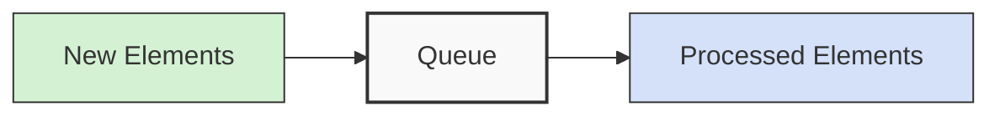

# C++ Queues

## Introduction

Queues are fundamental data structures in computer science that follow the **First-In-First-Out (FIFO)** principle. Think of a queue as a line of people waiting for a service - the first person to join the line is the first one to be served.

In this tutorial, we'll explore:
- What queues are and how they work
- Basic queue operations
- Different ways to implement queues in C++
- The C++ Standard Template Library (STL) queue container
- Real-world applications of queues
- Variations like priority queues and double-ended queues (deques)

Whether you're implementing a print spooler, managing processes in an operating system, or handling requests in a web server, understanding queues is essential for many programming tasks.

## Queue Basics

### What is a Queue?

A queue is a linear data structure that follows the First-In-First-Out (FIFO) principle. This means that the element added first will be the first one to be removed.



### Key Queue Operations

The main operations of a queue include:

1. **Enqueue**: Add an element to the back of the queue
2. **Dequeue**: Remove an element from the front of the queue
3. **Front**: View the element at the front of the queue without removing it
4. **IsEmpty**: Check if the queue is empty
5. **Size**: Get the number of elements in the queue

## Implementing a Queue in C++

Let's look at different ways to implement a queue in C++.

### Implementation using an Array

First, let's implement a basic queue using an array:

```cpp
#include <iostream>
using namespace std;

class Queue {
private:
    int* arr;       // array to store queue elements
    int capacity;   // maximum capacity of the queue
    int front;      // index of the front element
    int rear;       // index of the rear element
    int count;      // current size of the queue

public:
    // Constructor
    Queue(int size) {
        arr = new int[size];
        capacity = size;
        front = 0;
        rear = -1;
        count = 0;
    }

    // Destructor
    ~Queue() {
        delete[] arr;
    }

    // Function to add an element to the queue
    void enqueue(int item) {
        if (isFull()) {
            cout << "Queue Overflow! Cannot enqueue item: " << item << endl;
            return;
        }
        
        rear = (rear + 1) % capacity;  // circular array implementation
        arr[rear] = item;
        count++;
        
        cout << "Enqueued " << item << " to the queue" << endl;
    }

    // Function to remove an element from the queue
    int dequeue() {
        if (isEmpty()) {
            cout << "Queue Underflow! Cannot dequeue from an empty queue" << endl;
            return -1;
        }
        
        int item = arr[front];
        front = (front + 1) % capacity;  // circular array implementation
        count--;
        
        return item;
    }

    // Function to return the front element of the queue
    int peek() {
        if (isEmpty()) {
            cout << "Queue is empty" << endl;
            return -1;
        }
        return arr[front];
    }

    // Function to check if the queue is empty
    bool isEmpty() {
        return (count == 0);
    }

    // Function to check if the queue is full
    bool isFull() {
        return (count == capacity);
    }

    // Function to get the size of the queue
    int size() {
        return count;
    }
};

int main() {
    // Create a queue of capacity 5
    Queue q(5);

    // Insert elements
    q.enqueue(10);
    q.enqueue(20);
    q.enqueue(30);
    q.enqueue(40);
    q.enqueue(50);

    // Queue is full, this will print an error message
    q.enqueue(60);

    cout << "Queue size: " << q.size() << endl;
    cout << "Front element: " << q.peek() << endl;

    // Remove elements
    cout << "Dequeued: " << q.dequeue() << endl;
    cout << "Dequeued: " << q.dequeue() << endl;

    cout << "Queue size after dequeue operations: " << q.size() << endl;
    cout << "Front element after dequeue operations: " << q.peek() << endl;

    return 0;
}
```

**Output:**
```
Enqueued 10 to the queue
Enqueued 20 to the queue
Enqueued 30 to the queue
Enqueued 40 to the queue
Enqueued 50 to the queue
Queue Overflow! Cannot enqueue item: 60
Queue size: 5
Front element: 10
Dequeued: 10
Dequeued: 20
Queue size after dequeue operations: 3
Front element after dequeue operations: 30
```

### Implementation using Linked List

Next, let's implement a queue using a linked list, which allows dynamic size management:

```cpp
#include <iostream>
using namespace std;

// Node class for the linked list
class Node {
public:
    int data;
    Node* next;
    
    Node(int value) {
        data = value;
        next = nullptr;
    }
};

class LinkedListQueue {
private:
    Node* front;
    Node* rear;
    int count;

public:
    // Constructor
    LinkedListQueue() {
        front = nullptr;
        rear = nullptr;
        count = 0;
    }
    
    // Destructor
    ~LinkedListQueue() {
        while (!isEmpty()) {
            dequeue();
        }
    }

    // Function to add an element to the queue
    void enqueue(int item) {
        Node* newNode = new Node(item);
        
        // If queue is empty, front and rear both point to the new node
        if (isEmpty()) {
            front = newNode;
            rear = newNode;
        } else {
            // Add the new node at the end and update rear
            rear->next = newNode;
            rear = newNode;
        }
        
        count++;
        cout << "Enqueued " << item << " to the queue" << endl;
    }

    // Function to remove an element from the queue
    int dequeue() {
        if (isEmpty()) {
            cout << "Queue Underflow! Cannot dequeue from an empty queue" << endl;
            return -1;
        }
        
        // Store the front element to return it
        int item = front->data;
        
        // Move front to the next node
        Node* temp = front;
        front = front->next;
        
        // If front becomes nullptr, the queue is empty
        if (front == nullptr) {
            rear = nullptr;
        }
        
        delete temp;
        count--;
        
        return item;
    }

    // Function to return the front element of the queue
    int peek() {
        if (isEmpty()) {
            cout << "Queue is empty" << endl;
            return -1;
        }
        return front->data;
    }

    // Function to check if the queue is empty
    bool isEmpty() {
        return (front == nullptr);
    }

    // Function to get the size of the queue
    int size() {
        return count;
    }
};

int main() {
    LinkedListQueue q;

    // Insert elements
    q.enqueue(10);
    q.enqueue(20);
    q.enqueue(30);
    q.enqueue(40);
    q.enqueue(50);

    cout << "Queue size: " << q.size() << endl;
    cout << "Front element: " << q.peek() << endl;

    // Remove elements
    cout << "Dequeued: " << q.dequeue() << endl;
    cout << "Dequeued: " << q.dequeue() << endl;

    cout << "Queue size after dequeue operations: " << q.size() << endl;
    cout << "Front element after dequeue operations: " << q.peek() << endl;

    return 0;
}
```

**Output:**
```
Enqueued 10 to the queue
Enqueued 20 to the queue
Enqueued 30 to the queue
Enqueued 40 to the queue
Enqueued 50 to the queue
Queue size: 5
Front element: 10
Dequeued: 10
Dequeued: 20
Queue size after dequeue operations: 3
Front element after dequeue operations: 30
```

## C++ STL Queue

C++ Standard Template Library (STL) provides a built-in implementation of a queue container that is versatile and easy to use.

### Basic STL Queue Operations

```cpp
#include <iostream>
#include <queue>
using namespace std;

int main() {
    // Create a queue of integers
    queue<int> q;
    
    // Add elements to the queue
    q.push(10);
    q.push(20);
    q.push(30);
    q.push(40);
    q.push(50);
    
    cout << "Queue size: " << q.size() << endl;
    cout << "Front element: " << q.front() << endl;
    cout << "Back element: " << q.back() << endl;
    
    // Remove elements from the queue
    cout << "\nDequeuing elements:" << endl;
    while (!q.empty()) {
        cout << "Processed: " << q.front() << endl;
        q.pop();
    }
    
    cout << "\nQueue is empty: " << (q.empty() ? "Yes" : "No") << endl;
    
    return 0;
}
```

**Output:**
```
Queue size: 5
Front element: 10
Back element: 50

Dequeuing elements:
Processed: 10
Processed: 20
Processed: 30
Processed: 40
Processed: 50

Queue is empty: Yes
```

### Working with Custom Objects in STL Queue

STL queues can work with any data type, including custom objects:

```cpp
#include <iostream>
#include <queue>
#include <string>
using namespace std;

class Task {
private:
    string name;
    int priority;
    
public:
    Task(string n, int p) : name(n), priority(p) {}
    
    string getName() const {
        return name;
    }
    
    int getPriority() const {
        return priority;
    }
};

int main() {
    queue<Task> taskQueue;
    
    // Add tasks to the queue
    taskQueue.push(Task("Send email", 3));
    taskQueue.push(Task("Prepare presentation", 1));
    taskQueue.push(Task("Call client", 2));
    taskQueue.push(Task("Update database", 4));
    
    cout << "Processing tasks in FIFO order:" << endl;
    
    while (!taskQueue.empty()) {
        Task currentTask = taskQueue.front();
        cout << "Processing: " << currentTask.getName() 
             << " (Priority: " << currentTask.getPriority() << ")" << endl;
        taskQueue.pop();
    }
    
    return 0;
}
```

**Output:**
```
Processing tasks in FIFO order:
Processing: Send email (Priority: 3)
Processing: Prepare presentation (Priority: 1)
Processing: Call client (Priority: 2)
Processing: Update database (Priority: 4)
```

Notice that the tasks are processed in the order they were added (FIFO), regardless of their priority.

## STL Priority Queue

When elements need to be processed based on their priority rather than their arrival order, C++ STL provides a priority queue implementation.

```cpp
#include <iostream>
#include <queue>
#include <string>
using namespace std;

class Task {
private:
    string name;
    int priority;
    
public:
    Task(string n, int p) : name(n), priority(p) {}
    
    string getName() const {
        return name;
    }
    
    int getPriority() const {
        return priority;
    }
    
    // Operator overloading for comparison
    bool operator<(const Task& other) const {
        // Note: in priority_queue, higher values have higher priority by default
        // We use < because priority_queue uses the priority queue functions in reverse
        return priority < other.priority;
    }
};

int main() {
    // Create a priority queue of tasks
    priority_queue<Task> taskQueue;
    
    // Add tasks to the queue
    taskQueue.push(Task("Send email", 3));
    taskQueue.push(Task("Prepare presentation", 1));
    taskQueue.push(Task("Call client", 2));
    taskQueue.push(Task("Update database", 4));
    
    cout << "Processing tasks by priority (highest first):" << endl;
    
    while (!taskQueue.empty()) {
        Task currentTask = taskQueue.top();
        cout << "Processing: " << currentTask.getName() 
             << " (Priority: " << currentTask.getPriority() << ")" << endl;
        taskQueue.pop();
    }
    
    return 0;
}
```

**Output:**
```
Processing tasks by priority (highest first):
Processing: Update database (Priority: 4)
Processing: Send email (Priority: 3)
Processing: Call client (Priority: 2)
Processing: Prepare presentation (Priority: 1)
```

Notice that the tasks are now processed in order of priority (highest first) rather than arrival order.

## Real-World Applications of Queues

Queues are used in many real-world situations:

1. **Printer Spooler**: Documents wait in a queue to be printed.
2. **Process Scheduling**: Operating systems use queues to manage processes.
3. **Call Center Systems**: Calls are placed in a queue waiting for an agent.
4. **Web Servers**: Handle client requests in a queue to prevent overload.
5. **Breadth-First Search (BFS)**: Used in graph algorithms to explore nodes level by level.

Let's implement a simple printer spooler using a queue:

```cpp
#include <iostream>
#include <queue>
#include <string>
#include <thread>
#include <chrono>
using namespace std;

class PrintJob {
private:
    string filename;
    int pages;
    string username;

public:
    PrintJob(string fn, int p, string un) 
        : filename(fn), pages(p), username(un) {}
    
    string getFilename() const { return filename; }
    int getPages() const { return pages; }
    string getUsername() const { return username; }
};

class PrinterSpooler {
private:
    queue<PrintJob> jobQueue;
    bool isPrinterAvailable;

public:
    PrinterSpooler() : isPrinterAvailable(true) {}
    
    void addJob(const PrintJob& job) {
        jobQueue.push(job);
        cout << "Added job: " << job.getFilename() 
             << " (" << job.getPages() << " pages) from " 
             << job.getUsername() << endl;
    }
    
    void processPrintJobs() {
        cout << "\nStarting printer service...\n" << endl;
        
        while (!jobQueue.empty()) {
            PrintJob currentJob = jobQueue.front();
            
            cout << "Printing: " << currentJob.getFilename() 
                 << " for " << currentJob.getUsername() 
                 << " (" << currentJob.getPages() << " pages)" << endl;
            
            // Simulate printing time (1 second per job)
            this_thread::sleep_for(chrono::seconds(1));
            
            cout << "Completed printing: " << currentJob.getFilename() << endl;
            
            jobQueue.pop();
        }
        
        cout << "\nAll print jobs completed." << endl;
    }
    
    int pendingJobs() {
        return jobQueue.size();
    }
};

int main() {
    PrinterSpooler printer;
    
    // Add print jobs
    printer.addJob(PrintJob("report.pdf", 5, "alice"));
    printer.addJob(PrintJob("presentation.pptx", 12, "bob"));
    printer.addJob(PrintJob("invoice.docx", 2, "charlie"));
    printer.addJob(PrintJob("image.jpg", 1, "david"));
    
    cout << "Pending jobs: " << printer.pendingJobs() << endl;
    
    // Process the queue
    printer.processPrintJobs();
    
    return 0;
}
```

**Output:**
```
Added job: report.pdf (5 pages) from alice
Added job: presentation.pptx (12 pages) from bob
Added job: invoice.docx (2 pages) from charlie
Added job: image.jpg (1 pages) from david
Pending jobs: 4

Starting printer service...

Printing: report.pdf for alice (5 pages)
Completed printing: report.pdf
Printing: presentation.pptx for bob (12 pages)
Completed printing: presentation.pptx
Printing: invoice.docx for charlie (2 pages)
Completed printing: invoice.docx
Printing: image.jpg for david (1 pages)
Completed printing: image.jpg

All print jobs completed.
```

This example demonstrates how a printer spooler might use a queue to manage print jobs in a FIFO manner.

## Double-Ended Queue (Deque)

C++ STL also provides a double-ended queue (deque) that allows insertion and deletion at both ends:

```cpp
#include <iostream>
#include <deque>
using namespace std;

int main() {
    deque<int> dq;
    
    // Add elements to the front
    dq.push_front(10);
    dq.push_front(20);
    
    // Add elements to the back
    dq.push_back(30);
    dq.push_back(40);
    
    cout << "Deque contents: ";
    for (int element : dq) {
        cout << element << " ";
    }
    cout << endl;
    
    // Remove elements from both ends
    cout << "Front element (before removal): " << dq.front() << endl;
    dq.pop_front();
    cout << "Front element (after removal): " << dq.front() << endl;
    
    cout << "Back element (before removal): " << dq.back() << endl;
    dq.pop_back();
    cout << "Back element (after removal): " << dq.back() << endl;
    
    cout << "Deque contents after removals: ";
    for (int element : dq) {
        cout << element << " ";
    }
    cout << endl;
    
    return 0;
}
```

**Output:**
```
Deque contents: 20 10 30 40
Front element (before removal): 20
Front element (after removal): 10
Back element (before removal): 40
Back element (after removal): 30
Deque contents after removals: 10 30
```

## Queue Performance Comparison

Let's compare the performance characteristics of different queue implementations:

| Implementation | Enqueue | Dequeue | Front | Memory Usage | Dynamic Size |
|----------------|---------|---------|-------|--------------|--------------|
| Array-based    | O(1)    | O(1)    | O(1)  | Fixed        | No           |
| Linked List    | O(1)    | O(1)    | O(1)  | Dynamic      | Yes          |
| STL queue      | O(1)    | O(1)    | O(1)  | Dynamic      | Yes          |
| STL priority_queue | O(log n) | O(log n) | O(1) | Dynamic  | Yes         |
| STL deque      | O(1)    | O(1)    | O(1)  | Dynamic      | Yes          |

## Summary

In this tutorial, we've covered:

1. The basic concept of queues and their FIFO ordering principle
2. Implementation of queues using arrays and linked lists
3. Using C++ STL's ready-made queue container
4. Priority queues for handling elements with different priorities
5. Double-ended queues (deques) that allow manipulation at both ends
6. Real-world applications of queues, such as a printer spooler

Queues are essential data structures that help manage ordered collections of items. Understanding them is crucial for many real-world programming tasks, especially those involving scheduling, buffering, or processing items in a specific order.

## Additional Resources

- [C++ Reference - std::queue](https://en.cppreference.com/w/cpp/container/queue)
- [C++ Reference - std::priority_queue](https://en.cppreference.com/w/cpp/container/priority_queue)
- [C++ Reference - std::deque](https://en.cppreference.com/w/cpp/container/deque)

## Practice Exercises

1. Implement a circular queue with a fixed-size array that reuses empty spaces.
2. Create a queue class that keeps track of both the minimum and maximum values in the queue.
3. Implement a queue using two stacks.
4. Build a simulation of a bank with multiple tellers serving customers from a queue.
5. Implement a breadth-first search algorithm using a queue to traverse a graph.