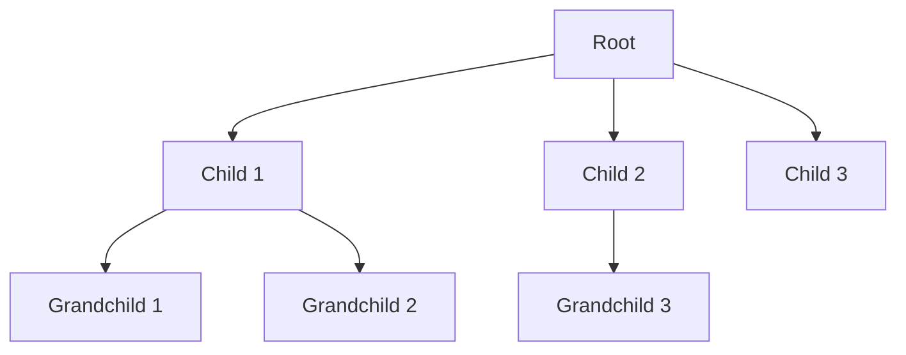
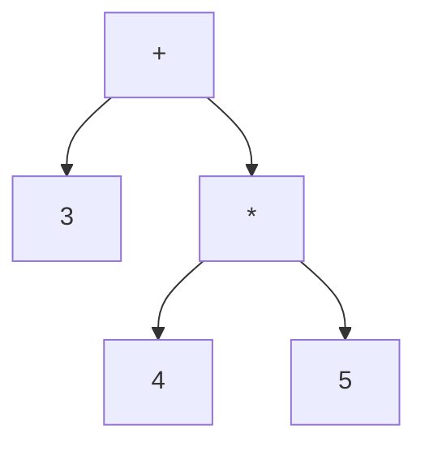

# C++ Trees

Trees are one of the most important non-linear data structures in computer science, providing efficient ways to represent hierarchical relationships between data. In this guide, we'll explore tree structures, their implementation in C++, and practical applications.

## Introduction to Trees

A tree is a hierarchical data structure consisting of nodes connected by edges. Unlike linear data structures such as arrays, linked lists, stacks, and queues, trees allow us to represent relationships that have a hierarchical nature.

Key features of trees:
- Each tree has a **root node** (the topmost node)
- Every node (except the root) has exactly one **parent node**
- Each node can have multiple **child nodes**
- Nodes with no children are called **leaf nodes** or **terminal nodes**

### Basic Tree Terminology

- **Node**: Basic element of a tree containing data and references to child nodes
- **Edge**: Connection between nodes
- **Root**: The topmost node with no parent
- **Child**: A node directly connected to another node when moving away from the root
- **Parent**: The converse of a child
- **Siblings**: Nodes that share the same parent
- **Leaf**: Node with no children
- **Height**: Length of the longest path from root to leaf
- **Depth**: Length of the path from the root to a particular node

Here's a simple visualization of a tree:



## Binary Trees

A binary tree is a special type of tree where each node has at most two children, typically referred to as the **left child** and the **right child**.

### Basic Binary Tree Node Structure in C++

```cpp
template <typename T>
struct TreeNode {
    T data;
    TreeNode* left;
    TreeNode* right;
    
    // Constructor
    TreeNode(T value) : data(value), left(nullptr), right(nullptr) {}
};
```

### Creating a Simple Binary Tree

```cpp
#include <iostream>

template <typename T>
struct TreeNode {
    T data;
    TreeNode* left;
    TreeNode* right;
    
    TreeNode(T value) : data(value), left(nullptr), right(nullptr) {}
};

int main() {
    // Creating a simple binary tree
    //        10
    //       /  \
    //      5    15
    //     / \   / \
    //    3   7 12  18
    
    TreeNode<int>* root = new TreeNode<int>(10);
    root->left = new TreeNode<int>(5);
    root->right = new TreeNode<int>(15);
    root->left->left = new TreeNode<int>(3);
    root->left->right = new TreeNode<int>(7);
    root->right->left = new TreeNode<int>(12);
    root->right->right = new TreeNode<int>(18);
    
    std::cout << "Binary tree created successfully!" << std::endl;
    std::cout << "Root value: " << root->data << std::endl;
    std::cout << "Left child of root: " << root->left->data << std::endl;
    std::cout << "Right child of root: " << root->right->data << std::endl;
    
    // Don't forget to free memory in a real application
    // (Here we're omitting the deletion code for simplicity)
    
    return 0;
}
```

**Output:**
```
Binary tree created successfully!
Root value: 10
Left child of root: 5
Right child of root: 15
```

## Tree Traversals

Traversal is the process of visiting each node in a tree exactly once. For binary trees, there are three common traversal methods:

### 1. In-order Traversal (Left → Root → Right)

```cpp
template <typename T>
void inOrderTraversal(TreeNode<T>* root) {
    if (root == nullptr) return;
    
    inOrderTraversal(root->left);      // Visit left subtree
    std::cout << root->data << " ";    // Visit root
    inOrderTraversal(root->right);     // Visit right subtree
}
```

### 2. Pre-order Traversal (Root → Left → Right)

```cpp
template <typename T>
void preOrderTraversal(TreeNode<T>* root) {
    if (root == nullptr) return;
    
    std::cout << root->data << " ";    // Visit root
    preOrderTraversal(root->left);     // Visit left subtree
    preOrderTraversal(root->right);    // Visit right subtree
}
```

### 3. Post-order Traversal (Left → Right → Root)

```cpp
template <typename T>
void postOrderTraversal(TreeNode<T>* root) {
    if (root == nullptr) return;
    
    postOrderTraversal(root->left);    // Visit left subtree
    postOrderTraversal(root->right);   // Visit right subtree
    std::cout << root->data << " ";    // Visit root
}
```

### Example Using All Three Traversals

```cpp
#include <iostream>

template <typename T>
struct TreeNode {
    T data;
    TreeNode* left;
    TreeNode* right;
    
    TreeNode(T value) : data(value), left(nullptr), right(nullptr) {}
};

template <typename T>
void inOrderTraversal(TreeNode<T>* root) {
    if (root == nullptr) return;
    inOrderTraversal(root->left);
    std::cout << root->data << " ";
    inOrderTraversal(root->right);
}

template <typename T>
void preOrderTraversal(TreeNode<T>* root) {
    if (root == nullptr) return;
    std::cout << root->data << " ";
    preOrderTraversal(root->left);
    preOrderTraversal(root->right);
}

template <typename T>
void postOrderTraversal(TreeNode<T>* root) {
    if (root == nullptr) return;
    postOrderTraversal(root->left);
    postOrderTraversal(root->right);
    std::cout << root->data << " ";
}

// Helper function to free memory
template <typename T>
void deleteTree(TreeNode<T>* root) {
    if (root == nullptr) return;
    deleteTree(root->left);
    deleteTree(root->right);
    delete root;
}

int main() {
    // Create a binary tree
    //        10
    //       /  \
    //      5    15
    //     / \   / \
    //    3   7 12  18
    
    TreeNode<int>* root = new TreeNode<int>(10);
    root->left = new TreeNode<int>(5);
    root->right = new TreeNode<int>(15);
    root->left->left = new TreeNode<int>(3);
    root->left->right = new TreeNode<int>(7);
    root->right->left = new TreeNode<int>(12);
    root->right->right = new TreeNode<int>(18);
    
    std::cout << "In-order traversal: ";
    inOrderTraversal(root);
    std::cout << std::endl;
    
    std::cout << "Pre-order traversal: ";
    preOrderTraversal(root);
    std::cout << std::endl;
    
    std::cout << "Post-order traversal: ";
    postOrderTraversal(root);
    std::cout << std::endl;
    
    // Free memory
    deleteTree(root);
    
    return 0;
}
```

**Output:**
```
In-order traversal: 3 5 7 10 12 15 18
Pre-order traversal: 10 5 3 7 15 12 18
Post-order traversal: 3 7 5 12 18 15 10
```

## Binary Search Trees (BST)

A Binary Search Tree is a special type of binary tree that maintains the following property: for any node, all nodes in the left subtree have values less than the node's value, and all nodes in the right subtree have values greater than the node's value.

### Key Operations in a BST

#### 1. Insertion

```cpp
template <typename T>
TreeNode<T>* insert(TreeNode<T>* root, T value) {
    // If the tree is empty, return a new node
    if (root == nullptr) {
        return new TreeNode<T>(value);
    }
    
    // Otherwise, recur down the tree
    if (value < root->data) {
        root->left = insert(root->left, value);
    } else if (value > root->data) {
        root->right = insert(root->right, value);
    }
    
    // Return the unchanged node pointer
    return root;
}
```

#### 2. Search

```cpp
template <typename T>
TreeNode<T>* search(TreeNode<T>* root, T value) {
    // Base cases: root is null or value is at root
    if (root == nullptr || root->data == value) {
        return root;
    }
    
    // Value is greater than root's value
    if (value > root->data) {
        return search(root->right, value);
    }
    
    // Value is less than root's value
    return search(root->left, value);
}
```

#### 3. Deletion

Deletion in a BST is more complex as it involves three cases:
1. Node to be deleted is a leaf (no children)
2. Node has one child
3. Node has two children

```cpp
template <typename T>
TreeNode<T>* findMin(TreeNode<T>* node) {
    TreeNode<T>* current = node;
    while (current && current->left != nullptr) {
        current = current->left;
    }
    return current;
}

template <typename T>
TreeNode<T>* deleteNode(TreeNode<T>* root, T value) {
    // Base case
    if (root == nullptr) return root;
    
    // Recursive calls for ancestors of node to be deleted
    if (value < root->data) {
        root->left = deleteNode(root->left, value);
    } else if (value > root->data) {
        root->right = deleteNode(root->right, value);
    } else {
        // Node with only one child or no child
        if (root->left == nullptr) {
            TreeNode<T>* temp = root->right;
            delete root;
            return temp;
        } else if (root->right == nullptr) {
            TreeNode<T>* temp = root->left;
            delete root;
            return temp;
        }
        
        // Node with two children
        TreeNode<T>* temp = findMin(root->right); // Find smallest in right subtree
        root->data = temp->data; // Copy the successor's data
        root->right = deleteNode(root->right, temp->data); // Delete the successor
    }
    return root;
}
```

### Complete BST Example

```cpp
#include <iostream>

template <typename T>
struct TreeNode {
    T data;
    TreeNode* left;
    TreeNode* right;
    
    TreeNode(T value) : data(value), left(nullptr), right(nullptr) {}
};

template <typename T>
TreeNode<T>* insert(TreeNode<T>* root, T value) {
    if (root == nullptr) {
        return new TreeNode<T>(value);
    }
    
    if (value < root->data) {
        root->left = insert(root->left, value);
    } else if (value > root->data) {
        root->right = insert(root->right, value);
    }
    
    return root;
}

template <typename T>
TreeNode<T>* search(TreeNode<T>* root, T value) {
    if (root == nullptr || root->data == value) {
        return root;
    }
    
    if (value > root->data) {
        return search(root->right, value);
    }
    
    return search(root->left, value);
}

template <typename T>
void inOrderTraversal(TreeNode<T>* root) {
    if (root == nullptr) return;
    inOrderTraversal(root->left);
    std::cout << root->data << " ";
    inOrderTraversal(root->right);
}

// Helper function to free memory
template <typename T>
void deleteTree(TreeNode<T>* root) {
    if (root == nullptr) return;
    deleteTree(root->left);
    deleteTree(root->right);
    delete root;
}

int main() {
    TreeNode<int>* root = nullptr;
    
    // Insert nodes
    root = insert(root, 50);
    insert(root, 30);
    insert(root, 20);
    insert(root, 40);
    insert(root, 70);
    insert(root, 60);
    insert(root, 80);
    
    std::cout << "In-order traversal of the BST: ";
    inOrderTraversal(root);
    std::cout << std::endl;
    
    // Search for values
    int searchValue = 40;
    TreeNode<int>* result = search(root, searchValue);
    if (result != nullptr) {
        std::cout << "Found " << searchValue << " in the BST." << std::endl;
    } else {
        std::cout << searchValue << " not found in the BST." << std::endl;
    }
    
    searchValue = 55;
    result = search(root, searchValue);
    if (result != nullptr) {
        std::cout << "Found " << searchValue << " in the BST." << std::endl;
    } else {
        std::cout << searchValue << " not found in the BST." << std::endl;
    }
    
    // Free memory
    deleteTree(root);
    
    return 0;
}
```

**Output:**
```
In-order traversal of the BST: 20 30 40 50 60 70 80
Found 40 in the BST.
55 not found in the BST.
```

## Balanced Trees

A balanced tree is a binary tree where the height of the left and right subtrees of any node differ by no more than a small amount (usually 1). Common examples include:

1. **AVL Trees**: Self-balancing BST where the height difference between left and right subtrees cannot be more than 1
2. **Red-Black Trees**: Self-balancing BST with additional coloring property
3. **B-Trees**: Self-balancing tree data structure that maintains sorted data and allows searches, sequential access, insertions, and deletions in logarithmic time

### AVL Tree Implementation Example

```cpp
#include <iostream>
#include <algorithm>

template <typename T>
struct AVLNode {
    T data;
    AVLNode* left;
    AVLNode* right;
    int height;
    
    AVLNode(T value) : data(value), left(nullptr), right(nullptr), height(1) {}
};

template <typename T>
int height(AVLNode<T>* node) {
    if (node == nullptr) return 0;
    return node->height;
}

template <typename T>
int getBalance(AVLNode<T>* node) {
    if (node == nullptr) return 0;
    return height(node->left) - height(node->right);
}

template <typename T>
AVLNode<T>* rightRotate(AVLNode<T>* y) {
    AVLNode<T>* x = y->left;
    AVLNode<T>* T2 = x->right;
    
    // Perform rotation
    x->right = y;
    y->left = T2;
    
    // Update heights
    y->height = std::max(height(y->left), height(y->right)) + 1;
    x->height = std::max(height(x->left), height(x->right)) + 1;
    
    // Return new root
    return x;
}

template <typename T>
AVLNode<T>* leftRotate(AVLNode<T>* x) {
    AVLNode<T>* y = x->right;
    AVLNode<T>* T2 = y->left;
    
    // Perform rotation
    y->left = x;
    x->right = T2;
    
    // Update heights
    x->height = std::max(height(x->left), height(x->right)) + 1;
    y->height = std::max(height(y->left), height(y->right)) + 1;
    
    // Return new root
    return y;
}

template <typename T>
AVLNode<T>* insert(AVLNode<T>* node, T value) {
    // Standard BST insert
    if (node == nullptr) {
        return new AVLNode<T>(value);
    }
    
    if (value < node->data) {
        node->left = insert(node->left, value);
    } else if (value > node->data) {
        node->right = insert(node->right, value);
    } else {
        // Duplicate values not allowed
        return node;
    }
    
    // Update height of current node
    node->height = 1 + std::max(height(node->left), height(node->right));
    
    // Get the balance factor to check if this node became unbalanced
    int balance = getBalance(node);
    
    // Left Left Case
    if (balance > 1 && value < node->left->data) {
        return rightRotate(node);
    }
    
    // Right Right Case
    if (balance < -1 && value > node->right->data) {
        return leftRotate(node);
    }
    
    // Left Right Case
    if (balance > 1 && value > node->left->data) {
        node->left = leftRotate(node->left);
        return rightRotate(node);
    }
    
    // Right Left Case
    if (balance < -1 && value < node->right->data) {
        node->right = rightRotate(node->right);
        return leftRotate(node);
    }
    
    // Return the unchanged node pointer
    return node;
}

template <typename T>
void inOrder(AVLNode<T>* root) {
    if (root == nullptr) return;
    inOrder(root->left);
    std::cout << root->data << " ";
    inOrder(root->right);
}

template <typename T>
void deleteTree(AVLNode<T>* root) {
    if (root == nullptr) return;
    deleteTree(root->left);
    deleteTree(root->right);
    delete root;
}

int main() {
    AVLNode<int>* root = nullptr;
    
    // Insert nodes
    root = insert(root, 10);
    root = insert(root, 20);
    root = insert(root, 30);
    root = insert(root, 40);
    root = insert(root, 50);
    root = insert(root, 25);
    
    std::cout << "In-order traversal of the AVL tree: ";
    inOrder(root);
    std::cout << std::endl;
    
    // Free memory
    deleteTree(root);
    
    return 0;
}
```

**Output:**
```
In-order traversal of the AVL tree: 10 20 25 30 40 50
```

## Practical Applications of Trees

Trees are used in various real-world applications:

### 1. File Systems

Computer file systems organize files and directories in a hierarchical tree structure.

```cpp
// A simple representation of a file system
struct FileSystemNode {
    std::string name;
    bool isDirectory;
    std::vector<FileSystemNode*> children;  // For directories
    std::string content;                    // For files
    
    FileSystemNode(const std::string& n, bool isDir) 
        : name(n), isDirectory(isDir) {}
    
    void addChild(FileSystemNode* child) {
        if (isDirectory) {
            children.push_back(child);
        }
    }
};
```

### 2. Expression Evaluation

Binary trees can represent arithmetic expressions. For example, the expression "3 + 4 * 5" can be represented as:



```cpp
#include <iostream>
#include <string>

struct ExprNode {
    std::string value;
    ExprNode* left;
    ExprNode* right;
    
    ExprNode(const std::string& val) 
        : value(val), left(nullptr), right(nullptr) {}
};

int evaluateExpressionTree(ExprNode* root) {
    // If leaf node (operand)
    if (!root->left && !root->right) {
        return std::stoi(root->value);
    }
    
    // Evaluate left and right subtrees
    int leftVal = evaluateExpressionTree(root->left);
    int rightVal = evaluateExpressionTree(root->right);
    
    // Apply operator
    if (root->value == "+") return leftVal + rightVal;
    if (root->value == "-") return leftVal - rightVal;
    if (root->value == "*") return leftVal * rightVal;
    if (root->value == "/") return leftVal / rightVal;
    
    return 0;  // Default case
}

int main() {
    // Create expression tree for: 3 + 4 * 5
    ExprNode* root = new ExprNode("+");
    root->left = new ExprNode("3");
    root->right = new ExprNode("*");
    root->right->left = new ExprNode("4");
    root->right->right = new ExprNode("5");
    
    std::cout << "Result of the expression: " << evaluateExpressionTree(root) << std::endl;
    
    // Clean up memory
    delete root->right->right;
    delete root->right->left;
    delete root->right;
    delete root->left;
    delete root;
    
    return 0;
}
```

**Output:**
```
Result of the expression: 23
```

### 3. Database Indexing

B-trees and B+ trees are commonly used for database indexing to speed up data retrieval operations.

### 4. HTML DOM

The Document Object Model (DOM) in web browsers is represented as a tree structure, with elements nested inside other elements.

## Summary

Trees are versatile data structures that provide efficient ways to organize hierarchical data. In this guide, we've explored:

- Basic tree concepts and terminology
- Binary trees and their implementation
- Tree traversal methods
- Binary Search Trees (BST) and their operations
- Balanced trees like AVL trees
- Practical applications of trees in real-world scenarios

Understanding trees is crucial for solving complex problems in computer science. They form the foundation for many advanced data structures and algorithms.

## Exercises

1. Implement a function to find the height of a binary tree
2. Write a function to count the number of nodes in a binary tree
3. Implement level-order traversal of a binary tree using a queue
4. Create a function to check if a binary tree is a valid BST
5. Implement a complete binary tree using an array representation
6. Write a function to find the lowest common ancestor of two nodes in a BST
7. Implement a deletion function for an AVL tree

## Additional Resources

- "Introduction to Algorithms" by Cormen, Leiserson, Rivest, and Stein
- "Data Structures and Algorithms in C++" by Michael T. Goodrich
- [Visualizing Data Structures and Algorithms](https://visualgo.net/en/bst)
- [GeeksforGeeks - Tree Data Structure](https://www.geeksforgeeks.org/tree-data-structure/)
- [CS Fundamentals: Tree Traversal Algorithms](https://www.youtube.com/watch?v=9RHO6jU--GU)

Happy coding!