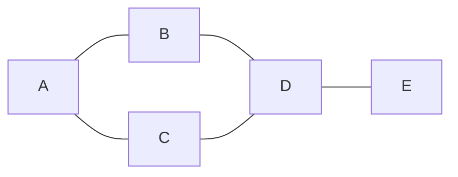
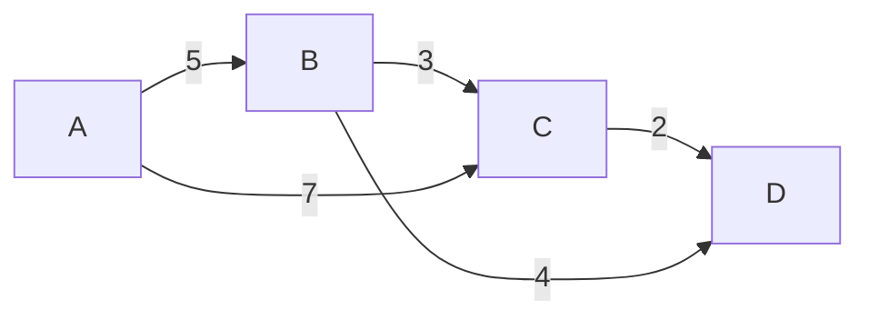

# C++ Graphs

## Introduction

Graphs are one of the most versatile and powerful data structures in computer science. They represent relationships between entities and are used to model various real-world scenarios, from social networks to road maps, from computer networks to dependency relationships in software.

In this tutorial, we'll explore how to implement and work with graphs in C++. We'll cover:

- Basic graph concepts and terminology
- Different ways to represent graphs in C++
- Graph traversal algorithms
- Common graph operations
- Real-world applications of graphs

Whether you're preparing for coding interviews or building complex applications, understanding graphs is essential for any programmer.

## Graph Fundamentals

### What is a Graph?

A graph is a collection of **nodes** (also called vertices) connected by **edges**. Mathematically, a graph G is represented as G = (V, E), where V is the set of vertices and E is the set of edges.



### Types of Graphs

1. **Undirected Graph**: Edges have no direction. If node A is connected to node B, then node B is also connected to node A.

2. **Directed Graph (Digraph)**: Edges have direction. If node A has a directed edge to node B, it doesn't mean node B has an edge to node A.



3. **Weighted Graph**: Edges have weights or costs associated with them.

4. **Unweighted Graph**: All edges have the same weight or no weight.

5. **Cyclic Graph**: Contains at least one cycle (a path that starts and ends at the same vertex).

6. **Acyclic Graph**: Contains no cycles.

7. **Connected Graph**: There is a path between every pair of vertices.

8. **Disconnected Graph**: There is at least one pair of vertices with no path between them.

## Graph Representation in C++

There are several ways to represent graphs in C++. The two most common methods are:

1. **Adjacency Matrix**
2. **Adjacency List**

Let's implement both representations:

### Adjacency Matrix

An adjacency matrix is a 2D array where matrix[i][j] represents the edge between vertex i and vertex j.

```cpp
#include <iostream>
#include <vector>
using namespace std;

class GraphMatrix {
private:
    int V; // Number of vertices
    vector<vector<int>> adjMatrix;

public:
    GraphMatrix(int v) {
        V = v;
        adjMatrix.resize(V, vector<int>(V, 0));
    }

    // Add edge for undirected graph
    void addEdge(int u, int v, int weight = 1) {
        adjMatrix[u][v] = weight;
        adjMatrix[v][u] = weight; // For undirected graph
    }

    // Add edge for directed graph
    void addDirectedEdge(int u, int v, int weight = 1) {
        adjMatrix[u][v] = weight;
    }

    // Print the adjacency matrix
    void printGraph() {
        cout << "Adjacency Matrix:" << endl;
        for (int i = 0; i < V; i++) {
            for (int j = 0; j < V; j++) {
                cout << adjMatrix[i][j] << " ";
            }
            cout << endl;
        }
    }
};

int main() {
    // Create a graph with 5 vertices
    GraphMatrix g(5);
    
    // Add edges
    g.addEdge(0, 1);
    g.addEdge(0, 4);
    g.addEdge(1, 2);
    g.addEdge(1, 3);
    g.addEdge(1, 4);
    g.addEdge(2, 3);
    g.addEdge(3, 4);
    
    // Print the graph
    g.printGraph();
    
    return 0;
}
```

**Output:**
```
Adjacency Matrix:
0 1 0 0 1 
1 0 1 1 1 
0 1 0 1 0 
0 1 1 0 1 
1 1 0 1 0 
```

**Advantages of Adjacency Matrix:**
- Fast edge lookup (O(1))
- Simple to implement
- Works well for dense graphs

**Disadvantages of Adjacency Matrix:**
- Uses O(V²) space, even for sparse graphs
- Slower to iterate over all edges

### Adjacency List

An adjacency list uses an array of lists, where each element in the array represents a vertex, and the corresponding list contains the neighbors of that vertex.

```cpp
#include <iostream>
#include <vector>
#include <utility> // for pair
using namespace std;

class GraphList {
private:
    int V; // Number of vertices
    vector<vector<pair<int, int>>> adjList; // vertex, weight

public:
    GraphList(int v) {
        V = v;
        adjList.resize(V);
    }

    // Add edge for undirected graph
    void addEdge(int u, int v, int weight = 1) {
        adjList[u].push_back({v, weight});
        adjList[v].push_back({u, weight}); // For undirected graph
    }

    // Add edge for directed graph
    void addDirectedEdge(int u, int v, int weight = 1) {
        adjList[u].push_back({v, weight});
    }

    // Print the adjacency list
    void printGraph() {
        cout << "Adjacency List:" << endl;
        for (int i = 0; i < V; i++) {
            cout << "Vertex " << i << ": ";
            for (auto neighbor : adjList[i]) {
                cout << "(" << neighbor.first << ", " << neighbor.second << ") ";
            }
            cout << endl;
        }
    }
};

int main() {
    // Create a graph with 5 vertices
    GraphList g(5);
    
    // Add edges
    g.addEdge(0, 1);
    g.addEdge(0, 4);
    g.addEdge(1, 2);
    g.addEdge(1, 3);
    g.addEdge(1, 4);
    g.addEdge(2, 3);
    g.addEdge(3, 4);
    
    // Print the graph
    g.printGraph();
    
    return 0;
}
```

**Output:**
```
Adjacency List:
Vertex 0: (1, 1) (4, 1) 
Vertex 1: (0, 1) (2, 1) (3, 1) (4, 1) 
Vertex 2: (1, 1) (3, 1) 
Vertex 3: (1, 1) (2, 1) (4, 1) 
Vertex 4: (0, 1) (1, 1) (3, 1) 
```

**Advantages of Adjacency List:**
- Space-efficient for sparse graphs (O(V+E))
- Faster to iterate over all edges
- Easier to find all neighbors of a vertex

**Disadvantages of Adjacency List:**
- Slower edge lookup (O(degree of vertex))
- More complex to implement

## Graph Traversal Algorithms

Graph traversal involves visiting every vertex in a graph. The two primary traversal algorithms are:

### 1. Breadth-First Search (BFS)

BFS explores all neighbors of a vertex before moving to the next level of vertices. It uses a queue to track vertices to visit next.

```cpp
#include <iostream>
#include <vector>
#include <queue>
using namespace std;

class Graph {
private:
    int V;
    vector<vector<int>> adjList;

public:
    Graph(int v) : V(v) {
        adjList.resize(V);
    }

    void addEdge(int u, int v) {
        adjList[u].push_back(v);
        adjList[v].push_back(u);
    }

    // BFS traversal from a given source vertex
    void BFS(int start) {
        // Mark all vertices as not visited
        vector<bool> visited(V, false);
        
        // Create a queue for BFS
        queue<int> q;
        
        // Mark the current node as visited and enqueue it
        visited[start] = true;
        q.push(start);
        
        cout << "BFS traversal starting from vertex " << start << ": ";
        
        while (!q.empty()) {
            // Dequeue a vertex from queue and print it
            int vertex = q.front();
            cout << vertex << " ";
            q.pop();
            
            // Get all adjacent vertices of the dequeued vertex
            // If an adjacent has not been visited, mark it as visited and enqueue it
            for (int neighbor : adjList[vertex]) {
                if (!visited[neighbor]) {
                    visited[neighbor] = true;
                    q.push(neighbor);
                }
            }
        }
        
        cout << endl;
    }
};

int main() {
    Graph g(7);
    g.addEdge(0, 1);
    g.addEdge(0, 2);
    g.addEdge(1, 3);
    g.addEdge(1, 4);
    g.addEdge(2, 5);
    g.addEdge(2, 6);
    
    g.BFS(0);
    
    return 0;
}
```

**Output:**
```
BFS traversal starting from vertex 0: 0 1 2 3 4 5 6 
```

### 2. Depth-First Search (DFS)

DFS explores as far as possible along each branch before backtracking. It can be implemented using recursion or a stack.

```cpp
#include <iostream>
#include <vector>
#include <stack>
using namespace std;

class Graph {
private:
    int V;
    vector<vector<int>> adjList;

public:
    Graph(int v) : V(v) {
        adjList.resize(V);
    }

    void addEdge(int u, int v) {
        adjList[u].push_back(v);
        adjList[v].push_back(u);
    }

    // Recursive DFS
    void DFSUtil(int vertex, vector<bool>& visited) {
        // Mark the current node as visited and print it
        visited[vertex] = true;
        cout << vertex << " ";
        
        // Recur for all the adjacent vertices
        for (int neighbor : adjList[vertex]) {
            if (!visited[neighbor]) {
                DFSUtil(neighbor, visited);
            }
        }
    }
    
    // DFS traversal from a given source vertex
    void DFS(int start) {
        // Mark all vertices as not visited
        vector<bool> visited(V, false);
        
        cout << "DFS traversal starting from vertex " << start << ": ";
        
        // Call the recursive helper function
        DFSUtil(start, visited);
        
        cout << endl;
    }
    
    // Iterative DFS using stack
    void DFSIterative(int start) {
        // Mark all vertices as not visited
        vector<bool> visited(V, false);
        
        // Create a stack for DFS
        stack<int> s;
        
        // Push the current source node
        s.push(start);
        
        cout << "Iterative DFS traversal starting from vertex " << start << ": ";
        
        while (!s.empty()) {
            // Pop a vertex from stack
            int vertex = s.top();
            s.pop();
            
            // If the vertex is unvisited, mark it and print it
            if (!visited[vertex]) {
                cout << vertex << " ";
                visited[vertex] = true;
            }
            
            // Push all unvisited adjacent vertices
            // We push in reverse order to get the same result as recursive DFS
            for (int i = adjList[vertex].size() - 1; i >= 0; i--) {
                int neighbor = adjList[vertex][i];
                if (!visited[neighbor]) {
                    s.push(neighbor);
                }
            }
        }
        
        cout << endl;
    }
};

int main() {
    Graph g(7);
    g.addEdge(0, 1);
    g.addEdge(0, 2);
    g.addEdge(1, 3);
    g.addEdge(1, 4);
    g.addEdge(2, 5);
    g.addEdge(2, 6);
    
    g.DFS(0);
    g.DFSIterative(0);
    
    return 0;
}
```

**Output:**
```
DFS traversal starting from vertex 0: 0 1 3 4 2 5 6 
Iterative DFS traversal starting from vertex 0: 0 2 6 5 1 4 3 
```

## Common Graph Algorithms

Let's implement some common graph algorithms:

### 1. Shortest Path Algorithm (Dijkstra's Algorithm)

Dijkstra's algorithm finds the shortest path from a source vertex to all other vertices in a weighted graph.

```cpp
#include <iostream>
#include <vector>
#include <queue>
#include <limits>
using namespace std;

typedef pair<int, int> pii; // weight, vertex

class Graph {
private:
    int V;
    vector<vector<pii>> adjList; // vertex, weight

public:
    Graph(int v) : V(v) {
        adjList.resize(V);
    }

    void addEdge(int u, int v, int weight) {
        adjList[u].push_back({v, weight});
        adjList[v].push_back({u, weight}); // For undirected graph
    }

    // Dijkstra's algorithm for shortest paths
    void dijkstra(int src) {
        // Create a priority queue for vertices
        priority_queue<pii, vector<pii>, greater<pii>> pq;
        
        // Create a vector for distances and initialize all as infinity
        vector<int> dist(V, numeric_limits<int>::max());
        
        // Insert source in priority queue and initialize its distance as 0
        pq.push({0, src});
        dist[src] = 0;
        
        cout << "Shortest distances from vertex " << src << ":\n";
        
        while (!pq.empty()) {
            // The first vertex in pair is the minimum distance vertex
            int u = pq.top().second;
            pq.pop();
            
            // For all adjacent vertices of u
            for (auto& neighbor : adjList[u]) {
                int v = neighbor.first;
                int weight = neighbor.second;
                
                // If there is a shorter path to v through u
                if (dist[v] > dist[u] + weight) {
                    // Update distance of v
                    dist[v] = dist[u] + weight;
                    pq.push({dist[v], v});
                }
            }
        }
        
        // Print shortest distances
        for (int i = 0; i < V; i++) {
            cout << "Vertex " << i << ": " << dist[i] << endl;
        }
    }
};

int main() {
    Graph g(6);
    
    // Add edges with weights
    g.addEdge(0, 1, 4);
    g.addEdge(0, 2, 2);
    g.addEdge(1, 2, 5);
    g.addEdge(1, 3, 10);
    g.addEdge(2, 3, 3);
    g.addEdge(2, 4, 8);
    g.addEdge(3, 4, 2);
    g.addEdge(3, 5, 7);
    g.addEdge(4, 5, 6);
    
    g.dijkstra(0);
    
    return 0;
}
```

**Output:**
```
Shortest distances from vertex 0:
Vertex 0: 0
Vertex 1: 4
Vertex 2: 2
Vertex 3: 5
Vertex 4: 7
Vertex 5: 12
```

### 2. Detecting Cycles in a Graph

```cpp
#include <iostream>
#include <vector>
using namespace std;

class Graph {
private:
    int V;
    vector<vector<int>> adjList;

public:
    Graph(int v) : V(v) {
        adjList.resize(V);
    }

    void addEdge(int u, int v) {
        adjList[u].push_back(v);
    }

    // Utility function for cycle detection
    bool isCyclicUtil(int v, vector<bool>& visited, vector<bool>& recStack) {
        // Mark the current node as visited and part of recursion stack
        visited[v] = true;
        recStack[v] = true;
        
        // Recur for all the vertices adjacent to this vertex
        for (int neighbor : adjList[v]) {
            // If not visited, check if there's a cycle starting from neighbor
            if (!visited[neighbor] && isCyclicUtil(neighbor, visited, recStack))
                return true;
            // If the neighbor is in recursion stack, we found a cycle
            else if (recStack[neighbor])
                return true;
        }
        
        // Remove the vertex from recursion stack
        recStack[v] = false;
        return false;
    }
    
    // Function to detect cycle in a directed graph
    bool isCyclic() {
        // Mark all vertices as not visited and not part of recursion stack
        vector<bool> visited(V, false);
        vector<bool> recStack(V, false);
        
        // Call the recursive helper function for each vertex
        for (int i = 0; i < V; i++) {
            if (!visited[i]) {
                if (isCyclicUtil(i, visited, recStack))
                    return true;
            }
        }
        
        return false;
    }
};

int main() {
    // Test for a graph with a cycle
    Graph g1(4);
    g1.addEdge(0, 1);
    g1.addEdge(1, 2);
    g1.addEdge(2, 3);
    g1.addEdge(3, 1); // Creates a cycle: 1->2->3->1
    
    if (g1.isCyclic())
        cout << "Graph contains a cycle\n";
    else
        cout << "Graph doesn't contain a cycle\n";
    
    // Test for a graph without a cycle
    Graph g2(4);
    g2.addEdge(0, 1);
    g2.addEdge(1, 2);
    g2.addEdge(2, 3);
    
    if (g2.isCyclic())
        cout << "Graph contains a cycle\n";
    else
        cout << "Graph doesn't contain a cycle\n";
    
    return 0;
}
```

**Output:**
```
Graph contains a cycle
Graph doesn't contain a cycle
```

## Real-World Applications of Graphs

Graphs are used in numerous real-world applications:

### 1. Social Network Analysis

Social networks like Facebook, LinkedIn, and Twitter use graphs extensively. Users are represented as vertices, and relationships (friendships, connections) are represented as edges.

```cpp
#include <iostream>
#include <vector>
#include <string>
#include <unordered_map>
#include <queue>
using namespace std;

class SocialNetwork {
private:
    unordered_map<string, vector<string>> friendships;

public:
    void addUser(const string& user) {
        if (friendships.find(user) == friendships.end()) {
            friendships[user] = vector<string>();
        }
    }

    void addFriendship(const string& user1, const string& user2) {
        addUser(user1);
        addUser(user2);
        friendships[user1].push_back(user2);
        friendships[user2].push_back(user1); // Friendship is bidirectional
    }

    void printNetwork() {
        cout << "Social Network Connections:\n";
        for (const auto& user : friendships) {
            cout << user.first << " is friends with: ";
            for (const string& friend_name : user.second) {
                cout << friend_name << " ";
            }
            cout << endl;
        }
    }

    // Find friends of friends (2-hop connections)
    vector<string> findFriendsOfFriends(const string& user) {
        vector<string> result;
        if (friendships.find(user) == friendships.end()) {
            return result;
        }

        // Track visited users to avoid duplicates
        unordered_map<string, bool> visited;
        visited[user] = true;

        // Mark direct friends as visited
        for (const string& direct_friend : friendships[user]) {
            visited[direct_friend] = true;
        }

        // Find friends of friends
        for (const string& direct_friend : friendships[user]) {
            for (const string& friend_of_friend : friendships[direct_friend]) {
                if (!visited[friend_of_friend]) {
                    result.push_back(friend_of_friend);
                    visited[friend_of_friend] = true;
                }
            }
        }

        return result;
    }

    // Find the shortest path between two users (degrees of separation)
    int degreesOfSeparation(const string& start, const string& end) {
        if (start == end) return 0;
        if (friendships.find(start) == friendships.end() || 
            friendships.find(end) == friendships.end()) {
            return -1; // One or both users don't exist
        }

        unordered_map<string, bool> visited;
        unordered_map<string, int> distance;
        queue<string> q;

        visited[start] = true;
        distance[start] = 0;
        q.push(start);

        while (!q.empty()) {
            string current = q.front();
            q.pop();

            for (const string& neighbor : friendships[current]) {
                if (!visited[neighbor]) {
                    visited[neighbor] = true;
                    distance[neighbor] = distance[current] + 1;
                    q.push(neighbor);

                    if (neighbor == end) {
                        return distance[neighbor];
                    }
                }
            }
        }

        return -1; // No path exists
    }
};

int main() {
    SocialNetwork network;
    
    // Add users and friendships
    network.addFriendship("Alice", "Bob");
    network.addFriendship("Alice", "Charlie");
    network.addFriendship("Bob", "Dave");
    network.addFriendship("Charlie", "Eve");
    network.addFriendship("Dave", "Frank");
    network.addFriendship("Eve", "Frank");
    network.addFriendship("Zack", "Yvonne");
    
    network.printNetwork();
    
    // Find friends of friends for Alice
    cout << "\nFriends of friends for Alice: ";
    vector<string> friendsOfFriends = network.findFriendsOfFriends("Alice");
    for (const string& user : friendsOfFriends) {
        cout << user << " ";
    }
    cout << endl;
    
    // Calculate degrees of separation
    cout << "\nDegrees of separation between Alice and Frank: " 
         << network.degreesOfSeparation("Alice", "Frank") << endl;
    
    cout << "Degrees of separation between Alice and Zack: "
         << network.degreesOfSeparation("Alice", "Zack") << endl;
    
    return 0;
}
```

**Output:**
```
Social Network Connections:
Charlie is friends with: Alice Eve 
Frank is friends with: Dave Eve 
Alice is friends with: Bob Charlie 
Dave is friends with: Bob Frank 
Yvonne is friends with: Zack 
Eve is friends with: Charlie Frank 
Bob is friends with: Alice Dave 
Zack is friends with: Yvonne 

Friends of friends for Alice: Dave Eve 

Degrees of separation between Alice and Frank: 3
Degrees of separation between Alice and Zack: -1
```

### 2. GPS and Navigation Systems

Maps in navigation systems represent road networks as graphs. Intersections are vertices, and roads are edges. Weights can represent distances, travel times, or other metrics.

```cpp
#include <iostream>
#include <vector>
#include <queue>
#include <string>
#include <unordered_map>
#include <limits>
using namespace std;

class NavigationSystem {
private:
    unordered_map<string, int> placeToIndex;
    unordered_map<int, string> indexToPlace;
    int placeCount;
    vector<vector<pair<int, int>>> roadMap; // adjacency list with distances

public:
    NavigationSystem() : placeCount(0) {}

    void addPlace(const string& place) {
        if (placeToIndex.find(place) == placeToIndex.end()) {
            placeToIndex[place] = placeCount;
            indexToPlace[placeCount] = place;
            
            // Expand the road map
            if (roadMap.size() <= placeCount) {
                roadMap.resize(placeCount + 1);
            }
            
            placeCount++;
        }
    }

    void addRoad(const string& placeA, const string& placeB, int distance) {
        addPlace(placeA);
        addPlace(placeB);
        
        int indexA = placeToIndex[placeA];
        int indexB = placeToIndex[placeB];
        
        roadMap[indexA].push_back({indexB, distance});
        roadMap[indexB].push_back({indexA, distance}); // Roads are bidirectional
    }

    void printMap() {
        cout << "Road Map:\n";
        for (int i = 0; i < placeCount; i++) {
            cout << indexToPlace[i] << " is connected to: ";
            for (const auto& road : roadMap[i]) {
                cout << indexToPlace[road.first] << " (" << road.second << " km) ";
            }
            cout << endl;
        }
    }

    // Find the shortest path using Dijkstra's algorithm
    vector<string> findShortestPath(const string& start, const string& end) {
        if (placeToIndex.find(start) == placeToIndex.end() || 
            placeToIndex.find(end) == placeToIndex.end()) {
            return {}; // One or both places don't exist
        }

        int startIndex = placeToIndex[start];
        int endIndex = placeToIndex[end];

        // Initialize distances and previous nodes
        vector<int> dist(placeCount, numeric_limits<int>::max());
        vector<int> prev(placeCount, -1);
        priority_queue<pair<int, int>, vector<pair<int, int>>, greater<pair<int, int>>> pq;

        dist[startIndex] = 0;
        pq.push({0, startIndex});

        while (!pq.empty()) {
            int u = pq.top().second;
            int d = pq.top().first;
            pq.pop();

            if (u == endIndex) break;
            if (d > dist[u]) continue;

            for (const auto& road : roadMap[u]) {
                int v = road.first;
                int weight = road.second;

                if (dist[u] + weight < dist[v]) {
                    dist[v] = dist[u] + weight;
                    prev[v] = u;
                    pq.push({dist[v], v});
                }
            }
        }

        // Construct the path
        vector<string> path;
        if (dist[endIndex] == numeric_limits<int>::max()) {
            return path; // No path exists
        }

        for (int at = endIndex; at != -1; at = prev[at]) {
            path.push_back(indexToPlace[at]);
        }
        reverse(path.begin(), path.end());

        return path;
    }

    int getTotalDistance(const vector<string>& path) {
        if (path.size() <= 1) return 0;

        int totalDist = 0;
        for (size_t i = 0; i < path.size() - 1; i++) {
            int indexA = placeToIndex[path[i]];
            int indexB = placeToIndex[path[i + 1]];
            
            for (const auto& road : roadMap[indexA]) {
                if (road.first == indexB) {
                    totalDist += road.second;
                    break;
                }
            }
        }
        
        return totalDist;
    }
};

int main() {
    NavigationSystem nav;
    
    // Add places and roads
    nav.addRoad("New York", "Boston", 350);
    nav.addRoad("New York", "Philadelphia", 150);
    nav.addRoad("Boston", "Portland", 180);
    nav.addRoad("Philadelphia", "Washington DC", 220);
    nav.addRoad("Washington DC", "Richmond", 170);
    nav.addRoad("Portland", "Montreal", 400);
    nav.addRoad("Montreal", "Quebec City", 250);
    
    nav.printMap();
    
    // Find shortest path
    cout << "\nShortest path from New York to Richmond:\n";
    vector<string> path = nav.findShortestPath("New York", "Richmond");
    for (size_t i = 0; i < path.size(); i++) {
        cout << path[i];
        if (i < path.size() - 1) cout << " -> ";
    }
    cout << "\nTotal distance: " << nav.getTotalDistance(path) << " km" << endl;
    
    cout << "\nShortest path from Boston to Quebec City:\n";
    path = nav.findShortestPath("Boston", "Quebec City");
    for (size_t i = 0; i < path.size(); i++) {
        cout << path[i];
        if (i < path.size() - 1) cout << " -> ";
    }
    cout << "\nTotal distance: " << nav.getTotalDistance(path) << " km" << endl;
    
    return 0;
}
```

**Output:**
```
Road Map:
New York is connected to: Boston (350 km) Philadelphia (150 km) 
Boston is connected to: New York (350 km) Portland (180 km) 
Philadelphia is connected to: New York (150 km) Washington DC (220 km) 
Washington DC is connected to: Philadelphia (220 km) Richmond (170 km) 
Richmond is connected to: Washington DC (170 km) 
Portland is connected to: Boston (180 km) Montreal (400 km) 
Montreal is connected to: Portland (400 km) Quebec City (250 km) 
Quebec City is connected to: Montreal (250 km) 

Shortest path from New York to Richmond:
New York -> Philadelphia -> Washington DC -> Richmond
Total distance: 540 km

Shortest path from Boston to Quebec City:
Boston -> Portland -> Montreal -> Quebec City
Total distance: 830 km
```

### 3. Web Crawling and Indexing

Search engines use graphs to represent the web. Web pages are vertices, and hyperlinks are edges. They use graph algorithms to crawl and index the web efficiently.

```cpp
#include <iostream>
#include <vector>
#include <queue>
#include <unordered_map>
#include <unordered_set>
#include <string>
using namespace std;

class WebCrawler {
private:
    unordered_map<string, vector<string>> webGraph; // URL to outgoing links

public:
    void addPage(const string& url) {
        if (webGraph.find(url) == webGraph.end()) {
            webGraph[url] = vector<string>();
        }
    }

    void addLink(const string& fromUrl, const string& toUrl) {
        addPage(fromUrl);
        addPage(toUrl);
        webGraph[fromUrl].push_back(toUrl);
    }

    void printWebGraph() {
        cout << "Web Graph:\n";
        for (const auto& page : webGraph) {
            cout << page.first << " links to:\n";
            for (const string& link : page.second) {
                cout << "  - " << link << "\n";
            }
            cout << endl;
        }
    }

    // BFS Web Crawler
    vector<string> crawl(const string& startUrl, int maxDepth) {
        if (webGraph.find(startUrl) == webGraph.end()) {
            return {}; // Start URL doesn't exist
        }

        unordered_set<string> visited;
        queue<pair<string, int>> q; // URL, depth
        vector<string> crawledPages;

        visited.insert(startUrl);
        q.push({startUrl, 0});
        crawledPages.push_back(startUrl);

        while (!q.empty()) {
            string currentUrl = q.front().first;
            int currentDepth = q.front().second;
            q.pop();

            if (currentDepth >= maxDepth) continue;

            for (const string& linkedUrl : webGraph[currentUrl]) {
                if (visited.find(linkedUrl) == visited.end()) {
                    visited.insert(linkedUrl);
                    q.push({linkedUrl, currentDepth + 1});
                    crawledPages.push_back(linkedUrl);
                }
            }
        }

        return crawledPages;
    }

    // PageRank algorithm (simplified)
    unordered_map<string, double> pageRank(int iterations, double dampingFactor = 0.85) {
        int n = webGraph.size();
        unordered_map<string, double> rank;
        
        // Initialize ranks
        for (const auto& page : webGraph) {
            rank[page.first] = 1.0 / n;
        }
        
        // Calculate PageRank
        for (int i = 0; i < iterations; i++) {
            unordered_map<string, double> newRank;
            
            // Initialize with damping factor
            for (const auto& page : webGraph) {
                newRank[page.first] = (1.0 - dampingFactor) / n;
            }
            
            // Update ranks
            for (const auto& page : webGraph) {
                string fromUrl = page.first;
                vector<string> outLinks = page.second;
                
                if (!outLinks.empty()) {
                    double outgoingValue = rank[fromUrl] * dampingFactor / outLinks.size();
                    
                    for (const string& toUrl : outLinks) {
                        newRank[toUrl] += outgoingValue;
                    }
                }
            }
            
            rank = newRank;
        }
        
        return rank;
    }
};

int main() {
    WebCrawler crawler;
    
    // Add pages and links
    crawler.addLink("https://example.com", "https://example.com/about");
    crawler.addLink("https://example.com", "https://example.com/products");
    crawler.addLink("https://example.com", "https://example.com/blog");
    crawler.addLink("https://example.com/about", "https://example.com/team");
    crawler.addLink("https://example.com/about", "https://example.com/contact");
    crawler.addLink("https://example.com/products", "https://example.com/product1");
    crawler.addLink("https://example.com/products", "https://example.com/product2");
    crawler.addLink("https://example.com/blog", "https://example.com/post1");
    crawler.addLink("https://example.com/blog", "https://example.com/post2");
    crawler.addLink("https://example.com/team", "https://example.com");
    crawler.addLink("https://example.com/product1", "https://example.com/products");
    crawler.addLink("https://example.com/post1", "https://example.com/post2");
    
    crawler.printWebGraph();
    
    // Crawl the web
    cout << "Crawling from https://example.com with max depth 2:\n";
    vector<string> crawledPages = crawler.crawl("https://example.com", 2);
    for (const string& url : crawledPages) {
        cout << "Crawled: " << url << endl;
    }
    
    // Calculate PageRank
    cout << "\nPageRank scores after 100 iterations:\n";
    unordered_map<string, double> pageRanks = crawler.pageRank(100);
    
    // Sort by PageRank
    vector<pair<string, double>> sortedRanks;
    for (const auto& rank : pageRanks) {
        sortedRanks.push_back(rank);
    }
    
    sort(sortedRanks.begin(), sortedRanks.end(), 
         [](const pair<string, double>& a, const pair<string, double>& b) {
             return a.second > b.second;
         });
    
    for (const auto& page : sortedRanks) {
        cout << page.first << ": " << page.second << endl;
    }
    
    return 0;
}
```

**Output:**
```
Web Graph:
https://example.com/product1 links to:
  - https://example.com/products

https://example.com/post2 links to:

https://example.com/post1 links to:
  - https://example.com/post2

https://example.com/about links to:
  - https://example.com/team
  - https://example.com/contact

https://example.com/products links to:
  - https://example.com/product1
  - https://example.com/product2

https://example.com/team links to:
  - https://example.com

https://example.com links to:
  - https://example.com/about
  - https://example.com/products
  - https://example.com/blog

https://example.com/product2 links to:

https://example.com/blog links to:
  - https://example.com/post1
  - https://example.com/post2

https://example.com/contact links to:


Crawling from https://example.com with max depth 2:
Crawled: https://example.com
Crawled: https://example.com/about
Crawled: https://example.com/products
Crawled: https://example.com/blog
Crawled: https://example.com/team
Crawled: https://example.com/contact
Crawled: https://example.com/product1
Crawled: https://example.com/product2
Crawled: https://example.com/post1
Crawled: https://example.com/post2

PageRank scores after 100 iterations:
https://example.com: 0.184411
https://example.com/products: 0.118945
https://example.com/about: 0.111809
https://example.com/post2: 0.108291
https://example.com/product1: 0.0906497
https://example.com/blog: 0.0906497
https://example.com/team: 0.0824103
https://example.com/contact: 0.0743458
https://example.com/post1: 0.0743458
https://example.com/product2: 0.0637624
```

## Summary

In this tutorial, we've covered:

1. **Graph Fundamentals**: Basic concepts and types of graphs.
2. **Graph Representation**: Adjacency matrices and adjacency lists.
3. **Graph Traversal**: BFS and DFS algorithms for traversing graphs.
4. **Common Graph Algorithms**: Dijkstra's algorithm for shortest paths and cycle detection.
5. **Real-World Applications**: How graphs are used in social networks, navigation systems, and web crawling.

Graphs are a versatile data structure that can model many real-world problems. Understanding graph algorithms is essential for solving complex computational problems efficiently.

## Additional Resources

To deepen your understanding of graphs in C++, consider these resources:

1. **Books**:
   - "Introduction to Algorithms" by Cormen, Leiserson, Rivest, and Stein
   - "Algorithm Design" by Kleinberg and Tardos

2. **Online Courses**:
   - Coursera: "Algorithms on Graphs" by UC San Diego
   - edX: "Algorithms" by Princeton University

3. **Websites**:
   - [GeeksforGeeks - Graph Data Structure](https://www.geeksforgeeks.org/graph-data-structure-and-algorithms/)
   - [CP-Algorithms - Graph Algorithms](https://cp-algorithms.com/graph/breadth-first-search.html)

## Exercises

1. Implement a graph class that supports both directed and undirected graphs.
2. Write a function to check if a graph is bipartite.
3. Implement the Bellman-Ford algorithm for finding shortest paths with negative weights.
4. Create a function to find all bridges in an undirected graph (edges whose removal would increase the number of connected components).
5. Implement Kruskal's or Prim's algorithm to find the minimum spanning tree of a graph.
6. Create a topological sorting algorithm for directed acyclic graphs.
7. Implement the Floyd-Warshall algorithm for all-pairs shortest paths.
8. Write a function to find strongly connected components in a directed graph using Kosaraju's algorithm.

Keep exploring graphs, and you'll discover that many seemingly complex problems have elegant graph-based solutions!