# C++ Hash Tables

## Introduction

Hash tables are powerful data structures that provide efficient data retrieval operations, typically offering O(1) time complexity for lookups, insertions, and deletions. They are fundamental to many applications in computer science and are implemented in C++ through containers like `std::unordered_map` and `std::unordered_set`.

In this tutorial, we'll explore:
- What hash tables are and how they work
- Hash functions and their importance
- Collision resolution strategies
- Implementing a basic hash table in C++
- Using the C++ Standard Library hash table implementations
- Real-world applications

## What Are Hash Tables?

A hash table (also called a hash map) is a data structure that maps keys to values. It uses a hash function to compute an index into an array of buckets or slots, from which the desired value can be found.


The core advantage of hash tables is their speed. When implemented correctly, they provide constant-time O(1) operations for lookups, insertions, and deletions, making them significantly faster than data structures like arrays or linked lists for many applications.

## Hash Functions

A hash function is a crucial component of hash tables. It takes an input (or 'key') and returns a fixed-size value, which is used as the index in the hash table.

### Characteristics of Good Hash Functions

1. **Deterministic**: The same input should always produce the same output
2. **Uniform distribution**: Output values should be evenly distributed
3. **Efficiency**: The function should be quick to compute
4. **Minimal collisions**: Different inputs should produce different outputs as much as possible

### Simple Hash Function Example

Here's a simple hash function for strings:

```cpp
unsigned int simpleHash(const std::string& key, unsigned int tableSize) {
    unsigned int hash = 0;
    for (char ch : key) {
        hash = hash * 31 + ch;
    }
    return hash % tableSize;
}
```

This function iterates through each character in the string, multiplies the running hash by a prime number (31), adds the character value, and finally takes the modulo with the table size to ensure the result fits within the array bounds.

## Collision Resolution

A collision occurs when the hash function produces the same index for two different keys. There are several strategies to handle collisions:

### 1. Chaining

Chaining involves storing multiple key-value pairs that hash to the same index in a linked list or other data structure.

```mermaid
graph LR
    A[Hash Table Array] --> B[0]
    A --> C[1]
    A --> D[2]
    A --> E[...]
    
    C --> F["Key1:Value1 → Key2:Value2"]
    D --> G["Key3:Value3"]
```



### 2. Open Addressing

With open addressing, all elements are stored in the hash table array itself. When a collision occurs, we probe for the next available slot according to some probing sequence.

Common probing methods include:
- **Linear Probing**: Check the next slot sequentially
- **Quadratic Probing**: Check slots that are offset by increasing perfect squares
- **Double Hashing**: Use a second hash function to determine the offset

## Implementing a Basic Hash Table in C++

Let's implement a simple hash table that uses chaining for collision resolution:

```cpp
#include <iostream>
#include <list>
#include <vector>
#include <string>
#include <functional>

template<typename K, typename V>
class HashTable {
private:
    // Each bucket contains a list of key-value pairs
    std::vector<std::list<std::pair<K, V>>> buckets;
    size_t size;
    
    // Hash function to convert key to index
    size_t hashFunction(const K& key) const {
        return std::hash<K>{}(key) % buckets.size();
    }
    
public:
    HashTable(size_t bucketCount = 10) : buckets(bucketCount), size(0) {}
    
    // Insert a key-value pair
    void insert(const K& key, const V& value) {
        size_t index = hashFunction(key);
        
        // Check if key already exists
        for (auto& pair : buckets[index]) {
            if (pair.first == key) {
                pair.second = value; // Update value if key exists
                return;
            }
        }
        
        // Key doesn't exist, add new pair
        buckets[index].emplace_back(key, value);
        size++;
    }
    
    // Find value by key
    bool find(const K& key, V& value) const {
        size_t index = hashFunction(key);
        
        for (const auto& pair : buckets[index]) {
            if (pair.first == key) {
                value = pair.second;
                return true;
            }
        }
        
        return false; // Key not found
    }
    
    // Remove a key-value pair
    bool remove(const K& key) {
        size_t index = hashFunction(key);
        
        for (auto it = buckets[index].begin(); it != buckets[index].end(); ++it) {
            if (it->first == key) {
                buckets[index].erase(it);
                size--;
                return true;
            }
        }
        
        return false; // Key not found
    }
    
    // Get the number of elements
    size_t getSize() const {
        return size;
    }
    
    // Print the hash table (for debugging)
    void print() const {
        for (size_t i = 0; i < buckets.size(); ++i) {
            std::cout << "Bucket " << i << ": ";
            for (const auto& pair : buckets[i]) {
                std::cout << "(" << pair.first << ":" << pair.second << ") ";
            }
            std::cout << std::endl;
        }
    }
};
```

### Using Our Custom Hash Table

```cpp
#include <iostream>

int main() {
    HashTable<std::string, int> phoneBook;
    
    // Insert some key-value pairs
    phoneBook.insert("Alice", 123456);
    phoneBook.insert("Bob", 234567);
    phoneBook.insert("Charlie", 345678);
    phoneBook.insert("Dave", 456789);
    
    // Print the hash table
    std::cout << "Phone Book Contents:" << std::endl;
    phoneBook.print();
    
    // Find a value
    int number;
    if (phoneBook.find("Bob", number)) {
        std::cout << "Bob's number is: " << number << std::endl;
    } else {
        std::cout << "Bob not found" << std::endl;
    }
    
    // Remove a key-value pair
    if (phoneBook.remove("Charlie")) {
        std::cout << "Charlie removed from phone book" << std::endl;
    }
    
    // Try to find removed entry
    if (phoneBook.find("Charlie", number)) {
        std::cout << "Charlie's number is: " << number << std::endl;
    } else {
        std::cout << "Charlie not found" << std::endl;
    }
    
    // Print updated hash table
    std::cout << "\nUpdated Phone Book Contents:" << std::endl;
    phoneBook.print();
    
    return 0;
}
```

**Output:**
```
Phone Book Contents:
Bucket 0: 
Bucket 1: 
Bucket 2: (Charlie:345678) 
Bucket 3: 
Bucket 4: (Dave:456789) 
Bucket 5: 
Bucket 6: (Bob:234567) 
Bucket 7: (Alice:123456) 
Bucket 8: 
Bucket 9: 
Bob's number is: 234567
Charlie removed from phone book
Charlie not found

Updated Phone Book Contents:
Bucket 0: 
Bucket 1: 
Bucket 2: 
Bucket 3: 
Bucket 4: (Dave:456789) 
Bucket 5: 
Bucket 6: (Bob:234567) 
Bucket 7: (Alice:123456) 
Bucket 8: 
Bucket 9: 
```

Note: The exact output might differ based on the hash function implementation, as the standard library's `std::hash` might produce different values across different platforms and compilers.

## C++ Standard Library Hash Tables

The C++ Standard Library provides several hash table implementations:

### std::unordered_map

`std::unordered_map` is a hash table that stores key-value pairs and provides fast lookup based on keys.

```cpp
#include <iostream>
#include <unordered_map>
#include <string>

int main() {
    // Create an unordered_map
    std::unordered_map<std::string, int> scores;
    
    // Insert elements
    scores["Alice"] = 95;
    scores["Bob"] = 89;
    scores["Charlie"] = 92;
    
    // Access elements
    std::cout << "Bob's score: " << scores["Bob"] << std::endl;
    
    // Check if a key exists
    if (scores.find("Dave") == scores.end()) {
        std::cout << "Dave's score not found" << std::endl;
    }
    
    // Iterate through the map
    std::cout << "All scores:" << std::endl;
    for (const auto& [name, score] : scores) {
        std::cout << name << ": " << score << std::endl;
    }
    
    // Get hash table statistics
    std::cout << "\nHash table statistics:" << std::endl;
    std::cout << "Number of buckets: " << scores.bucket_count() << std::endl;
    std::cout << "Load factor: " << scores.load_factor() << std::endl;
    
    return 0;
}
```

**Output:**
```
Bob's score: 89
Dave's score not found
All scores:
Charlie: 92
Bob: 89
Alice: 95

Hash table statistics:
Number of buckets: 8
Load factor: 0.375
```

### std::unordered_set

`std::unordered_set` is a hash table that stores unique values and provides fast lookup operations.

```cpp
#include <iostream>
#include <unordered_set>
#include <string>

int main() {
    // Create an unordered_set of strings
    std::unordered_set<std::string> names;
    
    // Insert elements
    names.insert("Alice");
    names.insert("Bob");
    names.insert("Charlie");
    names.insert("Alice"); // Duplicate, will be ignored
    
    // Check size
    std::cout << "Set contains " << names.size() << " elements" << std::endl;
    
    // Check if element exists
    if (names.find("Bob") != names.end()) {
        std::cout << "Bob is in the set" << std::endl;
    }
    
    // Remove an element
    names.erase("Charlie");
    
    // Iterate through the set
    std::cout << "Set contents:" << std::endl;
    for (const auto& name : names) {
        std::cout << name << std::endl;
    }
    
    return 0;
}
```

**Output:**
```
Set contains 3 elements
Bob is in the set
Set contents:
Bob
Alice
```

## Performance Considerations

Hash tables offer excellent average-case performance, but there are still some important considerations:

1. **Load Factor**: The ratio of elements to buckets. A higher load factor increases the chance of collisions, degrading performance.

2. **Hash Function Quality**: A poor hash function can lead to many collisions, resulting in O(n) worst-case performance.

3. **Rehashing**: When the load factor exceeds a threshold, the hash table might resize and rehash all elements, which is an expensive O(n) operation.

4. **Memory Overhead**: Hash tables typically use more memory than sequential data structures like arrays.

## Real-World Applications

Hash tables are used in numerous applications due to their efficiency:

### 1. Caching Systems

Hash tables are perfect for implementing caches, where fast lookups are critical:

```cpp
#include <iostream>
#include <unordered_map>
#include <string>
#include <chrono>
#include <thread>

// A simple function that simulates an expensive operation
std::string fetchDataFromDatabase(const std::string& query) {
    // Simulate network delay or complex computation
    std::this_thread::sleep_for(std::chrono::seconds(2));
    return "Result for query: " + query;
}

class QueryCache {
private:
    std::unordered_map<std::string, std::string> cache;

public:
    std::string getResult(const std::string& query) {
        // Check if result is in cache
        auto it = cache.find(query);
        if (it != cache.end()) {
            std::cout << "Cache hit!" << std::endl;
            return it->second;
        }
        
        // If not in cache, fetch from database
        std::cout << "Cache miss. Fetching from database..." << std::endl;
        std::string result = fetchDataFromDatabase(query);
        
        // Store in cache for future use
        cache[query] = result;
        
        return result;
    }
};

int main() {
    QueryCache cache;
    
    // First query will miss the cache
    auto start = std::chrono::high_resolution_clock::now();
    std::string result1 = cache.getResult("SELECT * FROM users");
    auto end = std::chrono::high_resolution_clock::now();
    std::chrono::duration<double> elapsed1 = end - start;
    
    std::cout << "Result: " << result1 << std::endl;
    std::cout << "Time taken: " << elapsed1.count() << " seconds\n\n";
    
    // Second identical query will hit the cache
    start = std::chrono::high_resolution_clock::now();
    std::string result2 = cache.getResult("SELECT * FROM users");
    end = std::chrono::high_resolution_clock::now();
    std::chrono::duration<double> elapsed2 = end - start;
    
    std::cout << "Result: " << result2 << std::endl;
    std::cout << "Time taken: " << elapsed2.count() << " seconds" << std::endl;
    
    return 0;
}
```

**Output:**
```
Cache miss. Fetching from database...
Result: Result for query: SELECT * FROM users
Time taken: 2.00123 seconds

Cache hit!
Result: Result for query: SELECT * FROM users
Time taken: 0.000057 seconds
```

### 2. Symbol Tables in Compilers

Compilers use hash tables to store and look up symbols (variables, functions, etc.) during compilation:

```cpp
#include <iostream>
#include <unordered_map>
#include <string>
#include <variant>

enum class SymbolType {
    Variable,
    Function,
    Constant
};

struct VariableInfo {
    std::string dataType;
    bool isInitialized;
};

struct FunctionInfo {
    std::string returnType;
    int paramCount;
};

struct ConstantInfo {
    std::string dataType;
    std::string value;
};

using SymbolInfo = std::variant<VariableInfo, FunctionInfo, ConstantInfo>;

class SymbolTable {
private:
    std::unordered_map<std::string, SymbolInfo> symbols;

public:
    bool insert(const std::string& name, const SymbolInfo& info) {
        // Check if symbol already exists
        if (symbols.find(name) != symbols.end()) {
            return false; // Symbol already exists
        }
        
        symbols[name] = info;
        return true;
    }
    
    bool lookup(const std::string& name, SymbolInfo& info) {
        auto it = symbols.find(name);
        if (it == symbols.end()) {
            return false; // Symbol not found
        }
        
        info = it->second;
        return true;
    }
    
    void printTable() {
        std::cout << "SYMBOL TABLE CONTENTS:\n";
        std::cout << "--------------------\n";
        
        for (const auto& [name, info] : symbols) {
            std::cout << "Symbol: " << name << " | Type: ";
            
            if (std::holds_alternative<VariableInfo>(info)) {
                const auto& var = std::get<VariableInfo>(info);
                std::cout << "Variable | DataType: " << var.dataType 
                          << " | Initialized: " << (var.isInitialized ? "Yes" : "No");
            } else if (std::holds_alternative<FunctionInfo>(info)) {
                const auto& func = std::get<FunctionInfo>(info);
                std::cout << "Function | ReturnType: " << func.returnType 
                          << " | Params: " << func.paramCount;
            } else if (std::holds_alternative<ConstantInfo>(info)) {
                const auto& constant = std::get<ConstantInfo>(info);
                std::cout << "Constant | DataType: " << constant.dataType 
                          << " | Value: " << constant.value;
            }
            
            std::cout << std::endl;
        }
    }
};

int main() {
    SymbolTable symTable;
    
    // Insert symbols
    symTable.insert("count", VariableInfo{"int", true});
    symTable.insert("calculateSum", FunctionInfo{"int", 2});
    symTable.insert("MAX_SIZE", ConstantInfo{"int", "100"});
    symTable.insert("name", VariableInfo{"string", false});
    
    // Print the table
    symTable.printTable();
    
    // Look up a symbol
    SymbolInfo info;
    if (symTable.lookup("calculateSum", info)) {
        if (std::holds_alternative<FunctionInfo>(info)) {
            const auto& func = std::get<FunctionInfo>(info);
            std::cout << "\nFound function 'calculateSum':\n";
            std::cout << "Return type: " << func.returnType << "\n";
            std::cout << "Parameter count: " << func.paramCount << std::endl;
        }
    }
    
    return 0;
}
```

**Output:**
```
SYMBOL TABLE CONTENTS:
--------------------
Symbol: name | Type: Variable | DataType: string | Initialized: No
Symbol: count | Type: Variable | DataType: int | Initialized: Yes
Symbol: MAX_SIZE | Type: Constant | DataType: int | Value: 100
Symbol: calculateSum | Type: Function | ReturnType: int | Params: 2

Found function 'calculateSum':
Return type: int
Parameter count: 2
```

### 3. Database Indexing

Hash tables can be used for database indexing to quickly locate records:

```cpp
#include <iostream>
#include <unordered_map>
#include <vector>
#include <string>

struct User {
    int id;
    std::string name;
    std::string email;
    
    void display() const {
        std::cout << "ID: " << id << ", Name: " << name << ", Email: " << email << std::endl;
    }
};

class UserDatabase {
private:
    std::vector<User> users;
    std::unordered_map<int, size_t> idIndex;
    std::unordered_map<std::string, std::vector<size_t>> nameIndex;
    
public:
    void addUser(const User& user) {
        // Add to main storage
        users.push_back(user);
        size_t index = users.size() - 1;
        
        // Update indexes
        idIndex[user.id] = index;
        nameIndex[user.name].push_back(index);
    }
    
    User* findById(int id) {
        auto it = idIndex.find(id);
        if (it == idIndex.end()) {
            return nullptr;
        }
        return &users[it->second];
    }
    
    std::vector<User*> findByName(const std::string& name) {
        std::vector<User*> result;
        auto it = nameIndex.find(name);
        if (it == nameIndex.end()) {
            return result;
        }
        
        for (size_t index : it->second) {
            result.push_back(&users[index]);
        }
        return result;
    }
};

int main() {
    UserDatabase db;
    
    // Add users
    db.addUser({1, "Alice", "alice@example.com"});
    db.addUser({2, "Bob", "bob@example.com"});
    db.addUser({3, "Alice", "alice2@example.com"});
    db.addUser({4, "Charlie", "charlie@example.com"});
    
    // Find by ID
    std::cout << "Finding user with ID 2:" << std::endl;
    User* user = db.findById(2);
    if (user) {
        user->display();
    }
    
    // Find by name
    std::cout << "\nFinding users with name 'Alice':" << std::endl;
    auto aliceUsers = db.findByName("Alice");
    for (User* u : aliceUsers) {
        u->display();
    }
    
    // Try to find non-existent user
    std::cout << "\nFinding user with ID 5:" << std::endl;
    user = db.findById(5);
    if (user) {
        user->display();
    } else {
        std::cout << "User not found" << std::endl;
    }
    
    return 0;
}
```

**Output:**
```
Finding user with ID 2:
ID: 2, Name: Bob, Email: bob@example.com

Finding users with name 'Alice':
ID: 1, Name: Alice, Email: alice@example.com
ID: 3, Name: Alice, Email: alice2@example.com

Finding user with ID 5:
User not found
```

## Summary

Hash tables are versatile data structures that offer efficient lookup, insertion, and deletion operations. Their nearly constant-time performance makes them ideal for applications where quick access to data is crucial.

In this tutorial, we've explored:
- The fundamental concepts behind hash tables
- Hash functions and collision resolution strategies
- How to implement a basic hash table in C++
- Using the Standard Library's hash table implementations
- Real-world applications of hash tables

When working with hash tables, remember to consider the quality of your hash function, load factor management, and potential collision resolution strategies to ensure optimal performance.

## Exercises

1. **Basic Implementation**: Extend our custom `HashTable` implementation to automatically resize and rehash when the load factor exceeds a certain threshold.

2. **Hash Function Comparison**: Create a program that compares the performance of different hash functions (e.g., multiplication method, division method, universal hashing) using various datasets.

3. **Word Frequency Counter**: Build a program that reads a text file and counts the frequency of each word using a hash table.

4. **Two Sum Problem**: Solve the "Two Sum" problem using a hash table. Given an array of integers and a target sum, find two numbers in the array that add up to the target.

5. **Custom Hash Function**: Implement a custom hash function for a `Person` class with fields like name, age, and address. Use it with `std::unordered_map`.

## Additional Resources

- [C++ Reference: std::unordered_map](https://en.cppreference.com/w/cpp/container/unordered_map)
- [C++ Reference: std::unordered_set](https://en.cppreference.com/w/cpp/container/unordered_set)
- [Introduction to Algorithms](https://mitpress.mit.edu/books/introduction-algorithms-third-edition) by Cormen, Leiserson, Rivest, and Stein
- [The Art of Computer Programming, Volume 3: Sorting and Searching](https://www-cs-faculty.stanford.edu/~knuth/taocp.html) by Donald Knuth