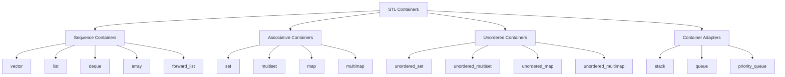

# C++ STL Introduction

## What is the STL?

The Standard Template Library (STL) is a powerful set of C++ template classes to provide general-purpose classes and functions with templates that implement many popular and commonly used algorithms and data structures like vectors, lists, queues, and stacks.

The STL is composed of four components:
- **Containers**: Objects that store data
- **Algorithms**: Procedures that process data
- **Iterators**: Objects that point to elements in a container
- **Function Objects**: Objects that act like functions

## Why Use the STL?

Before diving into the components, let's understand why the STL is so valuable:

- **Reusability**: Avoids reinventing the wheel for common data structures and algorithms
- **Efficiency**: Implementations are highly optimized
- **Standardization**: Part of the C++ standard library, available in all modern C++ compilers
- **Type Safety**: Uses templates to provide compile-time type checking
- **Reduced Development Time**: Ready-to-use components save coding effort

```cpp
// Without STL - Manual array management
int* createAndFillArray(int size) {
    int* arr = new int[size];
    for(int i = 0; i < size; i++) {
        arr[i] = i * 2;
    }
    return arr;
} // Need to manually delete[] arr later

// With STL - Vector handles memory management
#include <vector>
std::vector<int> createAndFillVector(int size) {
    std::vector<int> vec(size);
    for(int i = 0; i < size; i++) {
        vec[i] = i * 2;
    }
    return vec;
} // No manual memory management needed
```

## STL Components in Detail

### 1. Containers

Containers are objects that store data. The STL provides several container classes that allow you to store objects and access them in various ways.

#### Container Types:

**Sequence Containers**:
- `vector`: Dynamic array
- `list`: Doubly linked list
- `deque`: Double-ended queue
- `array` (C++11): Static array
- `forward_list` (C++11): Singly linked list

**Associative Containers**:
- `set`: Collection of unique keys
- `multiset`: Collection that allows duplicate keys
- `map`: Collection of key-value pairs
- `multimap`: Collection that allows duplicate keys

**Unordered Containers** (C++11):
- `unordered_set`: Hash table of unique keys
- `unordered_multiset`: Hash table allowing duplicate keys
- `unordered_map`: Hash table of key-value pairs
- `unordered_multimap`: Hash table allowing duplicate keys

**Container Adapters**:
- `stack`: LIFO (Last-In-First-Out) data structure
- `queue`: FIFO (First-In-First-Out) data structure
- `priority_queue`: Priority heap structure



### 2. Algorithms

Algorithms are template functions that implement various operations on ranges of elements. STL provides about 60 algorithms in the `<algorithm>` header.

**Common Algorithm Categories:**
- **Non-modifying Sequence Operations**: `find`, `count`, `for_each`, etc.
- **Modifying Sequence Operations**: `copy`, `move`, `transform`, etc.
- **Sorting and Related Operations**: `sort`, `merge`, `binary_search`, etc.
- **Numeric Operations** (in `<numeric>`): `accumulate`, `inner_product`, etc.

### 3. Iterators

Iterators are objects that point to elements in a container. They act like pointers but provide a more abstract interface.

**Iterator Types:**
- **Input Iterators**: Read-only, forward movement, single pass
- **Output Iterators**: Write-only, forward movement, single pass
- **Forward Iterators**: Read-write, forward movement, multiple passes
- **Bidirectional Iterators**: Read-write, forward and backward movement
- **Random Access Iterators**: Read-write, random access like pointers

### 4. Function Objects (Functors)

Function objects are objects that act like functions. They are used with STL algorithms to customize behavior.

## Getting Started with STL: A Practical Example

Let's explore a practical example that demonstrates several STL components working together:

```cpp
#include <iostream>
#include <vector>
#include <algorithm>
#include <string>

// A simple structure for a student
struct Student {
    std::string name;
    int score;
    
    Student(const std::string& n, int s) : name(n), score(s) {}
    
    // For comparison purposes
    bool operator < (const Student& other) const {
        return score > other.score; // Sort in descending order
    }
};

int main() {
    // Create a vector of students (Container)
    std::vector<Student> students;
    
    // Add students to the vector
    students.push_back(Student("Alice", 92));
    students.push_back(Student("Bob", 85));
    students.push_back(Student("Charlie", 90));
    students.push_back(Student("Diana", 87));
    students.push_back(Student("Evan", 79));
    
    // Sort students by score (Algorithm)
    std::sort(students.begin(), students.end());
    
    // Print the sorted list using iterators
    std::cout << "Top students by score:" << std::endl;
    for (auto it = students.begin(); it != students.end(); ++it) {
        std::cout << it->name << ": " << it->score << std::endl;
    }
    
    // Using the find_if algorithm with a lambda function (C++11)
    auto highScorer = std::find_if(students.begin(), students.end(), 
                                 [](const Student& s) { return s.score > 90; });
    
    if (highScorer != students.end()) {
        std::cout << "\nFound a student with score > 90: " 
                  << highScorer->name << " with score " << highScorer->score << std::endl;
    }
    
    // Calculate the average score using algorithms
    int totalScore = 0;
    std::for_each(students.begin(), students.end(), 
                [&totalScore](const Student& s) { totalScore += s.score; });
    
    double averageScore = static_cast<double>(totalScore) / students.size();
    std::cout << "\nAverage score: " << averageScore << std::endl;
    
    return 0;
}
```

**Output:**
```
Top students by score:
Alice: 92
Charlie: 90
Diana: 87
Bob: 85
Evan: 79

Found a student with score > 90: Alice with score 92

Average score: 86.6
```

In this example:
1. We created a `vector` container to store `Student` objects
2. We used the `sort` algorithm to sort students by score
3. We used iterators to traverse and display the container elements
4. We used the `find_if` algorithm with a lambda function to find a high-scoring student
5. We used the `for_each` algorithm to calculate the total score

## Another Example: Word Frequency Counter

Let's look at another practical example that uses maps to count word frequencies:

```cpp
#include <iostream>
#include <map>
#include <string>
#include <sstream>
#include <algorithm>
#include <cctype>

int main() {
    std::string text = "This is a sample text. This text is used to demonstrate "
                       "the STL map container. This is quite useful in many applications.";
    
    // Create a map to store word frequencies
    std::map<std::string, int> wordFreq;
    
    // Convert the string to lowercase and process it
    std::transform(text.begin(), text.end(), text.begin(),
                   [](unsigned char c) { return std::tolower(c); });
    
    // Replace punctuation with spaces
    std::replace_if(text.begin(), text.end(),
                    [](char c) { return std::ispunct(c); }, ' ');
    
    // Use a stringstream to split the text into words
    std::stringstream ss(text);
    std::string word;
    
    // Count frequency of each word
    while (ss >> word) {
        wordFreq[word]++;
    }
    
    // Display the word frequencies
    std::cout << "Word frequencies:" << std::endl;
    for (const auto& pair : wordFreq) {
        std::cout << pair.first << ": " << pair.second << std::endl;
    }
    
    // Find the most frequent word
    auto mostFrequent = std::max_element(
        wordFreq.begin(), wordFreq.end(),
        [](const auto& a, const auto& b) { return a.second < b.second; }
    );
    
    std::cout << "\nMost frequent word: \"" << mostFrequent->first
              << "\" (appears " << mostFrequent->second << " times)" << std::endl;
    
    return 0;
}
```

**Output:**
```
Word frequencies:
a: 1
applications: 1
container: 1
demonstrate: 1
in: 1
is: 3
many: 1
map: 1
quite: 1
sample: 1
stl: 1
text: 2
the: 1
this: 3
to: 1
used: 1
useful: 1

Most frequent word: "is" (appears 3 times)
```

This example demonstrates:
1. Using a `map` container to associate words with their frequencies
2. Using algorithms like `transform` and `replace_if` to process strings
3. Using STL iterators to navigate through the map
4. Using `max_element` with a lambda function to find the most frequent word

## Common STL Headers

Here's a quick reference guide to the most commonly used STL headers:

- `<vector>`, `<list>`, `<deque>`, `<array>`: Sequence containers
- `<map>`, `<set>`: Associative containers
- `<unordered_map>`, `<unordered_set>`: Unordered containers
- `<stack>`, `<queue>`: Container adapters
- `<algorithm>`: Algorithms like `sort`, `find`, etc.
- `<numeric>`: Numeric algorithms like `accumulate`
- `<iterator>`: Special iterators and iterator functions
- `<functional>`: Function objects and function wrappers

## Summary

The STL is a cornerstone of modern C++ programming, providing a rich collection of containers, algorithms, iterators, and function objects that work together seamlessly. Key takeaways:

- STL containers provide efficient, type-safe data structures
- STL algorithms offer optimized implementations of common operations
- Iterators bridge containers and algorithms
- Function objects allow customizing algorithm behavior

By leveraging the STL, you can:
- Write more concise, readable code
- Reduce bugs related to manual memory management
- Improve program efficiency
- Focus on solving problems rather than implementing basic data structures

## Practice Exercises

1. Create a program that reads a list of integers from the user and uses STL containers and algorithms to find:
   - The minimum and maximum values
   - The sum and average
   - The median value
   - How many values are above the average

2. Implement a simple text analyzer that reads a text file and reports:
   - Total word count
   - Number of unique words
   - 5 most common words and their frequencies
   - Average word length

3. Create a phone book application using STL maps that allows:
   - Adding new contacts
   - Searching for a contact by name
   - Deleting contacts
   - Listing all contacts alphabetically

## Additional Resources

- [C++ Reference - STL](https://en.cppreference.com/w/cpp/container)
- [Microsoft's STL Documentation](https://docs.microsoft.com/en-us/cpp/standard-library/cpp-standard-library-reference)
- Book: "Effective STL" by Scott Meyers
- Book: "The C++ Standard Library: A Tutorial and Reference" by Nicolai M. Josuttis