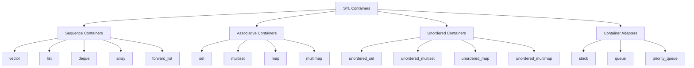

# C++ Containers

## Introduction

Containers are a fundamental component of the C++ Standard Template Library (STL). They are data structures designed to store collections of objects in memory. STL containers provide efficient, type-safe, and reusable solutions for storing and manipulating data without having to implement these data structures from scratch.

In this tutorial, we'll explore the different types of containers available in the C++ STL, understand their characteristics, and learn when to use each through practical examples.

## Types of STL Containers

STL containers can be broadly classified into four categories:



Let's explore each category in detail.

## Sequence Containers

Sequence containers store elements in a linear sequence, and the position of each element depends on the time and place of insertion.

### Vector

`vector` is a dynamic array that can resize itself automatically when elements are inserted or deleted. It provides random access to elements and efficient insertion and deletion at the end.

```cpp
#include <iostream>
#include <vector>

int main() {
    // Creating a vector of integers
    std::vector<int> numbers;
    
    // Adding elements to the vector
    numbers.push_back(10);
    numbers.push_back(20);
    numbers.push_back(30);
    
    // Accessing elements using index
    std::cout << "Element at index 1: " << numbers[1] << std::endl;
    
    // Iterating through the vector
    std::cout << "All elements: ";
    for (int num : numbers) {
        std::cout << num << " ";
    }
    std::cout << std::endl;
    
    // Getting vector size
    std::cout << "Vector size: " << numbers.size() << std::endl;
    
    // Removing the last element
    numbers.pop_back();
    
    // After removing the last element
    std::cout << "After pop_back(): ";
    for (int num : numbers) {
        std::cout << num << " ";
    }
    std::cout << std::endl;
    
    return 0;
}
```

**Output:**
```
Element at index 1: 20
All elements: 10 20 30 
Vector size: 3
After pop_back(): 10 20 
```

**When to use `vector`:**
- When you need frequent access to random elements
- When you primarily add/remove elements at the end
- When you need dynamic resizing

### List

`list` is implemented as a doubly-linked list, which allows efficient insertion and deletion anywhere in the container but doesn't support random access.

```cpp
#include <iostream>
#include <list>

int main() {
    // Creating a list of integers
    std::list<int> numbers;
    
    // Adding elements to the list
    numbers.push_back(10);  // Add to end
    numbers.push_front(5);  // Add to beginning
    numbers.push_back(15);
    
    // Inserting an element in the middle
    auto it = numbers.begin();
    std::advance(it, 1);  // Move iterator to the second element
    numbers.insert(it, 7);
    
    // Iterating through the list
    std::cout << "List elements: ";
    for (int num : numbers) {
        std::cout << num << " ";
    }
    std::cout << std::endl;
    
    // Removing an element
    numbers.remove(7);  // Removes all occurrences of 7
    
    // After removal
    std::cout << "After removing 7: ";
    for (int num : numbers) {
        std::cout << num << " ";
    }
    std::cout << std::endl;
    
    return 0;
}
```

**Output:**
```
List elements: 5 7 10 15 
After removing 7: 5 10 15 
```

**When to use `list`:**
- When you need frequent insertions and deletions at any position
- When you don't need random access to elements
- When element order must be preserved

### Deque

`deque` (double-ended queue) allows efficient insertion and deletion at both the beginning and end of the container, and provides random access like vectors.

```cpp
#include <iostream>
#include <deque>

int main() {
    // Creating a deque of integers
    std::deque<int> numbers;
    
    // Adding elements to both ends
    numbers.push_back(30);
    numbers.push_front(10);
    numbers.push_back(40);
    numbers.push_front(5);
    
    // The deque now contains: 5, 10, 30, 40
    
    // Accessing elements using index
    std::cout << "Element at index 2: " << numbers[2] << std::endl;
    
    // Iterating through the deque
    std::cout << "All elements: ";
    for (int num : numbers) {
        std::cout << num << " ";
    }
    std::cout << std::endl;
    
    // Removing elements from both ends
    numbers.pop_front();
    numbers.pop_back();
    
    // After removals
    std::cout << "After pop operations: ";
    for (int num : numbers) {
        std::cout << num << " ";
    }
    std::cout << std::endl;
    
    return 0;
}
```

**Output:**
```
Element at index 2: 30
All elements: 5 10 30 40 
After pop operations: 10 30 
```

**When to use `deque`:**
- When you need frequent insertion and deletion at both ends
- When you also need random access to elements
- When you need a more flexible data structure than a vector

## Associative Containers

Associative containers implement sorted data structures that provide fast search operations.

### Map

`map` stores key-value pairs in a sorted order based on keys. Each key is unique and can appear only once.

```cpp
#include <iostream>
#include <map>
#include <string>

int main() {
    // Creating a map with string keys and integer values
    std::map<std::string, int> studentScores;
    
    // Inserting key-value pairs
    studentScores["Alice"] = 95;
    studentScores["Bob"] = 89;
    studentScores["Charlie"] = 78;
    
    // Another way to insert
    studentScores.insert(std::pair<std::string, int>("David", 92));
    
    // Accessing values using keys
    std::cout << "Bob's score: " << studentScores["Bob"] << std::endl;
    
    // Iterating through the map
    std::cout << "All student scores:" << std::endl;
    for (const auto& pair : studentScores) {
        std::cout << pair.first << ": " << pair.second << std::endl;
    }
    
    // Checking if a key exists
    if (studentScores.find("Eve") == studentScores.end()) {
        std::cout << "Eve is not in the database" << std::endl;
    }
    
    // Removing an entry
    studentScores.erase("Charlie");
    
    // Size after removal
    std::cout << "Number of students after removal: " << studentScores.size() << std::endl;
    
    return 0;
}
```

**Output:**
```
Bob's score: 89
All student scores:
Alice: 95
Bob: 89
Charlie: 78
David: 92
Eve is not in the database
Number of students after removal: 3
```

**When to use `map`:**
- When you need to associate values with unique keys
- When you need to maintain elements in sorted order (by key)
- When you need fast lookups by key

### Set

`set` stores unique elements in a sorted order. It's like a map without values, only keys.

```cpp
#include <iostream>
#include <set>
#include <string>

int main() {
    // Creating a set of strings
    std::set<std::string> fruits;
    
    // Inserting elements
    fruits.insert("Apple");
    fruits.insert("Banana");
    fruits.insert("Orange");
    fruits.insert("Apple");  // Duplicate, will be ignored
    
    // Checking size (note that duplicate "Apple" was ignored)
    std::cout << "Number of fruits: " << fruits.size() << std::endl;
    
    // Iterating through the set (will be in sorted order)
    std::cout << "Available fruits:" << std::endl;
    for (const auto& fruit : fruits) {
        std::cout << "- " << fruit << std::endl;
    }
    
    // Checking if an element exists
    if (fruits.find("Mango") == fruits.end()) {
        std::cout << "Mango is not in the set" << std::endl;
    }
    
    // Removing an element
    fruits.erase("Banana");
    
    // After removal
    std::cout << "After removing Banana:" << std::endl;
    for (const auto& fruit : fruits) {
        std::cout << "- " << fruit << std::endl;
    }
    
    return 0;
}
```

**Output:**
```
Number of fruits: 3
Available fruits:
- Apple
- Banana
- Orange
Mango is not in the set
After removing Banana:
- Apple
- Orange
```

**When to use `set`:**
- When you need to store unique elements
- When you need to maintain elements in sorted order
- When you need to check if an element exists quickly

## Unordered Containers

Unordered containers implement unsorted data structures that provide fast access to elements by using hash tables.

### Unordered Map

`unordered_map` stores key-value pairs with unique keys, but unlike `map`, it doesn't sort the elements.

```cpp
#include <iostream>
#include <unordered_map>
#include <string>

int main() {
    // Creating an unordered_map for product prices
    std::unordered_map<std::string, double> productPrices;
    
    // Adding products and their prices
    productPrices["Laptop"] = 999.99;
    productPrices["Phone"] = 599.99;
    productPrices["Headphones"] = 149.99;
    
    // Accessing a product price
    std::cout << "Phone price: $" << productPrices["Phone"] << std::endl;
    
    // Checking if a product exists
    if (productPrices.find("Tablet") == productPrices.end()) {
        std::cout << "Tablet is not in our catalog" << std::endl;
    }
    
    // Iterating through products (note: order is not guaranteed)
    std::cout << "Product catalog:" << std::endl;
    for (const auto& product : productPrices) {
        std::cout << product.first << ": $" << product.second << std::endl;
    }
    
    // Updating a price
    productPrices["Laptop"] = 899.99;
    
    // Adding a new product
    productPrices.insert({"Tablet", 349.99});
    
    // Checking size
    std::cout << "Number of products: " << productPrices.size() << std::endl;
    
    return 0;
}
```

**Output:**
```
Phone price: $599.99
Tablet is not in our catalog
Product catalog:
Headphones: $149.99
Phone: $599.99
Laptop: $999.99
Number of products: 4
```

**When to use `unordered_map`:**
- When you need key-value associations
- When you don't care about the order of elements
- When you need faster lookups than `map` (in average case)

### Unordered Set

`unordered_set` stores unique elements without any particular order, using hash tables for fast access.

```cpp
#include <iostream>
#include <unordered_set>
#include <string>

int main() {
    // Creating an unordered set of usernames
    std::unordered_set<std::string> usernames;
    
    // Adding usernames
    usernames.insert("user123");
    usernames.insert("admin");
    usernames.insert("guest");
    usernames.insert("user123");  // Duplicate, will be ignored
    
    // Checking size
    std::cout << "Number of unique usernames: " << usernames.size() << std::endl;
    
    // Checking if a username exists
    std::string username = "admin";
    if (usernames.find(username) != usernames.end()) {
        std::cout << "Username '" << username << "' is already taken" << std::endl;
    }
    
    // Iterating through usernames (order not guaranteed)
    std::cout << "Registered usernames:" << std::endl;
    for (const auto& name : usernames) {
        std::cout << "- " << name << std::endl;
    }
    
    // Removing a username
    usernames.erase("guest");
    
    // After removal
    std::cout << "After removing 'guest', " << usernames.size() << " usernames remain" << std::endl;
    
    return 0;
}
```

**Output:**
```
Number of unique usernames: 3
Username 'admin' is already taken
Registered usernames:
- guest
- admin
- user123
After removing 'guest', 2 usernames remain
```

**When to use `unordered_set`:**
- When you need to store unique elements
- When element order doesn't matter
- When you need fast lookup, insertion, and deletion

## Container Adapters

Container adapters provide a different interface for sequence containers.

### Stack

`stack` provides a Last-In-First-Out (LIFO) data structure.

```cpp
#include <iostream>
#include <stack>
#include <string>

int main() {
    // Creating a stack of strings
    std::stack<std::string> bookStack;
    
    // Adding books to the stack
    bookStack.push("Harry Potter");
    bookStack.push("The Hobbit");
    bookStack.push("1984");
    
    // Getting the top element
    std::cout << "Book on top: " << bookStack.top() << std::endl;
    
    // Getting stack size
    std::cout << "Number of books: " << bookStack.size() << std::endl;
    
    // Removing books one by one
    std::cout << "Removing books from the stack:" << std::endl;
    while (!bookStack.empty()) {
        std::cout << "Taking " << bookStack.top() << " off the stack" << std::endl;
        bookStack.pop();
    }
    
    // Stack is now empty
    std::cout << "Is stack empty? " << (bookStack.empty() ? "Yes" : "No") << std::endl;
    
    return 0;
}
```

**Output:**
```
Book on top: 1984
Number of books: 3
Removing books from the stack:
Taking 1984 off the stack
Taking The Hobbit off the stack
Taking Harry Potter off the stack
Is stack empty? Yes
```

**When to use `stack`:**
- When you need to manage data in a Last-In-First-Out (LIFO) manner
- For function call tracking, undo operations, or syntax parsing

### Queue

`queue` provides a First-In-First-Out (FIFO) data structure.

```cpp
#include <iostream>
#include <queue>
#include <string>

int main() {
    // Creating a queue for customer service
    std::queue<std::string> customerQueue;
    
    // Adding customers to the queue
    customerQueue.push("Customer 1");
    customerQueue.push("Customer 2");
    customerQueue.push("Customer 3");
    
    // Getting the queue size
    std::cout << "Customers waiting: " << customerQueue.size() << std::endl;
    
    // Viewing the first and last customers in line
    std::cout << "First in line: " << customerQueue.front() << std::endl;
    std::cout << "Last in line: " << customerQueue.back() << std::endl;
    
    // Serving customers (removing from queue)
    std::cout << "Serving customers:" << std::endl;
    while (!customerQueue.empty()) {
        std::cout << "Now serving: " << customerQueue.front() << std::endl;
        customerQueue.pop();
    }
    
    // Queue is now empty
    std::cout << "Is queue empty? " << (customerQueue.empty() ? "Yes" : "No") << std::endl;
    
    return 0;
}
```

**Output:**
```
Customers waiting: 3
First in line: Customer 1
Last in line: Customer 3
Serving customers:
Now serving: Customer 1
Now serving: Customer 2
Now serving: Customer 3
Is queue empty? Yes
```

**When to use `queue`:**
- When you need First-In-First-Out (FIFO) behavior
- For handling requests in order
- For breadth-first searches in algorithms

### Priority Queue

`priority_queue` is a special type of queue where elements are ordered by their priority.

```cpp
#include <iostream>
#include <queue>
#include <string>

int main() {
    // Creating a priority queue of integers (default: largest has highest priority)
    std::priority_queue<int> numbers;
    
    // Adding elements
    numbers.push(10);
    numbers.push(30);
    numbers.push(20);
    numbers.push(5);
    
    // Processing elements in order of priority
    std::cout << "Numbers in priority order:" << std::endl;
    while (!numbers.empty()) {
        std::cout << numbers.top() << std::endl;
        numbers.pop();
    }
    
    // Creating a min priority queue (smallest has highest priority)
    std::priority_queue<int, std::vector<int>, std::greater<int>> minNumbers;
    
    // Adding elements to min queue
    minNumbers.push(10);
    minNumbers.push(30);
    minNumbers.push(20);
    minNumbers.push(5);
    
    // Processing min priority queue
    std::cout << "Numbers in min priority order:" << std::endl;
    while (!minNumbers.empty()) {
        std::cout << minNumbers.top() << std::endl;
        minNumbers.pop();
    }
    
    return 0;
}
```

**Output:**
```
Numbers in priority order:
30
20
10
5
Numbers in min priority order:
5
10
20
30
```

**When to use `priority_queue`:**
- When elements need to be processed according to priority
- For task scheduling based on priority
- For implementing algorithms like Dijkstra's or Prim's

## Real-world Application Example

Let's build a simplified task management system that demonstrates how different containers can work together in a real application.

```cpp
#include <iostream>
#include <vector>
#include <map>
#include <queue>
#include <string>

// Define a task structure
struct Task {
    int id;
    std::string description;
    int priority;  // 1-5, where 5 is highest
    
    // For priority queue comparison
    bool operator<(const Task& other) const {
        return priority < other.priority;  // Higher priority comes first
    }
};

class TaskManager {
private:
    int nextId = 1;
    std::map<int, Task> allTasks;  // Store all tasks by ID
    std::priority_queue<Task> taskQueue;  // Tasks ordered by priority
    std::vector<Task> completedTasks;  // History of completed tasks
    
public:
    // Add a new task
    void addTask(const std::string& description, int priority) {
        Task newTask = {nextId++, description, priority};
        allTasks[newTask.id] = newTask;
        taskQueue.push(newTask);
        std::cout << "Task #" << newTask.id << " added: " << description << std::endl;
    }
    
    // Get the highest priority task
    void getNextTask() {
        if (taskQueue.empty()) {
            std::cout << "No tasks in the queue!" << std::endl;
            return;
        }
        
        Task nextTask = taskQueue.top();
        std::cout << "Next task: #" << nextTask.id << " - " 
                  << nextTask.description 
                  << " (Priority: " << nextTask.priority << ")" << std::endl;
    }
    
    // Complete a task
    void completeTask(int taskId) {
        if (allTasks.find(taskId) == allTasks.end()) {
            std::cout << "Task #" << taskId << " not found!" << std::endl;
            return;
        }
        
        Task completedTask = allTasks[taskId];
        completedTasks.push_back(completedTask);
        allTasks.erase(taskId);
        
        // Rebuild priority queue (since we can't easily remove from middle)
        std::priority_queue<Task> newQueue;
        for (const auto& pair : allTasks) {
            newQueue.push(pair.second);
        }
        taskQueue = newQueue;
        
        std::cout << "Task #" << taskId << " completed!" << std::endl;
    }
    
    // List all tasks
    void listAllTasks() {
        if (allTasks.empty()) {
            std::cout << "No pending tasks." << std::endl;
            return;
        }
        
        std::cout << "All pending tasks:" << std::endl;
        for (const auto& pair : allTasks) {
            const Task& task = pair.second;
            std::cout << "Task #" << task.id << ": " << task.description 
                      << " (Priority: " << task.priority << ")" << std::endl;
        }
    }
    
    // Show task history
    void showHistory() {
        if (completedTasks.empty()) {
            std::cout << "No completed tasks yet." << std::endl;
            return;
        }
        
        std::cout << "Completed tasks:" << std::endl;
        for (const auto& task : completedTasks) {
            std::cout << "Task #" << task.id << ": " << task.description << std::endl;
        }
    }
};

int main() {
    TaskManager manager;
    
    // Add some tasks
    manager.addTask("Finish project proposal", 5);
    manager.addTask("Reply to emails", 2);
    manager.addTask("Prepare for meeting", 4);
    manager.addTask("Update documentation", 3);
    
    std::cout << "\n--- Task List ---\n";
    manager.listAllTasks();
    
    std::cout << "\n--- Next Task ---\n";
    manager.getNextTask();  // Should show highest priority task
    
    std::cout << "\n--- Completing Tasks ---\n";
    manager.completeTask(1);  // Complete the project proposal
    manager.completeTask(3);  // Complete the meeting preparation
    
    std::cout << "\n--- Updated Task List ---\n";
    manager.listAllTasks();
    
    std::cout << "\n--- Task History ---\n";
    manager.showHistory();
    
    return 0;
}
```

**Output:**
```
Task #1 added: Finish project proposal
Task #2 added: Reply to emails
Task #3 added: Prepare for meeting
Task #4 added: Update documentation

--- Task List ---
All pending tasks:
Task #1: Finish project proposal (Priority: 5)
Task #2: Reply to emails (Priority: 2)
Task #3: Prepare for meeting (Priority: 4)
Task #4: Update documentation (Priority: 3)

--- Next Task ---
Next task: #1 - Finish project proposal (Priority: 5)

--- Completing Tasks ---
Task #1 completed!
Task #3 completed!

--- Updated Task List ---
All pending tasks:
Task #2: Reply to emails (Priority: 2)
Task #4: Update documentation (Priority: 3)

--- Task History ---
Completed tasks:
Task #1: Finish project proposal
Task #3: Prepare for meeting
```

This example demonstrates how different containers can be used together in a practical application:
- `map` for efficiently storing and retrieving tasks by ID
- `priority_queue` for organizing tasks by priority
- `vector` for maintaining a history of completed tasks

## Performance Comparison

Understanding the performance characteristics of different containers is essential for making the right choice:

| Container      | Access | Insertion/Removal (middle) | Insertion/Removal (end) | Ordering  | Search |
|----------------|--------|----------------------------|-------------------------|-----------|--------|
| vector         | O(1)   | O(n)                       | Amortized O(1)          | None      | O(n)   |
| list           | O(n)   | O(1)                       | O(1)                    | None      | O(n)   |
| deque          | O(1)   | O(n)                       | O(1)                    | None      | O(n)   |
| map            | O(log n)| O(log n)                  | O(log n)                | Sorted    | O(log n)|
| set            | N/A    | O(log n)                   | O(log n)                | Sorted    | O(log n)|
| unordered_map  | O(1)*  | O(1)*                      | O(1)*                   | None      | O(1)*  |
| unordered_set  | N/A    | O(1)*                      | O(1)*                   | None      | O(1)*  |
| stack          | O(1)**  | N/A                        | O(1)                    | LIFO      | N/A    |
| queue          | O(1)**  | N/A                        | O(1)                    | FIFO      | N/A    |
| priority_queue | O(1)**  | N/A                        | O(log n)                | Priority  | N/A    |

\* Average case for unordered containers; worst case can be O(n)  
\** Access to only specific elements (top, front, or back)

## Summary

STL containers provide a powerful toolkit for managing collections of data in C++:

1. **Sequence containers** (vector, list, deque) store elements in a linear arrangement.
2. **Associative containers** (map, set) store elements in sorted order for efficient lookups.
3. **Unordered containers** (unordered_map, unordered_set) provide hash-based storage for faster average-case access.
4. **Container adapters** (stack, queue, priority_queue) provide specialized interfaces over other containers.

Each container has its strengths and weaknesses, making it important to choose the right one for your specific needs. Consider factors like:

- The operations you'll perform most frequently
- Whether order matters
- The size of your data
- Performance requirements

## Practice Exercises

1. Create a program that reads a text file and counts the frequency of each word using an appropriate container.
2. Implement a simple address book using a container that allows lookups by name.
3. Create a playlist system where songs can be:
   - Added to the end of the playlist
   - Removed from any position
   - Shuffled randomly
   - Sorted by different criteria (name, duration, etc.)
4. Implement a browser history feature with "back" and "forward" functionality using appropriate containers.
5. Create a simple inventory management system that tracks items by ID and maintains them sorted by quantity.

## Additional Resources

- [C++ Reference - Containers Library](https://en.cppreference.com/w/cpp/container)
- [C++ STL Tutorial by GeeksforGeeks](https://www.geeksforgeeks.org/the-c-standard-template-library-stl/)
- [Effective STL by Scott Meyers](https://www.amazon.com/Effective-STL-Specific-Standard-Template/dp/0201749629) (book)
- [C++ Core Guidelines](https://isocpp.github.io/CppCoreGuidelines/CppCoreGuidelines)

Understanding containers is fundamental to writing efficient C++ code. By mastering these data structures, you'll be able to choose the right tool for each programming challenge you face.