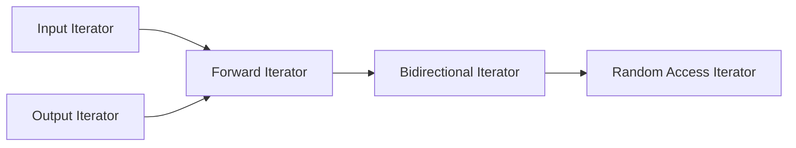

# C++ Iterators

## Introduction

Iterators are one of the most fundamental concepts in the C++ Standard Template Library (STL). Think of iterators as sophisticated pointers that provide a unified way to traverse through different types of containers (like vectors, lists, and maps) without needing to know the specific details of each container's implementation.

Iterators serve as a bridge between containers and algorithms, allowing you to access elements of a container sequentially without exposing the container's internal structure. This abstraction is what makes the STL so powerful and flexible.

In this tutorial, we'll explore what iterators are, the different types of iterators available in C++, and how to use them effectively in your code.

## What Are Iterators?

Iterators are objects that behave like pointers to elements within a container. They allow you to:

1. Access elements in a container
2. Navigate through the container (move forward or backward)
3. Perform operations on the elements

The beauty of iterators is that they provide a consistent interface for different container types. Whether you're working with a vector, list, map, or any other STL container, the syntax for using iterators remains largely the same.

Here's a basic example of using an iterator with a vector:

```cpp
#include <iostream>
#include <vector>

int main() {
    // Create a vector of integers
    std::vector<int> numbers = {1, 2, 3, 4, 5};
    
    // Declare an iterator for the vector
    std::vector<int>::iterator it;
    
    // Use the iterator to traverse the vector
    for (it = numbers.begin(); it != numbers.end(); ++it) {
        std::cout << *it << " ";  // Dereference the iterator to access the element
    }
    std::cout << std::endl;
    
    return 0;
}
```

**Output:**
```
1 2 3 4 5
```

In this example, `it` is an iterator that points to elements in the `numbers` vector. We use the `begin()` method to get an iterator to the first element and `end()` to get an iterator to one past the last element. By incrementing the iterator, we move through the container one element at a time.

## Types of Iterators

The STL provides several types of iterators, each with different capabilities:

1. **Input Iterators**: Allow reading elements in a forward direction (one pass, read-only)
2. **Output Iterators**: Allow writing elements in a forward direction (one pass, write-only)
3. **Forward Iterators**: Combine input and output iterators, but only move forward
4. **Bidirectional Iterators**: Can move both forward and backward
5. **Random Access Iterators**: Can jump directly to any element (like array indexing)

This hierarchy forms what's known as the "iterator concept hierarchy":



Let's explore each type with examples.

### Input Iterators

These iterators can only read values and move forward. They're typically used for one-pass algorithms.

```cpp
#include <iostream>
#include <sstream>
#include <iterator>

int main() {
    std::istringstream input("1 2 3 4 5");
    
    // Create an input iterator
    std::istream_iterator<int> it(input);
    std::istream_iterator<int> end;
    
    // Read values using the input iterator
    while (it != end) {
        std::cout << "Read: " << *it << std::endl;
        ++it;
    }
    
    return 0;
}
```

**Output:**
```
Read: 1
Read: 2
Read: 3
Read: 4
Read: 5
```

### Output Iterators

These iterators can only write values and move forward.

```cpp
#include <iostream>
#include <iterator>
#include <vector>

int main() {
    std::vector<int> numbers;
    
    // Create an output iterator
    std::back_insert_iterator<std::vector<int>> it(numbers);
    
    // Write values using the output iterator
    *it = 1;
    ++it;
    *it = 2;
    ++it;
    *it = 3;
    
    // Display the vector contents
    for (int num : numbers) {
        std::cout << num << " ";
    }
    std::cout << std::endl;
    
    return 0;
}
```

**Output:**
```
1 2 3
```

### Forward Iterators

These iterators can read and write values, and move forward.

```cpp
#include <iostream>
#include <forward_list>

int main() {
    std::forward_list<int> numbers = {1, 2, 3, 4, 5};
    
    // Forward iterators can only move forward
    std::forward_list<int>::iterator it = numbers.begin();
    
    // Read and modify values
    while (it != numbers.end()) {
        *it = *it * 2;  // Double each value
        ++it;
    }
    
    // Display the modified list
    for (int num : numbers) {
        std::cout << num << " ";
    }
    std::cout << std::endl;
    
    return 0;
}
```

**Output:**
```
2 4 6 8 10
```

### Bidirectional Iterators

These iterators can read and write values, and move both forward and backward.

```cpp
#include <iostream>
#include <list>

int main() {
    std::list<int> numbers = {1, 2, 3, 4, 5};
    
    // Bidirectional iterator can move both ways
    std::list<int>::iterator it = numbers.begin();
    
    // Move forward to the third element
    std::advance(it, 2);  // it now points to 3
    std::cout << "Current element: " << *it << std::endl;
    
    // Move backward one element
    --it;  // it now points to 2
    std::cout << "Previous element: " << *it << std::endl;
    
    return 0;
}
```

**Output:**
```
Current element: 3
Previous element: 2
```

### Random Access Iterators

These are the most powerful iterators, offering all capabilities of other iterators plus random access to elements.

```cpp
#include <iostream>
#include <vector>

int main() {
    std::vector<int> numbers = {10, 20, 30, 40, 50};
    
    // Random access iterator
    std::vector<int>::iterator it = numbers.begin();
    
    // Direct access to elements
    std::cout << "First element: " << *it << std::endl;
    std::cout << "Third element: " << *(it + 2) << std::endl;
    std::cout << "Last element: " << *(it + 4) << std::endl;
    
    // Iterator arithmetic
    it += 3;  // Move 3 positions forward
    std::cout << "After advancing 3 positions: " << *it << std::endl;
    
    // Calculate distance between iterators
    std::vector<int>::iterator end = numbers.end();
    std::cout << "Distance to end: " << end - it << " elements" << std::endl;
    
    return 0;
}
```

**Output:**
```
First element: 10
Third element: 30
Last element: 50
After advancing 3 positions: 40
Distance to end: 2 elements
```

## Common Iterator Operations

Here are some common operations you can perform with iterators:

### 1. Declaring Iterators

To declare an iterator for a container:

```cpp
std::vector<int>::iterator it;               // Mutable iterator
std::vector<int>::const_iterator cit;        // Constant iterator (can't modify elements)
std::vector<int>::reverse_iterator rit;      // Reverse iterator (traverses backward)
std::vector<int>::const_reverse_iterator crit; // Constant reverse iterator
```

### 2. Getting Iterators from Containers

Most containers provide methods to get iterators:

```cpp
it = container.begin();    // Iterator to the first element
it = container.end();      // Iterator to one past the last element
rit = container.rbegin();  // Reverse iterator to the last element
rit = container.rend();    // Reverse iterator to one before the first element
```

### 3. Moving Iterators

```cpp
++it;       // Move to the next element
--it;       // Move to the previous element (not available for all iterator types)
it += n;    // Move forward n elements (random access iterators only)
it -= n;    // Move backward n elements (random access iterators only)
```

### 4. Accessing Elements

```cpp
*it;        // Access the element the iterator points to
it->member; // Access a member of the element (if it's a class/struct)
```

## Practical Examples

Let's look at some real-world examples of using iterators.

### Example 1: Finding an Element in a Container

```cpp
#include <iostream>
#include <vector>
#include <algorithm>

int main() {
    std::vector<int> numbers = {10, 20, 30, 40, 50};
    
    int target = 30;
    std::vector<int>::iterator it = std::find(numbers.begin(), numbers.end(), target);
    
    if (it != numbers.end()) {
        int position = std::distance(numbers.begin(), it);
        std::cout << "Found " << target << " at position " << position << std::endl;
    } else {
        std::cout << target << " not found in the vector" << std::endl;
    }
    
    return 0;
}
```

**Output:**
```
Found 30 at position 2
```

### Example 2: Modifying Elements in a Container

```cpp
#include <iostream>
#include <list>
#include <algorithm>

int main() {
    std::list<int> numbers = {1, 2, 3, 4, 5};
    
    // Multiply each element by 10
    std::list<int>::iterator it;
    for (it = numbers.begin(); it != numbers.end(); ++it) {
        *it = *it * 10;
    }
    
    // Display the modified list
    std::cout << "Modified list: ";
    for (int num : numbers) {
        std::cout << num << " ";
    }
    std::cout << std::endl;
    
    return 0;
}
```

**Output:**
```
Modified list: 10 20 30 40 50
```

### Example 3: Inserting and Erasing Elements

```cpp
#include <iostream>
#include <vector>

int main() {
    std::vector<int> numbers = {10, 20, 30, 40, 50};
    
    // Display original vector
    std::cout << "Original vector: ";
    for (int num : numbers) {
        std::cout << num << " ";
    }
    std::cout << std::endl;
    
    // Insert an element in the middle
    std::vector<int>::iterator it = numbers.begin() + 2;  // Points to 30
    it = numbers.insert(it, 25);  // Insert 25 before 30, it now points to the inserted element
    
    // Display vector after insertion
    std::cout << "After insertion: ";
    for (int num : numbers) {
        std::cout << num << " ";
    }
    std::cout << std::endl;
    
    // Erase the element we just inserted
    it = numbers.erase(it);  // Erase 25, it now points to the next element (30)
    
    // Display vector after erasure
    std::cout << "After erasure: ";
    for (int num : numbers) {
        std::cout << num << " ";
    }
    std::cout << std::endl;
    
    return 0;
}
```

**Output:**
```
Original vector: 10 20 30 40 50
After insertion: 10 20 25 30 40 50
After erasure: 10 20 30 40 50
```

### Example 4: Using Iterator Adapters

The STL provides several iterator adapters, such as `back_inserter`, `front_inserter`, and `inserter`. These are special iterators that make it easier to add elements to containers.

```cpp
#include <iostream>
#include <vector>
#include <list>
#include <algorithm>
#include <iterator>

int main() {
    std::vector<int> source = {1, 2, 3, 4, 5};
    std::vector<int> destination;
    
    // Use back_inserter to add elements to the end of the destination
    std::copy(source.begin(), source.end(), std::back_inserter(destination));
    
    // Display the destination vector
    std::cout << "Destination after back_inserter: ";
    for (int num : destination) {
        std::cout << num << " ";
    }
    std::cout << std::endl;
    
    // Use front_inserter with a list (vector doesn't support front_inserter)
    std::list<int> sourceList = {10, 20, 30};
    std::list<int> destList;
    
    std::copy(sourceList.begin(), sourceList.end(), std::front_inserter(destList));
    
    // Display the destination list
    std::cout << "Destination after front_inserter: ";
    for (int num : destList) {
        std::cout << num << " ";
    }
    std::cout << std::endl;
    
    return 0;
}
```

**Output:**
```
Destination after back_inserter: 1 2 3 4 5
Destination after front_inserter: 30 20 10
```

## Auto and Range-Based For Loops

In modern C++, you can use the `auto` keyword and range-based for loops to simplify working with iterators:

```cpp
#include <iostream>
#include <vector>

int main() {
    std::vector<int> numbers = {1, 2, 3, 4, 5};
    
    // Using auto to declare iterators
    for (auto it = numbers.begin(); it != numbers.end(); ++it) {
        std::cout << *it << " ";
    }
    std::cout << std::endl;
    
    // Using range-based for loop (even simpler)
    for (const auto& num : numbers) {
        std::cout << num << " ";
    }
    std::cout << std::endl;
    
    return 0;
}
```

**Output:**
```
1 2 3 4 5
1 2 3 4 5
```

## Iterator Invalidation

An important concept to understand when working with iterators is **iterator invalidation**. This occurs when an operation on a container potentially makes existing iterators invalid, which can lead to undefined behavior if you continue to use them.

Common operations that can invalidate iterators include:
- Adding or removing elements from a container
- Resizing a container
- Moving a container (e.g., via move assignment)

Different container types have different rules for when iterators are invalidated:

```cpp
#include <iostream>
#include <vector>

int main() {
    std::vector<int> numbers = {1, 2, 3, 4, 5};
    
    auto it = numbers.begin() + 2;  // Points to 3
    std::cout << "Before insertion: " << *it << std::endl;
    
    // Insert element at the beginning (potentially invalidates all iterators)
    numbers.insert(numbers.begin(), 0);
    
    // WARNING: Using 'it' here is undefined behavior!
    // std::cout << "After insertion: " << *it << std::endl;  // Don't do this!
    
    // Get a new valid iterator instead
    it = numbers.begin() + 2;
    std::cout << "With new iterator: " << *it << std::endl;
    
    return 0;
}
```

**Output:**
```
Before insertion: 3
With new iterator: 2
```

Always be aware of iterator invalidation rules for the container you're working with.

## Summary

Iterators are a powerful abstraction in C++ that provides a uniform way to work with different container types. They enable you to traverse, access, and modify container elements without needing to understand the internal implementation details of each container.

Key points to remember:
1. Iterators act as a bridge between containers and algorithms
2. Different iterator types offer different capabilities
3. Most containers provide methods like `begin()` and `end()` to get iterators
4. Be aware of iterator invalidation when modifying containers
5. Modern C++ offers simplified ways to work with iterators through `auto` and range-based for loops

By mastering iterators, you'll be able to write more generic, reusable, and efficient code when working with the C++ STL.

## Exercises

1. Write a program that uses iterators to find and remove all even numbers from a `std::list<int>`.
2. Implement a function that takes two iterators (begin and end) and reverses the elements in that range without using the `std::reverse` algorithm.
3. Create a program that merges two sorted vectors into a third sorted vector using iterators.
4. Write a function that takes a container and uses iterators to print every element, along with its position in the container.
5. Implement a custom iterator for a simple linked list class.

## Additional Resources

- [C++ Reference: Iterators](https://en.cppreference.com/w/cpp/iterator)
- [C++ Standard Library: A Tutorial and Reference](https://www.amazon.com/Standard-Library-Tutorial-Reference-2nd/dp/0321623215)
- [Effective STL: 50 Specific Ways to Improve Your Use of the Standard Template Library](https://www.amazon.com/Effective-STL-Specific-Standard-Template/dp/0201749629)