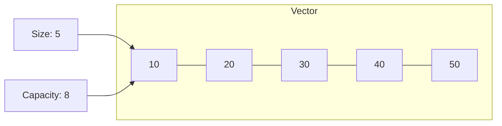

# C++ Vector

## Introduction

Vectors are one of the most useful and versatile container types in the C++ Standard Template Library (STL). A vector is essentially a dynamic array that can grow or shrink in size automatically as elements are added or removed. Unlike traditional arrays, vectors handle memory management for you, making them much easier and safer to use.

In this tutorial, we'll explore:
- What vectors are and why they're useful
- How to create and initialize vectors
- Basic vector operations
- Vector iterators
- Common vector functions
- Performance considerations
- Real-world applications

## What is a Vector?

A vector in C++ is a sequence container that stores elements in a linear arrangement, just like an array. The key advantages of vectors over traditional arrays include:

1. **Dynamic Size**: Vectors can grow or shrink at runtime
2. **Automatic Memory Management**: No need to manage memory allocation/deallocation manually
3. **Rich Set of Built-in Functions**: Many useful operations are already implemented
4. **Type Safety**: Vectors ensure all elements are of the same type

Let's visualize a vector:



## Including the Vector Header

To use vectors in your C++ program, you need to include the vector header:

```cpp
#include <vector>
```

## Creating and Initializing Vectors

Let's look at different ways to create and initialize vectors:

```cpp
#include <iostream>
#include <vector>

int main() {
    // Empty vector of integers
    std::vector<int> vec1;
    
    // Vector with 5 integers, all initialized to 0
    std::vector<int> vec2(5);
    
    // Vector with 5 integers, all initialized to 42
    std::vector<int> vec3(5, 42);
    
    // Vector initialized with a list of values
    std::vector<int> vec4 = {10, 20, 30, 40, 50};
    
    // Vector created from another vector (copy constructor)
    std::vector<int> vec5(vec4);
    
    // Display vec4 contents
    std::cout << "vec4 contains:";
    for(int i = 0; i < vec4.size(); i++) {
        std::cout << " " << vec4[i];
    }
    std::cout << std::endl;
    
    return 0;
}
```

**Output:**
```
vec4 contains: 10 20 30 40 50
```

## Basic Vector Operations

### Adding Elements

You can add elements to a vector using the `push_back()` method:

```cpp
#include <iostream>
#include <vector>

int main() {
    std::vector<std::string> fruits;
    
    // Add elements to the end of the vector
    fruits.push_back("Apple");
    fruits.push_back("Banana");
    fruits.push_back("Orange");
    
    // Add element at specific position using insert()
    fruits.insert(fruits.begin() + 1, "Mango");
    
    // Display all fruits
    std::cout << "Fruits in the vector:";
    for(const auto& fruit : fruits) {
        std::cout << " " << fruit;
    }
    std::cout << std::endl;
    
    return 0;
}
```

**Output:**
```
Fruits in the vector: Apple Mango Banana Orange
```

### Accessing Elements

There are several ways to access vector elements:

```cpp
#include <iostream>
#include <vector>

int main() {
    std::vector<int> numbers = {10, 20, 30, 40, 50};
    
    // Using array-like indexing (no bounds checking)
    std::cout << "First element: " << numbers[0] << std::endl;
    
    // Using at() method (with bounds checking)
    std::cout << "Third element: " << numbers.at(2) << std::endl;
    
    // Access first and last elements
    std::cout << "First element: " << numbers.front() << std::endl;
    std::cout << "Last element: " << numbers.back() << std::endl;
    
    // Using try-catch with at() method for safe access
    try {
        std::cout << "Element at index 10: " << numbers.at(10) << std::endl;
    } catch(const std::out_of_range& e) {
        std::cout << "Error: " << e.what() << std::endl;
    }
    
    return 0;
}
```

**Output:**
```
First element: 10
Third element: 30
First element: 10
Last element: 50
Error: vector::_M_range_check: __n (which is 10) >= this->size() (which is 5)
```

### Removing Elements

Vectors provide several ways to remove elements:

```cpp
#include <iostream>
#include <vector>

int main() {
    std::vector<int> numbers = {10, 20, 30, 40, 50, 60};
    
    // Remove the last element
    numbers.pop_back();
    
    // Remove element at a specific position
    numbers.erase(numbers.begin() + 2); // Removes 30
    
    // Remove elements in a range (from index 1 to index 2)
    numbers.erase(numbers.begin() + 1, numbers.begin() + 3);
    
    // Display remaining elements
    std::cout << "Elements after removal:";
    for(int num : numbers) {
        std::cout << " " << num;
    }
    std::cout << std::endl;
    
    // Clear all elements
    numbers.clear();
    std::cout << "Size after clear(): " << numbers.size() << std::endl;
    
    return 0;
}
```

**Output:**
```
Elements after removal: 10 50
Size after clear(): 0
```

## Vector Size and Capacity

Understanding the difference between size and capacity is important:

```cpp
#include <iostream>
#include <vector>

int main() {
    std::vector<int> vec;
    
    std::cout << "Initial size: " << vec.size() << std::endl;
    std::cout << "Initial capacity: " << vec.capacity() << std::endl;
    
    // Add 10 elements
    for(int i = 1; i <= 10; i++) {
        vec.push_back(i);
        std::cout << "After adding " << i << " elements - Size: " << vec.size() 
                  << ", Capacity: " << vec.capacity() << std::endl;
    }
    
    // Shrink to fit - reduces capacity to match size
    vec.shrink_to_fit();
    std::cout << "After shrink_to_fit() - Size: " << vec.size() 
              << ", Capacity: " << vec.capacity() << std::endl;
    
    // Reserve space for more elements
    vec.reserve(20);
    std::cout << "After reserve(20) - Size: " << vec.size() 
              << ", Capacity: " << vec.capacity() << std::endl;
    
    // Check if vector is empty
    std::cout << "Is vector empty? " << (vec.empty() ? "Yes" : "No") << std::endl;
    
    return 0;
}
```

**Output** (may vary depending on the implementation):
```
Initial size: 0
Initial capacity: 0
After adding 1 elements - Size: 1, Capacity: 1
After adding 2 elements - Size: 2, Capacity: 2
After adding 3 elements - Size: 3, Capacity: 4
After adding 4 elements - Size: 4, Capacity: 4
After adding 5 elements - Size: 5, Capacity: 8
After adding 6 elements - Size: 6, Capacity: 8
After adding 7 elements - Size: 7, Capacity: 8
After adding 8 elements - Size: 8, Capacity: 8
After adding 9 elements - Size: 9, Capacity: 16
After adding 10 elements - Size: 10, Capacity: 16
After shrink_to_fit() - Size: 10, Capacity: 10
After reserve(20) - Size: 10, Capacity: 20
Is vector empty? No
```

## Vector Iterators

Iterators provide a way to access elements of a container sequentially:

```cpp
#include <iostream>
#include <vector>

int main() {
    std::vector<int> numbers = {10, 20, 30, 40, 50};
    
    // Using iterator to access elements
    std::cout << "Using iterator:";
    for(std::vector<int>::iterator it = numbers.begin(); it != numbers.end(); ++it) {
        std::cout << " " << *it;
    }
    std::cout << std::endl;
    
    // Using auto keyword (C++11 and later)
    std::cout << "Using auto:";
    for(auto it = numbers.begin(); it != numbers.end(); ++it) {
        std::cout << " " << *it;
    }
    std::cout << std::endl;
    
    // Using range-based for loop (C++11 and later)
    std::cout << "Using range-based for loop:";
    for(const auto& num : numbers) {
        std::cout << " " << num;
    }
    std::cout << std::endl;
    
    // Reverse iterators
    std::cout << "In reverse order:";
    for(auto rit = numbers.rbegin(); rit != numbers.rend(); ++rit) {
        std::cout << " " << *rit;
    }
    std::cout << std::endl;
    
    return 0;
}
```

**Output:**
```
Using iterator: 10 20 30 40 50
Using auto: 10 20 30 40 50
Using range-based for loop: 10 20 30 40 50
In reverse order: 50 40 30 20 10
```

## Common Vector Algorithms

C++ STL provides many algorithms that work with vectors:

```cpp
#include <iostream>
#include <vector>
#include <algorithm> // For algorithms like sort, find, etc.
#include <numeric>   // For accumulate

int main() {
    std::vector<int> numbers = {30, 10, 50, 20, 40};
    
    // Sort the vector
    std::sort(numbers.begin(), numbers.end());
    std::cout << "Sorted vector:";
    for(int num : numbers) std::cout << " " << num;
    std::cout << std::endl;
    
    // Find an element
    auto it = std::find(numbers.begin(), numbers.end(), 20);
    if(it != numbers.end()) {
        std::cout << "Found 20 at position: " << it - numbers.begin() << std::endl;
    }
    
    // Sum of all elements
    int sum = std::accumulate(numbers.begin(), numbers.end(), 0);
    std::cout << "Sum of elements: " << sum << std::endl;
    
    // Check if a value exists
    bool exists = std::binary_search(numbers.begin(), numbers.end(), 40);
    std::cout << "40 exists in vector: " << (exists ? "Yes" : "No") << std::endl;
    
    // Find maximum element
    auto max_it = std::max_element(numbers.begin(), numbers.end());
    std::cout << "Maximum element: " << *max_it << std::endl;
    
    // Count occurrences
    numbers.push_back(10); // Add another 10
    int count = std::count(numbers.begin(), numbers.end(), 10);
    std::cout << "Count of 10: " << count << std::endl;
    
    return 0;
}
```

**Output:**
```
Sorted vector: 10 20 30 40 50
Found 20 at position: 1
Sum of elements: 150
40 exists in vector: Yes
Maximum element: 50
Count of 10: 2
```

## Vector of Custom Objects

Vectors can store custom objects, not just primitive types:

```cpp
#include <iostream>
#include <vector>
#include <string>

// Custom class
class Student {
private:
    std::string name;
    int age;
    double gpa;

public:
    Student(const std::string& n, int a, double g) : name(n), age(a), gpa(g) {}
    
    void display() const {
        std::cout << "Name: " << name << ", Age: " << age << ", GPA: " << gpa << std::endl;
    }
    
    double getGPA() const { return gpa; }
    std::string getName() const { return name; }
};

int main() {
    // Create a vector of students
    std::vector<Student> students;
    
    // Add students to the vector
    students.push_back(Student("Alice", 20, 3.8));
    students.push_back(Student("Bob", 22, 3.5));
    students.push_back(Student("Charlie", 21, 3.9));
    
    // Display all students
    std::cout << "All students:" << std::endl;
    for(const auto& student : students) {
        student.display();
    }
    
    // Find student with highest GPA
    double highest_gpa = 0.0;
    std::string top_student;
    
    for(const auto& student : students) {
        if(student.getGPA() > highest_gpa) {
            highest_gpa = student.getGPA();
            top_student = student.getName();
        }
    }
    
    std::cout << "\nStudent with highest GPA: " << top_student 
              << " (" << highest_gpa << ")" << std::endl;
    
    return 0;
}
```

**Output:**
```
All students:
Name: Alice, Age: 20, GPA: 3.8
Name: Bob, Age: 22, GPA: 3.5
Name: Charlie, Age: 21, GPA: 3.9

Student with highest GPA: Charlie (3.9)
```

## 2D Vectors (Vector of Vectors)

Vectors can be nested to create multi-dimensional structures:

```cpp
#include <iostream>
#include <vector>

int main() {
    // Create a 3x4 matrix (3 rows, 4 columns)
    std::vector<std::vector<int>> matrix = {
        {1, 2, 3, 4},
        {5, 6, 7, 8},
        {9, 10, 11, 12}
    };
    
    // Print the matrix
    std::cout << "Matrix:" << std::endl;
    for(const auto& row : matrix) {
        for(const auto& element : row) {
            std::cout << element << "\t";
        }
        std::cout << std::endl;
    }
    
    // Access specific elements
    std::cout << "\nElement at position [1][2]: " << matrix[1][2] << std::endl;
    
    // Create a dynamic 2D vector
    int rows = 3, cols = 3;
    std::vector<std::vector<int>> dynamicMatrix(rows, std::vector<int>(cols, 0));
    
    // Fill with some values
    for(int i = 0; i < rows; i++) {
        for(int j = 0; j < cols; j++) {
            dynamicMatrix[i][j] = i * cols + j + 1;
        }
    }
    
    // Print dynamic matrix
    std::cout << "\nDynamic Matrix:" << std::endl;
    for(const auto& row : dynamicMatrix) {
        for(const auto& element : row) {
            std::cout << element << "\t";
        }
        std::cout << std::endl;
    }
    
    return 0;
}
```

**Output:**
```
Matrix:
1	2	3	4	
5	6	7	8	
9	10	11	12	

Element at position [1][2]: 7

Dynamic Matrix:
1	2	3	
4	5	6	
7	8	9	
```

## Performance Considerations

When working with vectors, keep these performance considerations in mind:

1. **Reserve space** if you know the approximate size in advance to reduce reallocations
2. **Use emplace_back()** instead of push_back() when possible for better performance
3. **Avoid unnecessary copying** by using references when iterating
4. **Be careful with erase() operations** in the middle of large vectors, as they require shifting elements
5. **Consider using other containers** (like std::list or std::deque) if your use case involves frequent insertions/deletions in the middle

Example of efficient vector usage:

```cpp
#include <iostream>
#include <vector>
#include <chrono>
#include <string>

class ComplexObject {
private:
    std::string data;
    int value;
public:
    ComplexObject(const std::string& s, int v) : data(s), value(v) {}
};

int main() {
    const int N = 1000000;
    
    // Inefficient way (without reserve)
    std::vector<int> vec1;
    auto start1 = std::chrono::high_resolution_clock::now();
    for(int i = 0; i < N; i++) {
        vec1.push_back(i);
    }
    auto end1 = std::chrono::high_resolution_clock::now();
    
    // Efficient way (with reserve)
    std::vector<int> vec2;
    vec2.reserve(N);
    auto start2 = std::chrono::high_resolution_clock::now();
    for(int i = 0; i < N; i++) {
        vec2.push_back(i);
    }
    auto end2 = std::chrono::high_resolution_clock::now();
    
    // Compare push_back vs emplace_back
    std::vector<ComplexObject> vec3;
    vec3.reserve(N);
    auto start3 = std::chrono::high_resolution_clock::now();
    for(int i = 0; i < N; i++) {
        vec3.push_back(ComplexObject("test", i));
    }
    auto end3 = std::chrono::high_resolution_clock::now();
    
    std::vector<ComplexObject> vec4;
    vec4.reserve(N);
    auto start4 = std::chrono::high_resolution_clock::now();
    for(int i = 0; i < N; i++) {
        vec4.emplace_back("test", i);
    }
    auto end4 = std::chrono::high_resolution_clock::now();
    
    std::cout << "Without reserve: " 
              << std::chrono::duration_cast<std::chrono::milliseconds>(end1 - start1).count() 
              << " ms" << std::endl;
    
    std::cout << "With reserve: " 
              << std::chrono::duration_cast<std::chrono::milliseconds>(end2 - start2).count() 
              << " ms" << std::endl;
    
    std::cout << "push_back with complex objects: " 
              << std::chrono::duration_cast<std::chrono::milliseconds>(end3 - start3).count() 
              << " ms" << std::endl;
    
    std::cout << "emplace_back with complex objects: " 
              << std::chrono::duration_cast<std::chrono::milliseconds>(end4 - start4).count() 
              << " ms" << std::endl;
    
    return 0;
}
```

The output will vary based on your system, but typically you'll see that using `reserve()` and `emplace_back()` can significantly improve performance.

## Real-World Applications

### Task Management System

```cpp
#include <iostream>
#include <vector>
#include <string>
#include <algorithm>

// Task class representing a to-do item
class Task {
private:
    std::string description;
    bool completed;
    int priority; // 1-5, with 5 being highest priority

public:
    Task(const std::string& desc, int prio) 
        : description(desc), completed(false), priority(prio) {}
    
    void markCompleted() { completed = true; }
    
    void display() const {
        std::cout << "[" << (completed ? "X" : " ") << "] "
                  << "(" << priority << ") " << description << std::endl;
    }
    
    bool isCompleted() const { return completed; }
    int getPriority() const { return priority; }
    std::string getDescription() const { return description; }
};

class TaskManager {
private:
    std::vector<Task> tasks;

public:
    void addTask(const std::string& description, int priority) {
        tasks.emplace_back(description, priority);
        std::cout << "Task added." << std::endl;
    }
    
    void displayAllTasks() const {
        if(tasks.empty()) {
            std::cout << "No tasks to display." << std::endl;
            return;
        }
        
        std::cout << "\n--- All Tasks ---" << std::endl;
        for(size_t i = 0; i < tasks.size(); i++) {
            std::cout << i + 1 << ". ";
            tasks[i].display();
        }
    }
    
    void markTaskAsCompleted(size_t index) {
        if(index >= 1 && index <= tasks.size()) {
            tasks[index-1].markCompleted();
            std::cout << "Task marked as completed." << std::endl;
        } else {
            std::cout << "Invalid task index." << std::endl;
        }
    }
    
    void removeCompletedTasks() {
        size_t initialSize = tasks.size();
        tasks.erase(
            std::remove_if(tasks.begin(), tasks.end(), 
                          [](const Task& t) { return t.isCompleted(); }),
            tasks.end()
        );
        
        std::cout << "Removed " << (initialSize - tasks.size()) 
                  << " completed tasks." << std::endl;
    }
    
    void sortByPriority() {
        std::sort(tasks.begin(), tasks.end(), 
                 [](const Task& a, const Task& b) {
                     return a.getPriority() > b.getPriority();
                 });
        std::cout << "Tasks sorted by priority." << std::endl;
    }
};

int main() {
    TaskManager manager;
    
    // Add some tasks
    manager.addTask("Finish C++ homework", 5);
    manager.addTask("Go grocery shopping", 3);
    manager.addTask("Call mom", 4);
    manager.addTask("Read book chapter", 2);
    
    // Display all tasks
    manager.displayAllTasks();
    
    // Sort by priority
    manager.sortByPriority();
    manager.displayAllTasks();
    
    // Mark some tasks as completed
    manager.markTaskAsCompleted(1);
    manager.markTaskAsCompleted(3);
    manager.displayAllTasks();
    
    // Remove completed tasks
    manager.removeCompletedTasks();
    manager.displayAllTasks();
    
    return 0;
}
```

**Output:**
```
Task added.
Task added.
Task added.
Task added.

--- All Tasks ---
1. [ ] (5) Finish C++ homework
2. [ ] (3) Go grocery shopping
3. [ ] (4) Call mom
4. [ ] (2) Read book chapter
Tasks sorted by priority.

--- All Tasks ---
1. [ ] (5) Finish C++ homework
2. [ ] (4) Call mom
3. [ ] (3) Go grocery shopping
4. [ ] (2) Read book chapter
Task marked as completed.
Task marked as completed.

--- All Tasks ---
1. [X] (5) Finish C++ homework
2. [ ] (4) Call mom
3. [X] (3) Go grocery shopping
4. [ ] (2) Read book chapter
Removed 2 completed tasks.

--- All Tasks ---
1. [ ] (4) Call mom
2. [ ] (2) Read book chapter
```

### Simple Data Analysis

```cpp
#include <iostream>
#include <vector>
#include <algorithm>
#include <numeric>
#include <iomanip>
#include <cmath>

// Function to calculate standard deviation
double calculateStdDev(const std::vector<double>& data, double mean) {
    double sum_squared_diff = 0.0;
    for(double value : data) {
        sum_squared_diff += (value - mean) * (value - mean);
    }
    return std::sqrt(sum_squared_diff / data.size());
}

int main() {
    // Sample temperature readings over a week
    std::vector<double> temperatures = {
        22.5, 23.8, 21.7, 24.5, 26.1, 25.3, 23.9
    };
    
    // Calculate basic statistics
    double sum = std::accumulate(temperatures.begin(), temperatures.end(), 0.0);
    double mean = sum / temperatures.size();
    
    double min_temp = *std::min_element(temperatures.begin(), temperatures.end());
    double max_temp = *std::max_element(temperatures.begin(), temperatures.end());
    
    // Sort the temperatures
    std::vector<double> sorted_temps = temperatures;
    std::sort(sorted_temps.begin(), sorted_temps.end());
    
    // Calculate median
    double median;
    if(sorted_temps.size() % 2 == 0) {
        median = (sorted_temps[sorted_temps.size()/2 - 1] + 
                  sorted_temps[sorted_temps.size()/2]) / 2.0;
    } else {
        median = sorted_temps[sorted_temps.size()/2];
    }
    
    // Calculate standard deviation
    double std_dev = calculateStdDev(temperatures, mean);
    
    // Display results
    std::cout << std::fixed << std::setprecision(2);
    std::cout << "Temperature Analysis\n";
    std::cout << "====================\n";
    std::cout << "Daily readings: ";
    for(double temp : temperatures) {
        std::cout << temp << "°C ";
    }
    std::cout << "\n\n";
    
    std::cout << "Mean temperature: " << mean << "°C\n";
    std::cout << "Median temperature: " << median << "°C\n";
    std::cout << "Minimum temperature: " << min_temp << "°C\n";
    std::cout << "Maximum temperature: " << max_temp << "°C\n";
    std::cout << "Temperature range: " << max_temp - min_temp << "°C\n";
    std::cout << "Standard deviation: " << std_dev << "°C\n";
    
    // Count days above average
    int days_above_avg = std::count_if(temperatures.begin(), temperatures.end(),
                                      [mean](double temp) { return temp > mean; });
    
    std::cout << "Days above average: " << days_above_avg << "\n";
    
    return 0;
}
```

**Output:**
```
Temperature Analysis
====================
Daily readings: 22.50°C 23.80°C 21.70°C 24.50°C 26.10°C 25.30°C 23.90°C 

Mean temperature: 23.97°C
Median temperature: 23.90°C
Minimum temperature: 21.70°C
Maximum temperature: 26.10°C
Temperature range: 4.40°C
Standard deviation: 1.44°C
Days above average: 3
```

## Summary

In this tutorial, we've covered the essential aspects of C++ vectors, one of the most useful containers in the C++ Standard Template Library:

- **Basic Concepts**: What vectors are and how they differ from arrays
- **Creating and Initializing Vectors**: Different ways to create and populate vectors
- **Core Operations**: Adding, accessing, and removing elements
- **Size and Capacity**: Managing vector storage
- **Iterators**: Navigating through vector elements
- **Algorithms**: Common operations like sorting, finding, and counting
- **Advanced Usage**: Working with custom objects and multi-dimensional vectors
- **Performance Considerations**: How to optimize vector operations
- **Real-World Applications**: Practical examples of vectors in action

Vectors are an essential tool in any C++ programmer's toolkit, providing a flexible, safe, and efficient way to work with collections of data.

## Additional Resources

For further learning about C++ vectors, check out these resources:

1. [C++ Reference - Vector](https://en.cppreference.com/w/cpp/container/vector)
2. [C++ STL Vector Tutorial at cplusplus.com](http://www.cplusplus.com/reference/vector/vector/)
3. [C++ Vector vs Array - Key Differences](https://www.geeksforgeeks.org/vector-vs-array-in-c/)

## Exercises

1. **Vector Basics**: Create a program that reads 10 integers from the user and stores them in a vector. Then print the sum, average, minimum, and maximum values.

2. **Vector Manipulation**: Write a function to remove all duplicate elements from a vector, preserving the original order.

3. **Inventory System**: Implement a simple inventory management system for a store using vectors to track products (name, price, quantity).

4. **Matrix Operations**: Create functions to add and multiply two matrices represented as vectors of vectors.

5. **Data Processing**: Read a CSV file containing student grades and use vectors to calculate each student's average grade and the class average.

6. **Word Frequency Counter**: Write a program that reads a text file and counts the frequency of each word, storing results in a vector of pairs.

7. **Custom Vector Sort**: Create a vector of custom objects (like Student with name, ID, and GPA) and implement a function to sort it by multiple criteria.