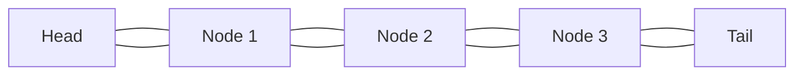

# C++ List

## Introduction

The `std::list` container is one of the sequence containers provided by the C++ Standard Template Library (STL). It implements a doubly-linked list data structure, which allows efficient insertions and deletions at any position within the sequence.

Unlike arrays or vectors that store elements in contiguous memory, a list stores elements at disparate memory locations. Each element in a list contains a value and pointers to the next and previous elements, forming a chain-like structure.



## Characteristics of std::list

- **Non-contiguous memory**: Elements are not stored in adjacent memory locations
- **Bidirectional iteration**: Can traverse the list in both forward and backward directions
- **No random access**: Cannot directly access elements by index (no `[]` operator)
- **Efficient insertions and deletions**: Can add or remove elements anywhere in O(1) time
- **Stable iterators**: Iterators remain valid even after insertions and deletions (except for erased elements)

## Including the List Header

To use the `std::list` container, you need to include the `<list>` header:

```cpp
#include <list>
```

## Creating and Initializing Lists

There are several ways to create and initialize a list:

```cpp
#include <iostream>
#include <list>

int main() {
    // Default constructor - empty list
    std::list<int> list1;
    
    // List with n elements, each initialized to a default value
    std::list<int> list2(5); // Creates a list with 5 zeros
    
    // List with n elements, each initialized to a specific value
    std::list<int> list3(3, 100); // Creates a list with 3 elements, each set to 100
    
    // List initialized with elements from another range
    std::list<int> list4(list3.begin(), list3.end());
    
    // List initialized with an initializer list
    std::list<int> list5 = {10, 20, 30, 40, 50};
    
    // Print list5
    std::cout << "list5 contains: ";
    for (const auto& element : list5) {
        std::cout << element << " ";
    }
    std::cout << std::endl;
    
    return 0;
}
```

**Output:**
```
list5 contains: 10 20 30 40 50
```

## Basic List Operations

### Accessing Elements

Unlike vectors or arrays, lists don't provide direct random access to elements. You need to iterate through the list to access specific elements. However, you can access the first and last elements directly:

```cpp
#include <iostream>
#include <list>

int main() {
    std::list<int> numbers = {10, 20, 30, 40, 50};
    
    // Accessing the first element
    std::cout << "First element: " << numbers.front() << std::endl;
    
    // Accessing the last element
    std::cout << "Last element: " << numbers.back() << std::endl;
    
    // Accessing an element at a specific position (requires iteration)
    std::cout << "Third element: ";
    auto it = numbers.begin();
    std::advance(it, 2); // Move iterator to the third position
    std::cout << *it << std::endl;
    
    return 0;
}
```

**Output:**
```
First element: 10
Last element: 50
Third element: 30
```

### Adding Elements

You can add elements at the beginning, end, or any position within the list:

```cpp
#include <iostream>
#include <list>

int main() {
    std::list<int> numbers;
    
    // Adding elements at the end
    numbers.push_back(30);
    numbers.push_back(40);
    
    // Adding elements at the beginning
    numbers.push_front(20);
    numbers.push_front(10);
    
    // Insert an element at a specific position
    auto it = numbers.begin();
    std::advance(it, 2); // Move to the third position
    numbers.insert(it, 25); // Insert 25 at the third position
    
    // Print the list
    std::cout << "List contains: ";
    for (const auto& num : numbers) {
        std::cout << num << " ";
    }
    std::cout << std::endl;
    
    return 0;
}
```

**Output:**
```
List contains: 10 20 25 30 40
```

### Removing Elements

You can remove elements from the beginning, end, or any position within the list:

```cpp
#include <iostream>
#include <list>

int main() {
    std::list<int> numbers = {10, 20, 30, 40, 50};
    
    // Remove the first element
    numbers.pop_front();
    
    // Remove the last element
    numbers.pop_back();
    
    // Remove an element at a specific position
    auto it = numbers.begin();
    std::advance(it, 1); // Move to the second position
    numbers.erase(it); // Remove the element at the second position
    
    // Remove all elements with a specific value
    numbers.push_back(30); // Add another 30
    numbers.remove(30); // Remove all elements with value 30
    
    // Print the list
    std::cout << "List after removals: ";
    for (const auto& num : numbers) {
        std::cout << num << " ";
    }
    std::cout << std::endl;
    
    return 0;
}
```

**Output:**
```
List after removals: 20
```

### List Size Operations

```cpp
#include <iostream>
#include <list>

int main() {
    std::list<int> numbers = {10, 20, 30, 40, 50};
    
    // Get the size of the list
    std::cout << "Size: " << numbers.size() << std::endl;
    
    // Check if the list is empty
    std::cout << "Is empty: " << (numbers.empty() ? "Yes" : "No") << std::endl;
    
    // Clear all elements
    numbers.clear();
    std::cout << "After clear, size: " << numbers.size() << std::endl;
    std::cout << "Is empty: " << (numbers.empty() ? "Yes" : "No") << std::endl;
    
    return 0;
}
```

**Output:**
```
Size: 5
Is empty: No
After clear, size: 0
Is empty: Yes
```

## List-Specific Operations

The list container provides some operations that are specific to linked lists and not available in other STL containers:

### Splicing Lists

Splicing moves elements from one list to another without copying or moving individual elements:

```cpp
#include <iostream>
#include <list>

void printList(const std::list<int>& lst, const std::string& name) {
    std::cout << name << ": ";
    for (const auto& item : lst) {
        std::cout << item << " ";
    }
    std::cout << std::endl;
}

int main() {
    std::list<int> list1 = {1, 2, 3, 4};
    std::list<int> list2 = {10, 20, 30};
    
    printList(list1, "List1 before splice");
    printList(list2, "List2 before splice");
    
    // Splice entire list2 at the beginning of list1
    list1.splice(list1.begin(), list2);
    
    printList(list1, "List1 after splice");
    printList(list2, "List2 after splice (empty)");
    
    // Create a new list for more splice operations
    std::list<int> list3 = {100, 200, 300, 400};
    
    // Splice a single element from list3 to list1
    auto it = list3.begin();
    std::advance(it, 1); // Point to 200
    list1.splice(list1.end(), list3, it);
    
    printList(list1, "List1 after splicing one element");
    printList(list3, "List3 after splicing out one element");
    
    return 0;
}
```

**Output:**
```
List1 before splice: 1 2 3 4
List2 before splice: 10 20 30
List1 after splice: 10 20 30 1 2 3 4
List2 after splice (empty): 
List1 after splicing one element: 10 20 30 1 2 3 4 200
List3 after splicing out one element: 100 300 400
```

### Sorting

Lists provide a built-in sort method that's optimized for linked lists:

```cpp
#include <iostream>
#include <list>

int main() {
    std::list<int> numbers = {5, 2, 9, 1, 7, 3};
    
    std::cout << "Before sorting: ";
    for (const auto& num : numbers) {
        std::cout << num << " ";
    }
    std::cout << std::endl;
    
    // Sort the list
    numbers.sort();
    
    std::cout << "After sorting: ";
    for (const auto& num : numbers) {
        std::cout << num << " ";
    }
    std::cout << std::endl;
    
    // Custom sorting (in descending order)
    numbers.sort(std::greater<int>());
    
    std::cout << "After sorting in descending order: ";
    for (const auto& num : numbers) {
        std::cout << num << " ";
    }
    std::cout << std::endl;
    
    return 0;
}
```

**Output:**
```
Before sorting: 5 2 9 1 7 3
After sorting: 1 2 3 5 7 9
After sorting in descending order: 9 7 5 3 2 1
```

### Removing Duplicates

The `unique()` function removes consecutive duplicate elements from the list:

```cpp
#include <iostream>
#include <list>

int main() {
    std::list<int> numbers = {1, 2, 2, 3, 3, 3, 4, 5, 5};
    
    std::cout << "Before removing duplicates: ";
    for (const auto& num : numbers) {
        std::cout << num << " ";
    }
    std::cout << std::endl;
    
    // Remove consecutive duplicates
    numbers.unique();
    
    std::cout << "After removing duplicates: ";
    for (const auto& num : numbers) {
        std::cout << num << " ";
    }
    std::cout << std::endl;
    
    return 0;
}
```

**Output:**
```
Before removing duplicates: 1 2 2 3 3 3 4 5 5
After removing duplicates: 1 2 3 4 5
```

### Merging Sorted Lists

The `merge()` function merges two sorted lists:

```cpp
#include <iostream>
#include <list>

int main() {
    std::list<int> list1 = {1, 3, 5, 7};
    std::list<int> list2 = {2, 4, 6, 8};
    
    std::cout << "List1 before merge: ";
    for (const auto& num : list1) {
        std::cout << num << " ";
    }
    std::cout << std::endl;
    
    std::cout << "List2 before merge: ";
    for (const auto& num : list2) {
        std::cout << num << " ";
    }
    std::cout << std::endl;
    
    // Merge list2 into list1
    list1.merge(list2);
    
    std::cout << "List1 after merge: ";
    for (const auto& num : list1) {
        std::cout << num << " ";
    }
    std::cout << std::endl;
    
    std::cout << "List2 after merge (empty): ";
    for (const auto& num : list2) {
        std::cout << num << " ";
    }
    std::cout << std::endl;
    
    return 0;
}
```

**Output:**
```
List1 before merge: 1 3 5 7
List2 before merge: 2 4 6 8
List1 after merge: 1 2 3 4 5 6 7 8
List2 after merge (empty): 
```

### Reversing the List

The `reverse()` function reverses the order of elements in the list:

```cpp
#include <iostream>
#include <list>

int main() {
    std::list<int> numbers = {1, 2, 3, 4, 5};
    
    std::cout << "Before reversing: ";
    for (const auto& num : numbers) {
        std::cout << num << " ";
    }
    std::cout << std::endl;
    
    // Reverse the list
    numbers.reverse();
    
    std::cout << "After reversing: ";
    for (const auto& num : numbers) {
        std::cout << num << " ";
    }
    std::cout << std::endl;
    
    return 0;
}
```

**Output:**
```
Before reversing: 1 2 3 4 5
After reversing: 5 4 3 2 1
```

## Practical Applications

### Task Manager

Here's an example of using a list to implement a simple task management system:

```cpp
#include <iostream>
#include <list>
#include <string>
#include <algorithm>

struct Task {
    int id;
    std::string description;
    bool completed;
    
    Task(int id, const std::string& desc) : id(id), description(desc), completed(false) {}
};

class TaskManager {
private:
    std::list<Task> tasks;
    int nextId = 1;
    
public:
    void addTask(const std::string& description) {
        tasks.push_back(Task(nextId++, description));
        std::cout << "Task added successfully.\n";
    }
    
    void markAsCompleted(int id) {
        auto it = std::find_if(tasks.begin(), tasks.end(), 
                              [id](const Task& task) { return task.id == id; });
        
        if (it != tasks.end()) {
            it->completed = true;
            std::cout << "Task marked as completed.\n";
        } else {
            std::cout << "Task not found.\n";
        }
    }
    
    void removeTask(int id) {
        auto it = std::find_if(tasks.begin(), tasks.end(), 
                              [id](const Task& task) { return task.id == id; });
        
        if (it != tasks.end()) {
            tasks.erase(it);
            std::cout << "Task removed successfully.\n";
        } else {
            std::cout << "Task not found.\n";
        }
    }
    
    void displayTasks() const {
        if (tasks.empty()) {
            std::cout << "No tasks in the list.\n";
            return;
        }
        
        std::cout << "\n===== TASK LIST =====\n";
        for (const auto& task : tasks) {
            std::cout << "ID: " << task.id 
                      << " | Status: " << (task.completed ? "Completed" : "Pending")
                      << " | " << task.description << "\n";
        }
        std::cout << "====================\n";
    }
};

int main() {
    TaskManager manager;
    
    // Add some tasks
    manager.addTask("Complete C++ assignment");
    manager.addTask("Buy groceries");
    manager.addTask("Schedule dentist appointment");
    
    // Display initial tasks
    manager.displayTasks();
    
    // Mark a task as completed
    manager.markAsCompleted(2);
    
    // Remove a task
    manager.removeTask(3);
    
    // Display updated tasks
    manager.displayTasks();
    
    return 0;
}
```

**Output:**
```
Task added successfully.
Task added successfully.
Task added successfully.

===== TASK LIST =====
ID: 1 | Status: Pending | Complete C++ assignment
ID: 2 | Status: Pending | Buy groceries
ID: 3 | Status: Pending | Schedule dentist appointment
====================
Task marked as completed.
Task removed successfully.

===== TASK LIST =====
ID: 1 | Status: Pending | Complete C++ assignment
ID: 2 | Status: Completed | Buy groceries
====================
```

### Browser History

Here's an example of using a list to implement a simple browser history:

```cpp
#include <iostream>
#include <list>
#include <string>

class BrowserHistory {
private:
    std::list<std::string> history;
    std::list<std::string>::iterator current;
    
public:
    BrowserHistory(const std::string& homepage) {
        history.push_back(homepage);
        current = history.begin();
    }
    
    void visit(const std::string& url) {
        // Remove all forward history
        auto it = current;
        ++it;
        history.erase(it, history.end());
        
        // Add new URL
        history.push_back(url);
        current = --history.end();
        
        std::cout << "Visited: " << url << std::endl;
    }
    
    std::string back() {
        if (current != history.begin()) {
            --current;
            std::cout << "Going back to: " << *current << std::endl;
            return *current;
        }
        
        std::cout << "Already at oldest page: " << *current << std::endl;
        return *current;
    }
    
    std::string forward() {
        auto it = current;
        ++it;
        
        if (it != history.end()) {
            ++current;
            std::cout << "Going forward to: " << *current << std::endl;
            return *current;
        }
        
        std::cout << "Already at newest page: " << *current << std::endl;
        return *current;
    }
    
    void displayHistory() const {
        std::cout << "\n=== Browser History ===\n";
        for (auto it = history.begin(); it != history.end(); ++it) {
            std::cout << (it == current ? "> " : "  ") << *it << std::endl;
        }
        std::cout << "=====================\n";
    }
};

int main() {
    BrowserHistory browser("https://www.homepage.com");
    
    browser.visit("https://www.example.com");
    browser.visit("https://www.cplusplus.com");
    browser.visit("https://www.github.com");
    
    browser.displayHistory();
    
    browser.back();
    browser.back();
    
    browser.displayHistory();
    
    browser.forward();
    
    browser.displayHistory();
    
    browser.visit("https://www.newsite.com");
    
    browser.displayHistory();
    
    return 0;
}
```

**Output:**
```
Visited: https://www.example.com
Visited: https://www.cplusplus.com
Visited: https://www.github.com

=== Browser History ===
  https://www.homepage.com
  https://www.example.com
  https://www.cplusplus.com
> https://www.github.com
=====================
Going back to: https://www.cplusplus.com
Going back to: https://www.example.com

=== Browser History ===
  https://www.homepage.com
> https://www.example.com
  https://www.cplusplus.com
  https://www.github.com
=====================
Going forward to: https://www.cplusplus.com

=== Browser History ===
  https://www.homepage.com
  https://www.example.com
> https://www.cplusplus.com
  https://www.github.com
=====================
Visited: https://www.newsite.com

=== Browser History ===
  https://www.homepage.com
  https://www.example.com
  https://www.cplusplus.com
> https://www.newsite.com
=====================
```

## Performance Considerations

When choosing between different STL containers, it's important to understand the performance characteristics of `std::list`:

| Operation | Time Complexity |
| --------- | --------------- |
| Access first/last element | O(1) |
| Insert/remove at beginning/end | O(1) |
| Insert/remove at middle | O(1) after finding position |
| Find element | O(n) |
| Splice operations | O(1) |
| Sort | O(n log n) comparisons, O(n) moves |

### When to Use std::list

- When you need frequent insertions and deletions at any position
- When elements should not be moved around in memory (iterators should remain valid)
- When you need fast splicing of whole lists
- When random access is not required

### When to Avoid std::list

- When you need random access to elements
- When memory usage is a concern (linked lists have overhead for pointers)
- When cache performance is important (elements are not contiguous in memory)
- When you mostly add/remove elements at the end (vector might be better)

## Summary

The `std::list` container in C++ STL is a powerful and flexible container that implements a doubly-linked list. It excels in scenarios requiring frequent insertions and deletions, particularly in the middle of the sequence.

Key points to remember:
- List elements are stored in non-contiguous memory locations
- Lists provide constant-time insertions and removals anywhere in the sequence
- Lists don't support random access - you must iterate through elements
- Iterator validity is preserved after insertions and deletions
- List-specific operations include splicing, merging, and efficient sorting

## Exercises

1. Implement a simple music playlist using `std::list` where users can add songs, remove songs, and move to the next or previous song.

2. Create a text editor line management system where each line is an element in a list, allowing for efficient insertions and deletions of lines.

3. Implement a card game where the deck of cards is represented as a list that can be shuffled, and cards can be drawn from the top or inserted back into the deck.

4. Create a program that reads numbers from user input and maintains them in a sorted list, inserting each new number in the correct position.

5. Implement a simple LRU (Least Recently Used) cache using a list to keep track of the access order of elements.

## Additional Resources

- [C++ Reference - std::list](https://en.cppreference.com/w/cpp/container/list)
- [cplusplus.com - std::list documentation](http://www.cplusplus.com/reference/list/list/)
- [C++ STL Tutorial by GeeksforGeeks](https://www.geeksforgeeks.org/the-c-standard-template-library-stl/)
- [C++ STL List with Examples](https://www.geeksforgeeks.org/list-cpp-stl/)
- [Advanced C++ Programming Course](https://www.learncpp.com/)